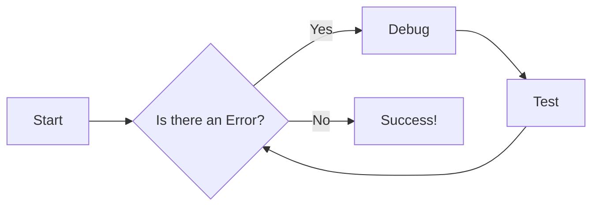

# Documentation - Getting Started

This guide outlines the process for contributing to and maintaining the documentation. All documentation resides within the `docs` directory of the GitHub repository. We leverage ReadTheDocs ([https://readthedocs.org/](https://readthedocs.org/)) for documentation generation and the Material for MkDocs theme ([https://squidfunk.github.io/mkdocs-material/](https://squidfunk.github.io/mkdocs-material/)) for a polished and consistent user experience.

## Setting Up Your Local Environment

To work on the documentation locally:

### Install Python

Ensure Python 3 is installed and accessible on your system. Verify by running:

```bash
python3 --version
```

---

## Building and Serving Documentation

To simplify working with documentation, the `docs/build_docs.sh` script provides several subcommands:

- **serve**: builds the documentation and starts a local server  
- **build** (default if no subcommand is given): builds the documentation without serving  
- **deploy**: builds the documentation and deploys it to GitHub Pages  
- **help**: displays usage information

This follows the documentation in git approach See :- [documentation in git](../whitepapers/documentation_in_git.md)

### Serve the Documentation Locally

To generate and serve the documentation on `localhost:8000`, run:

```bash
./build_docs.sh serve
```

Once the server is running, you can view the docs at:

[http://localhost:8000/rdkcentral/rdk-halif-aidl/](http://localhost:8000/rdkcentral/rdk-halif-aidl/)

Any changes to the Markdown files in the `docs` directory will automatically reload in the browser.

### Building Without Serving

If you just want to build the static files (without starting a local server), run:

```bash
./build_docs.sh build
```

This generates the site into the `site` directory.

---

## Structuring the Documentation

The file **`mkdocs.yml`**, located at the root of the repository, defines how your documentation is structured and navigated. Any additions, removals, or reorganizations of documentation pages require corresponding updates to **`mkdocs.yml`** to keep the site navigation current.

For more information on naming conventions used, see [Key Concepts and Naming Conventions](../halif/key_concepts/hal/hal_naming_conventions.md).

---

## Deploying Documentation

If you have the necessary permissions to deploy, follow these steps:

Build the documentation and deploy to the `gh-pages` branch:

```bash
./build_docs.sh build
./build_docs.sh deploy
```

The site will be published at: [https://rdkcentral.github.io/rdk-halif-aidl/](https://rdkcentral.github.io/rdk-halif-aidl/)  

> **Note**: The published site’s resides in the `gh-pages` branch of this repository.

### Getting Help

At any time, you can see a list of available subcommands and usage information by running:

```bash
./build_docs.sh
```

or

```bash
./build_docs.sh help
```

---

## Writing Style and Guidelines

When contributing to the documentation, please adhere to the following guidelines:

- **Accuracy and Clarity:** Ensure all information is accurate, up-to-date, and easy to understand. Use clear and concise language.
- **Proofreading:** Thoroughly proofread all content for spelling, grammar, and punctuation errors before submitting changes.
- **Admonitions for Emphasis:** Use admonitions to highlight key information, warnings, notes, or tips. Material for MkDocs provides various admonition styles: [https://squidfunk.github.io/mkdocs-material/reference/admonitions/](https://squidfunk.github.io/mkdocs-material/reference/admonitions/)

!!! note Note
    This is an example of a note admonition.

!!! info Info
    This is an example of a info admonition.

!!! tip "Tip"
    This is an example of a tip admonition.

!!! example Example
    This is an example

!!! warning Important Consideration
    This is a warning!

- **Code Blocks with Syntax Highlighting:** Always use code blocks for code examples and specify the language for syntax highlighting:

```python
def example_function():
    print("Hello, world!")
```

```javascript
function exampleFunction() 
{
    console.log("Hello, world!");
}
```

- **MkDocs-Material Reference:** Refer to the official Material for MkDocs documentation for advanced features and customization options: [https://squidfunk.github.io/mkdocs-material/reference/](https://squidfunk.github.io/mkdocs-material/reference/)

- **Mermaid Diagrams (Preferred):** Use Mermaid ([https://mermaid.js.org/](https://mermaid.js.org/)) for creating diagrams whenever possible. Mermaid diagrams offer better accessibility, performance, and scalability compared to embedded images.



This guide ensures consistency, accuracy, and usability across all documentation contributions.
