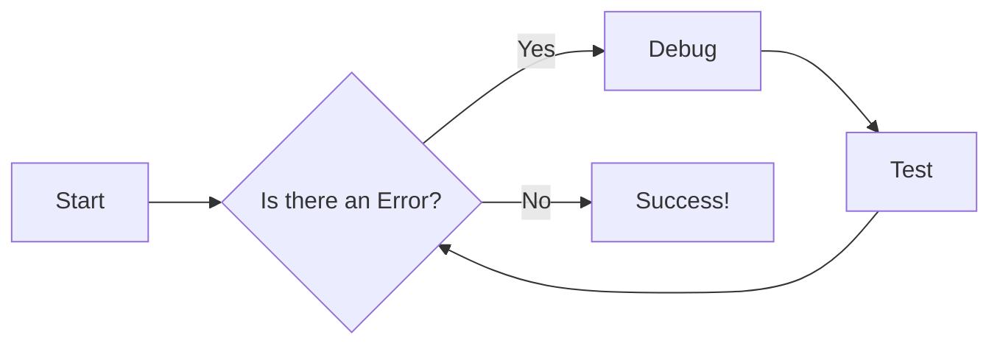

# Documentation Guide

This guide outlines the process for contributing to and maintaining the documentation. All documentation resides within the `docs` directory of the GitHub repository. We leverage ReadTheDocs ([https://readthedocs.org/](https://readthedocs.org/)) for documentation generation and the Material for MkDocs theme ([https://squidfunk.github.io/mkdocs-material/](https://squidfunk.github.io/mkdocs-material/)) for a polished and consistent user experience.

## Setting Up Your Local Environment

To work on the documentation locally:

### Install Python

Ensure Python 3 is installed and accessible on your system. Verify by running:

```bash
python3 --version
```

### Building and Serving Documentation

To generate and serve the documentation locally, navigate to the `docs` directory and execute the `build_docs.sh` script. This script will:

- Set up a Python 3 virtual environment  
- Clone the required repositories  
- Configure necessary directories  
- Build the documentation and launch a local web server  

Run the following command:

```bash
./build_docs.sh serve
```

Once the process completes, you can access the documentation in your web browser at:

[http://localhost:8000/rdkcentral/rdk-halif-aidl/](http://localhost:8000/rdkcentral/rdk-halif-aidl/)

The site will automatically reload when you modify Markdown files within the `docs` directory.

#### Building Without Serving

If you want to build the documentation without running the local web server, use:

```bash
./build_docs.sh
```

## Structuring the Documentation

The `mkdocs.yml` file, located at the root of the repository, is crucial for defining the documentation's structure and navigation. This file dictates the hierarchy of pages and how they are linked. **Any additions or removals of documentation pages require a corresponding update to ****`mkdocs.yml`**** to maintain proper navigation.**

See [For information on the the naming conventions used see:-](../halif/key_concepts/hal/hal_naming_conventions.md)

## Deploying Documentation

If you have the required permissions to deploy the documentation, use the `deploy_docs.sh` script. This will:

- Rebuild the documentation  
- Deploy the latest version  

Run the following command:

```bash
./deploy_docs.sh
```

The latest documentation will be deployed to GitHub Pages at [https://rdkcentral.github.io/rdk-halif-aidl/](https://rdkcentral.github.io/rdk-halif-aidl/). The website's source code resides in the `gh-pages` branch of the repository.

## Writing Style and Guidelines

When contributing to the documentation, please adhere to the following guidelines:

- **Accuracy and Clarity:** Ensure all information is accurate, up-to-date, and easy to understand. Use clear and concise language.
- **Proofreading:** Thoroughly proofread all content for spelling, grammar, and punctuation errors before submitting changes.
- **Admonitions for Emphasis:** Use admonitions to highlight key information, warnings, notes, or tips. Material for MkDocs provides various admonition styles: [https://squidfunk.github.io/mkdocs-material/reference/admonitions/](https://squidfunk.github.io/mkdocs-material/reference/admonitions/)

!!! note "Helpful Tip"
    This is an example of a note admonition.

!!! warning "Important Consideration"
    This is a warning!

- **Code Blocks with Syntax Highlighting:** Always use code blocks for code examples and specify the language for syntax highlighting:

```python
def example_function():
    print("Hello, world!")
```

```javascript
function exampleFunction() {
    console.log("Hello, world!");
}
```

- **MkDocs-Material Reference:** Refer to the official Material for MkDocs documentation for advanced features and customization options: [https://squidfunk.github.io/mkdocs-material/reference/](https://squidfunk.github.io/mkdocs-material/reference/)

- **Mermaid Diagrams (Preferred):** Use Mermaid ([https://mermaid.js.org/](https://mermaid.js.org/)) for creating diagrams whenever possible. Mermaid diagrams offer better accessibility, performance, and scalability compared to embedded images.



This guide ensures consistency, accuracy, and usability across all documentation contributions.
