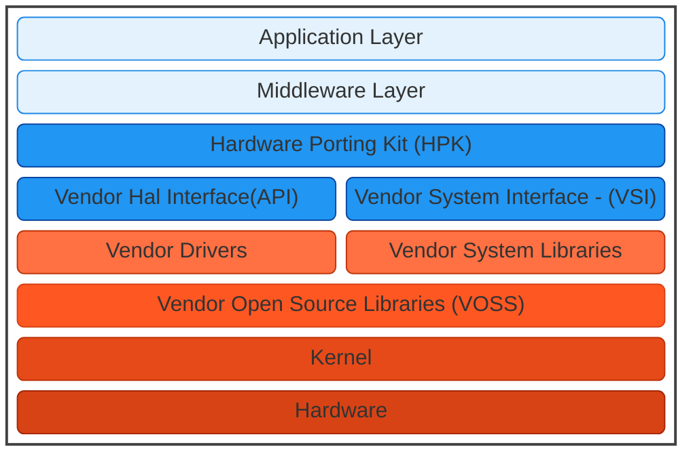

# The Software Stack

It is important to distinguish the different layers within the software stack:

- **Application Layer**: The software that directly interacts with end users (for example, an Electronic Programme Guide or streaming applications).
- **Middleware Layer**: Provides core services and functionality to the Application Layer—such as multimedia frameworks, network communication, and security.
- **Vendor Layer**: Interacts directly with the hardware. It includes drivers and other components that translate hardware-specific requirements into a format consumable by the Middleware and Application layers.

## Platform Independence

A key principle is **platform independence**. The Application and Middleware layers are designed to run on any platform without modification, relying on a discovery interface to identify hardware capabilities at runtime. All platform-specific details are handled by the Vendor Layer, ensuring the Application and Middleware remain portable. Each layer can also be released or updated at its own cadence, thanks to process separation—meaning updates to the Vendor Layer do not impact the stability of the upper layers.

Additionally, each interface introduces a dedicated `capabilities` mechanism, allowing the system to identify both the hardware’s capabilities and any associated constraints. Through these interface and the service manager it's possible to determine whether major features are supported on a given platform, further preserving the flexibility of the Application and Middleware layers.

---

## Component Stability and Versioning

Every component within the stack moves to a fixed version consumption model, where both interfaces and implementations follow a strict versioning scheme defining the contracts between components.

All **non-HAL components** within the stack follows the **Semantic Versioning (SemVer)** with a `major.minor.bugfix/doc` format:

- **Major** – Incremented for incompatible API changes.  
- **Minor** – Incremented when adding functionality in a backwards-compatible manner.  
- **Bugfix/Doc** – Incremented for backwards-compatible bug fixes or documentation updates (treating documentation as part of the semantic contract).

For more information, see [SemVer](https://www.semver.org).

---

## HAL Service Interfaces Architecture

Most of the HAL interfaces are implemented as **services** in a client–server architecture. These services maintain process separation and are backward compatible with older API versions. Interface definitions in AIDL files produce C++ code for both client and server, with HAL calls transmitted via Binder IPC.

These interfaces use a stable interface paradigm with **incremental versioning** to guarantee **full ABI backwards compatibility**:

- **Binary Compatibility**: Newly introduced features do not break or alter existing interfaces, so older clients do not need recompilation.  
- **Compatibility-Breaking Changes**: If a change cannot maintain backward compatibility, then a **brand-new** component (rather than altering an existing one) will be created. And the previous component will become obsolete and be deprecated over time.
- **Validation & Compliance**: Hash checks and validation scripts ensure that all interface updates remain backward compatible, enforcing the stable interface requirement.  
- **Opt-In for New Features**: Existing clients can continue using older interfaces seamlessly, unless they choose to adopt the new features (in which case rebuilding against the updated AIDL definitions is required).

---

## Vendor System Interfaces (In-Process HALs)

A smaller subset of HALs function as in-process libraries, collectively referred to as the **Vendor System Interface (VSI)**. They are dynamically linked to the RDK Middleware, commonly used for:

- **Graphics** – EGL, OpenGL ES, Vulkan
- **Wi-Fi** – wpa_supplicant
- **Bluetooth** – BlueZ

Because these libraries run in the same process, introducing a new VSI version typically requires a rebuild of the upper layers. Consequently, VSI changes are expected to occur infrequently—only when there is a substantial need—so that their release cadence remains low.
