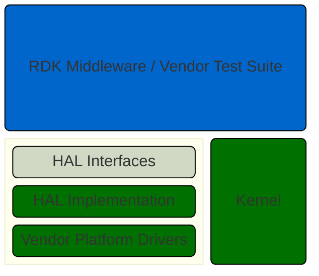

# HAL Versions Overview

The HAL interfaces provide the API contract between the RDK middleware and vendor layer containing the HAL implementation.

Both the RDK middleware and the Vendor Test Suite can sit above the HAL interfaces, which have been designed to use completely generic code with no platform/vendor specific code.

## Versions

Each HAL release is versioned as a major.minor.doc number and includes HAL services and components at different versions.

The version should increment with:

**Major**: A non-backward compatible change to the API.
**Minor**: A backward compatible change to the API. Defined as no change to the ABI exposed by the library that is used by the client.
**Doc**: A change in the documentation. Since the documentation defines sematic operation, it is important as an interface header definition change. It is backward compatible because it does not change the ABI.

All HAL versions are listed separately in this section for reference.

## HAL Service Interfaces

Most of the HAL interfaces are implemented as services across a client-server architecture which uses process separation and provides backwards compatibility with older versions of the API.

The interface definitions are provided in AIDL files, which generate C++ sources for both the client and server processes. HAL API calls are made across Binder.

## In-Process HALs

A small number of HALs exist as libraries which are dynamically linked to RDK middleware processes.

- Graphics: EGL, OpenGL ES, Vulkan graphics drivers
- Wi-Fi: wpa_supplicant
- Bluetooth: BlueZ
- CDM: Content Decryption Modules for DRM

## Device Profiles

The HAL supports device profiles for TV and STB which mandates which of the HAL services should be supported in the vendor layer.

At runtime the RDK middleware can access the DeviceInfo HAL service to get the device profile for the HAL.

