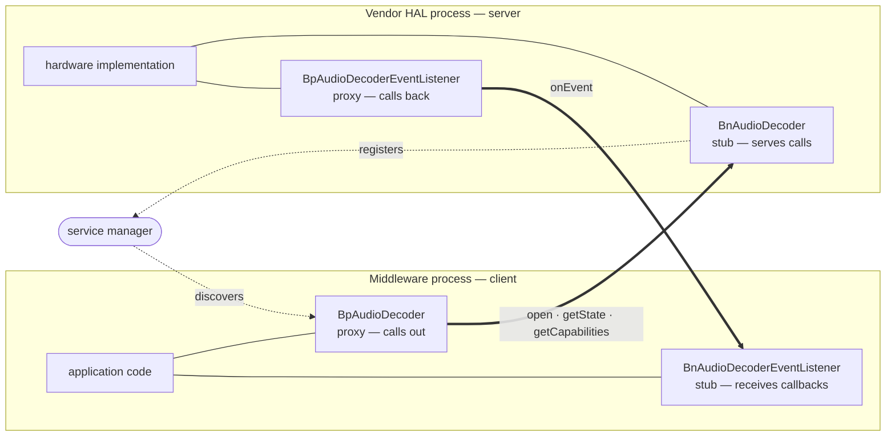
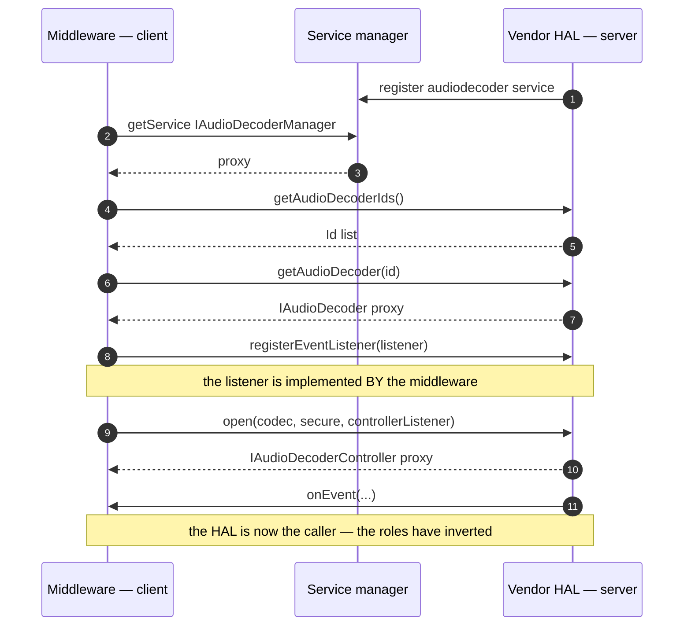
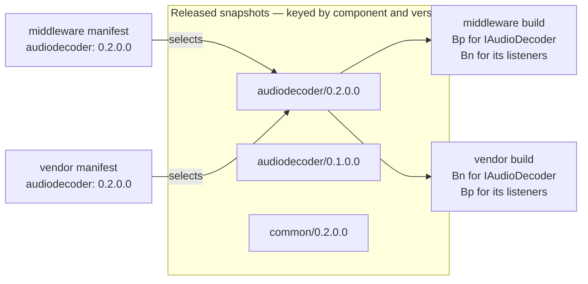

# HAL Interface Usage

How a HAL component is used by the two processes either side of it: which code
each one compiles, which direction the calls run, and how each selects the
version it builds against.

## Two processes, one contract

A HAL component is a contract between two processes built and delivered by
different organisations:

- the **vendor HAL** implements it and registers it with the service manager — the **server**;
- the **middleware** binds to that service and calls it — the **client**.

The generated C++ gives each side its half: the implementer derives from a `Bn`
stub, the caller holds a `Bp` proxy. Neither side writes it by hand.



Both processes contain a `Bp` proxy *and* a `Bn` stub. That is not an artefact
of the diagram — it is the shape of every component.

## The roles invert inside a single component

The interfaces are not one-directional. Listeners run the other way:

```aidl
IAudioDecoder.Id[] getAudioDecoderIds();                       // client calls
@nullable IAudioDecoder getAudioDecoder(in IAudioDecoder.Id);  // client calls

@nullable IAudioDecoderController open(
    in Codec codec, in boolean secure,
    in IAudioDecoderControllerListener listener);              // client SUPPLIES an implementation
boolean registerEventListener(
    in IAudioDecoderEventListener listener);                   // client SUPPLIES an implementation
```

A listener is passed *into* the HAL, so the **middleware implements `Bn`** for
it and the **vendor HAL calls it through `Bp`**. 56 of the 152 interfaces in the
released tree are `*Listener` callbacks.



So neither process is purely a client or purely a server. Each is a client of
some interfaces in a component and a server of others, and the two are mirrors
of one another.

## What each process builds

Both compile the same generated code, for every component and version they use.
The client/server split runs *per interface*, not per process, so neither side
can drop a half.

The consequence matters for everything downstream: **the unit a consumer selects
is (component, version), never (component, role).**

## Version selection

Each layer pins its own set of versions and builds against it. Middleware and
vendor are built and delivered separately, and each pin is a deliberate choice:
moving up to a later revision means deciding what to implement against it and
when to move.

**How far the two pins may differ depends on the era.** While a component is
`0.x`, a major bump is a breaking change, so middleware and vendor must be
**aligned on the major** — which couples their release cadences to each other.
Below the major each side chooses freely: within one major the protocol is
backwards-compatible, so a `0.2.3` server serves any `0.2.y` client. After a
component adopts frozen-AIDL discipline the interface is additive-only, and the
vendor can hold a major while the middleware versions independently.

Compatibility is checked at runtime rather than assumed. `halcompat::isCompatible()`
applies the era rule for you — major equality while in era `0`, plain ordering
once frozen — so a client never handles the encoding itself. The helper and the
rules it applies are documented in
[Client Usage of Stable AIDL](../../whitepapers/client_usage_of_stable_aidl.md)
and the [Versioning Guide](../../standards/versioning-guide.md).



The two layers select their own rows, subject to the era rule above: while a
component is `0.x` they must land on the same major, and each may sit at a
different minor or patch within it. That is what makes the snapshot tree the
shared artefact and the version choice a per-consumer one.

**A layer's pin is not the whole story.** A manifest pins the components a layer
names; every dependency is then built at the exact version its dependent links,
because the build closure is keyed by `(component, version)`. So where two
consumers need different versions of the same component, both are planned and
built side by side — `common@0.1.0.0` and `common@0.2.0.0` coexist in one build,
each serving the dependent that asked for it. The layout that keeps them apart
once installed — the version in the library name, and in the staged header path
— is described in
[Third-Party Build Integration](../../standards/build_integration.md) and the
[`rdk-halif-aidl` recipe](../../../tests/yocto/meta-rdk-halif-aidl/recipes-halif/rdk-halif-aidl/rdk-halif-aidl.bb);
what a release must provide to support it is the subject of
[HLA: What a Released HAL Snapshot Contains](../../architecture/hla-released-snapshot-contents.md).
