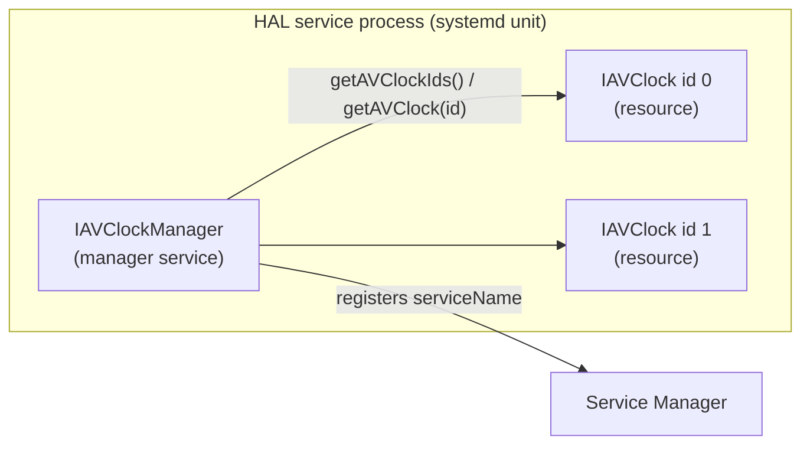
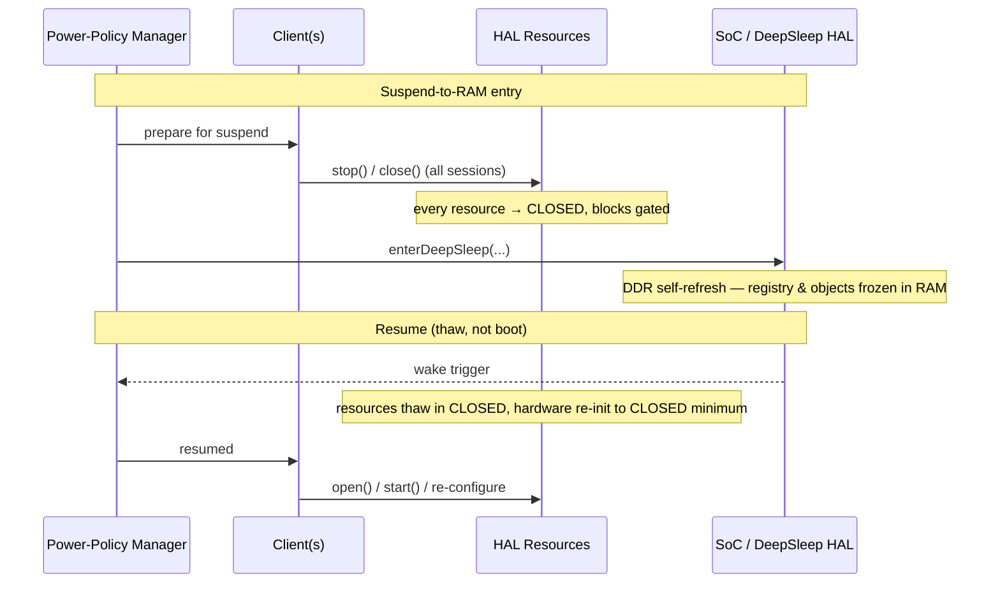

# HAL Resource Lifecycle

This page defines the lifecycle *around* a HAL resource — how a device comes into
existence, how it is initialised, how it releases power, and how it behaves across
service teardown, suspend/resume and bootloader handover.

It is the companion to [Session State Management](hal_session_state_management.md),
which defines the per-resource session state machine (`CLOSED` → `READY` → `STARTED` …).
Session State Management describes what happens *once a client holds a session*; this
page describes everything before, around and after that.

---

## Service vs. resource — two distinct layers

A common source of confusion is conflating the *manager service* with the *resource
instances* it exposes. They have separate lifecycles.

| Layer | Example | Registered with Service Manager? | Reached via |
|---|---|---|---|
| **Manager service** | `IAVClockManager`, `IAudioMixerManager` | **Yes** — by `serviceName` | systemd-started process |
| **Singleton service** | `IDeepSleep`, `IBoot` | **Yes** — by `serviceName` | systemd-started process |
| **Resource instance** ("device") | `IAVClock` id `0`, `mixer0` | **No** | `IxxxManager.getXxx(id)` |

Some HALs expose a single resource directly (no manager + resource split) — `IDeepSleep` and `IBoot` are examples. They register with the Service Manager exactly like a manager service does, but the API surface itself is the resource. The split into `IxxxManager` + `Ixxx` is the multi-resource pattern; the singleton pattern collapses to a single binder service.

The Service Manager holds **services**, not devices. Individual resources are never
registered with it — they are enumerated and reached *through* their manager.

---

## Resource existence

A resource "exists" because the **vendor layer declares it** — through the
[HAL Feature Profile](hal_feature_profiles.md) and the manager's `getXxxIds()`
enumeration. It does not exist because a client asked for it.

| # | Requirement | Comments |
|---|---|---|
| HAL.LIFECYCLE.1 | The set of resources a manager exposes is **static and platform-defined**. | Declared by the vendor layer; not created dynamically at runtime. |
| HAL.LIFECYCLE.2 | `getXxx(id)` is a **lookup, not a factory**. | It returns an interface handle to an already-existing resource, or `null` for an unknown id. It never constructs a resource and never changes its state. |
| HAL.LIFECYCLE.3 | Acquiring an interface is not acquiring the device. | `getXxx(id)` returns a binder proxy; `open()` is the point at which a client takes an exclusive *session*. The resource exists before `open()` and outlives `close()`. |

---

## Eager initialisation at service start

When a manager service starts, it constructs and initialises **every** resource it
controls — the full set returned by `getXxxIds()` — before it registers as operational.

| # | Requirement | Comments |
|---|---|---|
| HAL.LIFECYCLE.4 | A manager service shall initialise all controlled resources to their platform-required defaults **before** registering with the Service Manager. | Driven by the HFP / vendor config, not by any client request. No lazy creation. |
| HAL.LIFECYCLE.5 | "Initialised" means the HAL object and its software/default state exist and are queryable. | It does **not** mean hardware clocks are running. A freshly initialised resource sits in `CLOSED` — see [Power](#power-and-the-session-state-machine). Existence ≠ powered. |
| HAL.LIFECYCLE.6 | `getXxxIds()`, `getCapabilities()` and `getState()` shall be answerable the instant the service is operational, from retained software state. | They must never block on initialisation and never spin hardware up. |
| HAL.LIFECYCLE.7 | A resource that cannot be initialised shall not appear half-built. | The service either omits its id from `getXxxIds()` or surfaces it as failed. |

Service registration is therefore the **barrier**: once a manager is operational,
every resource it enumerates exists and is at platform defaults.

---

## Power and the session state machine

Power is a function of **session state** — there is no separate power-management API.
A resource releases power by being driven down its own state machine.

| State | Power tier | Hardware expectation |
|---|---|---|
| `STARTED` | Full | Clocks running, block active. |
| `READY` | Quiescent / idle | Processing clocks stopped; the vendor *may* keep minimal warm state for a fast `start()`. |
| `CLOSED` | Deepest per-resource low power | The vendor layer **shall** gate the block / stop its clocks. Only software state is retained. |

| # | Requirement | Comments |
|---|---|---|
| HAL.LIFECYCLE.8 | A resource in `CLOSED` shall be held at the platform's minimum power for that block. | This is the per-resource low-power mechanism — driven by `close()`, not by de-registration. |
| HAL.LIFECYCLE.9 | Querying a resource (`getCapabilities()`, `getState()`, `getXxxIds()`) shall not change its power state. | Otherwise a monitoring client defeats low power. |

The "`STARTED` but idle" case needs no extra API — an AV clock paused at rate `0.0`,
or a sink with its clock detached, is the low-power idle point within `STARTED`.

---

## Service teardown and de-registration

De-registration from the Service Manager is **not** a low-power mechanism. It is the
inverse of the eager-init event — the whole service is going away.

| # | Requirement | Comments |
|---|---|---|
| HAL.LIFECYCLE.10 | A manager service de-registers only on **service-process teardown** — orderly shutdown, service restart, or OTA update. | Routine low power keeps the service registered and answering queries, with resources in `CLOSED`. |
| HAL.LIFECYCLE.11 | On teardown the service shall release all hardware handles it holds. | It shall **not** unilaterally shut down a shared platform driver. |
| HAL.LIFECYCLE.12 | Platform driver shutdown is resolved by systemd dependency ref-counting. | The HAL service unit `Wants`/`Requires` the driver unit; systemd stops the driver only when no other unit still requires it. |

A *rarely-used* service may legitimately be socket/bus-activated — systemd stops it
when idle and re-activates it on the first binder call. This trades away the
eager-init guarantee and instant queryability, so it is a per-component decision —
appropriate for seldom-touched services, not for hot-path services such as AV clock.

---

## Suspend-to-RAM and resume

Suspend-to-RAM keeps DDR in self-refresh, so **every process is preserved in RAM** —
including the Service Manager registry and all HAL service objects. Resume is a thaw,
not a boot.

**Entry** is the deep-sleep choreography: the middleware power-policy manager drives
all active clients to cooperatively `stop()` → `close()` their sessions, collapsing
**every resource to `CLOSED`**, then the SoC suspends.

| # | Requirement | Comments |
|---|---|---|
| HAL.LIFECYCLE.13 | Suspend-to-RAM entry shall quiesce all resources to `CLOSED` before the SoC suspends. | Cooperative client teardown — this is *how* the system reaches all-`CLOSED`. |
| HAL.LIFECYCLE.14 | Across suspend-to-RAM the Service Manager registry, manager services, resource objects and client binder proxies are preserved in self-refresh RAM. | No re-registration on resume; eager initialisation does **not** re-run. |
| HAL.LIFECYCLE.15 | On resume, every resource is in `CLOSED` with `getXxxIds()` / `getCapabilities()` queryable. | Each vendor block re-initialises only to its `CLOSED`-level minimum. Software objects were never lost, so there is no software/hardware divergence to reconcile. |
| HAL.LIFECYCLE.16 | On resume, clients rebuild their sessions (`open()` / `start()` / re-configure). | The client process also survives the suspend and is responsible for re-acquiring its resources. |
| HAL.LIFECYCLE.17 | Registry preservation tracks RAM preservation. | A deeper "cold" sleep tier that does not keep DDR in self-refresh has full reboot semantics — re-registration and eager init run from scratch. |

---

## Bootloader → main-app handover

At cold boot the bootloader (or an early splash app) may already have brought up the
display path and be showing a splash screen / boot logo. When the HAL services start,
the first hardware touch must not destroy that image.

| # | Requirement | Comments |
|---|---|---|
| HAL.LIFECYCLE.18 | For handover-sensitive devices, **eager initialisation** shall be non-destructive — it constructs the HAL object but **adopts** the live hardware state the bootloader left running rather than resetting to a default that blanks output. | Eager init is the *first* hardware touch, before any client `open()` — so the rule applies there first. |
| HAL.LIFECYCLE.19 | The first `open()` of a handover-sensitive device shall also be non-destructive. | Adopt the live state; do not blank. |
| HAL.LIFECYCLE.20 | Adopting the bootloader's live hardware state is distinct from restoring persisted user settings. | Handover = adopt the *running hardware* state. Persisted settings (picture mode, brightness) are re-applied separately and only when doing so causes no visible disruption. |
| HAL.LIFECYCLE.21 | Handover-sensitive devices shall declare non-destructive-handover support in their `Capabilities` / HFP. | Lets clients and the boot sequence reason about which devices preserve the splash. |

**Handover-sensitive devices:** `panel`, `hdmioutput` (the HDMI link / timing),
`planecontrol` and `videosink` (display planes).

**Exempt:** the `indicator` / LED — a simple discrete state with no continuous
content; re-asserting it causes no jarring glitch, so it is not required to support
non-destructive handover.

**HDCP is not a handover case.** HDCP is an authenticated cryptographic session, not a
register state. A splash screen is unprotected content, so HDCP is normally **not
active** during splash. The main app authenticates HDCP **on demand**, later, when
protected content plays — it is not "restored" across handover. If a bootloader did
establish HDCP, full session hand-off is generally not possible and re-authentication
(with a possible brief glitch) is the realistic fallback. In this interface set HDCP
is a concern of `hdmioutput`, not a separate component.

---

## Related Pages

!!! tip "Related Pages"
    - [Session State Management](hal_session_state_management.md)
    - [HAL Feature Profiles](hal_feature_profiles.md)
    - [HAL Interface Overview](hal_interfaces.md)
    - [Service Manager](../../vsi/service_manager/current/service_manager.md)
    - [Deep Sleep](https://github.com/rdkcentral/rdk-halif-aidl/blob/develop/deepsleep/current/docs/deep_sleep.md)
