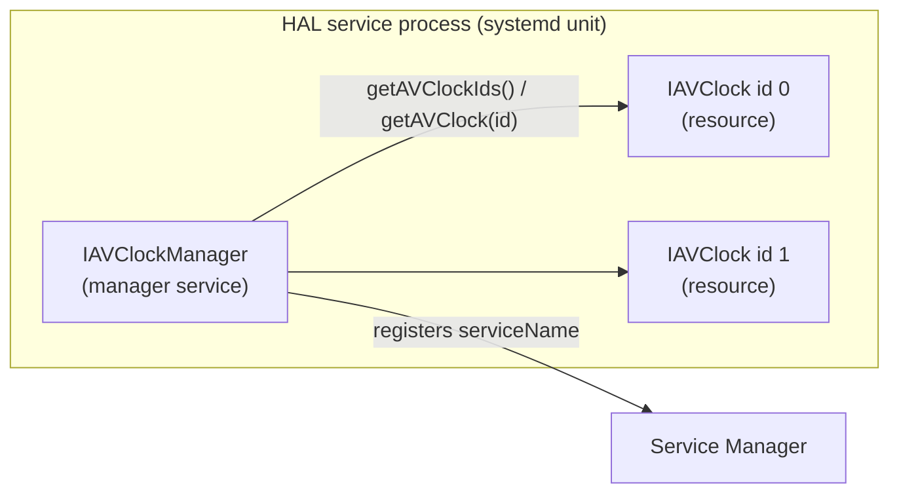
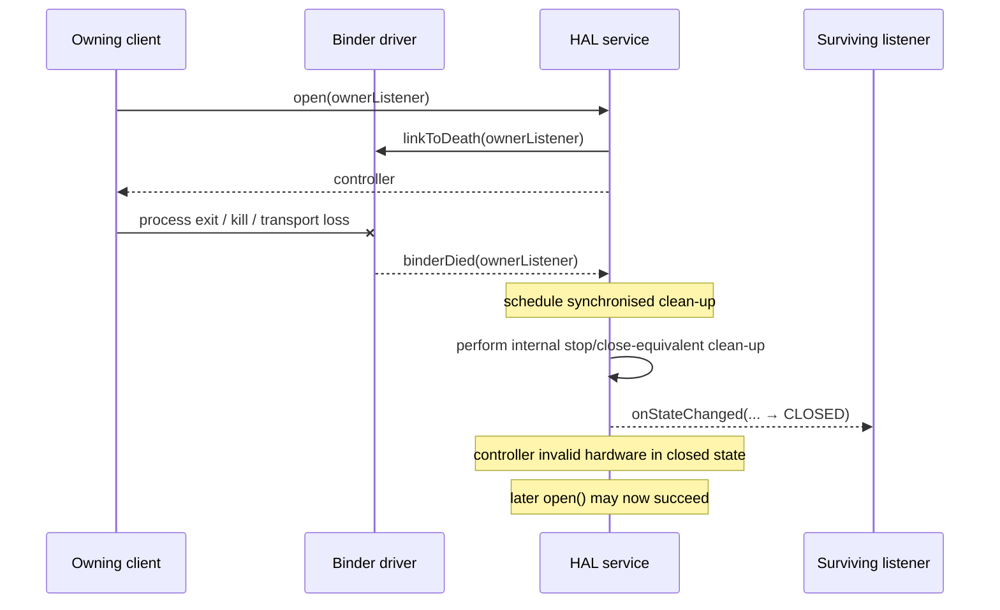
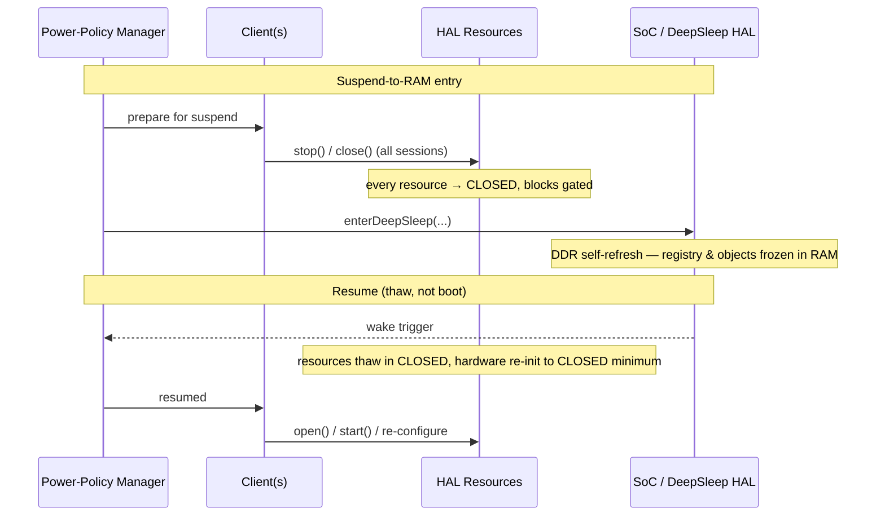

# HAL Resource Lifecycle

This page defines the lifecycle *around* a HAL resource — how a device comes into
existence, how it is initialised, how it releases power, and how it behaves across
service teardown, suspend/resume and bootloader handover.

It is the companion to [Session State Management](hal_session_state_management.md),
which defines the per-resource session state machine (`CLOSED` → `READY` → `STARTED` …).
Session State Management describes what happens *once a client holds a session*; this
page describes everything before, around and after that.

---

## Service vs. resource — two distinct layers

A common source of confusion is conflating the *manager service* with the *resource
instances* it exposes. They have separate lifecycles.

| Layer | Example | Registered with Service Manager? | Reached via |
|---|---|---|---|
| **Manager service** | `IAVClockManager`, `IAudioMixerManager` | **Yes** — by `serviceName` | systemd-started process |
| **Singleton service** | `IDeepSleep`, `IBootReason` | **Yes** — by `serviceName` | systemd-started process |
| **Resource instance** ("device") | `IAVClock` id `0`, `mixer0` | **No** | `IxxxManager.getXxx(id)` |

Some HALs expose a single resource directly (no manager + resource split) — `IDeepSleep` and `IBootReason` are examples. They register with the Service Manager exactly like a manager service does, but the API surface itself is the resource. The split into `IxxxManager` + `Ixxx` is the multi-resource pattern; the singleton pattern collapses to a single binder service.

```mermaid
flowchart LR
    SM["Service Manager"]
    subgraph Process["HAL service process (systemd unit)"]
        MGR["IAVClockManager<br/>(manager service)"]
        R0["IAVClock id 0<br/>(resource)"]
        R1["IAVClock id 1<br/>(resource)"]
    end
    MGR -- "registers serviceName" --> SM
    MGR -- "getAVClockIds() / getAVClock(id)" --> R0
    MGR --> R1
```

The Service Manager holds **services**, not devices. Individual resources are never
registered with it — they are enumerated and reached *through* their manager.

---

## Resource existence

A resource "exists" because the **vendor layer declares it** — through the
[HAL Feature Profile](hal_feature_profiles.md) and the manager's `getXxxIds()`
enumeration. It does not exist because a client asked for it.

| # | Requirement | Comments |
|---|---|---|
| HAL.LIFECYCLE.1 | The set of resources a manager exposes is **static and platform-defined**. | Declared by the vendor layer; not created dynamically at runtime. |
| HAL.LIFECYCLE.2 | `getXxx(id)` is a **lookup, not a factory**. | It returns an interface handle to an already-existing resource, or `null` for an unknown id. It never constructs a resource and never changes its state. |
| HAL.LIFECYCLE.3 | Acquiring an interface is not acquiring the device. | `getXxx(id)` returns a binder proxy; `open()` is the point at which a client takes an exclusive *session*. The resource exists before `open()` and outlives `close()`. |

---

## Eager initialisation at service start

When a manager service starts, it constructs and initialises **every** resource it
controls — the full set returned by `getXxxIds()` — before it registers as operational.

| # | Requirement | Comments |
|---|---|---|
| HAL.LIFECYCLE.4 | A manager service shall initialise all controlled resources to their platform-required defaults **before** registering with the Service Manager. | Driven by the HFP / vendor config, not by any client request. No lazy creation. |
| HAL.LIFECYCLE.5 | "Initialised" means the HAL object and its software/default state exist and are queryable. | It does **not** mean hardware clocks are running. A freshly initialised resource sits in `CLOSED` — see [Power](#power-and-the-session-state-machine). Existence ≠ powered. |
| HAL.LIFECYCLE.6 | `getXxxIds()`, `getCapabilities()` and `getState()` shall be answerable the instant the service is operational, from retained software state. | They must never block on initialisation and never spin hardware up. |
| HAL.LIFECYCLE.7 | A resource that cannot be initialised shall not appear half-built. | The service either omits its id from `getXxxIds()` or surfaces it as failed. |

Service registration is therefore the **barrier**: once a manager is operational,
every resource it enumerates exists and is at platform defaults.

---

## Power and the session state machine

Power is a function of **session state** — there is no separate power-management API.
A resource releases power by being driven down its own state machine.

| State | Power tier | Hardware expectation |
|---|---|---|
| `STARTED` | Full | Clocks running, block active. |
| `READY` | Quiescent / idle | Processing clocks stopped; the vendor *may* keep minimal warm state for a fast `start()`. |
| `CLOSED` | Deepest per-resource low power | The vendor layer **shall** gate the block / stop its clocks. Only software state is retained. |

| # | Requirement | Comments |
|---|---|---|
| HAL.LIFECYCLE.8 | A resource in `CLOSED` shall be held at the platform's minimum power for that block. | This is the per-resource low-power mechanism — driven by `close()`, not by de-registration. |
| HAL.LIFECYCLE.9 | Querying a resource (`getCapabilities()`, `getState()`, `getXxxIds()`) shall not change its power state. | Otherwise a monitoring client defeats low power. |

The "`STARTED` but idle" case needs no extra API — an AV clock paused at rate `0.0`,
or a sink with its clock detached, is the low-power idle point within `STARTED`.

---

## Client death and Resource clean-up

Client process death is a normal lifecycle event. In this section, **client death**
means that a client process exits or is killed, or that its Binder transport is
lost. It does not mean that the HAL service itself has died.

Binder does not call `stop()` or `close()` when a client dies. It only reports the
death of a watched Binder object through a death recipient (`linkToDeath()` or
`AIBinder_linkToDeath()`). The HAL service implementation owns the resulting state
transition and hardware clean-up.

For an exclusive session, the controller listener passed to `open()` is the
**ownership liveness token**. A separately registered event listener is an
independent subscription and is watched independently. Where an interface uses the
same Binder object for both roles, one death notification may satisfy both
obligations, but the session and subscription clean-up rules still both apply.

### Interfaces without `open()` or listener registration

`linkToDeath()` requires a remote Binder object owned by the client. The Binder
object representing the HAL service is owned by the server, so the service cannot
link to its own Binder to detect which client has died. Binder caller PID/UID values
identify a transaction caller but are not durable liveness tokens, and completion or
failure of a synchronous transaction is not a client-death notification.

An interface without `open()`, a listener, or another client-supplied Binder token
shall choose one of these designs:

| Interface behaviour | Client-death design |
|---|---|
| Stateless query or atomic configuration | No death recipient is required. The call either completes or fails, and committed hardware state is not reverted merely because the caller later dies. Examples include `getCapabilities()` and `IIndicator.set()`. |
| Service-owned or system-owned operation | The operation continues independently after acceptance. Its completion, cancellation and recovery rules shall not depend on caller liveness. |
| Client-owned long-running operation | The method shall receive a client-implemented typed listener or liveness-token interface. The service links to that Binder before accepting the operation and unlinks when the operation ends. |
| Asynchronous operation with a listener | The listener Binder is the liveness token if the interface explicitly defines the operation as client-owned. Otherwise its death only removes listener delivery and the service-owned operation continues. |

Adding a listener or token solely for death monitoring is an AIDL surface change.
Existing methods shall not claim death-triggered cancellation when they accept only
values or structured data. If backward compatibility prevents changing such a method, a
new token-bearing method shall be added at the end of the interface and the original
method shall retain caller-independent semantics.

| # | Requirement | Comments |
|---|---|---|
| HAL.LIFECYCLE.22 | A HAL service that grants an exclusive session through `open()` shall register a death recipient on the controller listener Binder supplied to that call. | Registration is part of acquiring the session. If the listener is already dead or death monitoring cannot be established, `open()` shall fail and roll back without granting ownership. |
| HAL.LIFECYCLE.23 | The service shall unlink the ownership death recipient when the matching `close()` completes. | The service shall also unlink it when a failed `open()` is rolled back. Explicit close and death clean-up may race, so unlinking and clean-up shall be idempotent and associated with the specific session generation. |
| HAL.LIFECYCLE.24 | The service shall register a death recipient on every Binder passed to `registerEventListener()` and unlink it when the matching `unregisterEventListener()` completes. | A listener used only for event observation does not own the resource. |
| HAL.LIFECYCLE.25 | Death of the ownership liveness token shall cause the service to release that client's session. | The HAL performs clean-up itself; AIDL/Binder does not implicitly invoke interface methods. Death of the ownership listener is treated as loss of the owner even if the client process remains alive. |
| HAL.LIFECYCLE.26 | Death clean-up shall produce the same observable resource and hardware end state as a successful explicit `stop()` followed by `close()`. | The resource reaches `CLOSED`, queued or in-flight work owned by the session is discarded or completed as specified by the component, controller handles are invalidated, and hardware reaches its documented closed-state condition. Clean-up is an internal operation; the service does not make Binder calls to the dead client. |
| HAL.LIFECYCLE.27 | The Binder death recipient shall only identify the affected registration/session and schedule synchronised, idempotent clean-up. | Potentially blocking stop, drain, driver or listener-notification work shall not run on the Binder death-recipient thread. A late death notification after explicit unlink shall be harmless. |
| HAL.LIFECYCLE.28 | When an event-listener Binder dies, the service shall remove that listener registration and release all state held solely for that registration. | If that listener is not the ownership liveness token, its death shall not close another client's session. A client that registered a listener but never opened a resource therefore loses only that subscription. |
| HAL.LIFECYCLE.29 | Surviving event listeners for the same resource shall receive the normal state-change notifications caused by death clean-up. | The dead listener is dropped and is not called. Notifications follow the ordering in [Session State Management](hal_session_state_management.md), ending in `CLOSED`; component documentation may define additional hardware-specific events. |
| HAL.LIFECYCLE.30 | Death clean-up shall reach `CLOSED` within 500 milliseconds after the service receives the death notification. | This matches the target-state bound in `HAL.STATE.2`. A subsequent `open()` shall not succeed until clean-up is complete; while clean-up is in progress it may wait within the bound or return the interface's normal unavailable/busy failure. |
| HAL.LIFECYCLE.31 | After death clean-up completes, a restarted client shall acquire the resource using the normal `open()` flow. | No force-close, takeover or recovery call is required. The new session receives a new controller and death-recipient association. |
| HAL.LIFECYCLE.32 | A component may strengthen this contract with hardware-specific clean-up, but shall not weaken the common ownership, `CLOSED` end-state, timing or re-open guarantees. | Examples include de-asserting an HDMI-input HPD line or detaching an audio mix. The component documentation states such additional effects. |
| HAL.LIFECYCLE.33 | A service shall use `linkToDeath()` only with a client-supplied Binder whose documented lifetime represents the session, subscription or operation being monitored. | The service Binder, caller PID/UID and transaction lifetime shall not be used as substitutes. |
| HAL.LIFECYCLE.34 | A method that accepts no client-supplied Binder shall have caller-independent semantics. | Client death neither rolls back completed configuration nor implicitly cancels accepted work. |
| HAL.LIFECYCLE.35 | If caller death must cancel a long-running operation, the interface shall accept a typed client Binder token and define the clean-up boundary. | The contract states whether death cancels only work not yet committed, aborts active hardware work, or allows an irreversible operation to complete safely. |
| HAL.LIFECYCLE.36 | Death of a listener Binder shall cancel an operation only when the interface explicitly defines that Binder as its operation liveness token. | Otherwise the dead listener is removed and the operation continues without further delivery to it. |

```mermaid
sequenceDiagram
    participant Client as Owning client
    participant Binder as Binder driver
    participant HAL as HAL service
    participant Observer as Surviving listener

    Client->>HAL: open(ownerListener)
    HAL->>Binder: linkToDeath(ownerListener)
    HAL-->>Client: controller
    Client-xBinder: process exit / kill / transport loss
    Binder-->>HAL: binderDied(ownerListener)
    Note over HAL: schedule synchronised clean-up
    HAL->>HAL: perform internal stop/close-equivalent clean-up
    HAL-->>Observer: onStateChanged(... → CLOSED)
    Note over HAL: controller invalid hardware in closed state
    Note over HAL: later open() may now succeed
```

---

## Service teardown and de-registration

De-registration from the Service Manager is **not** a low-power mechanism. It is the
inverse of the eager-init event — the whole service is going away.

| # | Requirement | Comments |
|---|---|---|
| HAL.LIFECYCLE.10 | A manager service de-registers only on **service-process teardown** — orderly shutdown, service restart, or OTA update. | Routine low power keeps the service registered and answering queries, with resources in `CLOSED`. |
| HAL.LIFECYCLE.11 | On teardown the service shall release all hardware handles it holds. | It shall **not** unilaterally shut down a shared platform driver. |
| HAL.LIFECYCLE.12 | Platform driver shutdown is resolved by systemd dependency ref-counting. | The HAL service unit `Wants`/`Requires` the driver unit; systemd stops the driver only when no other unit still requires it. |

A *rarely-used* service may legitimately be socket/bus-activated — systemd stops it
when idle and re-activates it on the first binder call. This trades away the
eager-init guarantee and instant queryability, so it is a per-component decision —
appropriate for seldom-touched services, not for hot-path services such as AV clock.

---

## Suspend-to-RAM and resume

Suspend-to-RAM keeps DDR in self-refresh, so **every process is preserved in RAM** —
including the Service Manager registry and all HAL service objects. Resume is a thaw,
not a boot.

**Entry** is the deep-sleep choreography: the middleware power-policy manager drives
all active clients to cooperatively `stop()` → `close()` their sessions, collapsing
**every resource to `CLOSED`**, then the SoC suspends.

| # | Requirement | Comments |
|---|---|---|
| HAL.LIFECYCLE.13 | Suspend-to-RAM entry shall quiesce all resources to `CLOSED` before the SoC suspends. | Cooperative client teardown — this is *how* the system reaches all-`CLOSED`. |
| HAL.LIFECYCLE.14 | Across suspend-to-RAM the Service Manager registry, manager services, resource objects and client binder proxies are preserved in self-refresh RAM. | No re-registration on resume; eager initialisation does **not** re-run. |
| HAL.LIFECYCLE.15 | On resume, every resource is in `CLOSED` with `getXxxIds()` / `getCapabilities()` queryable. | Each vendor block re-initialises only to its `CLOSED`-level minimum. Software objects were never lost, so there is no software/hardware divergence to reconcile. |
| HAL.LIFECYCLE.16 | On resume, clients rebuild their sessions (`open()` / `start()` / re-configure). | The client process also survives the suspend and is responsible for re-acquiring its resources. |
| HAL.LIFECYCLE.17 | Registry preservation tracks RAM preservation. | A deeper "cold" sleep tier that does not keep DDR in self-refresh has full reboot semantics — re-registration and eager init run from scratch. |

```mermaid
sequenceDiagram
    participant PM as Power-Policy Manager
    participant Cl as Client(s)
    participant HAL as HAL Resources
    participant SoC as SoC / DeepSleep HAL

    Note over PM,SoC: Suspend-to-RAM entry
    PM->>Cl: prepare for suspend
    Cl->>HAL: stop() / close()  (all sessions)
    Note over HAL: every resource → CLOSED, blocks gated
    PM->>SoC: enterDeepSleep(...)
    Note over SoC: DDR self-refresh — registry & objects frozen in RAM

    Note over PM,SoC: Resume (thaw, not boot)
    SoC-->>PM: wake trigger
    Note over HAL: resources thaw in CLOSED, hardware re-init to CLOSED minimum
    PM->>Cl: resumed
    Cl->>HAL: open() / start() / re-configure
```

---

## Bootloader → main-app handover

At cold boot the bootloader (or an early splash app) may already have brought up the
display path and be showing a splash screen / boot logo. When the HAL services start,
the first hardware touch must not destroy that image.

| # | Requirement | Comments |
|---|---|---|
| HAL.LIFECYCLE.18 | For handover-sensitive devices, **eager initialisation** shall be non-destructive — it constructs the HAL object but **adopts** the live hardware state the bootloader left running rather than resetting to a default that blanks output. | Eager init is the *first* hardware touch, before any client `open()` — so the rule applies there first. |
| HAL.LIFECYCLE.19 | The first `open()` of a handover-sensitive device shall also be non-destructive. | Adopt the live state; do not blank. |
| HAL.LIFECYCLE.20 | Adopting the bootloader's live hardware state is distinct from restoring persisted user settings. | Handover = adopt the *running hardware* state. Persisted settings (picture mode, brightness) are re-applied separately and only when doing so causes no visible disruption. |
| HAL.LIFECYCLE.21 | Handover-sensitive devices shall declare non-destructive-handover support in their `Capabilities` / HFP. | Lets clients and the boot sequence reason about which devices preserve the splash. |

**Handover-sensitive devices:** `panel`, `hdmioutput` (the HDMI link / timing),
`planecontrol` and `videosink` (display planes).

**Exempt:** the `indicator` / LED — a simple discrete state with no continuous
content; re-asserting it causes no jarring glitch, so it is not required to support
non-destructive handover.

**HDCP is not a handover case.** HDCP is an authenticated cryptographic session, not a
register state. A splash screen is unprotected content, so HDCP is normally **not
active** during splash. The main app authenticates HDCP **on demand**, later, when
protected content plays — it is not "restored" across handover. If a bootloader did
establish HDCP, full session hand-off is generally not possible and re-authentication
(with a possible brief glitch) is the realistic fallback. In this interface set HDCP
is a concern of `hdmioutput`, not a separate component.

---

## Related Pages

!!! tip "Related Pages"
    - [Session State Management](hal_session_state_management.md)
    - [HAL Feature Profiles](hal_feature_profiles.md)
    - [HAL Interface Overview](hal_interfaces.md)
    - [Service Manager](../../vsi/service_manager/current/service_manager.md)
    - [Deep Sleep](https://github.com/rdkcentral/rdk-halif-aidl/blob/develop/deepsleep/current/docs/deep_sleep.md)
