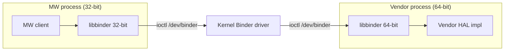

# Binder Runtime: Layering, Bitness, and Kernel Requirements

How the Binder userspace runtime (`libbinder`/`libutils`) is built and delivered across the **MW** and **vendor** layers, and what the target kernel must provide.

## Layering

The [layer-aggregation architecture](../../vsi/filesystem/current/docs/directory_and_dynamic_linking_specification.md) mounts `/mw` and `/vendor` as independent, read-only layers. The MW and vendor layers run as **separate processes** and communicate over the kernel Binder driver.



## Each layer ships its own libbinder

- **MW** builds and delivers its own `libbinder`/`libutils`. MW is **32-bit** on current platforms.
- **Vendor** builds and delivers its own `libbinder`/`libutils`, at the vendor's bitness — **platform-dependent** (32- or 64-bit).
- They interoperate **over the kernel Binder driver (IPC)**; neither layer links the other's libraries.

## Bitness rule (in-process)

A process is a single ELF class; every library loaded into it must match that bitness. The dynamic linker refuses to load a 64-bit `.so` into a 32-bit process (and vice versa).

| Boundary | Same process? | Rule |
| --- | --- | --- |
| Within one layer's process | yes | all libraries share the process bitness |
| MW ↔ vendor | no — separate processes | bitness may differ; the kernel Binder driver bridges it |

## Binder protocol version — the constraint that governs interop

Compile bitness is **not** what must match across MW, vendor, and kernel — the **Binder protocol version** is. libbinder verifies it with a strict **equality** check when it opens the driver: the open *fails* if the kernel's protocol version is not exactly the userspace library's. The version is selected at build time by `BINDER_IPC_32BIT`:

| Build | `BINDER_IPC_32BIT` | `binder_uintptr_t` | Protocol |
| --- | --- | --- | --- |
| legacy 32-bit | set | 32-bit | **7** |
| modern (any process bitness) | unset | 64-bit | **8** |

A 32-bit process can run protocol **8** (64-bit binder handles inside a 32-bit process) — that is how a 32-bit and a 64-bit process interoperate on one kernel. **MW, vendor, and kernel must all agree on the protocol version.**

### Two supported platform configurations

| Platform | MW | Vendor | Protocol | MW build | Kernel |
| --- | --- | --- | --- | --- | --- |
| All-32-bit userspace | 32-bit | 32-bit | 7 | `BINDER_IPC_32BIT=1` | `CONFIG_ANDROID_BINDER_IPC_32BIT=y` |
| Mixed (32-bit MW + 64-bit vendor) | 32-bit | 64-bit | 8 | 32-bit compile, `BINDER_IPC_32BIT` unset | `CONFIG_ANDROID_BINDER_IPC_32BIT` unset |

> **Build gap.** linux_binder_idl currently couples `TARGET_LIB32_VERSION=ON` to `-DBINDER_IPC_32BIT=1` (`CMakeLists.txt:702-707`), so it can only produce the **protocol-7** 32-bit build. The **mixed** configuration needs a 32-bit compile with **protocol 8** (`BINDER_IPC_32BIT` unset). Decoupling the compile bitness from the protocol flag is tracked in linux_binder_idl#35. Until then, a 32-bit MW cannot share a kernel with a 64-bit vendor.

## Kernel requirements

```text
CONFIG_ANDROID_BINDER_IPC=y
CONFIG_ANDROID_BINDER_DEVICES="binder,hwbinder,vndbinder"
# All-32-bit-userspace (protocol 7) platforms ONLY:
CONFIG_ANDROID_BINDER_IPC_32BIT=y
# Mixed 32/64 (protocol 8) platforms: leave CONFIG_ANDROID_BINDER_IPC_32BIT UNSET
CONFIG_ANDROID_BINDERFS=y    # optional; kernels >= 5.0
```

- **Device node.** libbinder opens `/dev/binder` directly; **binderfs is not required** (it is consulted only for an optional feature probe, and its absence is handled cleanly). On kernels < 5.0 use the static node from `CONFIG_ANDROID_BINDER_DEVICES`; ≥ 5.0 may use binderfs.
- **32-bit userspace on a 64-bit kernel.** Served by the Binder `compat_ioctl` path. On a mixed platform the kernel uses protocol 8 (no `BINDER_IPC_32BIT`) and the 32-bit MW must also be a protocol-8 build.

## Supported kernel range

**The supported floor is kernel 4.9**, through 5.16 and later.

The upstream AOSP `android-13.0.0_r74` libbinder runtime works across this range: nothing it uses unconditionally is newer than the range, and newer ioctls (process-freeze ~5.10, oneway-spam-detection ~5.11) are runtime-guarded, so on older kernels they degrade non-fatally — `BINDER_SET_CONTEXT_MGR_EXT` (~4.19) falls back to `BINDER_SET_CONTEXT_MGR`, freeze/node-info ioctls return errors only to explicit opt-in callers, and the binderfs probe returns false. The governing constraint is **protocol-version + struct-ABI match**, not individual ioctl availability — libbinder hard-fails the driver open if the kernel's `BINDER_VERSION` is not exactly its own.

!!! warning "Port patch must honour the 4.9 floor"
    `native.patch` currently disables the pre-5.16 fallback definitions in `binder_module.h` on a "require 5.16+" assumption, which **breaks builds against 4.9 kernel headers**. The fallback shims must be restored so the runtime builds against both old and new headers — tracked in linux_binder_idl#35.

### Verification

Binder is a kernel driver, so the kernel under test must actually run. **Docker shares the host kernel and cannot test other kernel versions** — use **QEMU/KVM VMs**, one per kernel (**4.9, 5.4, 5.10, 5.15, 5.16**) × protocol (7/8) × bitness. Each runs a binder smoke test: open `/dev/binder` (catches the `BINDER_VERSION` mismatch), start `servicemanager`, register/fetch a service, round-trip a transaction, and exercise the guarded ioctls to confirm graceful degradation.

## Build & delivery

- **MW recipe** builds its 32-bit Binder runtime + the HAL interface libraries and stages them under `/mw/lib` with the layer `ld.so.conf.d` entry. The binder **protocol** (7 or 8) is selected to match the platform's vendor and kernel.
- **Vendor recipe** builds its own Binder runtime + HAL implementation at the vendor's bitness, staged under `/vendor/lib`.
- **servicemanager** runs once for the system context both layers share.
