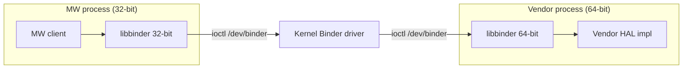

# Binder Runtime: Layering, Bitness, and Kernel Requirements

How the Binder userspace runtime (`libbinder`/`libutils`) is built and delivered across the **MW** and **vendor** layers, and what the target kernel must provide.

## Layering

The [layer-aggregation architecture](../../vsi/filesystem/current/docs/directory_and_dynamic_linking_specification.md) mounts `/mw` and `/vendor` as independent, read-only layers. The MW and vendor layers run as **separate processes** and communicate over the kernel Binder driver.



## Each layer ships its own bitness-matched libbinder

- **MW** builds and delivers its own `libbinder`/`libutils`, **32-bit** (`TARGET_LIB32_VERSION=ON`).
- **Vendor** builds and delivers its own `libbinder`/`libutils`, matched to the vendor's own bitness (e.g. 64-bit).
- The two interoperate **over the kernel Binder driver (IPC)**, which marshals transactions across the 32/64 boundary. Neither layer links the other's libraries.

## Bitness rule

A process is a single ELF class; every library loaded into it must match that bitness. The dynamic linker refuses to load a 64-bit `.so` into a 32-bit process (and vice versa).

| Boundary | Same process? | Bitness rule |
|----------|---------------|--------------|
| Within one layer's process (in-process linking) | yes | all libraries share the process bitness |
| MW ↔ vendor | no — separate processes | bitness may differ; the kernel Binder driver bridges it |

A cross-bitness split (32-bit MW, 64-bit vendor) is therefore an **IPC** boundary, served by per-layer bitness-matched binders. Kernel bitness is independent: a 64-bit kernel serves 32-bit userspace.

## Kernel requirements

The target kernel must enable the Binder driver and expose the device the runtime opens:

```text
CONFIG_ANDROID_BINDER_IPC=y
CONFIG_ANDROID_BINDER_DEVICES="binder,hwbinder,vndbinder"   # static device nodes
CONFIG_ANDROID_BINDERFS=y                                    # kernels >= 5.0 (binderfs)
```

- **Device node.** The runtime opens `/dev/binder`. On kernels **≥ 5.0** this may be provided via **binderfs** (`mount -t binder binder /dev/binderfs`); on earlier kernels it is a **static device node** created from `CONFIG_ANDROID_BINDER_DEVICES`.
- **32-bit userspace on a 64-bit kernel.** A 64-bit kernel serves 32-bit MW via the Binder `compat_ioctl` path. Build the MW runtime to match the **userspace** architecture (32-bit), independent of kernel bitness.
- **Protocol version.** The Binder protocol version is stable across the supported range (8 on 64-bit, 7 on 32-bit), so core transactions are version-independent.

### Minimum supported kernel

<!-- Pinned from the libbinder feature audit (#662): the floor is the lowest
     kernel whose Binder driver implements every ioctl the AOSP-13 libbinder
     issues unconditionally. Matrix added on completion of that audit. -->

The supported floor is the lowest kernel whose Binder driver implements every feature the shipped `libbinder` uses unconditionally. Features such as binderfs (5.0), process-freeze ioctls (5.x), and extended-error reporting (5.x) are introduced at specific kernel versions; a target below a used feature's introduction either degrades (if the runtime guards it) or fails (if unconditional). The pinned floor and per-feature matrix are tracked in #662.

## Build & delivery

- **MW recipe** builds the 32-bit Binder SDK (`TARGET_LIB32_VERSION=ON`) plus the HAL interface libraries, and stages them under `/mw/lib` with the layer's `ld.so.conf.d` entry.
- **Vendor recipe** builds its own Binder runtime and HAL implementation at the vendor's bitness, staged under `/vendor/lib` with the vendor `ld.so.conf.d` entry.
- **servicemanager** runs once for the system context both layers share.
