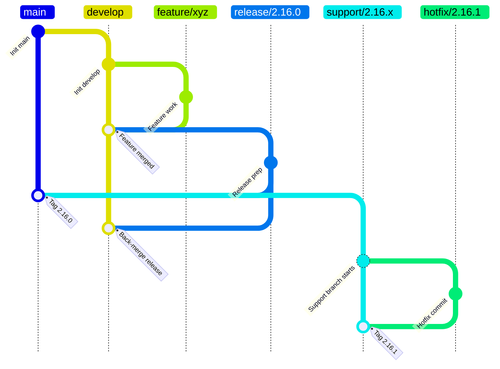
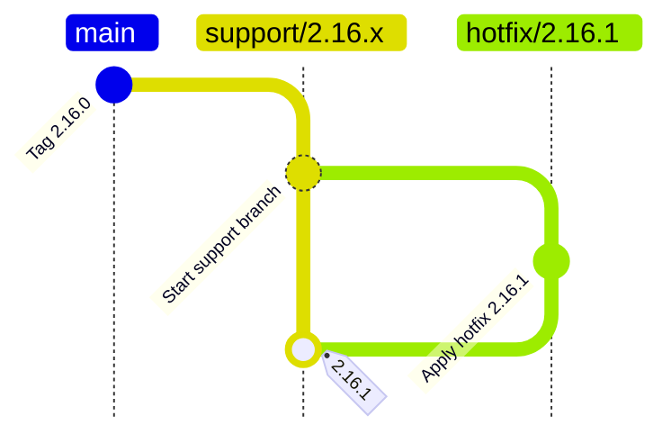
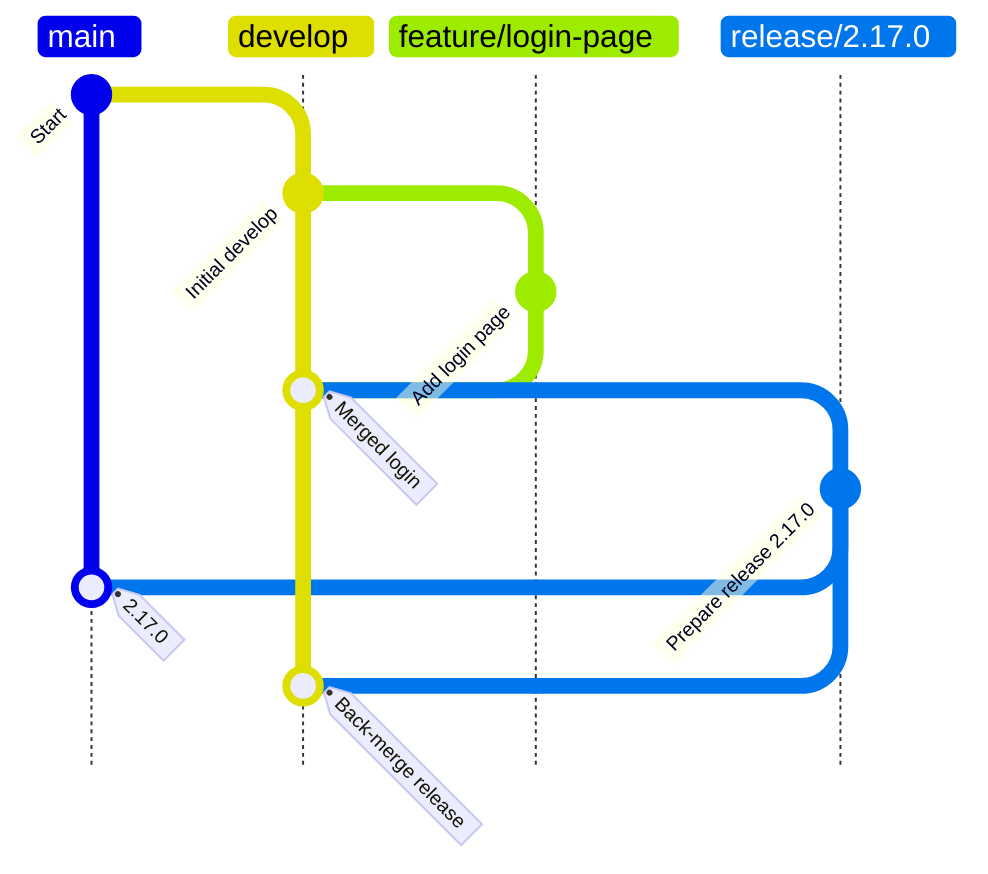

# **Git-Flow AVH Branching Strategy**

This document outlines the usage of support and hotfix branches in a Git-Flow AVH (A Vincent Driessen Git-Flow AVH extension) model, especially when maintaining long-term support from specific release tags. It emphasizes using the `git flow` command-line tool to streamline operations and maintain consistency.

## Document History

|Date|Author|Version|Comment|
|----|-------|------|-------|
|1st July 2025 | G. Weatherup| 1.0.0 | Initial Revision|

!!! info "**Related Branching Strategies:**"
    |||
    |-|-|
    |**Direct Branching**|[direct_branching.md](direct_branching.md)|
    |**Forced Based Branching**|[forked_based_branching.md](forked_based_branching.md)|
    |**Branchying Strategies**|[branching_strategies.md](../whitepapers/branching_strategies.md)|
    |**Engineering Goals**|[engineering_goals.md](../whitepapers/engineering_goals.md)|

## **Overview of Git-Flow Workflow**

Git-Flow is a branching model that facilitates parallel development and support of stable release lines. The key branches are:

* `main`: always contains production-ready code.
* `develop`: integration branch for features, and the base for releases.
* `feature/*`: for new features; merged into `develop`.
* `release/*`: prepares for a production release; merged into `main` and `develop`.
* `hotfix/*`: used for emergency fixes on production; merged into `main`, or `support` if branched from a support line.
* `support/*`: added in AVH to support older release lines; hotfixes can be branched from and to here.

### **Git-Flow Lifecycle (Visualized)**



## **Git Flow Initialization**

To start using **Git Flow**, you first need to initialize it in your repository. This sets up the standard branch model and naming conventions used to manage development, releases, and hotfixes.

### Initialize Git Flow

Run the following command inside your repository:

```bash
git flow init
```

You will then be prompted to define the naming conventions for different branch types. The defaults are generally recommended and widely used:

```text
Branch name for production releases: main
Branch name for "next release" development: develop
Feature branches? [feature/]
Release branches? [release/]
Hotfix branches? [hotfix/]
Support branches? [support/]
Version tag prefix? []
```

### Use Defaults Automatically

If you want to skip the interactive prompts and accept the defaults directly, use:

```bash
git flow init -d
```

This will configure the repository with the **main/develop** base branches and the standard prefixes for feature, release, and hotfix branches.

## **Support Branches**

### **Purpose**

Support branches are used to **maintain older release lines** (e.g., `2.16.x`) beyond their initial release. They allow teams to deliver critical hotfixes or security patches **without impacting ongoing development** on `develop` or future releases on `main`.

Typical use cases:

* Customers locked to a specific release series
* Long-term maintenance of older product versions
* Security patching of legacy branches

---

### **Creation**

AVH Git Flow provides a dedicated subcommand to create support branches.

To create a support branch from a specific release tag, first check out the tag you want to base the support branch on. Then, run the `git flow support start` command. 

For example:

```bash
# Step 1: Check out the release tag you want to support
git checkout tags/2.16.0
# Step 2: Create and check out the support branch from that tag
git flow support start 2.16.x
```

This creates and checks out `support/2.16.x`.

To share it with remote:

```bash
git flow support publish 2.16.x
```

or

```bash
git push -u
```

---

### **Maintenance**

Support branches behave like other long-lived branches (`main`, `develop`):

* **Hotfixing**

  Create hotfixes from the support branch, not from `main`:

  ```bash
  git flow hotfix start 2.16.1 support/2.16.x
  ```

  After fixing and finishing the hotfix:

  * The hotfix branch is merged back into `support/2.16.x`.
  * The version is tagged (e.g., `2.16.1`).
  * The changes remain isolated from `main` or `develop`.

* **No automatic merging to `main`/`develop`**

Support branches are standalone maintenance lines. They do **not** receive merges back into `main` or `develop` unless explicitly needed.

!!! warning "Critical Fixes"
      For critical, non-regression fixes created on a support/* branch, teams must manually cherry-pick the hotfix commit into the develop branch if the fix is needed in future releases.

## **Hotfix Branches**

### **Hotfix Purpose**

Used for critical patches. When maintaining older releases, hotfixes are branched from a `support` branch in AVH.

### **Workflow**

```bash
git checkout support/2.16.x
git flow hotfix start 2.16.1
# implement fix
git flow hotfix finish 2.16.1
```

Performs:

* Merge into `support/2.16.x`
* Auto-tag `2.16.1`
* Cleanup

### **Pushing:**

```bash
git push origin support/2.16.x
git push origin --tags
```

### **Hotfix Diagram**



## **Feature and Release Branches**

### **Feature**

```bash
git flow feature start 456-login-page
# Develop
git flow feature finish 456-login-page
```

`456` in this case is an example github issue id, so that the branch can be tracked via naming convention.

The feature branch will flow :-

* From: `develop`
* To: `develop`


### **Release**

```bash
git flow release start 2.17.0
# Bump changelog
git flow release finish 2.17.0
```

The release branch will flow :-

* From: `develop`
* To: `main` and `develop`
* Tags release

### **Feature/Release Diagram**



## **Conclusion**

Git-Flow AVH extends traditional Git-Flow by supporting long-term maintenance via support branches. This approach is particularly well-suited for projects that must continue maintaining older release lines while simultaneously advancing new features. Support branches allow you to isolate hot-fixes and patches without interfering with current development or production versions. The diagrams included in this document help visualize these flows clearly, reinforcing consistent usage across teams. Using Git-Flow commands enforces structure and minimizes branching errors. The visual diagrams assist in understanding the flow of changes across branches.

## **References**

The following references provide background on Git-Flow and its common workflows:

* [A successful Git branching model (nvie.com)](https://nvie.com/posts/a-successful-git-branching-model/)
* [Gitflow Workflow - Atlassian Git Tutorials](https://www.atlassian.com/git/tutorials/comparing-workflows/gitflow-workflow)
* [Gitflow-AVH by petervanderdoes (GitHub)](https://github.com/petervanderdoes/gitflow-avh)
* [Git Flow by Jeff Kreeftmeijer](https://jeffkreeftmeijer.com/git-flow/)
* [Gitflow-AVH README (GitHub)](https://github.com/petervanderdoes/gitflow-avh?tab=readme-ov-file)
* [Git-Flow Cheatsheet](https://danielkummer.github.io/git-flow-cheatsheet/)

!!! note "Note"
      While these references describe the standard Git-Flow model and the AVH implementation, **none of them fully address the enhanced support flow**. Specifically, they typically assume `hotfix/*` always merge into `main`, which is **not the case when using support branches properly**. If you are using `support/*` branches, hotfixes should only merge back into their respective support line to maintain version isolation and avoid regression conflicts.
