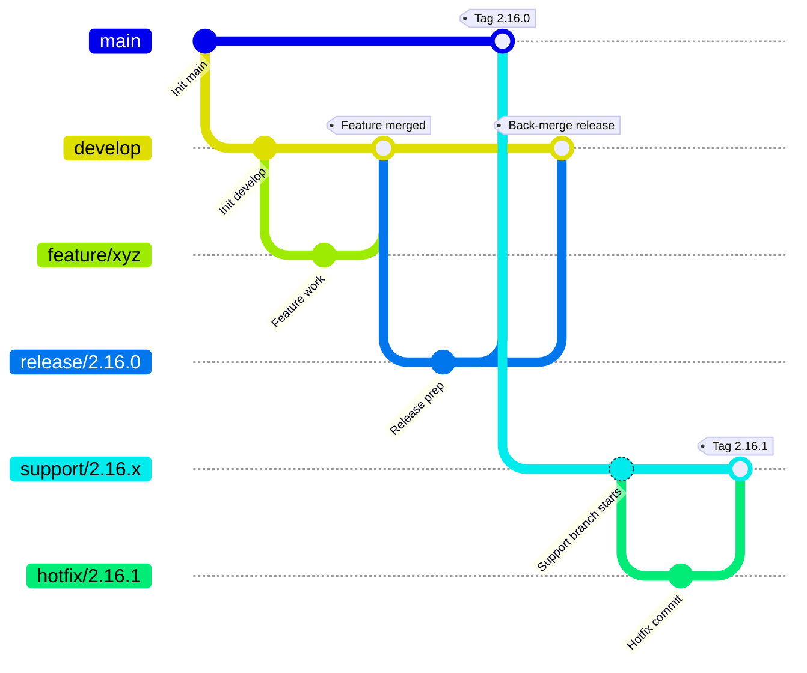
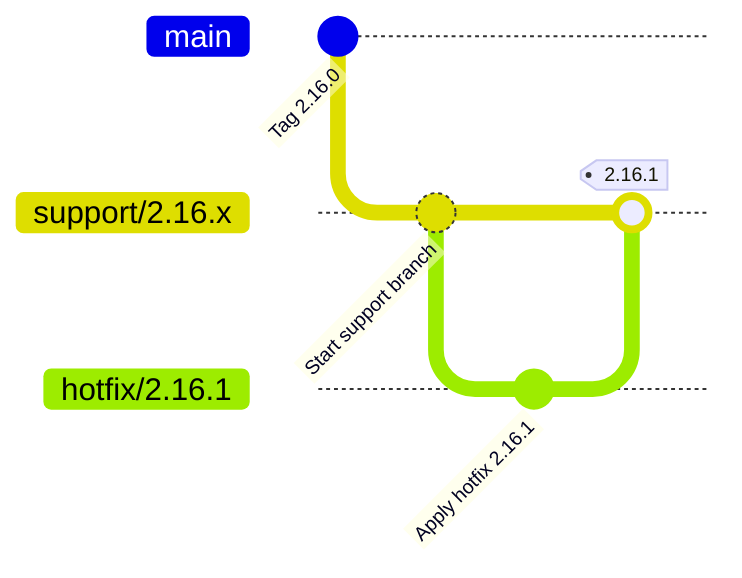
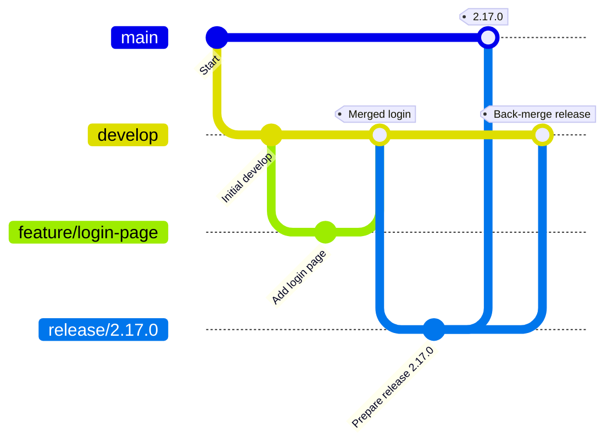

# **Git-Flow AVH Branching Strategy**

This document outlines the usage of support and hotfix branches in a Git-Flow AVH (A Vincent Driessen Git-Flow AVH extension) model, especially when maintaining long-term support from specific release tags. It emphasizes using the `git flow` command-line tool to streamline operations and maintain consistency.

## **1. Overview of Git-Flow Workflow**

Git-Flow is a branching model that facilitates parallel development and support of stable release lines. The key branches are:

* `main`: always contains production-ready code.
* `develop`: integration branch for features, and the base for releases.
* `feature/*`: for new features; merged into `develop`.
* `release/*`: prepares for a production release; merged into `main` and `develop`.
* `hotfix/*`: used for emergency fixes on production; merged into `develop`, or `support` if branched from a support line.
* `support/*`: added in AVH to support older release lines; hotfixes are branched from here.

### **Git-Flow Lifecycle (Visualized)**



## **2. Git Flow Initialization**

To start using Git-Flow, initialize it in your repository:

```bash
git flow init
```

You will be prompted to define naming conventions for branches. Defaults usually suffice:

```text
Branch name for production releases: main
Branch name for "next release" development: develop
Feature branches? [feature/]
Release branches? [release/]
Hotfix branches? [hotfix/]
Support branches? [support/]
Version tag prefix? []
```

This sets up the Git configuration to manage the branching model consistently.

## **3. Support Branches**

### **Purpose**

Support branches maintain older release lines (e.g., 2.16.x) indefinitely, enabling future hotfixes without affecting ongoing development.

### **Creation**

AVH provides a `git flow support` subcommand:

```bash
git checkout tags/2.16.0
git flow support start 2.16.x
```

This creates and checks out `support/2.16.x`. To publish:

```bash
git flow support publish 2.16.x
```

### **Maintenance**

* Use hotfix branches for patches: `git flow hotfix start 2.16.1`
* Merges will target `support/2.16.x` only (not `main` when using support branches)

## **4. Hotfix Branches**

### **Purpose**

Used for critical patches, hotfixes are branched from a `support` branch in AVH.

### **Workflow**

```bash
git checkout support/2.16.x
git flow hotfix start 2.16.1
# implement fix
git flow hotfix finish 2.16.1
```

Performs:

* Merge into `support/2.16.x`
* Auto-tag `2.16.1`
* Cleanup

### **Pushing:**

```bash
git push origin support/2.16.x
git push origin --tags
```

### **Hotfix Diagram**



## **5. Feature and Release Branches**

### **Feature**

```bash
git flow feature start login-page
# Develop
git flow feature finish login-page
```

* From: `develop`
* To: `develop`

### **Release**

```bash
git flow release start 2.17.0
# QA and test
git flow release finish 2.17.0
```

* From: `develop`
* To: `main` and `develop`
* Tags release

### **Feature/Release Diagram**



## **6. Conclusion**

Git-Flow AVH extends traditional Git-Flow by supporting long-term maintenance via support branches. This approach is particularly well-suited for projects that must continue maintaining older release lines while simultaneously advancing new features. Support branches allow you to isolate hot-fixes and patches without interfering with current development or production versions. The diagrams included in this document help visualize these flows clearly, reinforcing consistent usage across teams.
This makes it ideal for large-scale software that requires patching older versions while still moving forward with new features. Using Git-Flow commands enforces structure and minimizes branching errors. The visual diagrams assist in understanding the flow of changes across branches.

## **7. References**

The following references provide background on Git-Flow and its common workflows:

* [A successful Git branching model (nvie.com)](https://nvie.com/posts/a-successful-git-branching-model/)
* [Gitflow Workflow - Atlassian Git Tutorials](https://www.atlassian.com/git/tutorials/comparing-workflows/gitflow-workflow)
* [Gitflow-AVH by petervanderdoes (GitHub)](https://github.com/petervanderdoes/gitflow-avh)
* [Git Flow by Jeff Kreeftmeijer](https://jeffkreeftmeijer.com/git-flow/)
* [Gitflow-AVH README (GitHub)](https://github.com/petervanderdoes/gitflow-avh?tab=readme-ov-file)

> Note: While these references describe the standard Git-Flow model and the AVH implementation, **none of them fully address the enhanced support flow**. Specifically, they typically assume hotfixes always merge into `main`, which is **not the case when using support branches properly**. If you are using `support/*` branches, hotfixes should only merge back into their respective support line to maintain version isolation and avoid regression conflicts.
