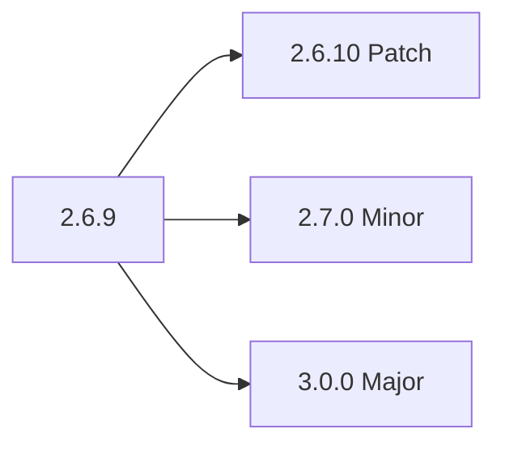
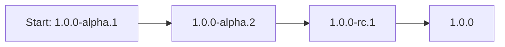

# Semantic Versioning

## Document History

|Date|Author|Version|Comment|
|----|-------|------|-------|
|1st July 2025 | G. Weatherup| 1.0.0 | Initial Revision|

## Overview

Semantic Versioning is a Universal Standard for Software Releases, often abbreviated as **SemVer**, is a structured versioning scheme that has become a standard across the software industry. It offers a systematic and meaningful way to number software releases, helping both developers and users understand the nature and impact of each release at a glance.

Software development is a rapidly evolving process — new features, improvements, and fixes are constantly introduced. Without a clear and consistent versioning system, it's difficult to communicate changes, manage dependencies, and ensure backward compatibility. Semantic Versioning addresses this problem by offering a standardized format:

The official specification can be found here:- [https://semver.org/](https://semver.org/)

## SemVer Format: `MAJOR.MINOR.PATCH`

Semantic Versioning follows the format `X.Y.Z`, where each component conveys specific information about the nature of the release. This three-part version number helps communicate the scope and compatibility of changes and defines a contract between the software and its users or integrators.

Each version number is composed of three numeric identifiers:

---

## 1. Major Version (X)

The **major version** indicates breaking changes — updates that may be incompatible with previous versions of the software. When the major version is incremented:

* Both the **minor** and **patch** components are reset to zero.
* This signals to users that updating may require changes in how the software is used.

**Example**:
If the current version is `2.6.9`, the next major release would be `3.0.0`.
Use this when **API contracts are broken**, functionality is removed, or the behavior of the system is fundamentally changed.

## 2. Minor Version (Y)

The **minor version** is used when new features are added **in a backward-compatible** manner. When the minor version is incremented:

* The **patch** version is reset to zero.

**Example**:
If the current version is `2.6.9`, the next minor version would be `2.7.0`.
Use this when introducing **new functionality**, UI enhancements, or improvements that do not affect existing APIs.

## 3. Patch Version (Z)

The **patch version** is used for **bug fixes** and small improvements that do not alter any APIs or existing functionality.

**Example**:
If the current version is `2.6.9`, a patch update would be `2.6.10`.
Use this for **maintenance releases** that fix issues, correct typos, or improve documentation.

---

## Pre-release and Build Metadata

SemVer also allows **pre-release** identifiers by appending a hyphen:

**Example**:
`1.0.0-alpha.1`, `1.0.0-beta.2`, `1.0.0-rc.1`

These are used for versions that are not yet stable but are available for testing or preview. Each identifier must:

* Use only alphanumeric characters and hyphens (`[A-Za-z0-9-]`)
* Avoid leading zeros in numeric identifiers.

Pre-release versions have **lower precedence** than the associated normal version: e.g., `1.0.0-alpha` < `1.0.0`.

You can also add **build metadata** using a `+`, like `1.0.0-alpha+exp.sha.5114f85`, primarily for internal tracking. Build metadata does **not** affect version precedence.

* If two versions differ only in build metadata (e.g., `1.0.0+buildA` and `1.0.0+buildB`), they are considered to have equal precedence.

---

## Version Precedence Rules

When comparing two SemVer-compliant versions to determine precedence:

1. Compare the major, minor, and patch numbers in that order.
2. A version without a pre-release tag is always considered higher than one with a pre-release.
3. Pre-release identifiers are compared lexically or numerically, as appropriate.

Example: Pre-release identifiers are compared based on their components. Numeric parts are compared numerically, and alphabetical parts are compared lexically. Therefore:

- `1.0.0-alpha.9` is lower than `1.0.0-alpha.10` (numeric comparison).
- `1.0.0-alpha` is lower than `1.0.0-beta` (lexical comparison).

---

## Defining the Public API

Semantic Versioning assumes that your software has a clearly defined **public API** — whether it’s a set of REST endpoints, functions, modules, or configuration files. Any changes that affect this contract must be reflected in the versioning.

---

## Advantages of Semantic Versioning

* **Transparency**: Users instantly know if a release might break their code or is a safe upgrade.
* **Dependency Management**: Enables robust tooling for managing dependencies.
* **Clear Communication**: Developers and teams can interpret version history meaningfully.
* **Predictability**: Facilitates release planning and rollback strategies.

---

## Points to Keep in Mind

* The initial development version is typically `0.1.0`, not `0.0.1`.
* In the initial development phase (versions 0.y.z), even MINOR version increments may include breaking changes, as the public API is not yet stable. The MINOR version is often incremented for any significant feature or change.
* Documentation and other non-functional changes can still increment the patch version, especially when considered part of the software's contract.
* **SemVer is about trust** — it sets expectations about how your software will evolve.

---

## Version Upgrade Examples

---

