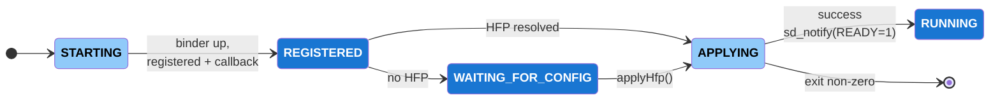
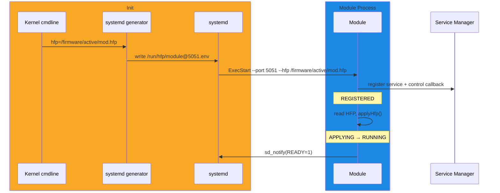
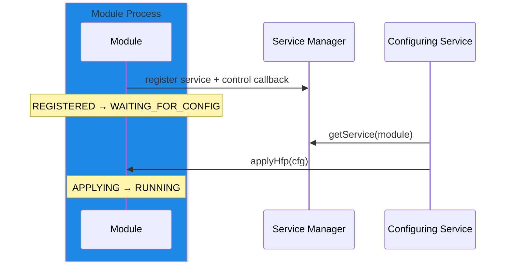

# Module Boot Sequence

## Overview

A HAL module runs as its own process, launched by [systemd](../../systemd/current/systemd.md). It listens on a Binder port and registers its interface with the [Service Manager](../../service_manager/current/service_manager.md), at which point clients can discover and call it.

```
<module> --port <port>
```

On the [vDevice](#vdevice-configuration), a module additionally presents the hardware capabilities declared in a [HAL Feature Profile (HFP)](../../../key_concepts/hal/hal_feature_profiles.md), supplied with `--hfp` at launch or delivered over Binder afterwards. Because the HFP defines what the module emulates, a vDevice module completes startup only once an HFP is applied. A module backed by real hardware initialises from that hardware and does not depend on an HFP.

---

## References

!!! info References
    |||
    |-|-|
    |**HAL Interface Type**|[AIDL and Binder](../../../introduction/aidl_and_binder.md)|
    |**Initialization Unit**|[systemd service](../../systemd/current/systemd.md)|
    |**Service Registration**|[Service Manager](../../service_manager/current/service_manager.md)|

---

## Related Pages

!!! tip "Related Pages"
    - [Service Manager](../../service_manager/current/service_manager.md)
    - [Systemd](../../systemd/current/systemd.md)
    - [HAL Feature Profile](../../../key_concepts/hal/hal_feature_profiles.md)
    - [AIDL and Binder](../../../introduction/aidl_and_binder.md)

---

## Startup Sequence

A module is launched with the Binder port it listens on:

```
<module> --port <port>
```

It brings up its Binder interface, registers with the Service Manager, initialises, and becomes ready to serve clients.


## Implementation Requirements

|#|Requirement | Comments|
|-|------------|---------|
|**HAL.BOOTSEQ.1** |A module shall accept the Binder port it listens on as the `--port` command-line argument.||
|**HAL.BOOTSEQ.2** |A module shall bring up its Binder interface and register with the Service Manager during startup.|Registration makes the module discoverable to clients.|
|**HAL.BOOTSEQ.3** |A module and the services it registers with or calls shall share the same Binder domain.|For example `/dev/binder` versus `/dev/vndbinder`.|
|**HAL.BOOTSEQ.4** |A module using `Type=notify` shall send `sd_notify(READY=1)` only on reaching the running state.|Dependents ordered `After=` the module start against a ready module.|

---

## vDevice Configuration

On the vDevice, a module emulates the hardware described by a [HAL Feature Profile (HFP)](../../../key_concepts/hal/hal_feature_profiles.md). The HFP defines the capabilities the module presents, so a vDevice module registers with the Service Manager but completes startup only once an HFP is applied.

```
<module> --port <port> --hfp <hfp-file>
```

A vDevice module reaches `REGISTERED` without the HFP and installs a control callback there, then applies the HFP from the first source that supplies one. When no source does, it parks in `WAITING_FOR_CONFIG` until an HFP is delivered over Binder. This gives one path whether the HFP is supplied at launch or afterwards.



### HFP Resolution

A vDevice module obtains its HFP from one of two sources:

|Source|When|
|------|----|
|`--hfp <path>` command-line argument|Present at launch.|
|Binder delivery into `WAITING_FOR_CONFIG`|No `--hfp` at launch; the HFP is pushed after startup.|

The module reads only `--hfp`; it does not read `/proc/cmdline`. The `--hfp` value is populated upstream — by an operator launching a single module by hand, or, in the default vDevice launch, by systemd from an environment file the generator derives from the kernel command-line `hfp=` locator.

### Kernel Command Line to systemd

The kernel command line carries an HFP **locator** — a path, partition, or URI — not the HFP contents:

```
... hfp=/firmware/active/<module>.hfp
```

A systemd generator reads `/proc/cmdline`, extracts the `hfp=` value, and writes an environment file that the templated unit consumes, so the module sees `--hfp` and never reads `/proc/cmdline` itself:

```ini
# /run/hfp/module@<port>.env  (written by the generator)
HFP_FILE=/firmware/active/<module>.hfp
```

```ini
# module@.service  (templated, one instance per module)
[Service]
Type=notify
EnvironmentFile=-/run/hfp/module@%i.env
ExecStart=/usr/bin/<module> --port %i --hfp ${HFP_FILE}
```

### HFP Delivery Over Binder

A module installs a control callback when it registers, so the configuring service drives the HFP in for a module parked in `WAITING_FOR_CONFIG`:

```aidl
interface IModuleControl {
    void applyHfp(in HfpBlob cfg);
}
```

`applyHfp()` moves the module `WAITING_FOR_CONFIG` → `APPLYING` → `RUNNING`.

### vDevice Requirements

|#|Requirement | Comments|
|-|------------|---------|
|**HAL.VDEVICE.1** |A vDevice module shall accept its HFP file location as the `--hfp` command-line argument.||
|**HAL.VDEVICE.2** |A vDevice module shall register with the Service Manager before requiring an HFP, entering a registered-but-unconfigured state.|Makes a module launched without an HFP discoverable rather than failed.|
|**HAL.VDEVICE.3** |A vDevice module launched without `--hfp` shall apply an HFP delivered over Binder before completing startup.|The `--hfp` value, when present, is supplied by an operator or by systemd from the kernel command-line locator.|
|**HAL.VDEVICE.4** |A vDevice module shall apply its HFP exactly once and retain that configuration for the lifetime of the process.||
|**HAL.VDEVICE.5** |A vDevice module that fails to apply its HFP shall exit non-zero, leaving recovery to the systemd restart policy.||

### vDevice Boot Sequence

The default vDevice boot, where the kernel command line supplies the HFP locator:



A vDevice module launched without an HFP, configured later over Binder:



---

## Product Customization

The systemd unit that launches a module is a vendor-layer deliverable. On the vDevice, the HFP file describing the emulated hardware, the kernel command-line `hfp=` locator, and the systemd generator that turns it into `--hfp` are provided alongside it.
