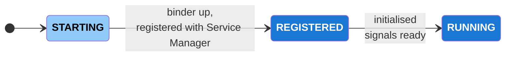
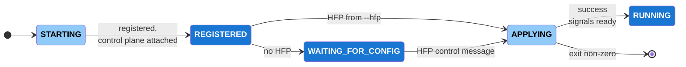
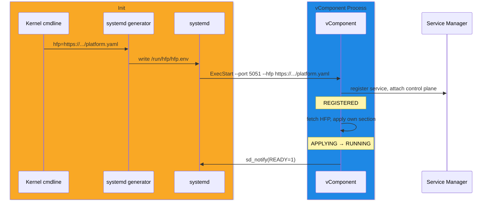
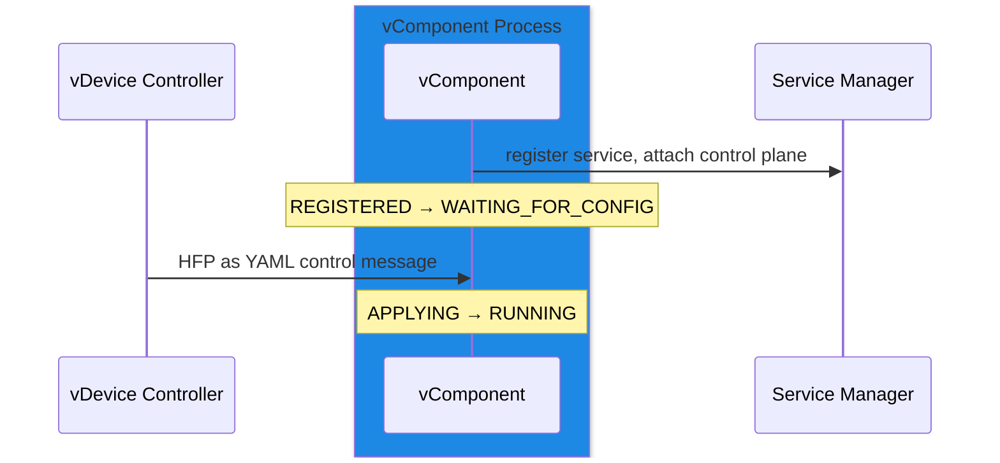

# Module Boot Sequence

## Overview

A HAL module runs as its own process, launched by [systemd](../../systemd/current/systemd.md). It registers its Binder interface with the [Service Manager](../../service_manager/current/service_manager.md) under its service name, at which point clients can discover and call it. A module backed by real hardware initialises from that hardware and registers over the kernel Binder driver, taking no command-line configuration.

On the [vDevice](#vdevice-configuration), a module runs as a vComponent and emulates the hardware described by a [HAL Feature Profile (HFP)](../../../key_concepts/hal/hal_feature_profiles.md). The HFP is supplied with `--hfp` at launch, or delivered afterwards as a YAML message over the control plane. Because the HFP defines what the module emulates, a vComponent completes startup only once an HFP is applied.

---

## References

!!! info References
    |||
    |-|-|
    |**HAL Interface Type**|[AIDL and Binder](../../../introduction/aidl_and_binder.md)|
    |**Initialization Unit**|[systemd service](../../systemd/current/systemd.md)|
    |**Service Registration**|[Service Manager](../../service_manager/current/service_manager.md)|

---

## Related Pages

!!! tip "Related Pages"
    - [Service Manager](../../service_manager/current/service_manager.md)
    - [Systemd](../../systemd/current/systemd.md)
    - [HAL Feature Profile](../../../key_concepts/hal/hal_feature_profiles.md)
    - [AIDL and Binder](../../../introduction/aidl_and_binder.md)
    - [vDevice Controller](../../../external_content/ut-core-wiki/5.1.0:-Standards:-vDevice-Controller.md)
    - [vDevice Control Plane](../../../external_content/ut-core-wiki/5.1.1:-Standards:-vDevice-Control-Plane.md)

---

## Startup Sequence

A module is launched by systemd. It brings up its Binder interface, registers with the Service Manager under its service name, initialises, and becomes ready to serve clients.



## Implementation Requirements

|#|Requirement | Comments|
|-|------------|---------|
|**HAL.BOOTSEQ.1** |A module shall register its Binder interface with the [Service Manager](../../service_manager/current/service_manager.md) under its service name via the standard `publishAndJoinThreadPool()` helper.|Registration uses the Service Manager mechanism, not per-module code; it makes the module discoverable to clients.|
|**HAL.BOOTSEQ.2** |A module and the services it registers with or calls shall share the same Binder domain.|For example `/dev/binder` versus `/dev/vndbinder`.|
|**HAL.BOOTSEQ.3** |A module shall signal readiness only on reaching the running state, so dependents are not started against an unconfigured module.|Emitted by the common module bootstrap, not re-implemented per module — for example `sd_notify(READY=1)` under systemd `Type=notify`.|

---

## vDevice Configuration

On the vDevice, a module runs as a vComponent managed by the vDevice Controller. The Controller routes control messages to it over a control plane socket, and the vComponent emulates the hardware described by a [HAL Feature Profile (HFP)](../../../key_concepts/hal/hal_feature_profiles.md). It registers with the Service Manager but completes startup only once an HFP is applied.

The Controller provides a common control plane socket for all vComponents. A vComponent can also run standalone with its own control plane socket — given by `--port` — to debug a single module, optionally with its HFP on the command line:

```
<module> --port <port> --hfp <hfp-file>
```

A vComponent reaches `REGISTERED` without the HFP and attaches to the control plane there, then applies the HFP from `--hfp` when given. When it is not, the vComponent parks in `WAITING_FOR_CONFIG` until it receives an HFP as a control plane message. This gives one path whether the HFP is supplied at launch or afterwards.



### HFP Resolution

A vComponent obtains its HFP from one of two sources:

|Source|When|
|------|----|
|`--hfp <locator>` command-line argument|Present at launch.|
|Control plane message into `WAITING_FOR_CONFIG`|No `--hfp` at launch; the HFP arrives over the control plane after startup.|

The module reads only `--hfp`; it does not read `/proc/cmdline`. The `--hfp` value is a locator — supplied by an operator for a standalone module, or, in the default boot, by systemd from the shared environment file the generator derives from the kernel command-line `hfp=` URL.

### HFP Locator via Boot Parameters

The default vDevice boot configures every module from a single HFP that declares the configuration for all of the platform's modules. When the VM is launched, the launcher passes the HFP locator to the bootloader, which places it on the kernel command line for the boot sequence to read:

```
... hfp=https://<host>/<org>/<repo>/raw/<ref>/<platform>.yaml
```

The locator is a URL — ut-control resolves URL-defined configuration — pointing to one HFP file held in a git repository. A URL is used because the VM reaches its configuration over the network; the boot sequence fetches this single HFP, and each vComponent applies the section for its own domain.

A systemd generator reads `/proc/cmdline`, extracts the `hfp=` value, and writes a shared environment file the module units consume, so a module sees `--hfp` and never reads `/proc/cmdline` itself:

```ini
# /run/hfp/hfp.env  (written by the generator, shared by all modules)
HFP_FILE=https://<host>/<org>/<repo>/raw/<ref>/<platform>.yaml
```

```ini
# module@.service  (templated, one instance per module)
[Service]
Type=notify
EnvironmentFile=-/run/hfp/hfp.env
ExecStart=/usr/bin/<module> --port %i --hfp ${HFP_FILE}
```

### HFP Delivery Over the Control Plane

A vComponent attaches to the control plane when it registers. For a vComponent parked in `WAITING_FOR_CONFIG`, the HFP arrives as a YAML control message on the control plane socket — sent by the vDevice Controller, or, for a standalone vComponent, to its own `--port` socket. Applying that message moves the vComponent `WAITING_FOR_CONFIG` → `APPLYING` → `RUNNING`.

### vDevice Requirements

|#|Requirement | Comments|
|-|------------|---------|
|**HAL.VDEVICE.1** |A standalone vComponent shall accept the control plane socket it serves on as the `--port` command-line argument, and its HFP file location as the `--hfp` command-line argument.|Under the Controller, a vComponent uses the common control plane socket instead.|
|**HAL.VDEVICE.2** |A vComponent shall register and attach to the control plane before requiring an HFP, entering a registered-but-unconfigured state.|Makes a vComponent started without an HFP reachable rather than failed.|
|**HAL.VDEVICE.3** |A vComponent started without `--hfp` shall apply an HFP delivered as a control plane message before completing startup.|The `--hfp` value, when present, is supplied by an operator or by systemd from the kernel command-line locator.|
|**HAL.VDEVICE.4** |A vComponent shall apply its HFP exactly once and retain that configuration for the lifetime of the process.||
|**HAL.VDEVICE.5** |A vComponent that fails to apply its HFP shall exit non-zero, leaving recovery to the systemd restart policy.||

### vDevice Boot Sequence

The default vDevice boot, where the kernel command line supplies a single HFP URL for all modules:



A vComponent started without an HFP, configured later over the control plane:



---

## Product Customization

The systemd unit that launches a module is a vendor-layer deliverable. On the vDevice, the HFP file describing the emulated hardware, the kernel command-line `hfp=` locator, and the systemd generator that turns it into `--hfp` are provided alongside it.
