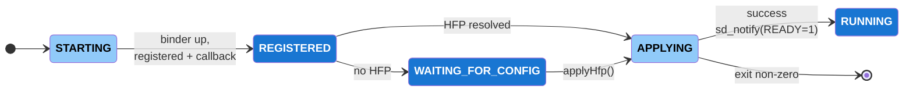
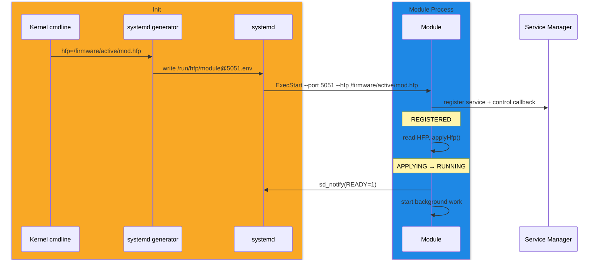
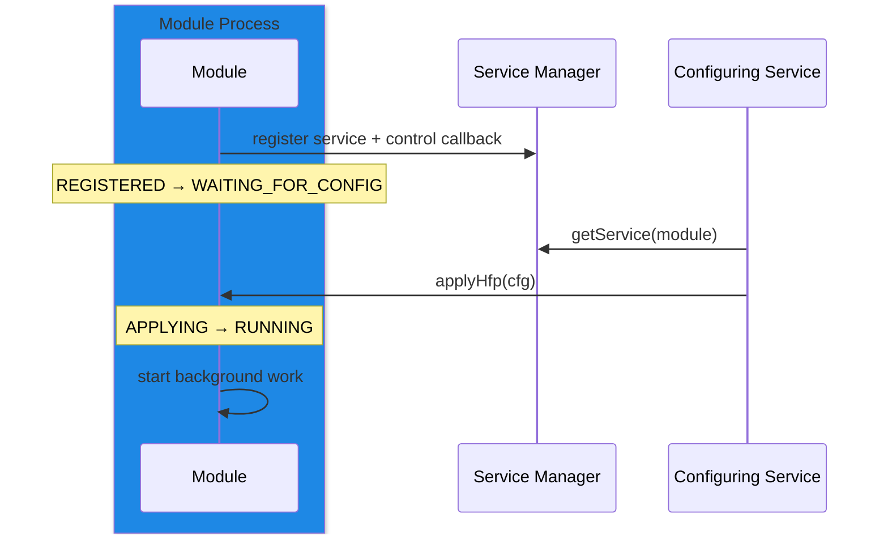

# Module Boot Sequence

A HAL module runs as its own process launched by [systemd](../../systemd/current/systemd.md). Each module is launched with a port and a [HAL Feature Profile (HFP)](../../../key_concepts/hal/hal_feature_profiles.md):

```
<module> --port <port> --hfp <hfp-file>
```

The HFP configures the module against the vendor layer it runs on. A module reaches Binder readiness and registers with the [Service Manager](../../service_manager/current/service_manager.md) **before** it has its HFP, then completes startup once the HFP is applied. This gives one startup path whether the HFP is supplied at launch or delivered afterwards over Binder.

!!! info "References"
    |Reference|Link|
    |-|-|
    |**HAL Interface Type**|[AIDL and Binder](../../../introduction/aidl_and_binder.md)|
    |**Service Registration**|[Service Manager](../../service_manager/current/service_manager.md)|
    |**Configuration**|[HAL Feature Profile (HFP)](../../../key_concepts/hal/hal_feature_profiles.md)|
    |**Initialization**|[systemd](../../systemd/current/systemd.md)|

## Implementation Requirements

|#|Requirement | Comments|
|-|------------|---------|
|**HAL.BOOTSEQ.1** |A module shall accept its listen port and HFP file location as the `--port` and `--hfp` command-line arguments.||
|**HAL.BOOTSEQ.2** |A module shall bring up its Binder interface and register with the Service Manager before requiring an HFP, entering a registered-but-unconfigured state.|Makes a module launched without an HFP discoverable rather than failed.|
|**HAL.BOOTSEQ.3** |A module shall resolve its HFP from, in priority order: the `--hfp` argument, the systemd-provided environment, then the kernel command line. When none supplies one, the module shall wait for an HFP delivered over Binder.|First source that yields an HFP wins.|
|**HAL.BOOTSEQ.4** |A module shall apply its HFP exactly once and retain that configuration for the lifetime of the process.||
|**HAL.BOOTSEQ.5** |A module using `Type=notify` shall send `sd_notify(READY=1)` only on reaching the running state, after the HFP is applied.|Dependents ordered `After=` the module start against a configured module.|
|**HAL.BOOTSEQ.6** |A module that fails to apply its HFP shall exit non-zero, leaving recovery to the systemd restart policy.||
|**HAL.BOOTSEQ.7** |A module and the services it registers with or calls shall share the same Binder domain.|For example `/dev/binder` versus `/dev/vndbinder`.|

## Startup State Machine

The module reaches `REGISTERED` without the HFP, then gates the remainder of startup on the HFP arriving. A module launched with an HFP transitions straight through `APPLYING` to `RUNNING`; a module launched without one parks in `WAITING_FOR_CONFIG` until the HFP is delivered over Binder.



## HFP Resolution Order

The HFP is resolved at the `REGISTERED` transition, taking the first source that yields one:

|Priority|Source|Use|
|-|------|---|
|1|`--hfp <path>` command-line argument|An operator launching a single module by hand.|
|2|systemd-provided environment (`EnvironmentFile`)|The on-device launch.|
|3|Kernel command-line locator (`/proc/cmdline`)|The production default.|
|4|Binder delivery into `WAITING_FOR_CONFIG`|The HFP is pushed after startup.|

Sources 1–3 differ only in where the HFP location comes from; the same apply routine consumes all four.

## Kernel Command Line to systemd

The kernel command line carries an HFP **locator** — a path, partition, or URI — not the HFP contents:

```
... hfp=/firmware/active/<module>.hfp
```

A systemd generator reads `/proc/cmdline`, extracts the `hfp=` value, and writes an environment file that the templated unit consumes, so the module sees `--hfp` and never reads `/proc/cmdline` itself:

```ini
# /run/hfp/module@<port>.env  (written by the generator)
HFP_FILE=/firmware/active/<module>.hfp
```

```ini
# module@.service  (templated, one instance per module)
[Service]
Type=notify
EnvironmentFile=-/run/hfp/module@%i.env
ExecStart=/usr/bin/<module> --port %i --hfp ${HFP_FILE}
```

## HFP Delivery Over Binder

A module installs a control callback when it registers, so the configuring service drives the HFP in for a module parked in `WAITING_FOR_CONFIG`:

```aidl
interface IModuleControl {
    void applyHfp(in HfpBlob cfg);
}
```

`applyHfp()` moves the module `WAITING_FOR_CONFIG` → `APPLYING` → `RUNNING`.

## Boot Sequence

The production boot, where the kernel command line supplies the HFP locator:



A module launched without an HFP, configured later over Binder:



## Product Customization

The HFP file is a vendor-layer deliverable describing the module's configuration on the target platform. The kernel command line `hfp=` locator and the systemd generator that turns it into `--hfp` are provided by the vendor layer.
