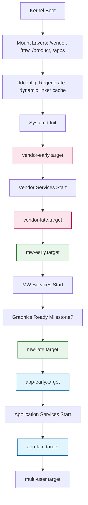

# Directory and Dynamic Linking Specification

## Document History

|Date|Author|Comments|
|----|------|--------|
|2025-12-12|G.Weatherup|Updated for multi-layer architecture|
|2025-05-21|G.Weatherup|Draft Revision|

!!! warning "Draft Document"
    This document is currently in **draft form** and under active discussion. Specifications, examples, and recommendations may change based on review feedback and implementation experience.

## Related Pages

!!! tip "Related Pages"
    - [File System](file_system_architecture.md)
    - [HALIF Logging System Design](halif_logging_system_design.md)
    - [Logging System](logging_system.md)

## Purpose

This document defines the file placement and dynamic linking policies for the **layered file system architecture**. It ensures modularity, maintainability, and reliable integration of components across multiple layers.

Applicable to all modules, libraries, executables, and configuration files delivered in the `/vendor`, `/mw`, `/product`, and `/apps` layers.

!!! note "Multi-Layer Architecture"
    Each layer (`/vendor`, `/mw`, `/product`, `/apps`) follows the same structural conventions while maintaining independence. For architectural overview, see [File System](file_system_architecture.md).

## Design Principles

* **Self-contained Modules**: Each module resides within its own directory under `/<layer>/<module>/` (e.g., `/vendor/<module>/`, `/mw/<module>/`).
* **Layer Isolation**: Each layer (`/vendor`, `/mw`, `/product`, `/apps`) is an independent mount point, allowing separate updates, versioning, and integrity checks.
* **Runtime Discovery**: Upper layers discover available modules via standardised layer aggregation directories (e.g., `/vendor/bin/`, `/vendor/lib/`), enabling platform-independent operation without compile-time knowledge of specific vendor modules.
* **No Global Path Pollution**: Module recipes never directly modify system directories like `/etc` or `/lib`; system integration is handled by boot/init processes.
* **Independent OSS Management**: Each layer manages its own Open Source Software components consumed exclusively from its mount point.

## Layer Aggregation Architecture

**Design Goal**: Enable the middleware layer to boot identically across all platforms without knowledge of vendor-specific modules.

**Boot Sequence**:

1. **Kernel** boots and mounts read-only layers (`/vendor`, `/mw`, `/apps`)
2. **Boot sequence** (primarily controlled by `/mw` but operating generically across all layer mount points) discovers available resources by scanning **fixed aggregation directories**:
   * `/vendor/bin/*` - all vendor executables (symlinks to module binaries)
   * `/vendor/lib/*` - all vendor libraries (symlinks to module libraries)
   * `/vendor/systemd/*` - all vendor services (symlinks to module services)
   * `/vendor/ld.so.conf.d/*` - all vendor linker configs (symlinks to module configs)
   * `/vendor/app_armor/*` - all vendor profiles (symlinks to module profiles)
   * Same pattern applies to `/mw`, `/apps`, and other layer mount points
3. **Init system** integrates discovered resources into system-wide locations

**Key Principle**: The boot sequence operates generically across all layer mount points without needing to know specific module names, paths, or what hardware exists. It simply processes everything present in the standard aggregation directories of each mounted layer.

**Aggregation Directory Structure**:

Each layer provides standardised directories containing symlinks to all module resources:

```bash
/<layer>/bin/           # Symlinks to all module executables
/<layer>/lib/           # Symlinks to all module libraries
/<layer>/etc/           # Symlinks to all module configurations
/<layer>/systemd/       # Symlinks to all module service files
/<layer>/app_armor/     # Symlinks to all module AppArmor profiles
/<layer>/ld.so.conf.d/  # Symlinks to all module linker configs
/<layer>/logrotate.d/   # Symlinks to all module logrotate configs
/<layer>/memory/        # Symlinks to all module memory declarations
```

**Discovery Example**:

Boot sequence discovers vendor services without prior knowledge:

```bash
# Boot sequence has no idea what vendor modules exist
# It simply discovers and processes everything in the aggregation directory
for service in /vendor/systemd/*.service; do
  systemctl enable "$service"
done

# Same pattern for dynamic linker - no module-specific knowledge needed
for conf in /vendor/ld.so.conf.d/*.conf; do
  # Process discovered linker configuration
done
```

**Example Layer Aggregation** (vendor layer with HDMI and Audio modules):

```bash
# Vendor layer aggregation directories (boot sequence only knows these exist)
/vendor/bin/
  ├── hdmi-daemon -> /vendor/hdmi/bin/hdmi-daemon
  └── audio-service -> /vendor/audio/bin/audio-service
/vendor/lib/
  ├── libhdmi.so.1.0 -> /vendor/hdmi/lib/libhdmi.so.1.0
  └── libaudio.so.2.3 -> /vendor/audio/lib/libaudio.so.2.3
/vendor/systemd/
  ├── vendor-hdmi.service -> /vendor/hdmi/systemd/vendor-hdmi.service
  └── vendor-audio.service -> /vendor/audio/systemd/vendor-audio.service
/vendor/ld.so.conf.d/
  ├── vendor-hdmi.conf -> /vendor/hdmi/ld.so.conf.d/vendor-hdmi.conf
  └── vendor-audio.conf -> /vendor/audio/ld.so.conf.d/vendor-audio.conf

# Module directories (boot sequence doesn't directly access these)
/vendor/hdmi/
  ├── bin/hdmi-daemon
  ├── lib/libhdmi.so.1.0
  ├── systemd/vendor-hdmi.service
  └── ld.so.conf.d/vendor-hdmi.conf
/vendor/audio/
  ├── bin/audio-service
  ├── lib/libaudio.so.2.3
  ├── systemd/vendor-audio.service
  └── ld.so.conf.d/vendor-audio.conf
```

**Boot-Agnostic Processing**: The boot sequence processes `/vendor/systemd/*.service` without needing to know that `hdmi` or `audio` modules exist. Dependencies are resolved through the service files themselves.

**System Integration** (pre-configured in rootfs at build time, out of scope for module recipes):

The rootfs is **read-only** and **pre-configured** at build time with fixed symlinks to known mount point locations. These mount points can contain different content depending on which layer image is mounted at runtime.

```bash
# Rootfs is pre-configured with fixed symlinks to mount point aggregation locations
# These are created once during rootfs image build, NOT at runtime

# Dynamic linker - fixed symlink to mount point location
/etc/ld.so.conf.d/vendor.conf -> /vendor/ld.so.conf.d/vendor.conf
/etc/ld.so.conf.d/mw.conf -> /mw/ld.so.conf.d/mw.conf
/etc/ld.so.conf.d/apps.conf -> /apps/ld.so.conf.d/apps.conf

# Systemd - fixed symlink to mount point location
# Each layer provides multiple milestone targets for fine-grained boot sequencing
# Module services within a layer can depend on each other (e.g., After=vendor-hdmi.service)
# System integration only links the layer-level milestone targets (early/late)
/etc/systemd/system/vendor-early.target -> /vendor/systemd/vendor-early.target
/etc/systemd/system/vendor-late.target -> /vendor/systemd/vendor-late.target
/etc/systemd/system/mw-early.target -> /mw/systemd/mw-early.target
/etc/systemd/system/mw-late.target -> /mw/systemd/mw-late.target
/etc/systemd/system/app-early.target -> /app/systemd/app-early.target
/etc/systemd/system/app-late.target -> /app/systemd/app-late.target

# AppArmor - fixed symlink to consolidated layer profiles
/etc/apparmor.d/vendor.profile -> /vendor/etc/app_armor/vendor.profile
/etc/apparmor.d/mw.profile -> /mw/etc/app_armor/mw.profile
/etc/apparmor.d/apps.profile -> /apps/etc/app_armor/apps.profile
```

**Runtime Behavior**: When `/vendor` is mounted (could be vendor_a or vendor_b), the pre-configured `/etc/ld.so.conf.d/vendor.conf` symlink automatically points to whatever content exists at `/vendor/ld.so.conf.d/vendor.conf` in the mounted image. After mount, `ldconfig` regenerates the cache with the discovered content.

**Platform Independence**: The rootfs is built once with fixed symlinks to known mount point locations (`/vendor`, `/mw`, `/apps`). At runtime, different vendor/middleware images can be mounted at these locations, and the system automatically uses whatever content is present. No runtime discovery or reconfiguration is needed.

!!! important "Module Recipe Scope"
    Module recipes (`do_install()`) are **only** responsible for:
    1. Installing files to `/<layer>/<module>/`
    2. Creating layer aggregation symlinks in `/<layer>/{bin,lib,etc,systemd,app_armor,ld.so.conf.d}/`
    Module recipes **must never** create symlinks in `/etc/`, `/lib/`, or other system directories. System integration is the responsibility of the boot/init process.

## Directory Layout

Each module in any layer should follow the directory convention:

```bash
/<layer>/<module>/              # Where <layer> is vendor, mw, product, or apps
├── bin/          # Executables specific to the module
├── lib/          # Shared/static libraries used by the module
├── etc/          # Configuration files for the module
│   └── manifest.json          # Module metadata and dependencies
├── data/         # Optional runtime or persistent module data
├── app_armor/    # Optional AppArmor profiles for the module
├── systemd/      # Optional systemd service files
├── memory/       # Static guide to resource usage declarations
│   └── usage.conf             # Memory footprint declarations
├── logs/ -> /var/log/<layer>/<module>/   # Writable logs symlink
├── ld.so.conf.d/ # Optional linker path configuration for symlink
├── logrotate.d/  # Optional logrotate configuration for symlink
├── VERSION       # Module version and build information (recommended)
```

### Examples by Layer

**Vendor Layer** (`/vendor/<module>/`):

```bash
/vendor/hdmi/
├── bin/hdmi-daemon
├── lib/libhdmi.so.1.0
├── etc/hdmi.conf
└── VERSION
```

**Middleware Layer** (`/mw/<module>/`):

```bash
/mw/streaming/
├── bin/stream-manager
├── lib/libstreaming.so.2.0
├── etc/streaming.conf
└── VERSION
```

**Product Layer** (configuration-only, see [File System](file_system_architecture.md)):

```bash
/product/etc/
├── as/config.yaml
├── entservices/config.yaml
└── rdkappmanager/config.yaml
```

!!! note "Layer Examples"
    For complete layer structure examples and details, see [File System](file_system_architecture.md).

## Integration Requirements

* Executables must be invoked using absolute paths (e.g., `/vendor/<module>/bin/daemon`, `/mw/<module>/bin/service`).
* Any module requiring dynamic libraries must either:
  * Embed RPATH during linking (`-Wl,-rpath,/<layer>/<module>/lib`), or
  * Rely on linker cache updates via `/etc/ld.so.conf.d/` configuration.
* Environment variables (e.g., `LD_LIBRARY_PATH`) must not be relied upon at runtime.
* Cross-layer dependencies must be declared in the module's `etc/manifest.json` file.
* Each layer maintains independence — libraries from one layer should not directly link against internal libraries of another layer unless through well-defined interfaces.

## Dynamic Linking and `dlopen()` Support

**Requirement: Module libraries must be made visible to the system linker via layer aggregation directories.**

Each module in any layer must provide a linker configuration file:

```bash
/<layer>/<module>/ld.so.conf.d/<layer>-<module>.conf
```

**Module Recipe Responsibility**: Create layer aggregation symlink:

```bash
/<layer>/ld.so.conf.d/<layer>-<module>.conf -> /<layer>/<module>/ld.so.conf.d/<layer>-<module>.conf
```

**Rootfs Configuration** (pre-configured at build time, out of scope for module recipes): Fixed symlink to mount point:

```bash
# Rootfs contains pre-configured symlink (created once during rootfs build)
/etc/ld.so.conf.d/<layer>.conf -> /<layer>/ld.so.conf.d/<layer>.conf

# After layer mount, regenerate cache with mounted content
ldconfig
```

**Content at Mount Point**: The `/<layer>/ld.so.conf.d/<layer>.conf` file at the mount point contains includes for all module configs:

```bash
# /vendor/ld.so.conf.d/vendor.conf (created by layer build, contains all module paths)
include /vendor/ld.so.conf.d/*.conf
```

**Boot-Agnostic Operation**: The rootfs contains a single pre-configured symlink `/etc/ld.so.conf.d/<layer>.conf` pointing to `/<layer>/ld.so.conf.d/<layer>.conf`. This works identically whether the mounted layer contains 2 modules or 20 modules - the content at the mount point handles the inclusion of all discovered modules.

### Examples by Layer

**Vendor Module**:

```bash
# File in module directory
/vendor/input/ld.so.conf.d/vendor-input.conf
Contents: /vendor/input/lib

# Layer aggregation (created by module recipe at build time)
/vendor/ld.so.conf.d/vendor-input.conf -> /vendor/input/ld.so.conf.d/vendor-input.conf

# System integration (created at runtime by boot/init from aggregation directory)
/etc/ld.so.conf.d/vendor-input.conf -> /vendor/ld.so.conf.d/vendor-input.conf
```

**Middleware Module**:

```bash
# File in module directory
/mw/streaming/ld.so.conf.d/mw-streaming.conf
Contents: /mw/streaming/lib

# Layer aggregation (created by module recipe at build time)
/mw/ld.so.conf.d/mw-streaming.conf -> /mw/streaming/ld.so.conf.d/mw-streaming.conf

# System integration (created at runtime by boot/init from aggregation directory)
/etc/ld.so.conf.d/mw-streaming.conf -> /mw/ld.so.conf.d/mw-streaming.conf
```

**Post-Install Action:** The system must execute `ldconfig` after installation or image build to regenerate the dynamic linker cache.

## AppArmor Integration and Permissions

To maintain security boundaries and prevent privilege escalation, each module integrated into any layer must be governed by an AppArmor profile.

### AppArmor Profile Structure

Each module will include its AppArmor profile in:

```bash
/<layer>/<module>/app_armor/<layer>-<module>.profile
```

**Module Recipe Responsibility**: Create layer aggregation symlink:

```bash
/<layer>/app_armor/<layer>-<module>.profile -> /<layer>/<module>/app_armor/<layer>-<module>.profile
```

**Layer-Wide Profile Consolidation**: A consolidated profile for each layer includes or references all module profiles:

```bash
/<layer>/etc/app_armor/<layer>.profile  # Consolidated profile including all module profiles
```

**Rootfs Configuration** (pre-configured at build time, out of scope for module recipes): Fixed symlink to mount point:

```bash
# Rootfs contains pre-configured symlink (created once during rootfs build)
/etc/apparmor.d/<layer>.profile -> /<layer>/etc/app_armor/<layer>.profile
```

This consolidated approach allows boot/init to load a single profile per layer that encompasses all modules, rather than discovering and loading individual module profiles.

### Examples by Layer

**Vendor Layer**:

```bash
# Individual module profiles (created by module recipe at build time)
/vendor/etc/app_armor/vendor-hdmi.profile -> /vendor/hdmi/app_armor/vendor-hdmi.profile
/vendor/etc/app_armor/vendor-audio.profile -> /vendor/audio/app_armor/vendor-audio.profile

# Consolidated vendor profile (includes or references all module profiles)
/vendor/etc/app_armor/vendor.profile
  #include "/vendor/app_armor/vendor-hdmi.profile"
  #include "/vendor/app_armor/vendor-audio.profile"

# System integration (created at runtime by boot/init - single profile per layer)
/etc/apparmor.d/vendor.profile -> /vendor/etc/app_armor/vendor.profile
```

**Middleware Layer**:

```bash
# Individual module profiles (created by module recipe at build time)
/mw/app_armor/mw-streaming.profile -> /mw/streaming/app_armor/mw-streaming.profile
/mw/app_armor/mw-browser.profile -> /mw/browser/app_armor/mw-browser.profile

# Consolidated middleware profile (includes or references all module profiles)
/mw/etc/app_armor/mw.profile
  #include "/mw/app_armor/mw-streaming.profile"
  #include "/mw/app_armor/mw-browser.profile"

# System integration (created at runtime by boot/init - single profile per layer)
/etc/apparmor.d/mw.profile -> /mw/etc/app_armor/mw.profile
```

### Enforcement Policy

* Profiles must be in enforced mode to provide real confinement.
* Profiles are activated via systemd unit or application launcher.
* Install scripts must create appropriate symlinks into `/etc/apparmor.d/`.
* System integrators must validate that all paths used by the module are declared.

## Update and Runtime Policy

* All layers (`/vendor`, `/mw`, `/product`, `/apps`) are treated as **read-only** at runtime.
* Writable runtime data for modules should be stored under `/var/<layer>/<module>/`.
* Updates to modules must not affect global system directories outside of `/etc/ld.so.conf.d/` and `/etc/apparmor.d/` symlinks.
* AppArmor profiles should be validated against updated module paths post-deployment.
* **Layer Independence**: Updates to one layer (e.g., `/mw`) must not require rebuilding other layers (e.g., `/vendor`), provided interface contracts are maintained.
* **Version Pinning**: Cross-layer dependencies must specify version requirements in manifest files to ensure compatibility.

## Operational Considerations

### Filesystem Access Policy

* All layers (`/vendor`, `/mw`, `/product`, `/apps`) are **read-only** at runtime.
* `/<layer>/<module>/log` is the designated **writable** path for runtime data, logs, and override configurations; this is a symbolic link from `/var/log/<layer>/<module>/`
* Modules must not write to `/etc`, `/usr`, or other immutable parts of the root filesystem.
* Each layer maintains isolated writable storage under `/var/<layer>/` to prevent cross-contamination.

### Memory Footprint Declarations

* Each module must include a `memory/usage.conf` file declaring expected heap, stack, and static memory usage.

* Format:

  ```bash
  heap=4MB
  stack=512KB
  static=1MB
  ```

* This allows the system to pre-allocate or validate resource claims during module startup.

### Systemd Service Integration

* Each module may include its own `.service` file in `/<layer>/<module>/systemd/`.

**Module Recipe Responsibility**: Create layer aggregation symlink:

```bash
/<layer>/systemd/<layer>-<module>.service -> /<layer>/<module>/systemd/<layer>-<module>.service
```

**Rootfs Configuration** (pre-configured at build time, out of scope for module recipes): Fixed symlinks to mount point:

```bash
# Rootfs contains pre-configured symlinks (created once during rootfs build)
# Systemd can be configured to include all services from mount point directories
/etc/systemd/system/<layer>.target.wants/ -> /<layer>/systemd/

# Or use systemd drop-ins to enable services from mount point
```

* Services must declare dependencies using `After=`, `Requires=`, and optionally `WatchdogSec=` for health monitoring.
* **Layer Boundaries**: Lower-layer services (e.g., vendor) should define milestone targets for upper layers to depend on, but must not directly reference upper-layer services.
* **Middleware Control**: Middleware controls the boot sequence but delegates to layer-specific milestone targets without needing knowledge of individual vendor services.
* **Milestone Targets**: Each layer provides early and late targets (`vendor-early.target`, `vendor-late.target`, `mw-early.target`, `mw-late.target`, `app-early.target`, `app-late.target`) for boot sequencing.

### Boot Sequence

The following diagram illustrates the system boot sequence and layer milestone targets:



**Key Boot Sequence Points**:

* **vendor-early.target**: Critical vendor services needed before middleware starts (e.g., essential hardware drivers)
* **vendor-late.target**: Full vendor layer operational (all vendor services running)
* **mw-early.target**: Middleware early initialization services
* **Graphics Ready**: Optional milestone indicating graphics subsystem is ready for applications
* **mw-late.target**: Full middleware stack operational (all RDK services running)
* **app-early.target**: Application layer initialization
* **app-late.target**: All applications running
* **multi-user.target**: System fully operational

Each layer's internal service ordering and dependencies are the responsibility of that layer. Upper layers only depend on the milestone targets of lower layers, maintaining layer independence.

### Examples by Layer

**Vendor Service**:

```bash
# Layer aggregation (created by module recipe at build time)
/vendor/systemd/vendor-hdmi.service -> /vendor/hdmi/systemd/vendor-hdmi.service

# System integration (created at runtime by boot/init from aggregation directory)
/etc/systemd/system/vendor-hdmi.service -> /vendor/systemd/vendor-hdmi.service
```

**Middleware Service** (depending on vendor milestone):

```bash
# /mw/streaming/systemd/mw-streaming.service
[Unit]
Description=Streaming Middleware Service
After=vendor-layer.target

[Service]
ExecStart=/mw/streaming/bin/stream-manager
```

### Log Management

* Logs must be written to:

`/<layer>/<module>/log/`

* This path must be a symbolic link to:

`/var/log/<layer>/<module>/`

Logs will be written to `/<layer>/<module>/log/`, which redirects to the writable `/var/log/<layer>/<module>/` location.

**Layer Initialization Responsibility**: During early boot, each layer's initialization process must create the required log directory structure in `/var/log/<layer>/` before module services start. This is typically handled by the layer's init script or systemd generator.

**Syslog-ng Integration**: Modules use syslog-ng for centralized logging. The platform's syslog-ng configuration routes messages to appropriate log files under `/var/log/<layer>/<module>/` based on facility and program name.

### Examples by Layer

**Vendor Module**:

```bash
# Module recipe creates symlink (at build time)
/vendor/hdmi/log/ -> /var/log/vendor/hdmi/

# Layer init creates directory structure (at boot time)
mkdir -p /var/log/vendor/hdmi/
```

**Middleware Module**:

```bash
# Module recipe creates symlink (at build time)
/mw/streaming/log/ -> /var/log/mw/streaming/

# Layer init creates directory structure (at boot time)
mkdir -p /var/log/mw/streaming/
```

#### Log File Rotation Integration

Each module may provide a standard logrotate config file:

```bash
/<layer>/<module>/logrotate.d/<layer>-<module>.conf
```

**Module Recipe Responsibility**: Create layer aggregation symlink:

```bash
/<layer>/logrotate.d/<layer>-<module>.conf -> /<layer>/<module>/logrotate.d/<layer>-<module>.conf
```

**Layer-Wide Configuration**: A consolidated logrotate configuration for each layer includes all module configs:

```bash
# /vendor/etc/logrotate.d/vendor.conf (created by layer build)
# This file includes all vendor module logrotate configurations
include /vendor/logrotate.d/vendor-*.conf

# /mw/etc/logrotate.d/mw.conf (created by layer build)
# This file includes all middleware module logrotate configurations
include /mw/logrotate.d/mw-*.conf
```

**Example Content Discovery**: When `/vendor` is mounted with hdmi and audio modules:

```bash
# Layer aggregation directory contains module configs:
/vendor/logrotate.d/
  ├── vendor-hdmi.conf -> /vendor/hdmi/logrotate.d/vendor-hdmi.conf
  └── vendor-audio.conf -> /vendor/audio/logrotate.d/vendor-audio.conf

# Consolidated config includes all discovered modules:
/vendor/etc/logrotate.d/vendor.conf
  include /vendor/logrotate.d/vendor-*.conf
```

**Rootfs Configuration** (pre-configured at build time, out of scope for module recipes): Fixed symlink to mount point:

```bash
# Rootfs contains pre-configured symlink (created once during rootfs build)
/etc/logrotate.d/<layer>.conf -> /<layer>/etc/logrotate.d/<layer>.conf
```

**Example Module Configuration**:

```bash
# /vendor/hdmi/logrotate.d/vendor-hdmi.conf
/var/log/vendor/hdmi/*.log {
  size 100k
  rotate 5
  compress
  delaycompress
  missingok
  notifempty
  copytruncate
}
```

This configuration ensures:

* Logs are rotated once they exceed 100 KB
* Up to 5 old logs are kept
* Old logs are compressed to save space
* Logging continues uninterrupted via copytruncate

### Log Configuration

Build-time log level configuration is defined in:

`/<layer>/<module>/etc/loglevel.conf`

Format:

`loglevel=error`

The default log level must be set to error.

### Startup Configuration Application

During system startup, each layer's platform components are responsible for applying syslog configuration settings for their modules.

This is platform-specific and may involve setting log levels in drivers, kernel modules, or components using platform-appropriate mechanisms.

Each layer team ensures this file is parsed and its value applied according to the SoC’s logging configuration method.

At runtime, a copy of the configuration is made to a writable location:

`/<layer>/<module>/log/loglevel.conf`

Wrapper modules will read the log level from the runtime configuration file to support dynamic log level adjustments without requiring a reboot or rebuild.

Supported log levels (ordered by severity, highest to lowest):

* **fatal** – Critical errors causing immediate termination.
* **error** – Operational failures requiring attention.
* **warn** – Recoverable anomalies or warnings.
* **info** – General informational messages.
* **debug** – Development-level diagnostics.
* **trace** – Highly granular tracing for deep debugging.

### Logging Mechanism

### Syslog-ng Usage

All modules must use syslog-ng for log message emission through the platform's syslog infrastructure.

This ensures logs are centrally accessible and manageable through standard tools (e.g., logread, journalctl, or remote syslog sinks).

**Wrapper Requirement**: Direct usage of `syslog()` is not permitted. Vendors must use the logging wrapper APIs provided by the HAL (Hardware Abstraction Layer).

These wrappers:

* Read and cache the active log level (as configured by the platform during startup)
* Filter messages based on severity
* Format and dispatch logs to syslog-ng with appropriate facility and program identifiers
* Route to module-specific log files via syslog-ng configuration (e.g., `/var/log/<layer>/<module>/<module>.log`)

**Layer Initialization**: Each layer's early init process must ensure `/var/log/<layer>/` directory structure exists before starting module services that require logging.

### Version Declaration (Recommended)

* Each module should include a file `/<layer>/<module>/VERSION` with contents akin to:

  ```bash
  version=MAJOR.MINOR.PATCH
  build_date=YYYY-MM-DD HH:MM:SS UTC
  build_sha=sha256:<commit-hash>
  layer=vendor|mw|product|apps
  dependencies=<comma-separated list>
  ```

* Version should follow Semantic Versioning (SemVer).
* The `layer` field identifies which layer the module belongs to.
* The `dependencies` field lists runtime dependencies on other modules.

## Appendix: Example Integration

This section provides concrete examples of how modules can integrate with the multi-layer architecture in compliance with the directory and dynamic linking policies described above.

### Example 1: Vendor Layer Module Integration

This example shows how a vendor module integrates with the `/vendor/sysint/${sysconfdir}` structure.

### Overview

This module is installed under the path `/vendor/sysint`, with all configuration, systemd, logging, versioning, and dynamic linker artifacts scoped within this directory. Integration points such as AppArmor and ld.so.conf.d use symbolic links into `/etc/` to preserve system-wide access.

### Directory Structure

```bash
/vendor/sysint/
├── etc/
│   ├── partners_defaults_device.json
│   ├── device-vendor.properties
│   ├── rfcdefaults/
│   └── logrotation.conf
├── lib/rdk/
│   └── ...
├── systemd/
│   └── start-up-scripts.service
├── app_armor/
│   └── vendor-sysint.profile
├── ld.so.conf.d/
│   └── vendor-sysint.conf
└── VERSION
```

### Installation Snippet (Yocto-style `do_install()`)

```bash
INSTALL_ROOT="/vendor/sysint"
LAYER="/vendor"

# Create module directory structure
install -d ${D}${INSTALL_ROOT}/{etc,lib/rdk,systemd,app_armor,ld.so.conf.d}

# Create layer aggregation directories
install -d ${D}${LAYER}/{lib,etc,systemd,app_armor,ld.so.conf.d}

# Install module files
install -m 0644 ${S}/etc/partners_defaults_device.json ${D}${INSTALL_ROOT}/etc/
install -m 0755 ${S}/etc/device-vendor.properties ${D}${INSTALL_ROOT}/etc/
install -d ${D}${INSTALL_ROOT}/etc/rfcdefaults
install -m 0755 ${S}/lib/rdk/* ${D}${INSTALL_ROOT}/lib/rdk/
install -m 0644 ${S}/systemd_units/start-up-scripts.service ${D}${INSTALL_ROOT}/systemd/

# Clean up pre-existing keys
for key in MODEL_NUM FW_VERSION_TAG1 FW_VERSION_TAG2 MANUFACTURE FRIENDLY_ID USB_POWER_GPIO_NUMBER USB_A_POWER_GPIO_NUMBER MFG_NAME; do
  sed -i "/$key/d" ${D}${INSTALL_ROOT}/etc/device-vendor.properties
  echo "$key=<default_or_variable_value>" >> ${D}${INSTALL_ROOT}/etc/device-vendor.properties
done

# AppArmor profile
install -m 0644 ${S}/etc/apparmor/vendor-sysint.profile ${D}${INSTALL_ROOT}/app_armor/
ln -sf ${INSTALL_ROOT}/app_armor/vendor-sysint.profile ${D}${LAYER}/app_armor/vendor-sysint.profile

# Dynamic linker configuration
echo "${INSTALL_ROOT}/lib" > ${D}${INSTALL_ROOT}/ld.so.conf.d/vendor-sysint.conf
ln -sf ${INSTALL_ROOT}/ld.so.conf.d/vendor-sysint.conf ${D}${LAYER}/ld.so.conf.d/vendor-sysint.conf

# Systemd service (layer aggregation)
ln -sf ${INSTALL_ROOT}/systemd/start-up-scripts.service ${D}${LAYER}/systemd/vendor-sysint.service

# Layer aggregation for configuration files
ln -sf ${INSTALL_ROOT}/etc/partners_defaults_device.json ${D}${LAYER}/etc/partners_defaults_device.json
ln -sf ${INSTALL_ROOT}/etc/device-vendor.properties ${D}${LAYER}/etc/device-vendor.properties

# Layer aggregation for libraries
for lib in ${D}${INSTALL_ROOT}/lib/rdk/*; do
  ln -sf ${INSTALL_ROOT}/lib/rdk/$(basename $lib) ${D}${LAYER}/lib/$(basename $lib)
done

# Version metadata
echo "version=$(cd ${S} && git describe --tags --always || echo unknown)" > ${D}${INSTALL_ROOT}/VERSION
echo "build_date=$(TZ=UTC date '+%Y-%m-%d %H:%M:%S UTC')" >> ${D}${INSTALL_ROOT}/VERSION
echo "build_sha=sha256:$(cd ${S} && git rev-parse HEAD || echo unknown)" >> ${D}${INSTALL_ROOT}/VERSION
echo "layer=vendor" >> ${D}${INSTALL_ROOT}/VERSION
echo "dependencies=" >> ${D}${INSTALL_ROOT}/VERSION
```

!!! note "System Integration"
    The boot/init process (not this module recipe) is responsible for creating symlinks from `/etc/ld.so.conf.d/`, `/etc/systemd/system/`, and `/etc/apparmor.d/` to the layer aggregation directories.

### Example `VERSION` File

```ini
version=2.5.0
build_date=2024-06-20 14:45:30 UTC
build_sha=sha256:abcde1234567890abcdef1234567890abcdef1234567890abcdef1234567890
layer=vendor
dependencies=
```

### Compliance Notes (Vendor Example)

* All artifacts are scoped to the module directory under `/vendor/sysint`.
* Layer aggregation symlinks enable runtime discovery by upper layers.
* Module recipe **never** creates symlinks in `/etc/` or other system directories.
* Boot/init process handles system-level integration (out of scope for module recipes).
* The `VERSION` file provides build provenance using the standardized format (version, build_date, build_sha, layer, dependencies).
* This supports modular updates and ensures the system remains maintainable, verifiable, and secure.
* **Platform Independence**: Middleware can boot identically regardless of which vendor modules are present.

### Example 2: Middleware Layer Module Integration

This example shows how a middleware module integrates with the `/mw/<module>/` structure.

#### Directory Structure

```bash
/mw/streaming/
├── bin/
│   └── stream-manager
├── lib/
│   └── libstreaming.so.2.0
├── etc/
│   ├── streaming.conf
│   ├── manifest.json
│   └── loglevel.conf
├── systemd/
│   └── mw-streaming.service
├── app_armor/
│   └── mw-streaming.profile
├── ld.so.conf.d/
│   └── mw-streaming.conf
├── memory/
│   └── usage.conf
├── logs/ -> /var/log/mw/streaming/
└── VERSION
```

#### Example manifest.json

```json
{
  "module": "streaming",
  "version": "3.1.0",
  "layer": "mw",
  "dependencies": {
    "runtime": [
      "vendor-hdmi:2.5.0",
      "vendor-audio:1.3.0"
    ],
    "build": [
      "toolchain:11.0"
    ]
  },
  "provides": [
    "libstreaming.so.2",
    "stream-manager"
  ],
  "conflicts": [],
  "oss_components": [
    {"name": "gstreamer", "version": "1.20.3", "license": "LGPL-2.1"},
    {"name": "ffmpeg", "version": "5.1.2", "license": "LGPL-2.1"}
  ]
}
```

#### Integration Snippet (Yocto-style do_install())

```bash
INSTALL_ROOT="/mw/streaming"
LAYER="/mw"

# Create module directory structure
install -d ${D}${INSTALL_ROOT}/{bin,lib,etc,systemd,app_armor,ld.so.conf.d,memory}

# Create layer aggregation directories
install -d ${D}${LAYER}/{bin,lib,etc,systemd,app_armor,ld.so.conf.d,memory}

# Create writable log directory
install -d ${D}/var/log/mw/streaming

# Install binaries and libraries
install -m 0755 ${S}/bin/stream-manager ${D}${INSTALL_ROOT}/bin/
install -m 0644 ${S}/lib/libstreaming.so.2.0 ${D}${INSTALL_ROOT}/lib/
ln -sf libstreaming.so.2.0 ${D}${INSTALL_ROOT}/lib/libstreaming.so.2

# Install configuration
install -m 0644 ${S}/etc/streaming.conf ${D}${INSTALL_ROOT}/etc/
install -m 0644 ${S}/etc/manifest.json ${D}${INSTALL_ROOT}/etc/
echo "loglevel=error" > ${D}${INSTALL_ROOT}/etc/loglevel.conf

# Memory declarations
echo "heap=8MB" > ${D}${INSTALL_ROOT}/memory/usage.conf
echo "stack=1MB" >> ${D}${INSTALL_ROOT}/memory/usage.conf
echo "static=2MB" >> ${D}${INSTALL_ROOT}/memory/usage.conf

# Dynamic linker configuration
echo "${INSTALL_ROOT}/lib" > ${D}${INSTALL_ROOT}/ld.so.conf.d/mw-streaming.conf
ln -sf ${INSTALL_ROOT}/ld.so.conf.d/mw-streaming.conf ${D}${LAYER}/ld.so.conf.d/mw-streaming.conf

# AppArmor profile (layer aggregation)
install -m 0644 ${S}/apparmor/mw-streaming.profile ${D}${INSTALL_ROOT}/app_armor/
ln -sf ${INSTALL_ROOT}/app_armor/mw-streaming.profile ${D}${LAYER}/app_armor/mw-streaming.profile

# Systemd service (layer aggregation)
install -m 0644 ${S}/systemd/mw-streaming.service ${D}${INSTALL_ROOT}/systemd/
ln -sf ${INSTALL_ROOT}/systemd/mw-streaming.service ${D}${LAYER}/systemd/mw-streaming.service

# Layer aggregation for binaries
ln -sf ${INSTALL_ROOT}/bin/stream-manager ${D}${LAYER}/bin/stream-manager

# Layer aggregation for libraries
ln -sf ${INSTALL_ROOT}/lib/libstreaming.so.2.0 ${D}${LAYER}/lib/libstreaming.so.2.0
ln -sf ${INSTALL_ROOT}/lib/libstreaming.so.2 ${D}${LAYER}/lib/libstreaming.so.2

# Layer aggregation for memory declarations
ln -sf ${INSTALL_ROOT}/memory/usage.conf ${D}${LAYER}/memory/mw-streaming-usage.conf

# Log directory symlink
ln -sf /var/log/mw/streaming ${D}${INSTALL_ROOT}/logs

# Version file (using YYYY-MM-DD HH:MM:SS UTC format)
echo "version=3.1.0" > ${D}${INSTALL_ROOT}/VERSION
echo "build_date=$(TZ=UTC date '+%Y-%m-%d %H:%M:%S UTC')" >> ${D}${INSTALL_ROOT}/VERSION
echo "layer=mw" >> ${D}${INSTALL_ROOT}/VERSION
echo "dependencies=vendor-hdmi:2.5.0,vendor-audio:1.3.0" >> ${D}${INSTALL_ROOT}/VERSION
```

!!! note "System Integration"
    The boot/init process (not this module recipe) is responsible for creating symlinks from `/etc/ld.so.conf.d/`, `/etc/systemd/system/`, and `/etc/apparmor.d/` to the layer aggregation directories.

#### Example Systemd Service File

```ini
[Unit]
Description=RDK Streaming Middleware Service
After=vendor-late.target
Requires=vendor-late.target

[Service]
Type=notify
ExecStart=/mw/streaming/bin/stream-manager
Restart=on-failure
RestartSec=5s
WatchdogSec=30s

[Install]
WantedBy=mw-late.target
```

**Note**: This service depends on `vendor-late.target` to ensure all vendor services are operational before starting. It does not reference specific vendor services (e.g., `vendor-hdmi.service`) directly, maintaining layer independence.

### Compliance Notes (Middleware Example)

* All artifacts are scoped to `/mw/streaming/`.
* Layer aggregation symlinks in `/mw/bin/`, `/mw/lib/`, etc. enable runtime discovery.
* Module recipe **never** creates symlinks in `/etc/` or other system directories.
* Boot/init process handles system-level integration (out of scope for module recipes).
* Cross-layer dependencies are explicitly declared in `manifest.json`.
* The systemd service can discover vendor services via `/vendor/systemd/*.service` at runtime.
* Independent OSS components (GStreamer, FFmpeg) are consumed from `/mw` mount points.
* Supports independent updates of the middleware layer without rebuilding vendor layer.
* **Platform Independence**: This middleware module functions identically across all vendor platforms.
