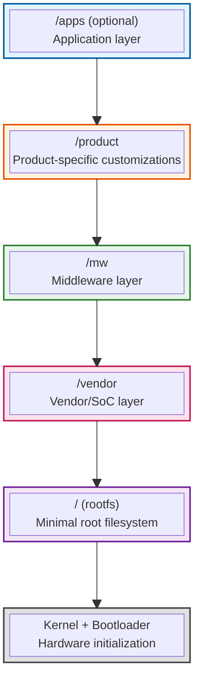

# File System

## Document History

|Date|Author|Comments|
|----|------|--------|
|2024-12-12|G.Weatherup|Initial comprehensive specification|

## Related Pages

!!! tip "Related Pages"
    - [Directory And Dynamic Linking Specification](directory_and_dynamic_linking_specification.md)
    - [Logging System](logging_system.md)

## Purpose

This document defines the system-wide file system architecture for RDK platforms, establishing a layered, modular approach that supports independent versioning, freezeable layers, and binary compatibility across multiple mount points.

The specification enables:

* **Independent Layer Updates**: Each layer (/vendor, /mw, /product, /apps) can be versioned, frozen, and updated independently
* **Module Traceability**: Clear visibility into what modules are built, delivered, and deployed
* **Bootloader Flexibility**: Kernel-driven mounting with bootloader configuration for binary compatibility
* **Development Clarity**: Well-defined locations for deliverables from each development team

## Architectural Overview

### Layered File System Model

The RDK platform adopts a **multi-layer architecture** where each layer represents a distinct functional and organizational boundary:



### Layer Characteristics

Each layer in the system has the following characteristics:

| Layer | Purpose | Freeze Cadence | Independence | OSS Components |
|-------|---------|----------------|--------------|----------------|
| **Kernel** | Hardware initialization, bootloader integration | Low (rarely changes) | Fully independent | Kernel-specific only |
| **rootfs (/)** | Minimal system-wide essentials | Low (stable base) | System foundation | Core utilities only |
| **/vendor** | SoC/hardware abstraction layer | Low-Medium (may freeze) | Independent mount | Vendor-specific OSS |
| **/mw** | RDK middleware services | Medium (may freeze later) | Independent mount | Middleware OSS |
| **/product** | Product customizations | Medium-High | Independent mount | Product-specific OSS |
| **/apps** | Application layer | High | Independent mount | Application OSS |

### Key Design Principles

1. **Freezeable Layers**: Any layer can be frozen with a stable version, reducing update frequency
2. **Independent Binaries**: Each layer is a separate mountable image with its own versioning
3. **No Cross-Layer Pollution**: Libraries and components remain within their designated layer
4. **Bootloader-Driven Configuration**: Mount points determined at boot time via bootloader
5. **Traceability**: All modules are auditable through configuration files and version metadata

## Kernel and Boot Sequence

### Kernel Role

The **kernel** is an independent bootable binary responsible for:

* Hardware initialization and driver loading
* Mounting the root filesystem (rootfs)
* Reading mount configuration provided by the bootloader
* Executing the mount sequence for additional layers

### Bootloader Configuration

During the boot sequence, the **bootloader** provides the kernel with configuration specifying:

* Which layers to mount (/vendor, /mw, /product, /apps)
* Version identifiers for each layer
* Mount options and priorities
* Fallback configurations for resilience

This enables **binary compatibility flexibility** — the same kernel can work with different combinations of layer versions based on bootloader settings.

Example bootloader configuration:

```bash
vendor_version=2.5.0
vendor_image=/boot/vendor-2.5.0.img
mw_version=3.1.0
mw_image=/boot/mw-3.1.0.img
product_version=1.0.5
product_image=/boot/product-1.0.5.img
apps_enabled=true
apps_image=/boot/apps-1.2.0.img
```

### Mount Sequence

The kernel executes the following mount sequence:

1. Mount rootfs (/) from kernel-supplied initramfs or separate partition
2. Read bootloader configuration from kernel command line or device tree
3. Mount /vendor layer (required)
4. Mount /mw layer (required)
5. Mount /product layer (required)
6. Mount /apps layer (if specified)
7. Execute systemd initialization with full layer visibility

## Root Filesystem (/)

### Stripped-Down Design

The **rootfs** is intentionally minimal, containing only:

* Essential system utilities (init, systemd, basic shell)
* Core libraries required for system bootstrap
* Kernel modules and firmware
* Mount point directories for additional layers
* Symbolic links for common directories

### Common Directory Structure

Standard directories are reorganized to support the layered architecture:

| Traditional Path | New Architecture | Notes |
|------------------|------------------|-------|
| `/usr/lib` | Symlinks to layer-specific lib directories | See Dynamic Linking section |
| `/etc` | Layer-specific configs under `/vendor/*/etc`, `/mw/*/etc` | Managed via symlinks |
| `/var/log` | Symlinks to `/var/log/{vendor,mw,product,apps}/*` | Per-layer logging |
| `/opt` | Deprecated in favor of layer-specific paths | Legacy support only |
| `/usr/bin` | Layer-specific bin directories | Invoked via absolute paths |

### Symbolic Link Strategy

The rootfs creates symbolic links at boot time to integrate layer-specific directories:

```bash
# Dynamic library paths
/usr/lib/vendor -> /vendor/lib
/usr/lib/mw -> /mw/lib

# Configuration merging
/etc/vendor -> /vendor/etc
/etc/mw -> /mw/etc

# Logging directories
/var/log/vendor -> /vendor/var/log
/var/log/mw -> /mw/var/log
```

## Layer-Specific Architecture

### /vendor Layer

The **vendor layer** provides hardware abstraction and SoC-specific functionality.

**Directory Structure**:

```bash
/vendor/
├── <module>/
│   ├── bin/              # Module executables
│   ├── lib/              # Shared libraries
│   ├── etc/              # Configuration files
│   ├── systemd/          # Service definitions
│   ├── app_armor/        # Security profiles
│   ├── ld.so.conf.d/     # Linker configuration
│   ├── memory/           # Resource declarations
│   ├── logs/ -> /var/log/vendor/<module>/
│   └── VERSION           # Version metadata
├── lib/                  # Aggregated libraries
├── bin/                  # Aggregated executables
└── etc/                  # Aggregated configurations
```

**Independent OSS Components**: The vendor layer maintains its own Open Source Software components (e.g., vendor-specific drivers, libraries) and consumes them exclusively from /vendor mount points.

### /mw Layer

The **middleware layer** provides RDK core services and framework components.

**Directory Structure**:

```bash
/mw/
├── <module>/
│   ├── bin/              # Middleware executables
│   ├── lib/              # RDK middleware libraries
│   ├── etc/              # Service configurations
│   ├── systemd/          # Service definitions
│   ├── app_armor/        # Security profiles
│   ├── ld.so.conf.d/     # Linker configuration
│   ├── memory/           # Resource declarations
│   ├── logs/ -> /var/log/mw/<module>/
│   └── VERSION           # Version metadata
├── lib/                  # Aggregated libraries
├── bin/                  # Aggregated executables
└── etc/                  # Aggregated configurations
```

**Independent OSS Components**: Middleware OSS components (e.g., GStreamer, D-Bus wrappers, RDK service libraries) are consumed from /mw mount points only.

### /product Layer

The **product layer** provides product-specific configurations and customizations. This layer contains configuration only, not platform-specific binaries or libraries.

!!! important "Delivery Mechanism"
    The `/product` layer is delivered by the **image assembler** during image composition. Unlike `/vendor` (which is SoC-specific) and `/mw` (which is platform-independent), the `/product` layer captures platform-level configurations that may be shared across multiple SoCs within the same product family. This allows the same kernel and vendor layers to support multiple product configurations through different `/product` images. The `/apps` layer is also platform-independent.

**Directory Structure**:

```bash
/product/
├── etc/
│   └── <component>/         # Component-specific configurations
│       └── *.yaml          # Configuration files (YAML for human readability)
├── data/                    # Product assets (images, branding)
├── logs/ -> /var/log/product/
└── VERSION                  # Version metadata
```

**Configuration Only**: The product layer is restricted to configuration files, assets, and data. Platform-specific executables and libraries must reside in the /vendor or /mw layers.

All product-specific configuration files should be organized under `/product/etc/` in component-specific subdirectories for clear organization and maintainability. Configuration files use YAML format to provide human-readable content with support for comments.

**Example**:

```bash
/product/etc/as/config.yaml              # Application Services configuration
/product/etc/entservices/config.yaml     # Enterprise services configuration
/product/etc/rdkappmanager/config.yaml   # RDK App Manager configuration
```

### /apps Layer (Optional)

The **application layer** provides end-user applications and services.

**Directory Structure**:

```bash
/apps/
├── <app>/
│   ├── bin/              # Application binaries
│   ├── lib/              # Application-specific libraries
│   ├── etc/              # Application configurations
│   ├── data/             # Application data
│   ├── logs/ -> /var/log/apps/<app>/
│   └── VERSION           # Version metadata
└── ...
```

**Independent OSS Components**: Application OSS dependencies are isolated to /apps mount points.

## Dynamic Linking and Library Management

### Layer-Specific Library Paths

Each layer maintains its own dynamic linker configuration:

```bash
# Vendor layer
/vendor/lib/
/vendor/<module>/lib/

# Middleware layer
/mw/lib/
/mw/<module>/lib/

# Product layer (configuration only - no lib directories)

# Apps layer
/apps/lib/
/apps/<app>/lib/
```

### Linker Configuration

Each module provides linker configuration in `/etc/ld.so.conf.d/`:

```bash
# Vendor module example
/etc/ld.so.conf.d/vendor-<module>.conf -> /vendor/<module>/ld.so.conf.d/vendor-<module>.conf

# Middleware module example
/etc/ld.so.conf.d/mw-<module>.conf -> /mw/<module>/ld.so.conf.d/mw-<module>.conf
```

### Runtime Linking Policy

* **RPATH Priority**: Modules should embed RPATH during compilation (`-Wl,-rpath,/<layer>/<module>/lib`)
* **No LD_LIBRARY_PATH**: Environment variables must not be relied upon
* **Layer Isolation**: Libraries from one layer should not directly depend on another layer's internal libraries
* **Shared Dependencies**: Common dependencies (e.g., glibc) provided by rootfs

For detailed linking specifications, see [Directory And Dynamic Linking Specification](directory_and_dynamic_linking_specification.md).

## Module Traceability and Auditing

### Configuration Files

Each module must include configuration files that enable traceability:

```bash
/<layer>/<module>/
├── VERSION               # Version and build metadata
├── etc/manifest.json     # Module dependencies and capabilities
└── memory/usage.conf     # Resource declarations
```

### VERSION File Format

```ini
version=MAJOR.MINOR.PATCH
build_date=YYYY-MM-DD HH:MM:SS UTC
build_sha=sha256:<commit-hash>
layer=vendor|mw|product|apps
dependencies=<comma-separated list>
```

### Manifest File Format

The manifest file is typically generated automatically by the build system (e.g., Yocto/BitBake) from recipe metadata during compilation. The specific generation mechanism depends on your vendor layer build setup.

**Example Yocto Generation Approach:**

In a Yocto recipe or custom bbclass, manifest generation can leverage recipe variables:

```python
# Example in a custom manifest.bbclass or recipe do_install_append
do_install_append() {
    install -d ${D}${sysconfdir}
    cat > ${D}${sysconfdir}/manifest.json << EOF
{
  "module": "${PN}",
  "version": "${PV}",
  "layer": "${LAYER_TYPE}",
  "dependencies": {
    "runtime": [$(echo "${RDEPENDS_${PN}}" | sed 's/ /", "/g' | sed 's/^/"/;s/$/"/')],
    "build": [$(echo "${DEPENDS}" | sed 's/ /", "/g' | sed 's/^/"/;s/$/"/')]
  },
  "provides": ["${RPROVIDES}"],
  "conflicts": [],
  "oss_components": [
    {"name": "${PN}", "version": "${PV}", "license": "${LICENSE}"}
  ]
}
EOF
}
```

**JSON Format:**

```json
{
  "module": "module-name",
  "version": "1.2.3",
  "layer": "vendor",
  "dependencies": {
    "runtime": ["module-a:1.0.0", "module-b:2.1.0"],
    "build": ["toolchain:11.0"]
  },
  "provides": ["libmodule.so.1", "module-daemon"],
  "conflicts": [],
  "oss_components": [
    {"name": "library-x", "version": "3.4.5", "license": "Apache-2.0"}
  ]
}
```

!!! note "Build System Integration"
    The manifest generation approach shown above is an example. Your vendor layer build infrastructure may implement this differently using custom bbclasses, buildhistory integration, or image postprocessing commands. Consult your vendor layer documentation for specific implementation details.

### Runtime Auditing

Scripts can audit the system by scanning layer directories:

```bash
# Audit all vendor modules
for module in /vendor/*/VERSION; do
  echo "Module: $(dirname $module)"
  cat $module
done

# Check OSS component usage
find /vendor /mw /product /apps -name manifest.json -exec jq '.oss_components' {} \;

# Verify memory declarations
find /vendor /mw -name usage.conf -exec cat {} \;
```

This enables:

* **Build Verification**: Confirm what was built and its version
* **Deployment Validation**: Verify what is actually deployed
* **Audit Reports**: Generate reports on module versions and OSS usage

## Integration Requirements

### Module Development Guidelines

Development teams must follow these guidelines for each layer:

1. **Directory Structure**: Follow the prescribed layout for the target layer
2. **VERSION Files**: Include comprehensive version metadata
3. **Manifest Files**: Declare all dependencies and provided components
4. **Linker Configuration**: Provide ld.so.conf.d entries for dynamic libraries
5. **Logging Integration**: Use layer-specific log paths (see [Logging System](logging_system.md))
6. **Security Profiles**: Include AppArmor profiles where applicable
7. **Service Definitions**: Provide systemd units with correct layer dependencies

### Cross-Layer Dependencies

While layers are independent, controlled dependencies are permitted:

* **Upward Dependencies**: Upper layers may depend on lower layers (e.g., /mw depends on /vendor)
* **No Downward Dependencies**: Lower layers must not depend on upper layers
* **Interface Contracts**: Dependencies must be through well-defined interfaces (e.g., AIDL/Binder)
* **Version Pinning**: Dependencies must specify version requirements in manifest files

### Build and Deployment

**Build Time**:

* Each layer is built independently
* Dependencies resolved against frozen layer versions
* Output is a mountable image per layer

**Deployment**:

* Bootloader configuration updated with new layer versions
* Kernel mounts layers during boot sequence
* Systemd initializes services across all mounted layers

**Update Strategy**:

* Individual layers can be updated without rebuilding others
* Bootloader configuration points to new layer version
* Rollback supported by reverting bootloader configuration

## Future Considerations

### Freezeable Layers

As the platform matures, layers will progressively freeze:

1. **Phase 1**: Vendor layer stabilizes and reduces update cadence
2. **Phase 2**: Middleware layer freezes after API stabilization
3. **Phase 3**: Product and Apps layers continue high-frequency updates

Frozen layers provide:

* **Binary Stability**: No ABI/API changes within major version
* **Reduced Testing**: Frozen layers need less regression testing
* **Faster Updates**: Upper layers update without rebuilding lower layers

### Alternative Configurations

The architecture supports flexibility for different deployment scenarios:

* **Monolithic Mode**: All layers merged into single rootfs (development/testing)
* **Hybrid Mode**: Some layers merged, others separate (transitional)
* **Fully Layered**: All layers independent (production target)

Bootloader configuration determines which mode is active.

## Compliance and Governance

### Layer Responsibilities

| Layer | Responsible Team | Governance |
|-------|------------------|------------|
| Kernel | Platform/SoC vendor | Upstream kernel + vendor patches |
| rootfs | Platform team | RDK community + platform leads |
| /vendor | SoC vendor | Vendor-specific |
| /mw | RDK middleware team | RDK community governance |
| /product | Product teams | Product-specific |
| /apps | Application teams | Application-specific |

### Review and Approval

Changes to this specification require:

* Review by RDK architecture team
* Approval from affected layer owners
* Impact assessment on existing deployments
* Migration plan for breaking changes

## Summary

This file system architecture provides:

* **Clear Separation**: Each layer has well-defined boundaries and responsibilities
* **Independent Evolution**: Layers can be versioned and frozen independently
* **Traceability**: Modules and OSS components are auditable
* **Flexibility**: Bootloader-driven configuration supports multiple deployment modes
* **Maintainability**: Reduced complexity through layer isolation

For implementation details on individual modules, see [Directory And Dynamic Linking Specification](directory_and_dynamic_linking_specification.md).
