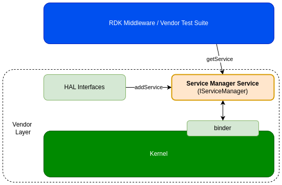

# Service Manager

The **Service Manager** is a crucial **Binder service** included in the vendor layer. It is launched early in system initialization and serves as a **registry** for Binder service interfaces.

- As each **HAL service** starts, it registers its **public Binder interface** with the **Service Manager**.
- Registered interfaces are added to the Service Manager’s list, making them discoverable by clients.
- Clients can retrieve a registered service interface by calling `getService()` with the corresponding service name.

## References

!!! info References
    |||
    |-|-|
    |**Interface Definition**|[service_manager/current](https://github.com/rdkcentral/rdk-halif-aidl/tree/main/service_manager/current)|
    | **API Documentation** | *TBD - Doxygen* |
    |**HAL Interface Type**|[AIDL and Binder](../../../introduction/aidl_and_binder.md)|
    |**Initialization - TBC** | [systemd](../../../vsi/systemd/current/intro.md) - **hal-service_manager.service** |
    |**VTS Tests**| TBC |
    |**Reference Implementation - vComponent**|[https://github.com/rdkcentral/rdk-halif-aidl/tree/main/service_manager/current](https://github.com/rdkcentral/rdk-halif-aidl/tree/main/service_manager/current)|

## Related Pages

!!! tip Related Pages

## Implementation Requirements

|#|Requirement | Comments|
|-|------------|---------|
|**HAL.SERVICEMAN.1** |Service Manager shall initialise and run early boot time to allow HAL servers to register their binder service interfaces as they start up.|
|**HAL.SERVICEMAN.2** |The list of registered services shall be listable for developers and testers to list on the device.|
|**HAL.SERVICEMAN.3** |HAL services shall be able to register their public HAL interfaces with Service Manager using the string name defined in the AIDL file.|
|**HAL.SERVICEMAN.4** |Clients shall obtain a public HAL interface using a string name from Service Manager.|

## Interface Definition

Client code accesses the [Service Manager](../../../vsi/service_manager/current/service_manager.md) by including C++ `IServiceManager.h` header and using the `getService()` function to access registered binder service interfaces.

See [https://android.googlesource.com/platform/frameworks/native/+/android-13.0.0_r74/libs/binder/include/binder/IServiceManager.h](https://android.googlesource.com/platform/frameworks/native/+/android-13.0.0_r74/libs/binder/include/binder/IServiceManager.h)

HAL binder services register an interface by calling the `publishAndJoinThreadPool()` static method on their interface class.

See [https://android.googlesource.com/platform/frameworks/native/+/android-13.0.0_r74/libs/binder/include/binder/BinderService.h](https://android.googlesource.com/platform/frameworks/native/+/android-13.0.0_r74/libs/binder/include/binder/BinderService.h)

## Initialization

The [systemd](../../../vsi/systemd/current/intro.md) `hal-service_manager.service` unit file is provided by the vendor layer to start the service.

The Service Manager depends on the kernel binder driver.

## Product Customization

The Service Manager is universal code that must be compiled and delivered as part of the vendor layer.

## System Context

The Service Manager handles service registration from HAL binder services and provides clients access to registered binder interfaces.

The list of registered binder interfaces builds up during boot.



## Building

To build the Service Manager from source, use the links to the source repository and patch repository below. The patch is required to build it for RDK.

For details on building the executable, see [https://github.com/rdk-e/linux_binder_idl/tree/main?tab=readme-ov-file#additional-build-options](https://github.com/rdk-e/linux_binder_idl/tree/main?tab=readme-ov-file#additional-build-options).

|Description | RDK-E Repository | Alternate Repository|
|------------|------------------|---------------------|
|**Service Manager** |[https://github.com/rdk-e/native_frameworks_platform-android/tree/master/cmds/servicemanager(https://github.com/rdk-e/native_frameworks_platform-android/tree/master/cmds/servicemanager) | [https://android.googlesource.com/platform/frameworks/native/+/refs/tags/android-13.0.0_r74/cmds/servicemanager/](https://android.googlesource.com/platform/frameworks/native/+/refs/tags/android-13.0.0_r74/cmds/servicemanager/)|
|**RDK patch** |[ttps://github.com/rdk-e/linux_binder_idl/blob/main/patches/native.patch](https://github.com/rdk-e/linux_binder_idl/blob/main/patches/native.patch) | [https://github.com/rdkcentral/linux_binder_idl/blob/main/patches/native.patch)](https://github.com/rdkcentral/linux_binder_idl/blob/main/patches/native.patch)|

## Client Access to Service Manager

For sample code, see [https://github.com/rdk-e/linux_binder_idl/tree/main/example](https://github.com/rdk-e/linux_binder_idl/tree/main/example).

The `IServiceManager.h` file can be found here: [https://android.googlesource.com/platform/frameworks/native/+/android-13.0.0_r74/libs/binder/include/binder/IServiceManager.h](https://android.googlesource.com/platform/frameworks/native/+/android-13.0.0_r74/libs/binder/include/binder/IServiceManager.h)

```cpp
sp<IFWManager> fwManagerService;
status_t status;

// Get the binder interface for the service.
status = getService(String16("FWManagerService"), &fwManagerService);
if (status != OK) {
    printf("\nFWManagerTestApp : Failed to Get FWManagerService handle from ServiceManager : [%s]\n", Status::fromStatusT(status).toString8().c_str());
    return -1;
}

// Use the interface to make a call.
FirmwareStatus fwStatus;
Status binderStatus;
binderStatus = fwManagerService->getFirmwareUpdateState(&fwStatus);
```

## Clients Waiting for Services

A client can call the `waitForService()` function to block until a HAL binder service becomes initialized and registered.

This may happen if the client is allowed to execute before or while the HAL service is initializing, but then needs to synchronize with the HAL service registration before it can proceed.

See `waitForService()` in [https://android.googlesource.com/platform/frameworks/native/+/android-13.0.0_r74/libs/binder/include/binder/IServiceManager.h](https://android.googlesource.com/platform/frameworks/native/+/android-13.0.0_r74/libs/binder/include/binder/IServiceManager.h)

