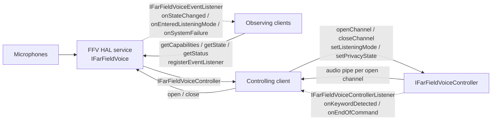
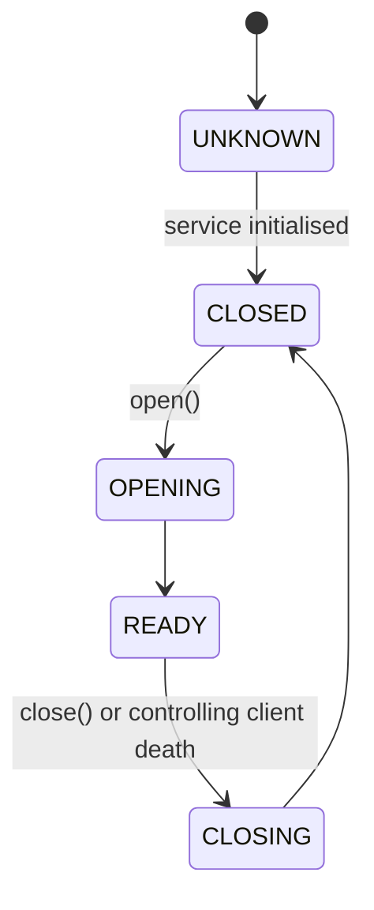
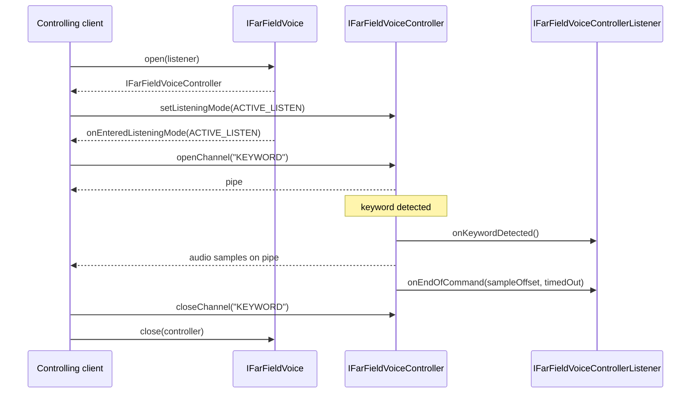

# Far Field Voice HAL

## Overview

The **Far Field Voice (FFV) HAL** captures far field audio from the platform's microphones, detects the keyword (wake word) and the end of the voice command that follows it, and delivers the audio to a client through pipes. The middleware typically forwards the Keyword Audio channel to a voice recognition service for interpretation of user intent.

Any number of clients can read the capabilities, state and status of the service. One client at a time controls it, through the `IFarFieldVoiceController` returned by `IFarFieldVoice.open()`.

---

## References

!!! info References
    |                              |                                                                                                       |
    | ---------------------------- | ----------------------------------------------------------------------------------------------------- |
    | **Interface Definition**     | [ffv/current](https://github.com/rdkcentral/rdk-halif-aidl/tree/main/ffv/current)                     |
    | **Interface Version**        | `current`                                                                                             |
    | **API Documentation**        | TBD                                                                                                   |
    | **HAL Interface Type**       | [AIDL and Binder](../introduction/aidl_and_binder.md)                                                 |
    | **Initialization Unit**      | [systemd service](../vsi/systemd/current/systemd.md)                                                  |
    | **VTS Tests**                | TBD                                                                                                   |
    | **Reference Implementation** | TBD                                                                                                   |
    | **HAL Feature Profile**      | [hfp-ffv.yaml](https://github.com/rdkcentral/rdk-halif-aidl/tree/main/ffv/current/hfp-ffv.yaml)       |

---

## Related Pages

!!! tip "Related Pages"
    * [HAL Feature Profile](../key_concepts/hal/hal_feature_profiles.md)
    * [HAL Interface Overview](../key_concepts/hal/hal_interfaces.md)

---

## System Context

---

## Interface Definitions

| AIDL File                               | Description                                                                         |
| --------------------------------------- | ----------------------------------------------------------------------------------- |
| `IFarFieldVoice.aidl`                   | Service interface: capabilities, state, status, listener registration, open/close  |
| `IFarFieldVoiceController.aidl`         | Control interface held by one client: audio channels, listening mode, privacy      |
| `IFarFieldVoiceControllerListener.aidl` | Controller callbacks: keyword detected, end of voice command                        |
| `IFarFieldVoiceEventListener.aidl`      | Service callbacks: state change, listening mode entered, system failure             |
| `Capabilities.aidl`                     | Channel types, microphone channel count, supported listening modes                  |
| `ListeningMode.aidl`                    | What the module listens for and which channels it serves                            |
| `State.aidl`                            | Service lifecycle states                                                            |
| `Status.aidl`                           | Current listening mode, keyword detected flag, privacy state                        |
| `ChannelStatus.aidl`                    | Per channel open flag and samples lost to buffer overflow                           |
| `FailureCode.aidl`                      | Reason reported with `onSystemFailure()`                                            |

---

## Implementation Requirements

| #             | Requirement                                                                                                     | Comments                                              |
| ------------- | --------------------------------------------------------------------------------------------------------------- | ----------------------------------------------------- |
| **HAL.FFV.1** | The service shall report its channel types, microphone channel count and listening modes via `getCapabilities()` | Values match the platform's `hfp-ffv.yaml`            |
| **HAL.FFV.2** | The service shall allow one controlling client at a time                                                        | `open()` fails with `EX_ILLEGAL_STATE` unless `CLOSED` |
| **HAL.FFV.3** | The service shall call `close()` implicitly when the controlling client dies                                    | Returns the service to `CLOSED`                       |
| **HAL.FFV.4** | The service shall accept `setListeningMode()` only for a mode in `Capabilities.supportedListeningModes`         | All channels must be closed                           |
| **HAL.FFV.5** | The service shall force all audio input to silence while the privacy state is active                            | `setPrivacyState(true)`                               |
| **HAL.FFV.6** | The service shall report a failure that stops capture or processing via `onSystemFailure()`                     | Carries a `FailureCode`                               |

---

## Audio Channels

A channel is one stream of audio from the service to the controlling client. `IFarFieldVoiceController.openChannel()` takes a channel type from `Capabilities.channelTypes` and returns the read end of a pipe; `closeChannel()` stops the channel's processing and closes the pipe.

| Channel type | Channel               | Content                                                                                         |
| ------------ | --------------------- | ----------------------------------------------------------------------------------------------- |
| `KEYWORD`    | Keyword Audio channel | Audio written from keyword detection onward, starting with the audio the service has buffered |
| Other        | Platform defined      | Audio written at the platform's sampling rate                                                   |

On the Keyword Audio channel, keyword detection starts when the channel is opened. Once the keyword is detected, the service writes the audio it has buffered to the pipe as fast as possible, then writes audio in real time. `onEndOfCommand()` reports the end of the voice command as a sample offset; offset `0` is the first sample written to the pipe after the channel was opened.

A channel type that cannot be served in the current listening mode, or that is mutually exclusive with a channel already open, fails `openChannel()` with `EX_ILLEGAL_STATE`.

---

## Listening Modes

A listening mode is the module's own behaviour, not a system power state. The system chooses when to change mode; the controlling client sets it with `setListeningMode()` while every channel is closed, and `onEnteredListeningMode()` reports when the mode is in effect.

| Mode            | Behaviour                                                                                 | Channels that can be opened       |
| --------------- | ----------------------------------------------------------------------------------------- | --------------------------------- |
| `ACTIVE_LISTEN` | Full far field capture and processing; keyword detection runs                             | Every type in `channelTypes`      |
| `KEYWORD_ALERT` | Keyword detection only, so the keyword can be detected while the platform is in low power | `KEYWORD`                         |
| `POWERED_OFF`   | No audio capture or processing                                                            | None                              |

`NONE` is reported in `Status.listeningMode` before a mode has been set and while a mode change is in progress. A platform lists the modes it supports in `Capabilities.supportedListeningModes` and in `supportedListeningModes` of its HFP.

---

## State Machine

Each transition is notified through `IFarFieldVoiceEventListener.onStateChanged()`. The controller and its channels are usable only in `READY`.

---

## Keyword Session

`timedOut` is `true` when the end of the voice command was not detected within the expected time, and `false` when it was detected.

---

## Error Handling

`onSystemFailure()` reports that the service, or one of its sub-systems, can no longer capture or process audio:

| `FailureCode`           | Meaning                                                      |
| ----------------------- | ------------------------------------------------------------ |
| `SUB_COMPONENT_FAILURE` | A sub-component could not be instantiated or communicated with |
| `IO_FAILURE`            | The service failed to perform I/O                            |

The client recovers by closing and reopening the service. A failure that repeats after reopening is a permanent fault. The client logs each occurrence with its `FailureCode`.
