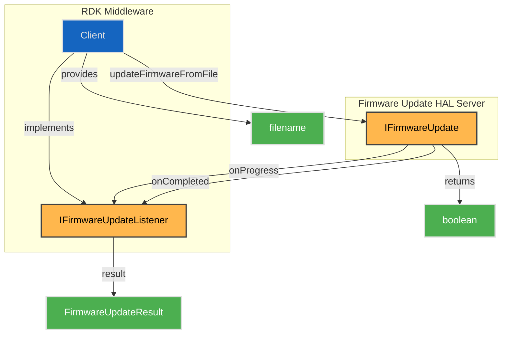
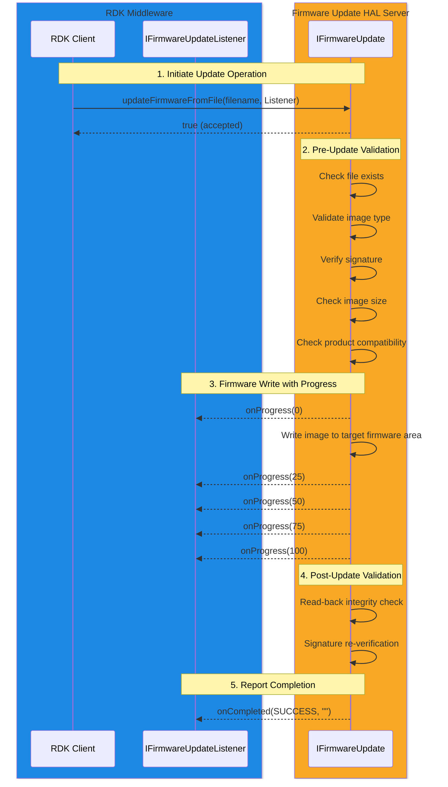
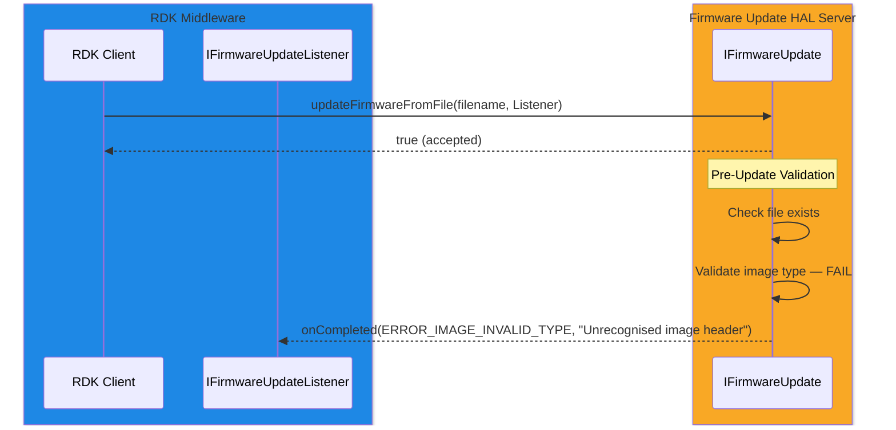

# Firmware Update HAL

## Overview

The Firmware Update HAL manages the **update lifecycle** for the
**multiple types of firmware** that exist on an RDK device, which live at
**various locations across the system**:

* Bootloader regions
* Application partitions
* Disaster-recovery images
* Bootloader splash-screen images
* Peripheral firmware blobs (e.g., Wi-Fi/BT controller, panel MCU, remote-control receiver)
* Vendor-specific images

The unifying concept is the **update lifecycle** — validation, write,
verification, and roll-over — *not* the underlying storage medium. Some
firmware lives on raw flash; some lives on partitioned eMMC; some is
streamed over an internal bus to a peripheral. From the middleware's
point of view all of these are "firmware to be updated", and the HAL
hides the platform-specific details.

The HAL performs comprehensive validation both before and after writing,
including signature verification, size checks, and product compatibility
validation. The background update operation runs at low priority to avoid
impacting foreground audio, video, or graphics operations.

---

!!! info "References"
    |||
    |-|-|
    |**Interface Definition**|[firmwareupdate/current](https://github.com/rdkcentral/rdk-halif-aidl/tree/main/firmwareupdate/current)|
    |**Interface Version**|`current`|
    |**HAL Interface Type**|[AIDL and Binder](../introduction/aidl_and_binder.md)|

---

!!! tip "Related Pages"
    * [HAL Feature Profile](../key_concepts/hal/hal_feature_profiles.md)
    * [HAL Interface Overview](../key_concepts/hal/hal_interfaces.md)

---

## Functional Overview

The Firmware Update HAL exposes a single operation — `updateFirmwareFromFile()` — which initiates a background firmware write from a file on the local filesystem. The caller provides a filename and an `IFirmwareUpdateListener` callback to receive progress and completion notifications.

The image header determines which firmware *type* the file is and therefore which *target location* it will be written to. This is intentional: the middleware does not need to know whether a given image is a bootloader, an application image, or a peripheral firmware blob — that is a property of the image itself and is platform-defined.

Only one update operation may be active at a time. If an update is already in progress, the call returns `false` and no new operation is started.

On successful completion, the newly written image is flagged as the preferred image to be loaded on the next boot (where applicable for the firmware type).

---

## Implementation Requirements

| #                     | Requirement                                                                                                  | Comments                                |
| --------------------- | ------------------------------------------------------------------------------------------------------------ | --------------------------------------- |
| HAL.FIRMWAREUPDATE.1  | The service shall register with the Binder Service Manager using the service name `"firmwareupdate"`.        |                                         |
| HAL.FIRMWAREUPDATE.2  | `updateFirmwareFromFile()` shall be non-blocking; all firmware I/O occurs in the background.                 |                                         |
| HAL.FIRMWAREUPDATE.3  | Only one background firmware update operation shall be active at a time.                                    | Return `false` if already in progress.  |
| HAL.FIRMWAREUPDATE.4  | Pre-update validation shall be performed before any data is written to the target firmware area.            | See Validation Pipeline below.          |
| HAL.FIRMWAREUPDATE.5  | Post-update validation shall read back written data and verify integrity against the source.                | Critical security requirement.          |
| HAL.FIRMWAREUPDATE.6  | If a signature exists, it shall be re-verified against data read back from the target area after writing.   | Platform-specific algorithm and keys.   |
| HAL.FIRMWAREUPDATE.7  | The background update operation shall run at low priority to avoid impacting AV operations.                 |                                         |
| HAL.FIRMWAREUPDATE.8  | On success, the written image shall be flagged as the preferred image for the next boot (where applicable). |                                         |

---

## Interface Definitions

| AIDL File                       | Description                                                        |
| ------------------------------- | ------------------------------------------------------------------ |
| IFirmwareUpdate.aidl            | Main interface; exposes `updateFirmwareFromFile()`                 |
| IFirmwareUpdateListener.aidl    | Asynchronous (`oneway`) callback interface for progress and result |
| FirmwareUpdateResult.aidl       | Result code enumeration for firmware update completion status      |

---

## Initialization

The Firmware Update HAL service is initialized by systemd and registered with the Binder Service Manager under the service name `"firmwareupdate"`. The middleware discovers the service through standard Binder lookup.

---

## Product Customization

* The set of supported firmware types (application, recovery, bootloader, splash screen, peripheral blobs, vendor-specific) is **platform-dependent**.
* The mapping between firmware *type* and *target location* (boot region, application partition, peripheral device, etc.) is **platform-dependent**.
* Image type detection is performed by examining the file contents — there is no explicit type parameter from the caller.
* Signature verification algorithms and key management are platform-specific and should align with the platform's secure boot requirements.

---

## System Context

---

## Validation Pipeline

The firmware update performs a two-phase validation process to ensure image integrity and security.

### Pre-Update Validation

Before any data is written, the image file is validated through the following ordered checks:

| Step | Check                          | Error Code                       |
| ---- | ------------------------------ | -------------------------------- |
| 1    | File existence and readability | `ERROR_FILE_OPEN_FAIL`           |
| 2    | Valid firmware image type      | `ERROR_IMAGE_INVALID_TYPE`       |
| 3    | Signature verification         | `ERROR_IMAGE_INVALID_SIGNATURE`  |
| 4    | Size fits target firmware area | `ERROR_IMAGE_INVALID_SIZE`       |
| 5    | Product compatibility          | `ERROR_IMAGE_INVALID_PRODUCT`    |

If any pre-update validation step fails, the operation is aborted immediately. No data is written and `onCompleted()` is called with the corresponding error code.

### Post-Update Validation

After the image is successfully written:

| Step | Check                          | Error Code                                |
| ---- | ------------------------------ | ----------------------------------------- |
| 1    | Read-back data integrity check | `ERROR_FW_UPDATE_VERIFY_FAILED`           |
| 2    | Signature re-verification      | `ERROR_FW_UPDATE_VERIFY_SIGNATURE_FAILED` |

!!! important
    Post-update validation is a critical security step. The implementation must read back the written data from the target firmware area and verify it against the source image. This detects corruption or tampering that may have occurred during the write process.

---

## Progress Reporting

Progress is reported through the `IFirmwareUpdateListener.onProgress()` callback with a percentage value (0–100):

1. Pre-update validation runs silently (no progress callbacks).
2. After all pre-update validations pass, `onProgress(0)` is reported — firmware write is about to begin.
3. `onProgress()` callbacks continue as data is written.
4. `onProgress(100)` is reported after the firmware write completes, before post-update validation begins.
5. Post-update validation runs silently after 100% is reported.
6. `onCompleted()` is called with the final result.

---

## Firmware Update Operation Sequence

### Failed Validation Example

---

## Result Codes

| Code | Value | Phase | Description |
| ---- | ----- | ----- | ----------- |
| `SUCCESS`                              | 0  | —           | Image written and verified successfully |
| `ERROR_GENERAL`                        | -1 | Any         | General error; details in `report` string |
| `ERROR_FILE_OPEN_FAIL`                 | 1  | Pre-update  | File does not exist or cannot be opened |
| `ERROR_IMAGE_INVALID_TYPE`             | 2  | Pre-update  | File is not a recognised firmware image |
| `ERROR_IMAGE_INVALID_SIGNATURE`        | 3  | Pre-update  | Image signature verification failed |
| `ERROR_IMAGE_INVALID_SIZE`             | 4  | Pre-update  | Image does not fit the target firmware area |
| `ERROR_IMAGE_INVALID_PRODUCT`          | 5  | Pre-update  | Image is incompatible with this product |
| `ERROR_FW_UPDATE_WRITE_FAILED`            | 6  | Write       | Firmware write operation failed |
| `ERROR_FW_UPDATE_VERIFY_FAILED`           | 7  | Post-update | Read-back data does not match source image |
| `ERROR_FW_UPDATE_VERIFY_SIGNATURE_FAILED` | 8  | Post-update | Signature verification failed on written data |

---

## Error Handling

Errors are reported exclusively through the `IFirmwareUpdateListener.onCompleted()` callback. The `report` string parameter should provide additional diagnostic details for error cases, which the middleware can log for analysis.

The interface follows standard Android Binder exception semantics:

* **Success**: Returns `EX_NONE` with valid output parameters.
* **Failure**: Returns a service-specific exception (e.g., `EX_SERVICE_SPECIFIC`, `EX_ILLEGAL_ARGUMENT`). Output parameters contain undefined memory and must not be used.

---

## Resource Management

* The Firmware Update HAL service is a singleton registered under the `"firmwareupdate"` service name.
* Only one background update operation is active at a time — concurrent requests are rejected with a `false` return value.
* The `IFirmwareUpdateListener` callback interface is `oneway` (asynchronous, fire-and-forget), so the HAL server does not block on listener delivery.
* When the calling client exits, the HAL should handle the dangling listener reference safely.

---

## Migration from `flash` HAL

The Firmware Update HAL was previously named `flash`. The rename reflects the broader scope: the HAL manages multiple firmware types at multiple locations across the system, of which raw flash storage is only one possibility.

Migration cheat-sheet for consumers:

| Old (`flash`)                                    | New (`firmwareupdate`)                                            |
| ------------------------------------------------ | ----------------------------------------------------------------- |
| `com.rdk.hal.flash`                              | `com.rdk.hal.firmwareupdate`                                      |
| `IFlash`                                         | `IFirmwareUpdate`                                                 |
| `IFlashListener`                                 | `IFirmwareUpdateListener`                                         |
| `FlashImageResult`                               | `FirmwareUpdateResult`                                            |
| `flashImageFromFile()`                           | `updateFirmwareFromFile()`                                        |
| service name `"flash"`                           | service name `"firmwareupdate"`                                   |
| `ERROR_FLASH_WRITE_FAILED`                       | `ERROR_FW_UPDATE_WRITE_FAILED`                                    |
| `ERROR_FLASH_VERIFY_FAILED`                      | `ERROR_FW_UPDATE_VERIFY_FAILED`                                   |
| `ERROR_FLASH_VERIFY_SIGNATURE_FAILED`            | `ERROR_FW_UPDATE_VERIFY_SIGNATURE_FAILED`                         |
| `libflash-vcurrent-cpp.so`                       | `libfirmwareupdate-vcurrent-cpp.so`                               |

The historical `flash/0.1.0.0/` snapshot has been removed; consumers that previously pinned to it must migrate to `firmwareupdate/0.2.0.0/`. The error-code and library-name table above documents the rename mapping.
