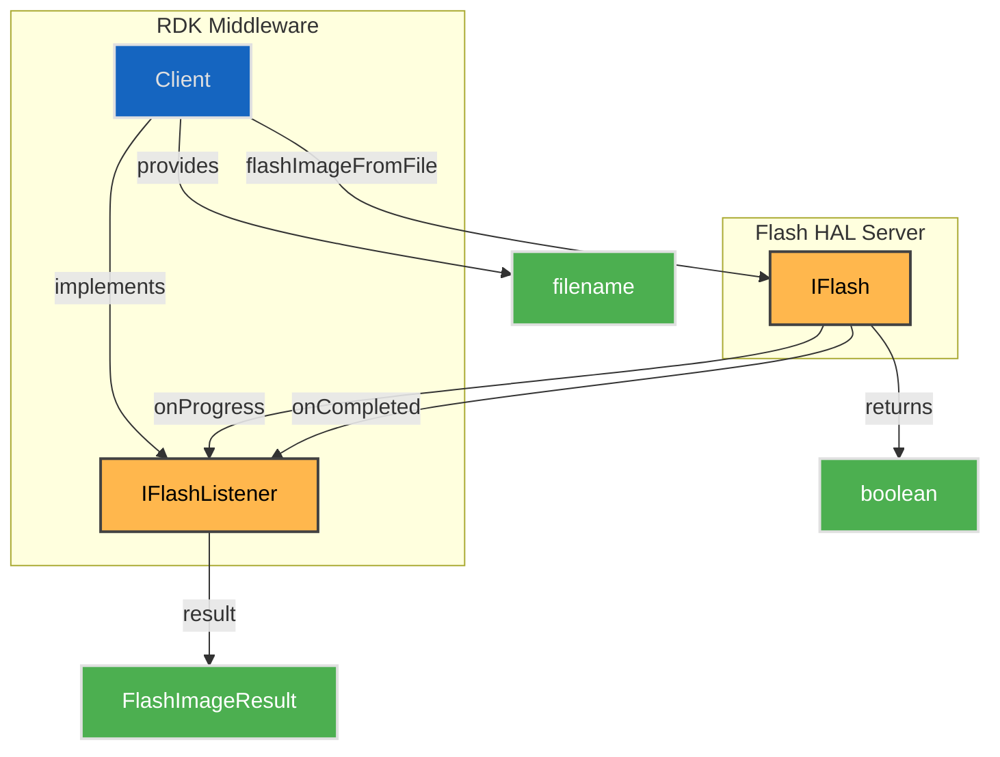
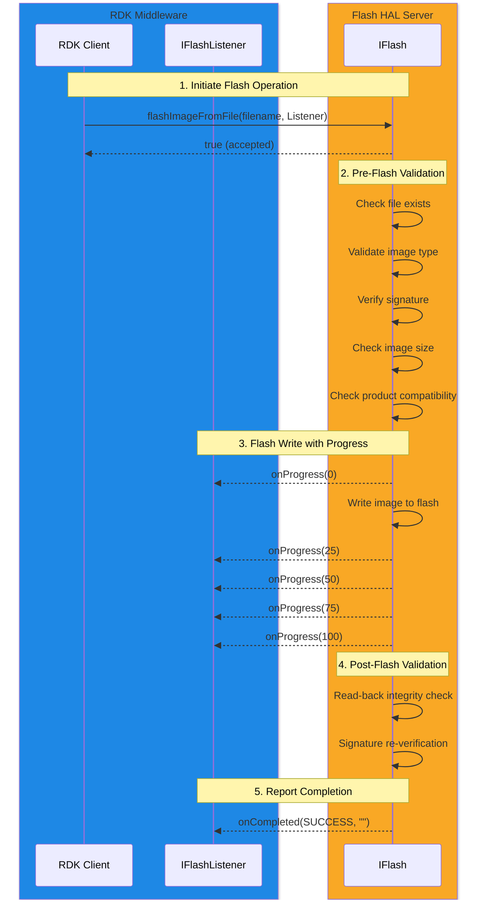
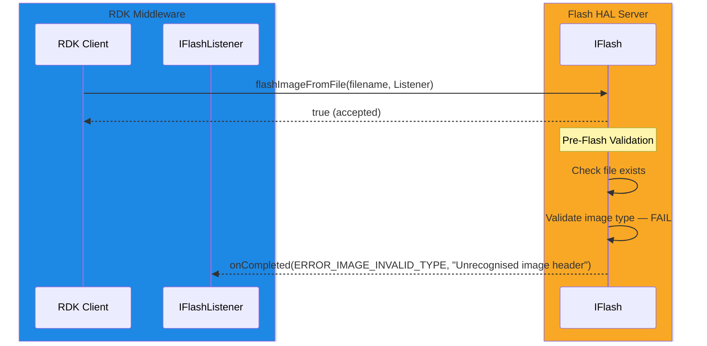

# Flash HAL

## Overview

The Flash HAL provides a non-blocking interface for writing firmware images to persistent flash storage on the device. It supports multiple image types including application images, disaster recovery images, bootloaders, and bootloader splash screen images. The specific image types supported are platform-dependent and detected by examination of the file.

The HAL performs comprehensive validation both before and after writing, including signature verification, size checks, and product compatibility validation. The background flash operation runs at low priority to avoid impacting foreground audio, video, or graphics operations.

---

!!! info "References"
    |||
    |-|-|
    |**Interface Definition**|[flash/current](https://github.com/rdkcentral/rdk-halif-aidl/tree/develop/flash/current)|
    |**HAL Interface Type**|[AIDL and Binder](../introduction/aidl_and_binder.md)|

---

!!! tip "Related Pages"
    * [HAL Feature Profile](../key_concepts/hal/hal_feature_profiles.md)
    * [HAL Interface Overview](../key_concepts/hal/hal_interfaces.md)

---

## Functional Overview

The Flash HAL exposes a single operation — `flashImageFromFile()` — which initiates a background firmware write from a file on the local filesystem. The caller provides a filename and an `IFlashListener` callback to receive progress and completion notifications.

Only one flash operation may be active at a time. If a flash is already in progress, the call returns `false` and no new operation is started.

On successful completion, the newly written image is flagged as the preferred image to be loaded on the next boot.

---

## Implementation Requirements

| #           | Requirement                                                                                      | Comments                                |
| ----------- | ------------------------------------------------------------------------------------------------ | --------------------------------------- |
| HAL.FLASH.1 | The service shall register with the Binder Service Manager using the service name `"flash"`.     |                                         |
| HAL.FLASH.2 | `flashImageFromFile()` shall be non-blocking; all flash I/O occurs in the background.            |                                         |
| HAL.FLASH.3 | Only one background flash operation shall be active at a time.                                   | Return `false` if already in progress.  |
| HAL.FLASH.4 | Pre-flash validation shall be performed before any data is written to flash.                     | See Validation Pipeline below.          |
| HAL.FLASH.5 | Post-flash validation shall read back written data and verify integrity against the source.      | Critical security requirement.          |
| HAL.FLASH.6 | If a signature exists, it shall be re-verified against data read back from flash after writing.  | Platform-specific algorithm and keys.   |
| HAL.FLASH.7 | The background flash operation shall run at low priority to avoid impacting AV operations.       |                                         |
| HAL.FLASH.8 | On success, the flashed image shall be flagged as the preferred image for the next boot.         |                                         |

---

## Interface Definitions

| AIDL File            | Description                                                        |
| -------------------- | ------------------------------------------------------------------ |
| IFlash.aidl          | Main flash interface; exposes `flashImageFromFile()`               |
| IFlashListener.aidl  | Asynchronous (`oneway`) callback interface for progress and result |
| FlashImageResult.aidl| Result code enumeration for flash completion status                |

---

## Initialization

The Flash HAL service is initialized by systemd and registered with the Binder Service Manager under the service name `"flash"`. The middleware discovers the service through standard Binder lookup.

---

## Product Customization

* Supported image types (application, recovery, bootloader, splash screen) are platform-dependent.
* Image type detection is performed by examining the file contents — there is no explicit type parameter.
* Signature verification algorithms and key management are platform-specific and should align with the platform's secure boot requirements.

---

## System Context

---

## Validation Pipeline

The flash operation performs a two-phase validation process to ensure image integrity and security.

### Pre-Flash Validation

Before any data is written to flash, the image file is validated through the following ordered checks:

| Step | Check                    | Error Code                       |
| ---- | ------------------------ | -------------------------------- |
| 1    | File existence and readability | `ERROR_FILE_OPEN_FAIL`       |
| 2    | Valid flash image type   | `ERROR_IMAGE_INVALID_TYPE`       |
| 3    | Signature verification   | `ERROR_IMAGE_INVALID_SIGNATURE`  |
| 4    | Size fits target flash area | `ERROR_IMAGE_INVALID_SIZE`    |
| 5    | Product compatibility    | `ERROR_IMAGE_INVALID_PRODUCT`    |

If any pre-flash validation step fails, the operation is aborted immediately. No data is written to flash and `onCompleted()` is called with the corresponding error code.

### Post-Flash Validation

After the image is successfully written to flash:

| Step | Check                          | Error Code                              |
| ---- | ------------------------------ | --------------------------------------- |
| 1    | Read-back data integrity check | `ERROR_FLASH_VERIFY_FAILED`             |
| 2    | Signature re-verification      | `ERROR_FLASH_VERIFY_SIGNATURE_FAILED`   |

!!! important
    Post-flash validation is a critical security step. The implementation must read back the written data from flash and verify it against the source image. This detects corruption or tampering that may have occurred during the write process.

---

## Progress Reporting

Progress is reported through the `IFlashListener.onProgress()` callback with a percentage value (0–100):

1. Pre-flash validation runs silently (no progress callbacks).
2. After all pre-flash validations pass, `onProgress(0)` is reported — flash write is about to begin.
3. `onProgress()` callbacks continue as data is written to flash.
4. `onProgress(100)` is reported after the flash write completes, before post-flash validation begins.
5. Post-flash validation runs silently after 100% is reported.
6. `onCompleted()` is called with the final result.

---

## Flash Operation Sequence

### Failed Validation Example

---

## Result Codes

| Code | Value | Phase | Description |
| ---- | ----- | ----- | ----------- |
| `SUCCESS`                            | 0  | —          | Image flashed and verified successfully |
| `ERROR_GENERAL`                      | -1 | Any        | General error; details in `report` string |
| `ERROR_FILE_OPEN_FAIL`              | 1  | Pre-flash  | File does not exist or cannot be opened |
| `ERROR_IMAGE_INVALID_TYPE`          | 2  | Pre-flash  | File is not a recognised flash image |
| `ERROR_IMAGE_INVALID_SIGNATURE`     | 3  | Pre-flash  | Image signature verification failed |
| `ERROR_IMAGE_INVALID_SIZE`          | 4  | Pre-flash  | Image does not fit the target flash area |
| `ERROR_IMAGE_INVALID_PRODUCT`       | 5  | Pre-flash  | Image is incompatible with this product |
| `ERROR_FLASH_WRITE_FAILED`          | 6  | Write      | Flash write operation failed |
| `ERROR_FLASH_VERIFY_FAILED`         | 7  | Post-flash | Read-back data does not match source image |
| `ERROR_FLASH_VERIFY_SIGNATURE_FAILED` | 8 | Post-flash | Signature verification failed on written data |

---

## Error Handling

Errors are reported exclusively through the `IFlashListener.onCompleted()` callback. The `report` string parameter should provide additional diagnostic details for error cases, which the middleware can log for analysis.

The interface follows standard Android Binder exception semantics:

* **Success**: Returns `EX_NONE` with valid output parameters.
* **Failure**: Returns a service-specific exception (e.g., `EX_SERVICE_SPECIFIC`, `EX_ILLEGAL_ARGUMENT`). Output parameters contain undefined memory and must not be used.

---

## Resource Management

* The Flash HAL service is a singleton registered under the `"flash"` service name.
* Only one background flash operation is active at a time — concurrent requests are rejected with a `false` return value.
* The `IFlashListener` callback interface is `oneway` (asynchronous, fire-and-forget), so the HAL server does not block on listener delivery.
* When the calling client exits, the HAL should handle the dangling listener reference safely.
