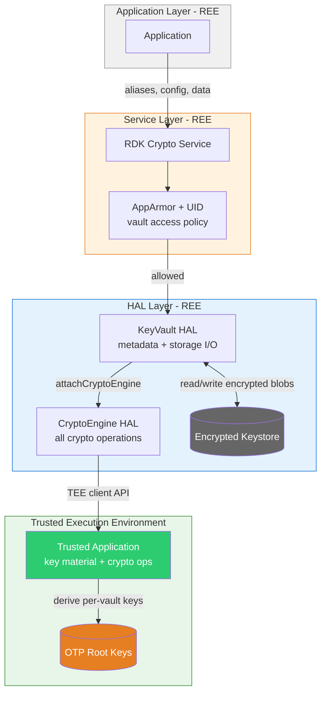
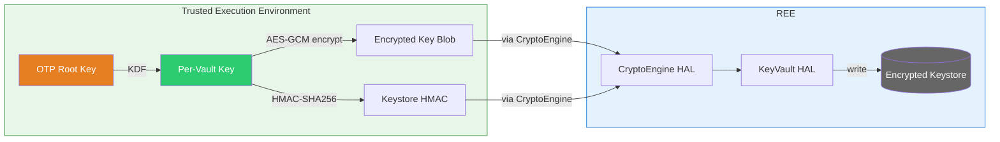
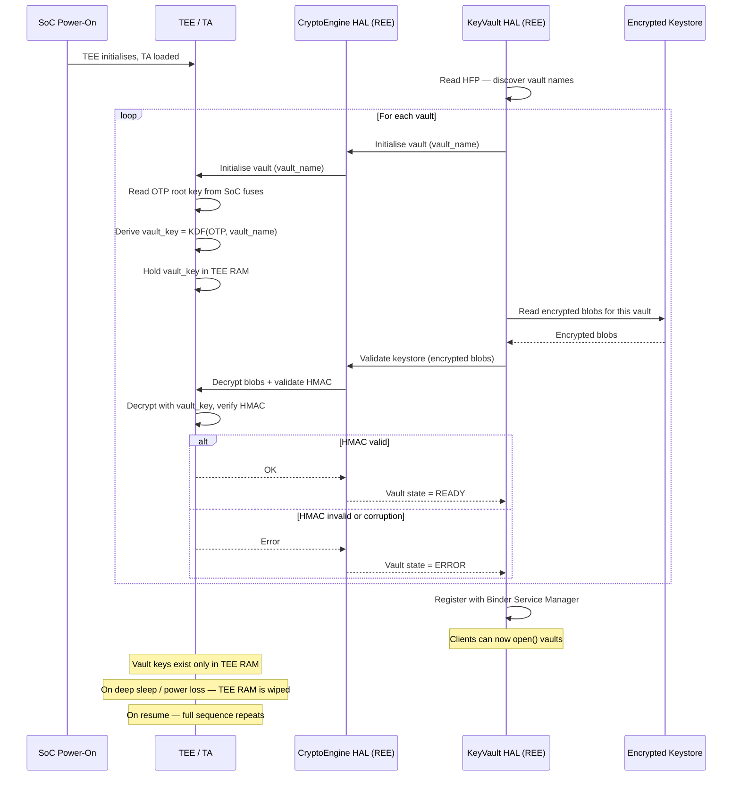
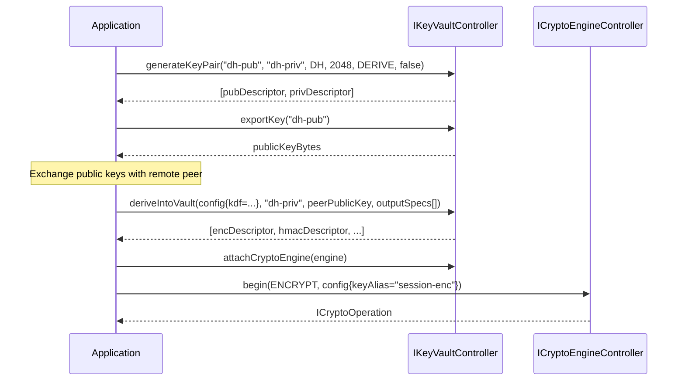
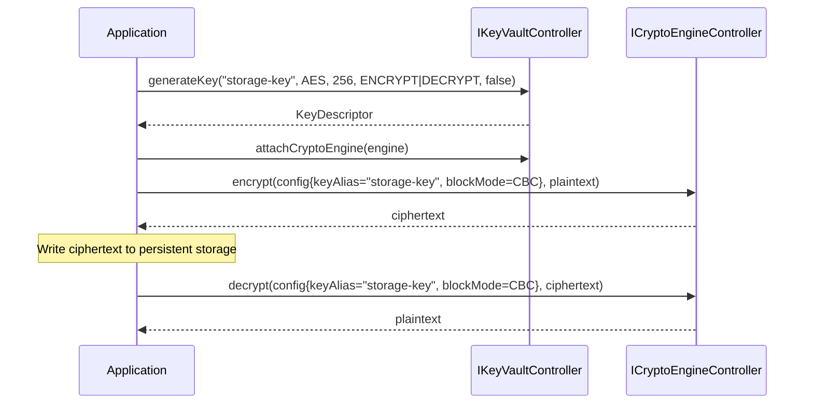
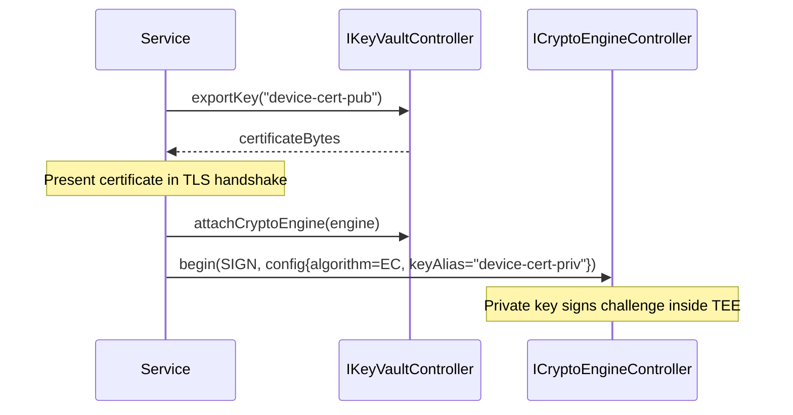
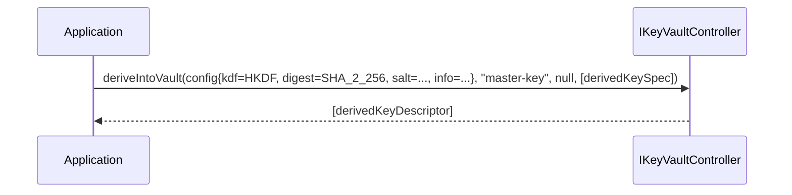
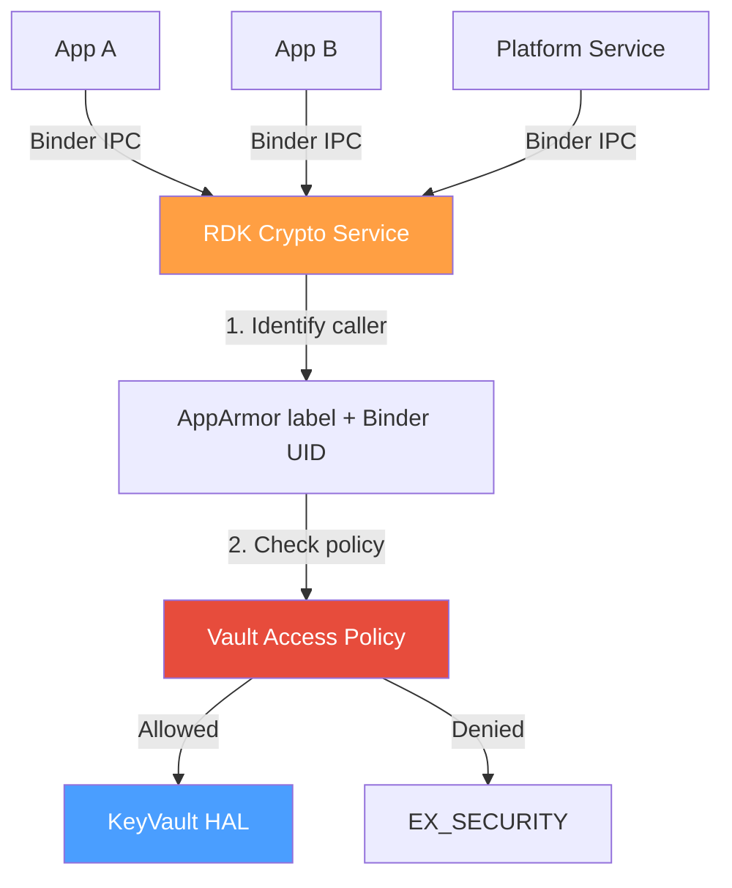
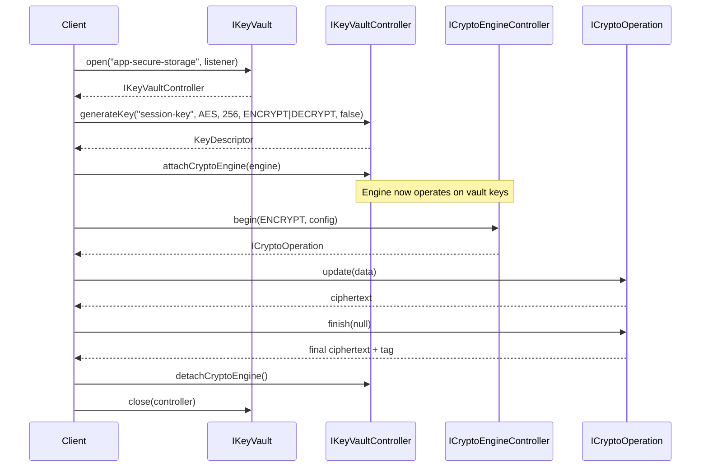
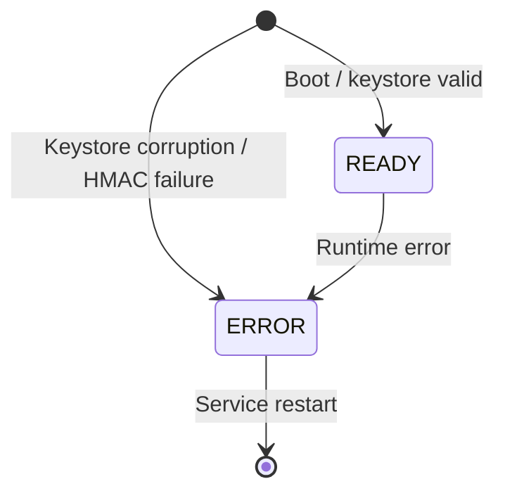

# KeyVault HAL

## Overview

The KeyVault HAL provides secure key storage and lifecycle management. It abstracts platform-specific secure storage (TEE, HSM) behind a uniform AIDL interface, offering named vault instances with independent key material, access rules, and persistence policies.

A KeyVault is purely a key store — it holds key material and manages key metadata. To perform cryptographic operations on vault-managed keys, callers attach an `ICryptoEngineController` to the vault. The engine then uses the vault's keys for its operations.

Excluded: cryptographic operations themselves — these are the responsibility of the CryptoEngine HAL.

---

## Architectural Model

Key material is created, stored, and operated on **inside the TEE** — it never crosses into the REE in plaintext. Callers interact with keys only through opaque aliases and descriptors.

### System Layers

The HAL services run in the REE as normal Linux processes. The KeyVault manages key metadata and persistence. The CryptoEngine is the only component that talks to the Trusted Application (TA) inside the TEE. The KeyVault uses the CryptoEngine for all operations that touch key material.



### How operations flow through the layers

The CryptoEngine is the only REE component that communicates with the TA. The KeyVault delegates all crypto to the CryptoEngine, which forwards to the TA. The TA runs inside the TEE (ARM TrustZone) where the REE — including the Linux kernel — cannot read or modify its memory.

| Operation | KeyVault | CryptoEngine | TA (inside TEE) | Result |
|-----------|----------|-------------|-----------------|--------|
| **Generate key** | Requests key gen via CryptoEngine | Forwards to TA | Generates key with hardware RNG. Encrypts blob with OTP-derived vault key. | Encrypted blob returned. KeyVault writes to persistent storage. |
| **Import key** | Passes raw material to CryptoEngine | Forwards to TA | Encrypts material with OTP-derived vault key. | Encrypted blob returned. KeyVault writes to persistent storage. |
| **Encrypt** | Reads encrypted blob from persistent storage. Passes blob + plaintext to CryptoEngine. | Forwards to TA | Decrypts blob. Encrypts plaintext with the key. Key stays in TEE memory. | Ciphertext returned. |
| **Decrypt** | Reads encrypted blob from persistent storage. Passes blob + ciphertext to CryptoEngine. | Forwards to TA | Decrypts blob. Decrypts ciphertext. | Plaintext returned. |
| **Sign / HMAC** | Reads encrypted blob. Passes blob + data to CryptoEngine. | Forwards to TA | Decrypts blob. Computes signature. | Signature returned. |
| **Derive into vault** | Reads source blob. Passes blob + peer key + specs to CryptoEngine. | Forwards to TA | Decrypts source key. Derives new keys. Encrypts each. | Encrypted blobs returned. KeyVault writes all to persistent storage. |
| **Export key** | Reads encrypted blob. Passes to CryptoEngine. | Forwards to TA | Decrypts blob. Checks extractable flag. | Raw material (if extractable) or error. |

The KeyVault handles metadata and storage I/O. The CryptoEngine handles TEE communication. Plaintext key material only ever exists inside the TA.

### How keys are protected at rest



1. The TA derives a **per-vault encryption key** from the hardware OTP root using a KDF. Each vault has its own derived key — compromise of one vault's data does not expose another.
2. The TA **encrypts each key blob with AES-GCM** using the per-vault key. The GCM authentication tag ensures integrity.
3. The encrypted blob is returned to the **CryptoEngine**, which passes it to the **KeyVault**. The KeyVault writes it to persistent storage. Neither the CryptoEngine nor the KeyVault can decrypt the blob.
4. The TA computes an **HMAC over the keystore** so that tampering with any blob or metadata is detected on the next load.
5. On boot, the KeyVault reads blobs from persistent storage, passes them through the CryptoEngine to the TA, and the TA validates the HMAC and re-derives vault keys from OTP before making keys available.

### Cold boot vault initialisation

On power-on, the TA derives per-vault encryption keys from the hardware OTP root. No vault key is ever stored — it is re-derived deterministically on every boot and lives only in TEE RAM.

```text
Vault Key = KDF(OTP_ROOT_KEY, vault_name)
```



The vault key is **ephemeral** — it is derived on every boot, lives only in TEE RAM, and is lost on power loss or deep sleep. Because the derivation is deterministic (same OTP + same vault name = same key), the TA can always re-derive it and decrypt the stored blobs.

This means:

- **No vault key on disk.** Nothing to steal from persistent storage.
- **No vault key in REE RAM.** The CryptoEngine and KeyVault never see the vault key.
- **Device-bound.** A different device has a different OTP, so it derives a different vault key and cannot decrypt the blobs.

### Key principles

- **KeyVault manages metadata and persistence.** It holds aliases, descriptors, and encrypted blobs. It reads and writes the encrypted keystore. It never performs crypto directly — it delegates to the attached CryptoEngine.
- **CryptoEngine is the TEE gateway.** It is the only REE component that communicates with the TA. All key generation, encryption, decryption, signing, and derivation flow through the CryptoEngine to the TA.
- **The TA is the security boundary.** Plaintext key material exists only in TEE-protected memory. The TA generates keys, encrypts blobs with OTP-derived vault keys, and performs all crypto operations.
- **Encrypted blobs transit the REE but are opaque.** The KeyVault and CryptoEngine handle encrypted blobs as byte arrays. Only the TA can decrypt them using OTP-derived keys that never leave the TEE.
- **Named vaults provide natural isolation.** Each vault has its own OTP-derived encryption key. Compromise of one vault's blobs does not expose another vault's keys.
- **SOFTWARE fallback.** For vaults with `securityLevel: SOFTWARE`, the CryptoEngine uses a software backend (e.g. OpenSSL) instead of the TA. Key material is still encrypted at rest but is present in REE process memory during operations.

---

## Use Cases

### Authenticated Key Exchange

**If you need to** establish session keys with a remote server via Diffie-Hellman:

1. Open a TEE-backed vault
2. `generateKeyPair()` — private key stays in vault, public key bytes returned
3. Send public key to remote peer, receive their public key
4. `deriveIntoVault()` — derive session keys (encryption, HMAC, wrapping) directly into vault
5. Attach a crypto engine and use the derived keys for encrypted communication

Key material never leaves the TEE. The caller only holds aliases and descriptors.



### Encrypted Persistent Storage

**If you need to** store sensitive data (tokens, credentials, app state) encrypted on disk:

1. Open a TEE-backed vault
2. `generateKey()` — create a non-extractable AES key bound to the device
3. Attach a crypto engine
4. `encrypt()` data before writing to disk; `decrypt()` on read
5. Key is device-bound — data cannot be decrypted on another device



### Device Identity and mTLS

**If you need to** authenticate the device to a backend service using mutual TLS:

1. Open the platform identity vault (contains factory-provisioned keypair)
2. Export the public certificate (extractable) for the TLS handshake
3. Attach a crypto engine for the private key signing operation
4. The private key signs the TLS challenge inside the TEE — it never enters REE memory



### Key Derivation (HKDF / PBKDF2)

**If you need to** derive a new key from an existing secret (e.g. from a master key or password):

1. Open a vault containing the base key
2. `deriveIntoVault()` with the derivation config (HKDF with salt/info, or PBKDF2 with salt/iterations)
3. The derived key is stored directly in the vault — raw material is never exposed



---

## Vault Access Control

The HAL is caller-agnostic — it does not enforce per-app access control. Access control is the responsibility of the RDK Crypto Service, which sits between applications and the HAL.

### How App-to-Vault Isolation Works

Each application runs in its own container or process. The RDK Crypto Service receives all vault requests via Binder IPC, identifies the caller, and checks whether that caller is permitted to access the requested vault. If not, the request is rejected before it reaches the HAL.



Isolation is enforced in two layers:

**AppArmor (mandatory access control)** — each application has an AppArmor profile that confines what it can do. The RDK Crypto Service reads the caller's AppArmor label via `/proc/<pid>/attr/apparmor/current` and matches it against the vault access policy. This is a kernel-enforced boundary — the application cannot bypass or modify its own profile.

**Binder caller UID (defence-in-depth)** — the RDK Crypto Service calls `getCallingUid()` on every request and checks it against a mapping of UID to permitted vault names. This catches misconfigured AppArmor profiles and provides a second verification of caller identity.

Both checks must pass. If either fails, the service returns `EX_SECURITY` and the request never reaches the HAL.

### Vault Access Policy

The service maintains a vault access policy that maps caller identities to permitted vaults. This is a platform configuration file loaded at service startup.

```yaml
# /etc/rdk/crypto-service/vault-access.yaml
vault-access:
  - profile: "app-a"
    vaults: ["app-a-storage"]

  - profile: "app-b"
    vaults: ["app-b-storage"]

  - profile: "platform-service"
    vaults: ["platform-identity", "drm-provisioning"]

  # Default: no access to any vault
```

When an application calls `open(vaultName)`:

1. Service reads the caller's AppArmor profile name
2. Service looks up the profile in the vault access policy
3. If the requested vault is in the allowed list, the request is forwarded to the HAL
4. If not, `EX_SECURITY` is returned

This is declarative, auditable, and updatable without changing the HAL or recompiling applications. The platform integrator defines the policy at build time; the service enforces it at runtime.

---

## References

!!! info References
|||
|-|-|
|**Interface Definition**|[keyvault/current](./com/rdk/hal/keyvault/)|
|**API Documentation**| Generated from AIDL Javadoc comments |
|**HAL Interface Type**| AIDL and Binder |
|**HAL Feature Profile**| [hfp-keyvault.yaml](./hfp-keyvault.yaml) |

---

## Related Pages

!!! tip "Related Pages"
- [CryptoEngine HAL](../../cryptoengine/current/document.md) — crypto operations; attached to a vault via `attachCryptoEngine()`
- [HAL Feature Profile](./hfp-keyvault.yaml) — platform-provisioned vaults and constraints

---

## Functional Overview

The KeyVault HAL has three layers:

| Interface | Role |
|-----------|------|
| `IKeyVault` | Top-level manager. Enumerates vaults, opens sessions, creates/destroys runtime vaults. |
| `IKeyVaultController` | Per-session controller. Key lifecycle (generate, import, export, delete, rotate), crypto engine attachment, and vault introspection. |
| `IKeyVaultEventListener` | Asynchronous callback interface for vault state changes, key expiry, and key invalidation. |

---

## Implementation Requirements

| # | Requirement | Comments |
|---|-------------|---------|
| HAL.KV.1 | The service shall register with Binder Service Manager using the service name `KeyVault`. | Defined as `IKeyVault.serviceName`. |
| HAL.KV.2 | Platform-provisioned vaults shall be available immediately after service startup. | Defined in HFP `vaults` section. |
| HAL.KV.3 | Key material for TEE-backed vaults shall never leave the secure environment in plaintext. | Export returns `EX_SECURITY` for non-extractable keys. |
| HAL.KV.4 | Key material at rest shall be encrypted using OTP-derived root keys. | Per-vault encryption with HMAC-authenticated keystores. |
| HAL.KV.5 | On deep sleep, the HAL is closed. On resume, the HAL is reopened and vaults re-initialise. | Callers check `getVaultState()` after `open()`. |
| HAL.KV.6 | `flush()` shall persist all pending changes and re-sign the keystore HMAC. | Write failure returns `EX_SERVICE_SPECIFIC`. |
| HAL.KV.7 | Application-created vaults shall be subject to HFP limits (`allowApplicationVaults`, `maxApplicationVaults`). | `createVault()` returns `EX_UNSUPPORTED_OPERATION` if not permitted. |
| HAL.KV.8 | Platform-provisioned vaults shall not be destroyable. | `destroyVault()` returns `EX_ILLEGAL_ARGUMENT`. |

---

## Interface Definitions

| AIDL File | Description |
|-----------|-------------|
| `IKeyVault.aidl` | Top-level manager: vault enumeration, session open/close, runtime vault create/destroy |
| `IKeyVaultController.aidl` | Per-session controller: key lifecycle, crypto engine attachment, vault introspection |
| `IKeyVaultEventListener.aidl` | Oneway callback interface: state changes, key expiry, key invalidation, key rotation |
| `VaultCapabilities.aidl` | Parcelable: vault name, security level, key limits, persistence, storage capacity |
| `DerivedKeySpec.aidl` | Parcelable: output key spec for deriveIntoVault (alias, algorithm, type, size, usages) |
| `KeyDescriptor.aidl` | Parcelable: key alias, algorithm, type, size, usages, extractability, digest, version, timestamps |
| `VaultState.aidl` | Enum: READY, ERROR |

---

## Initialization

1. The platform starts the KeyVault HAL service process.
2. The service reads the HAL Feature Profile to discover platform-provisioned vaults.
3. For each provisioned vault, the service initialises the keystore partition and validates the HMAC.
4. The service registers `IKeyVault` with Binder Service Manager under the name `KeyVault`.
5. Clients obtain the `IKeyVault` proxy via Service Manager lookup.
6. Clients call `getVaultNames()` to discover available vaults.
7. Clients call `open(vaultName, listener)` to obtain an `IKeyVaultController` session.

---

## Product Customization

Platform vendors customize vaults via the HAL Feature Profile ([hfp-keyvault.yaml](./hfp-keyvault.yaml)):

- **Application vault policy** — whether apps can create runtime vaults, and how many
- **Platform-provisioned vaults** — each with:
    - Name and description
    - Security level (`SOFTWARE` or `TEE`)
    - Maximum key count
    - Supported key sizes
    - Deep sleep persistence behaviour
    - Storage capacity
    - Key extractability policy

Example provisioned vaults:

| Vault | Security | Persists Sleep | Extractable | Use Case |
|-------|----------|---------------|-------------|----------|
| `platform-identity` | TEE | Yes | No | Device certificates and signing keys |
| `app-secure-storage` | TEE | Yes | No | Per-application encrypted key-value storage |
| `drm-provisioning` | TEE | Yes | No | DRM key provisioning and device credentials |
| `netflix-msl` | TEE | No | No | Netflix MSL session keys (re-derived after sleep) |
| `general-purpose` | SOFTWARE | Yes | Yes | Shared vault for platform services |

---

## Resource Management

| Operation | Behaviour |
|-----------|-----------|
| `IKeyVault.open(name, listener)` | Opens a session to a named vault. Returns `IKeyVaultController`. |
| `IKeyVault.close(controller)` | Aborts active operations, releases the session. Key material remains persisted. |
| `IKeyVaultController.attachCryptoEngine(engine)` | Binds a crypto engine to this vault session. Only one engine per session. |
| `IKeyVaultController.detachCryptoEngine()` | Unbinds the engine. Aborts in-flight operations using vault keys. |
| `IKeyVault.createVault(name, level, maxKeys)` | Creates a runtime vault (subject to HFP limits). |
| `IKeyVault.destroyVault(name)` | Destroys a runtime vault and securely erases all its keys. |

- Multiple sessions can be open to the same vault concurrently.
- If a client process dies, Binder death notification triggers cleanup of its sessions.

---

## Operation and Data Flow

### Key generation and use



### Key import and export

- `importKey(alias, algorithm, keyType, keyData, usages, extractable)` — encrypts raw key material at rest using vault root-derived key
- `exportKey(alias)` — returns raw key material only if `extractable == true`
- `deleteKey(alias)` — securely erases key material and re-persists the keystore

---

## Event Handling

Events are delivered via `IKeyVaultEventListener` (oneway/async):

| Event | Trigger |
|-------|---------|
| `onVaultStateChanged(state)` | Vault seal/unseal transitions (deep sleep/resume), error conditions, initial readiness. |
| `onKeyExpired(alias)` | Key TTL reached. Key material has been purged. |
| `onKeyInvalidated(alias)` | Key deleted or otherwise invalidated. |
| `onKeyRotated(alias, newVersion)` | Key rotated to a new version. |

Listeners are registered either at `open()` time or via `registerEventListener()` / `unregisterEventListener()`.

---

## State Machine / Lifecycle

### Vault state



- `READY` — keys are accessible. Normal operating state.
- `ERROR` — keystore corruption detected (e.g. HMAC validation failure).

On deep sleep the HAL is closed; on resume it is reopened and vaults re-initialise. Callers should check `getVaultState()` after `open()` before attempting key operations.

---

## Platform Capabilities

Queried at runtime via `IKeyVaultController.getCapabilities()`:

| Field | Description |
|-------|-------------|
| `vaultName` | Human-readable vault name |
| `halVersion` | HAL version string |
| `securityLevel` | `SOFTWARE` or `TEE` |
| `maxKeys` | Maximum key count for this vault |
| `keySizes` | Supported key sizes in bits |
| `persistsAcrossSleep` | Whether keys survive deep sleep |
| `storageCapacityBytes` | Total keystore partition size |
| `storageUsedBytes` | Current usage |

---

## Error Handling

| Exception | Meaning |
|-----------|---------|
| `EX_ILLEGAL_ARGUMENT` | Unknown vault name, duplicate alias, empty key data, attempt to destroy platform vault. |
| `EX_ILLEGAL_STATE` | Max sessions reached, engine already/not attached. |
| `EX_UNSUPPORTED_OPERATION` | Application vault creation not permitted by HFP. |
| `EX_SECURITY` | Attempt to export a non-extractable key. |
| `EX_SERVICE_SPECIFIC` | Key limit reached, keystore write failure, internal error. |

On any exception, output parameters contain undefined memory and must not be used.
