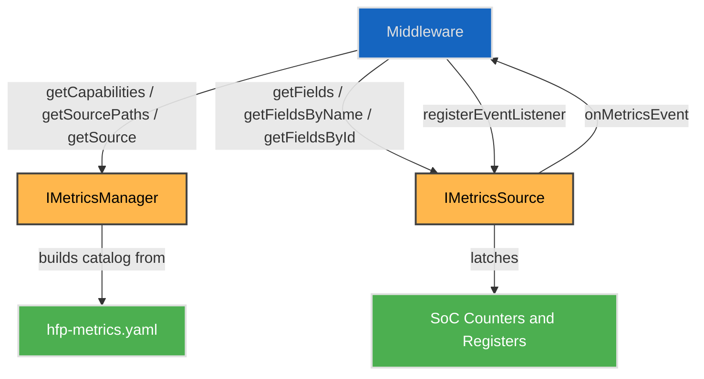
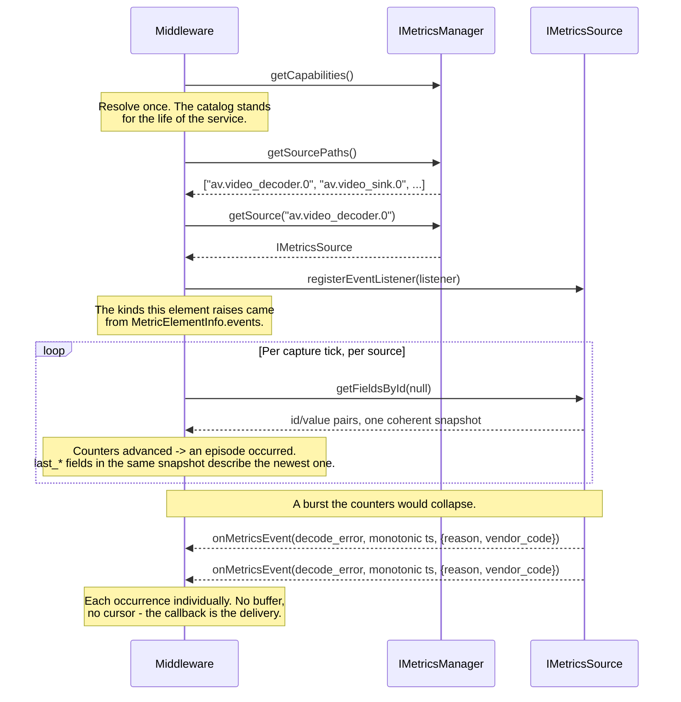

# Metrics

## Overview

The **Metrics HAL** service carries named numeric values from whoever measures them to whoever consumes them. It serves the **`av` domain**: the playback-quality figures a streaming partner certifies against.

Values are organised into **domains**, and a domain is the unit of extension — one added later is added without touching `av` or this interface. That is why every name is domain-qualified rather than assuming its subject.

Playback-quality metrics are a certification requirement across streaming partners — frames dropped and repeated, decode errors, underflow episodes with durations, A/V-sync excursions — with defined freshness and atomicity. Each SoC exposes these ad-hoc today (debug procfs, per-element properties, or not at all), so middleware cannot read them portably and cannot meet the accuracy contracts the certifications state. This HAL is the single vendor pull transport for them.

Middleware is the only client. It captures each source at the declared cadence, caches, and fans out to its own consumers; the HAL is not called per consumer.

---

## References

!!! info References
    |||
    |-|-|
    |**Interface Definition**|[metrics/current](https://github.com/rdkcentral/rdk-halif-aidl/tree/main/metrics/current)|
    |**Interface Version**|`current`|
    | **API Documentation** | *TBD - Doxygen* |
    |**HAL Interface Type**|[AIDL and Binder](../introduction/aidl_and_binder.md)|
    |**VTS Tests**| TBC |
    |**Reference Implementation - vComponent**|**TBD**|

---

## Related Pages

!!! tip "Related Pages"
    - [HAL Interface Overview](../key_concepts/hal/hal_interfaces.md)
    - [HAL Feature Profile](../key_concepts/hal/hal_feature_profiles.md)
    - [Video Decoder](../videodecoder/video_decoder.md)
    - [Video Sink](../videosink/video_sink.md)
    - [Audio Decoder](../audiodecoder/audio_decoder.md)
    - [Audio Sink](../audiosink/audio_sink.md)
    - [AV Clock](../avclock/av_clock.md)

---

## Versioning

| Version | Notes |
|---|---|
| `0.1.0.0` | Initial baseline. |

---

## Functional Overview

The Metrics HAL is responsible for:

- Publishing a **catalog** of every domain, element and field the product serves.
- Enumerating the **sources** this platform serves.
- Pushing each **occurrence** an element raises to a listener registered on that source, where a read could only carry the count and the newest.
- Serving a **coherent snapshot** of every value a source holds, at a declared freshness.
- Serving the **most recent occurrence** of each episodic condition — underflow, decode error, first frame — as ordinary fields alongside the counter that totals them.
- Accepting writes to the fields declared writable: configuration, tunables, test injection, and zeroing a high-water mark.

Three properties shape the interface:

- **Every name is a declared string.** There are no key enums, no compiled-in metric list and no value union.
- **Every value is a signed 64-bit integer.** Counters use the positive range; a signed field such as `sync_offset_ms` uses the sign.
- **The metric set is not part of the ABI.** Adding a field, an element or a whole domain is a declaration change — no interface freeze, no version bump, no coordinated consumer rebuild. This is what lets the metric set track the partner certification set, which moves every year, without the HAL moving with it.

---

## The Feature Profile is the contract

`hfp-metrics.yaml` states the interface data a vendor must implement and return, and it is what the test suites validate a device against. **A field is defined there and nowhere else** — its meaning and this product's declaration of it are the same statement, so there is no separate dictionary to agree with.

Each field carries what a vendor needs to implement it and what a test needs to assert against it:

```yaml
- name: frames_decoded
  unit: frames
  kind: counter
  id: '0x63c81c7efbe7e743'      # generated
  provider: Driver
  description: >
    Compressed frames the decoder has decoded and emitted at its output
    (post-decode, pre-sink). +1 per emitted frame. Counted from instance
    creation; never reset on flush/seek.
```

Everything else is generated from it by `scripts/generate.py`, which takes no arguments:

```text
hfp-metrics.yaml                     authored - the contract
    │
    ├─→ id: on each field             computed and written back in
    └─→ docs/vendor_field_dictionary.md
                                      the reference, and what each declared
                                      field must do
```

It regenerates, verifies the result is stable, checks the profile, and exits non-zero if anything is wrong.

### One profile per layer

This profile is the **HAL layer's** — what a SoC vendor owes. A layer above the HAL keeps its own profile in its own repository: the middleware that owns the session state machine declares its figures there, not here, and a vendor is never asked to serve them.

`getCapabilities()` returns the union of every profile live on the device, which composes without translation only because each follows the same shape. **A layer never declares another layer's fields** — that is what keeps "who owes this figure" answerable from the file it appears in.

Because a consumer above reads the union, the top layer publishes a **combined field dictionary**: every field a caller can see, across every layer that declares one, with the layer that produces each. That document is the top layer's to publish, from its own repository — `scripts/generate.py` produces it here when a working copy of an upper layer's unique fields is present, and produces nothing extra when there is not.

Contract ids are computed identically at every layer, from `path|unit|kind`, so an id means the same thing across the union without anything having to co-ordinate.

### Field contract id

Every field carries an id derived from the contract that governs how it may be read:

```text
id = first 8 bytes of SHA-256("<domain>.<element>.<field>|<unit>|<kind>")
```

Those 8 bytes are read big-endian with the sign bit cleared, giving 63 bits of hash in `MetricFieldInfo.id`. The value is therefore always non-negative, and compares identically however a consumer stores it. The declaration writes the same value as a `0x`-prefixed 16-digit literal.

Nothing allocates it, so there is no registry to consult and nothing to resolve when two people add a field on separate branches.

It buys a check no key can make alone. A key — a name or an ordinal — stays valid while the meaning underneath it changes: a product that declares `decode_latency_sum_us` but populates milliseconds still matches by name, and its consumer reports figures a thousand times wrong; a `current` sample reclassified as a `counter` gets differenced into nonsense. Because `unit` and `kind` are hashed, both change the id, so a consumer comparing against the id it was built with sees a hard mismatch rather than a wrong number.

The id is not compiled into the interface. It reaches a client at runtime on `MetricFieldInfo`:

1. **Resolve once.** `getFields()` returns every field a source serves — every key its declaration carries, including the id. The client keeps the ones it understands and caches `name → id`.
2. **Read many.** Two keys, same values and the same snapshot guarantee. `getFieldsByName()` returns `MetricKVPair{name, value}`, self-describing and worth it wherever a value outlives the call. `getFieldsById()` returns `MetricIdValue{id, value}` — two int64s, no string — for the capture loop, which reads the same set every cadence and would otherwise re-marshal a constant on every read. Either one reads the whole source when given null.
3. **Check what resolved against what was built.** An id arriving under a name the client already knew, but differing from the one it was built against, means the meaning moved — and the client stops trusting that field rather than reporting it wrongly.

### Two contracts, one declaration

A profile states a field once, and two audiences read that statement.

| | Read by | Where it lives | Keys |
|---|---|---|---|
| **Declaration** | The vendor implementing the field, the test suite asserting it, a reviewer | The profile and the reference generated from it | `provider`, `description`, `derived`, `derivedFrom`, `from` |
| **Runtime** | A consumer reading a value | `MetricFieldInfo` and its parents | `name`, `unit`, `kind`, `writable`, `id` |

The runtime set is the smaller one deliberately. Field data is returned per field, per source, so a device declaring 45 fields would carry roughly 8 KB of prose on every source to say something fixed that no consumer computes with. The test for a key is not whether it is true, but whether a consumer's arithmetic changes when it does not know it.

Provenance splits on exactly that test. `kind` already fixes what arithmetic is valid, and it fixes it identically whether the figure came from an instrument or from a stated computation over other fields — so where a figure came from, and which inputs produced it, are stated in the dictionary and stay in the profile.

### No SoC-private namespace

A figure only one SoC can produce still gets a profile entry with a full description. A private range would let a vendor ship a name nothing defines, and every consumer of it would grow per-SoC code.

## Metric Naming

Every metric name is four segments, fully qualified. There is no short form.

```text
<domain>.<element>.<instance>.<field>

av.video_decoder.0.frames_decoded
av.video_sink.1.frames_dropped_late
av.clock.0.sync_offset_ms
av.audio_sink.0.underflowed
```

| Segment | Meaning |
|---|---|
| **domain** | The subject area, and the unit of extension — a new domain touches nothing that exists |
| **element** | The thing within that domain which produces figures |
| **instance** | Which one. Always present, `0` where the element is a singleton |
| **field** | The metric |

The first three segments address a **source**; the fourth selects a field within it. `getSource("av.video_decoder.0")` returns one `IMetricsSource`, and one read of it is one coherent snapshot — the atomicity boundary is therefore visible in the name.

**A name given to a source is bare; a name returned in a value is fully qualified.** The source already fixes the first three segments, so `getFieldsByName(["frames_decoded"])` feeds back exactly what `getFields()` returned, and asking one source for another's field cannot be expressed. A value, by contrast, outlives the call that produced it — in a log line, a merged set or a bug report, `frames_decoded` alone says nothing about which source produced it, so `MetricKVPair.name` carries the whole path. `MetricIdValue` deliberately carries no name: a capture loop resolves its ids once and holds the mapping, so it is the one caller for which the path is already known and re-sending it is pure cost.

The path **is** the identity. There is no source-id parcelable, because modelling it a second time only creates a way for the two to disagree.

Names are by **subject, not producer**. Which block sources a figure differs per SoC, and for some fields it is middleware rather than the SoC at all, so a producer-shaped name would move between products for the same metric.

---

## Implementation Requirements

|#| Requirement | Comments |
|--|---|---|
| **HAL.METRICS.1** | Every metric name shall be the fully-qualified four-segment path `<domain>.<element>.<instance>.<field>`. | A bare field name is ambiguous once merged: `frames_decoded` from `av.video_decoder.0` and `av.audio_decoder.0` are the same string. |
| **HAL.METRICS.2** | Every metric value shall be a signed 64-bit integer. | AIDL `long`. Counters use the positive range and never the sign; a signed field such as `sync_offset_ms` uses it; a boolean-shaped field is 0 or 1. |
| **HAL.METRICS.3** | All values returned by one `getFieldsByName()` or `getFieldsById()` call shall be sampled at a single instant. | An obligation on the implementation, not a property to be discovered — a source spanning two hardware blocks shall latch both. Paired counters must never yield an impossible ratio. |
| **HAL.METRICS.4** | Counters shall be cumulative since service start and shall not reset on flush or seek. High-water fields shall be monotone non-decreasing between writes, and where declared `writable` shall accept a write of 0. | Consumers compute deltas from a baseline of their own; a maximum cannot be recovered by subtraction, so the reader zeros it instead. |
| **HAL.METRICS.5** | A read shall reflect events no older than the element's declared `captureCadenceMs`, which shall not exceed 50 ms. | A maximum staleness, not a rate to capture at. An element may guarantee tighter; never looser. Freshness is a partner-facing promise. |
| **HAL.METRICS.6** | A field the implementation cannot measure shall be left undeclared and omitted from reads. | It shall never be served as `0`. "Cannot measure it" and "measured zero" are different facts. |
| **HAL.METRICS.7** | Every field returned shall be declared in `hfp-metrics.yaml` with `unit`, `kind` and `writable`, and every name used shall exist in that domain's dictionary at the declared `dictionaryVersion`. | There is no SoC-private namespace: a figure only one SoC can produce still gets a dictionary entry, so no consumer grows per-SoC code. |
| **HAL.METRICS.8** | Every episodic condition shall be reported as a `counter` totalling occurrences, and where a consumer needs per-occurrence detail, `current` fields describing the most recent one. | A capture cannot recover an occurrence it did not sample, so the count is what makes the occurrence visible and the `last_*` fields are what make it diagnosable. |
| **HAL.METRICS.9** | Where a consumer requires exact PTS, a `*_pts_ms` field shall be within ±1 frame interval of the occurrence it describes. Where genuinely underivable it shall be left undeclared. | Never a sentinel value. |
| **HAL.METRICS.10** | `getSourcePaths()` shall return one path per instance the hardware has, at indices `0` to `n-1`, for the life of the service, and shall agree with the `instances` declared in the profile. | An idle resource is still served, so the set is static. The path list is the only runtime statement of how many exist. |
| **HAL.METRICS.16** | Every event kind an element declares shall be raised at the instant its trigger states, pushed to every listener registered on that source, and shall carry the payload values the declaration names that the product can derive. | A burst collapses in the counters; the push is what makes each occurrence individually visible. A value the product cannot derive is omitted, never defaulted. |
| **HAL.METRICS.17** | Event delivery shall hold no buffer, sequence number or per-caller cursor, and the counters and `last_*` fields shall move whether or not a listener is registered. | The callback is the delivery. A consumer that registers late, or misses a call, still has the totals. |
| **HAL.METRICS.18** | An event shall be declared only for a discrete occurrence with an instant, and every element declaring one shall declare a `counter` totalling those occurrences. | A `current` level, a `config` setting and a `high_water` maximum happen at no moment and cannot be pushed. A counter of routine throughput would push a firehose saying nothing the counter does not. The counter is what a consumer that missed the push still has. |
| **HAL.METRICS.11** | The implementation shall hold no per-caller state. | Every read is a snapshot of what the source holds now. Any consumer reads at any cadence without affecting another; fan-out is a middleware concern. |
| **HAL.METRICS.12** | Values shall be presented in canonical units and semantics regardless of the SoC's raw representation. | The provider is an adapter, not a passthrough. A transform normalises representation; it cannot manufacture information, so where a SoC reports only a combined figure the finer-grained fields stay undeclared rather than derived by guesswork. |
| **HAL.METRICS.13** | Every field returned shall carry the `id` its `<domain>.<element>.<field>`, `unit` and `kind` hash to. | Nothing allocates it, so it needs no registry. A product that serves a name in the wrong unit, or with the wrong kind, becomes a hard mismatch at the consumer rather than a silently wrong number. |
| **HAL.METRICS.14** | A read shall never be rejected, rate-limited or throttled for arriving sooner than `captureCadenceMs`. | It bounds what is worth reading, not what is allowed. A consumer capturing faster reads the same values again, because nothing refreshed them in between. |
| **HAL.METRICS.15** | Every declared field's values shall behave as its `kind` states, and shall carry the meaning the [vendor field dictionary](vendor_field_dictionary.md) gives that name. | The dictionary is the definition a test asserts against. `counter` and `high_water` behaviour is HAL.METRICS.4; `current` is a live sample re-read each capture, absolute and never summed; `config` is the present value of a tunable. |

---

## Interface Definitions

| Interface Definition File | Description |
|---|---|
| `IMetricsManager.aidl` | Metrics Manager HAL interface — catalog and source enumeration. |
| `IMetricsSource.aidl` | Metrics HAL interface for a single source (`<domain>.<element>.<instance>`). |
| `Capabilities.aidl` | The catalog — every profile live on this product. |
| `MetricProfileInfo.aidl` | One layer's declaration — its interface and schema versions, and its domains. |
| `MetricDomainInfo.aidl` | One domain and its elements, with the dictionary revision it was written against. |
| `MetricElementInfo.aidl` | One element — its fields, instance count and capture cadence. |
| `MetricFieldInfo.aidl` | One declared field — its identity, unit, kind, writability and id. |
| `MetricUnit.aidl` | Enum of the units a field's value may carry. |
| `MetricKind.aidl` | Enum of how a field's value behaves over time. |
| `MetricKVPair.aidl` | One metric value, keyed by its fully-qualified name. |
| `IMetricsSourceEventListener.aidl` | Push of occurrences from a source a consumer registered on. |
| `MetricsEvent.aidl` | One occurrence — its source, kind, instant and payload. |
| `MetricEventValue.aidl` | One payload value, keyed by its bare name. |
| `MetricEventInfo.aidl` | An event kind an element raises, and the payload it carries. |
| `MetricEventFieldInfo.aidl` | One value an event kind declares it may carry. |
| `MetricIdValue.aidl` | One metric value, keyed by its contract id — the capture-path form, no string. |

---

## Initialization

The [systemd](../vsi/systemd/current/systemd.md) `hal-metrics_manager.service` unit file is provided by the vendor layer to start the service, and should include [Wants](https://www.freedesktop.org/software/systemd/man/latest/systemd.unit.html#Wants=) or [Requires](https://www.freedesktop.org/software/systemd/man/latest/systemd.unit.html#Requires=) directives to start any platform driver services it depends upon.

At startup:

1. The service process is launched by systemd.
2. The `IMetricsManager` implementation registers itself with the AIDL Service Manager under the service name `MetricsManager` (matching `IMetricsManager.serviceName`).
3. The implementation builds its catalog from `hfp-metrics.yaml`.

Once registered, the service remains available for the lifetime of the system, and so do its sources — every element the hardware has is served whether or not it is in use.

---

## Product Customization

The metric set a product serves is **declared data**, not code. `hfp-metrics.yaml`, validated by `hfp-metrics-schema.yaml`, declares per element: its fields, `instances` and `captureCadenceMs`. `getCapabilities()` returns the runtime truth built from that declaration.

Two conventions to follow when filling one in:

- **Declare the whole dictionary and comment out what you cannot serve**, one line each, with `# NOT SUPPORTED — <reason>` on the same line. The file then reads as a checklist against the dictionary, so a reviewer sees what the SoC does not do rather than having to notice something missing.
- **`instances` is declared, not returned.** Every instance the hardware has is served, in use or idle, so `getSourcePaths()` names exactly this many at indices `0` to `instances-1`. Declaring it makes capability checkable before the product boots, lets a test assert that no source index `>= instances` ever appears, and gives CI a cross-check against the owning HAL's own feature profile — all of which happen against the profile, at build time. At runtime the path list already says how many there are.

---

## System Context



- **Middleware**: the single client. It captures, caches, and fans out to its own consumers.
- **IMetricsManager**: the catalog and the live source registry.
- **IMetricsSource**: one `<domain>.<element>.<instance>`, and the atomicity boundary for a read.
- **hfp-metrics.yaml**: the vendor declaration the catalog is built from.
- **SoC counters and registers**: where the figures come from.

---

## Resource Management

Sources are discovered, not opened, and the set is static per platform. A source is a hardware resource the vendor always has — a decoder that is idle is still present, and serves its fields with counters that simply do not advance. `getSourcePaths()` therefore returns the same set for the life of the service, matching the declared `instances` exactly, and a consumer enumerates once and holds the result — the path list being the only place a runtime count is stated.

Reading a source acquires nothing and blocks nothing — there is no open, no controller, and no single-writer ownership, because a metrics read is side-effect free. `setField()` is the exception and applies only to fields declared `writable` (configuration, tunables, test injection, and zeroing a high-water mark).

A client that exits leaves no state behind to clean up.

---

## Operation and Data Flow

1. **Resolve the catalog once.** `getCapabilities()` returns every domain, element and field the product serves. A consumer keeps the names it understands and ignores the rest. The catalog is built at startup and stands for the life of the service, so this is read once at attach.
2. **Enumerate the sources once.** `getSourcePaths()` names every source this platform serves. The set is static, so a consumer resolves the ones it cares about at attach and holds them for the life of the service.
3. **Register for what a read cannot carry.** `MetricElementInfo.events` declares the kinds an element raises — and only some figures qualify, so this list is short and the [field dictionary](vendor_field_dictionary.md#events) is where it is settled. `IMetricsSource.registerEventListener()` subscribes to them. Each occurrence arrives as a `MetricsEvent` carrying its source path, kind, payload and a **monotonic** timestamp taken when the vendor layer detected it — not when the callback arrived, since oneway delivery adds queueing and a burst can arrive coalesced. There is no buffer and no cursor — the callback is the delivery, and the counters remain the record of how many occurred, so a missed call costs that occurrence's detail and never the count.
4. **Capture each source.** `getFieldsByName()` and `getFieldsById()` return the keys asked for under one coherent snapshot, or every declared field when given null. A key the source does not serve is omitted rather than raising an error, whichever form it was given in, so a newer consumer degrades cleanly on an older product.

   A steady capture loop should use `getFieldsById()` with the ids it cached at resolve time. It reads the same fields for the life of the source, and their names cannot change between resolutions, so the string form sends the same bytes on every capture — in the request, and again in every pair returned.
5. **Compute deltas.** Counters are cumulative since service start, so rates and episode counts are the consumer's subtraction from a baseline it takes itself — at a session boundary, a channel change, or wherever its own reporting window begins. A counter that advanced between two captures says an episode occurred; the matching `last_*` fields describe the most recent one.

   A `high_water` field cannot be made window-relative that way, because a maximum over a window is not the difference of two maxima. Those fields are declared `writable`, and the reader zeros them where its window begins.

`getField()` exists for diagnostics and one-off reads. It is not the capture path — a per-field loop gives up the single-snapshot guarantee that makes paired counters comparable.

---

## Episodic Conditions

Underflows, decode errors and first-frame timing are episodic — they happen at an instant rather than describing a level. They are reported as ordinary fields, in two parts:

| Part | Kind | Answers |
|---|---|---|
| `underflowed`, `decode_errors`, `freeze_event_count` | `counter` | How many have happened |
| `last_underflow_duration_ms`, `last_decode_error_pts_ms`, `last_decode_error_reason` | `current` | What the most recent one was |

A counter that advanced between two captures is what makes the occurrence visible; the `last_*` fields are what make it diagnosable. Both arrive in the same snapshot as every other field, so an occurrence and the counters around it are always mutually consistent.

**What this trades.** Several occurrences within one capture interval advance the counter by several and leave `last_*` describing only the newest. Rates and totals are exact; the intermediate occurrences of a burst are not individually described. This is deliberate — it removes per-source retention, sequence numbering, cursor state and overwrite accounting from every vendor implementation, and no consumer requirement asks for the middle of a burst.

`last_decode_error_reason` is the closed classification a consumer acts on; `last_decode_error_vendor_code` is the SoC's own value for the same fault, carried through uninterpreted. A vendor supplies both — the first makes the fault comparable across platforms, the second makes it debuggable on this one.

A PTS the SoC cannot derive leaves the field **undeclared**, never served as `-1`. "No PTS available" and "the PTS is minus one" must not be the same value on the wire.

---

## Platform Capabilities

`getCapabilities()` returns the catalog:

```aidl
parcelable Capabilities {
    MetricProfileInfo[] profiles;
}
```

- `profiles` carries one entry per layer that declares metrics — the HAL's, and each layer above it. Each profile carries its own `interfaceVersion` and `schemaVersion`, so a consumer can tell which layer owes a figure and which schema shape it is reading.
- `domains`, within a profile, carries per domain the dictionary revision it was written against and its elements. Each element carries its fields and `captureCadenceMs`.

### Example hfp-metrics.yaml

```yaml
metrics:
  interfaceVersion: "0.1.0.0"
  schemaVersion: "0.1.0"
  domains:
    - domain: av
      dictionaryVersion: "1.1"
      elements:
        - element: video_decoder
          instances: 2            # declaration only - must agree with hfp-videodecoder.yaml
          captureCadenceMs: 20
          fields:

            # frames_decoded: Compressed frames the decoder has decoded and emitted at its
            #                 output (post-decode, pre-sink). +1 per emitted frame. Counted
            #                 from instance creation; never reset on flush/seek.
            - { name: frames_decoded, unit: frames, kind: counter, id: '0x63c81c7efbe7e743' }

          # - { name: frames_corrupted, unit: frames, kind: counter }   # NOT SUPPORTED - no
          #                                                             # per-frame integrity
          #                                                             # signal on this SoC
```

Descriptions and ids are generated by `scripts/generate.py` from the field dictionary at the pinned `dictionaryVersion`; neither is hand-edited. A product that cannot serve a field comments the entry out in place with a reason on the same line, so the file reads as a checklist against the dictionary rather than going silent.

---

## Error Handling

| Condition | Behaviour |
|---|---|
| Well-formed path this platform does not serve | `getSource()` returns `null`. |
| Malformed path (not three segments) | `getSource()` raises `EX_ILLEGAL_ARGUMENT` — a path that is not a path is an error in the caller. |
| Unknown name in `getFieldsByName()` | Omitted from the result, so a newer consumer degrades cleanly on an older product. |
| Unknown id in `getFieldsById()` | Omitted from the result, on the same grounds. |
| Unknown name in `getField()` | Returns `false`. |
| `setField()` on a read-only field | `EX_UNSUPPORTED_OPERATION`. |
| `setField()` on an undeclared name | `EX_ILLEGAL_ARGUMENT`. |
| Field the product cannot measure | Undeclared, and omitted from every read. Never served as `0`. |
| Consumer captures slower than episodes occur | Counters stay exact; `last_*` fields describe the newest occurrence only. Rates and totals are unaffected. |

---

## Metrics Collection Sequence


