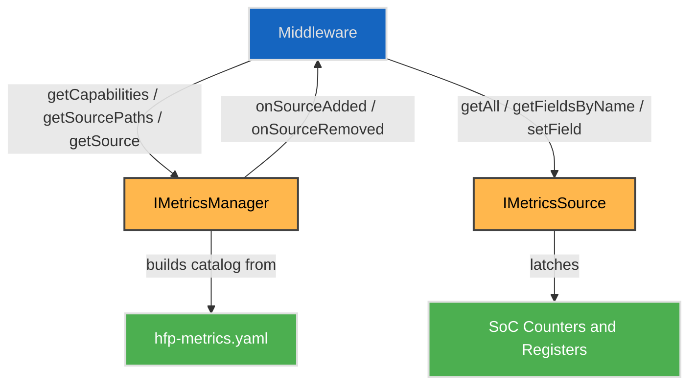
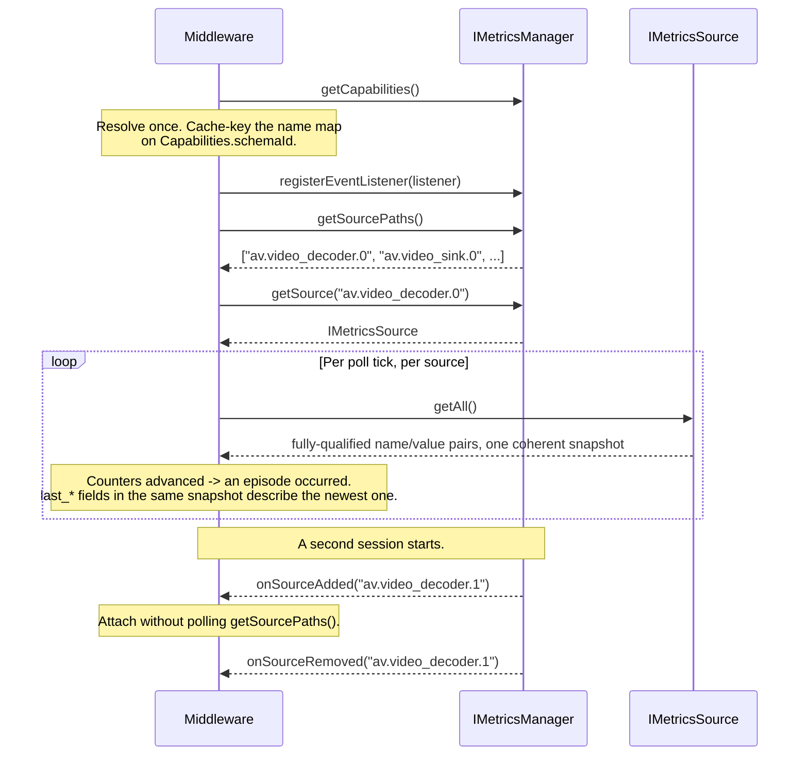

# Metrics

## Overview

The **Metrics HAL** service carries named numeric values from whoever measures them to whoever consumes them. It is a **general device metrics interface, not an A/V one**: values are organised into **domains**, of which A/V playback is one. `cpu` and `memory` are domains a platform may add later without touching the `av` domain or this interface.

Playback-quality metrics are a certification requirement across streaming partners — frames dropped and repeated, decode errors, underflow episodes with durations, A/V-sync excursions — with defined freshness and atomicity. Each SoC exposes these ad-hoc today (debug procfs, per-element properties, or not at all), so middleware cannot read them portably and cannot meet the accuracy contracts the certifications state. This HAL is the single vendor pull transport for them.

Middleware is the only client. It polls each source at the declared cadence, caches, and fans out to its own consumers; the HAL is not called per consumer.

---

## References

!!! info References
    |||
    |-|-|
    |**Interface Definition**|[metrics/current](https://github.com/rdkcentral/rdk-halif-aidl/tree/main/metrics/current)|
    |**Interface Version**|`current`|
    | **API Documentation** | *TBD - Doxygen* |
    |**HAL Interface Type**|[AIDL and Binder](../introduction/aidl_and_binder.md)|
    |**VTS Tests**| TBC |
    |**Reference Implementation - vComponent**|**TBD**|

---

## Related Pages

!!! tip "Related Pages"
    - [HAL Interface Overview](../key_concepts/hal/hal_interfaces.md)
    - [HAL Feature Profile](../key_concepts/hal/hal_feature_profiles.md)
    - [Video Decoder](../videodecoder/video_decoder.md)
    - [Video Sink](../videosink/video_sink.md)
    - [Audio Decoder](../audiodecoder/audio_decoder.md)
    - [Audio Sink](../audiosink/audio_sink.md)
    - [AV Clock](../avclock/av_clock.md)

---

## Versioning

| Version | Notes |
|---|---|
| `0.1.0.0` | Initial baseline. |

---

## Functional Overview

The Metrics HAL is responsible for:

- Publishing a **catalog** of every domain, element and field the product serves, with a schema identity a consumer can cache-key against.
- Enumerating the **sources** that are live now, and reporting them appearing and disappearing.
- Serving a **coherent snapshot** of every value a source holds, at a declared freshness.
- Serving the **most recent occurrence** of each episodic condition — underflow, decode error, first frame — as ordinary fields alongside the counter that totals them.
- Accepting writes to the fields declared writable: configuration, tunables and test injection.

Three properties shape the interface:

- **Every name is a declared string.** There are no key enums, no compiled-in metric list and no value union.
- **Every value is a signed 64-bit integer.** Counters use the positive range; a signed field such as `sync_offset_ms` uses the sign.
- **The metric set is not part of the ABI.** Adding a field, an element or a whole domain is a declaration change — no interface freeze, no version bump, no coordinated consumer rebuild. This is what lets the metric set track the partner certification set, which moves every year, without the HAL moving with it.

---

## HAL Field Dictionary

**HFD defines, HFP declares, the HAL carries.**

| | Artefact | States |
|---|---|---|
| **HFD** | `av-field-dictionary.yaml` | What every field *means* — unit, kind, provider, population rule. Authored. |
| **HFP** | `hfp-metrics.yaml` | Which of them *this product serves*, with what cadence and how many instances. |
| **HAL** | `com.rdk.hal.metrics` | Carries the values. Never enumerates them. |

A product may not declare a name the HFD does not define, and cannot redefine one it does — a declaration chooses whether to serve a field, not what it is.

The HFD is a declarative file rather than prose, because everything below is generated from it and a generator must not parse meaning out of a document edited by hand:

```text
av-field-dictionary.yaml             the HFD - authored
    │
    ├─→ docs/av_field_dictionary.md   human-readable reference
    ├─→ hfp-metrics.yaml              ids, descriptions
    └─→ docs/metrics_requirements.md  one requirement per field
```

`scripts/dictionary-ids.py --generate` writes all three. It is a pre-commit step for the engineer changing a definition, so the generated diff is reviewed by the person who caused it.

### Field contract id

Every field carries an id derived from the contract that governs how it may be read:

```text
id = first 8 bytes of SHA-256("<domain>.<element>.<field>|<unit>|<kind>")
```

Nothing allocates it, so there is no registry to consult and nothing to resolve when two people add a field on separate branches.

It buys a check no key can make alone. A key — a name or an ordinal — stays valid while the meaning underneath it changes: a product that declares `decode_latency_sum_us` but populates milliseconds still matches by name, and its consumer reports figures a thousand times wrong; a `current` sample reclassified as a `counter` gets differenced into nonsense. Because `unit` and `kind` are hashed, both change the id, so a consumer comparing against the id it was built with sees a hard mismatch rather than a wrong number.

The id is not compiled into the interface. It reaches a client at runtime on `MetricFieldInfo`, which is where it is useful:

1. **Resolve once.** `getFields()` on a source returns every field it serves — name, unit, kind and id. The client keeps the ones it understands and caches `name → id`.
2. **Read many.** `getAll()` returns `MetricKVPair{name, value}` and nothing else. The id does not ride the poll path, because it cannot change between resolutions and the client already holds it.
3. **Re-resolve on change.** `Capabilities.schemaId` changing is the signal that the declared set moved; the client resolves again and compares. An id that changed under a name it already knew means the meaning moved, and the client stops trusting that field rather than reporting it wrongly.

A client that wants a build-time assertion generates its own constants from this same dictionary. Putting them in the interface would make every vendor implementation carry a table only a client reads.

### No SoC-private namespace

A figure only one SoC can produce still gets an HFD entry. A private range would let a vendor ship a name no dictionary defines, and every consumer of it would grow per-SoC code — which is the cost the dictionary exists to avoid.

---

## Metric Naming

Every metric name is four segments, fully qualified. There is no short form.

```text
<domain>.<element>.<instance>.<field>

av.video_decoder.0.frames_decoded
av.video_sink.1.frames_dropped_late
av.clock.0.sync_offset_ms
cpu.core.3.utilisation_pct
```

| Segment | Meaning |
|---|---|
| **domain** | The subject area, and the unit of extension — a new domain touches nothing that exists |
| **element** | The thing within that domain which produces figures |
| **instance** | Which one. Always present, `0` where the element is a singleton |
| **field** | The metric |

The first three segments address a **source**; the fourth selects a field within it. `getSource("av.video_decoder.0")` returns one `IMetricsSource`, and one read of it is one coherent snapshot — the atomicity boundary is therefore visible in the name.

The path **is** the identity. There is no source-id parcelable, because modelling it a second time only creates a way for the two to disagree.

Names are by **subject, not producer**. Which block sources a figure differs per SoC, and for some fields it is middleware rather than the SoC at all, so a producer-shaped name would move between products for the same metric.

---

## Implementation Requirements

|#| Requirement | Comments |
|--|---|---|
| **HAL.METRICS.1** | Every metric name shall be the fully-qualified four-segment path `<domain>.<element>.<instance>.<field>`. | A bare field name is ambiguous once merged: `frames_decoded` from `av.video_decoder.0` and `av.audio_decoder.0` are the same string. |
| **HAL.METRICS.2** | Every metric value shall be a signed 64-bit integer. | AIDL `long`. Counters use the positive range and never the sign; a signed field such as `sync_offset_ms` uses it; a boolean-shaped field is 0 or 1. |
| **HAL.METRICS.3** | All values returned by one `getAll()` or `getFieldsByName()` call shall be sampled at a single instant. | An obligation on the implementation, not a property to be discovered — a source spanning two hardware blocks shall latch both. Paired counters must never yield an impossible ratio. |
| **HAL.METRICS.4** | Counters shall be cumulative since source creation and shall not reset on flush or seek. High-water fields shall be monotone non-decreasing. | Consumers compute deltas. |
| **HAL.METRICS.5** | A read shall reflect events no older than the element's declared `pollCadenceMs`, which shall not exceed 50 ms. | An element may declare tighter; never looser. Freshness is a partner-facing promise. |
| **HAL.METRICS.6** | A field the implementation cannot measure shall be left undeclared and omitted from reads. | It shall never be served as `0`. "Cannot measure it" and "measured zero" are different facts. |
| **HAL.METRICS.7** | Every field returned shall be declared in `hfp-metrics.yaml` with `unit`, `kind` and `writable`, and every name used shall exist in that domain's dictionary at the declared `dictionaryVersion`. | There is no SoC-private namespace: a figure only one SoC can produce still gets a dictionary entry, so no consumer grows per-SoC code. |
| **HAL.METRICS.8** | Every episodic condition shall be reported as a `counter` totalling occurrences, and where a consumer needs per-occurrence detail, `current` fields describing the most recent one. | A poll cannot recover an occurrence it did not sample, so the count is what makes the occurrence visible and the `last_*` fields are what make it diagnosable. |
| **HAL.METRICS.9** | Where a consumer requires exact PTS, a `*_pts_ms` field shall be within ±1 frame interval of the occurrence it describes. Where genuinely underivable it shall be left undeclared. | Never a sentinel value. |
| **HAL.METRICS.10** | `MetricElementInfo.instances` shall state how many of the element the hardware supports, and shall agree with the owning HAL's own feature profile. | The ceiling, not the live count. No source index `>= instances` shall ever appear. |
| **HAL.METRICS.11** | The implementation shall hold no per-caller state. | Every read is a snapshot of what the source holds now. Any consumer reads at any cadence without affecting another; fan-out is a middleware concern. |
| **HAL.METRICS.12** | Values shall be presented in canonical units and semantics regardless of the SoC's raw representation. | The provider is an adapter, not a passthrough. A transform normalises representation; it cannot manufacture information, so where a SoC reports only a combined figure the finer-grained fields stay undeclared rather than derived by guesswork. |
| **HAL.METRICS.13** | Every field returned shall carry the `id` its `<domain>.<element>.<field>`, `unit` and `kind` hash to. | Nothing allocates it, so it needs no registry. A product that serves a name in the wrong unit, or with the wrong kind, becomes a hard mismatch at the consumer rather than a silently wrong number. |

---

## Interface Definitions

| Interface Definition File | Description |
|---|---|
| `IMetricsManager.aidl` | Metrics Manager HAL interface — catalog and live source enumeration. |
| `IMetricsSource.aidl` | Metrics HAL interface for a single source (`<domain>.<element>.<instance>`). |
| `IMetricsManagerEventListener.aidl` | Listener callbacks to clients from the `IMetricsManager` for sources appearing and disappearing. |
| `Capabilities.aidl` | The catalog — every domain this product serves, with the schema identity. |
| `MetricDomainInfo.aidl` | One domain and its elements, with the dictionary revision it was written against. |
| `MetricElementInfo.aidl` | One element — its fields, instance count and cadence. |
| `MetricFieldInfo.aidl` | One declared field — name, unit, kind and writability. |
| `MetricKVPair.aidl` | One metric value, keyed by its fully-qualified name. |

---

## Initialization

The [systemd](../vsi/systemd/current/systemd.md) `hal-metrics_manager.service` unit file is provided by the vendor layer to start the service, and should include [Wants](https://www.freedesktop.org/software/systemd/man/latest/systemd.unit.html#Wants=) or [Requires](https://www.freedesktop.org/software/systemd/man/latest/systemd.unit.html#Requires=) directives to start any platform driver services it depends upon.

At startup:

1. The service process is launched by systemd.
2. The `IMetricsManager` implementation registers itself with the AIDL Service Manager under the service name `MetricsManager` (matching `IMetricsManager.serviceName`).
3. The implementation builds its catalog from `hfp-metrics.yaml` and derives `Capabilities.schemaId` from it.

Once registered, the service remains available for the lifetime of the system. Sources come and go beneath it as the elements they measure are created and destroyed.

---

## Product Customization

The metric set a product serves is **declared data**, not code. `hfp-metrics.yaml`, validated by `hfp-metrics-schema.yaml`, declares per element: its fields, `instances` and `pollCadenceMs`. `getCapabilities()` returns the runtime truth built from that declaration.

Two conventions to follow when filling one in:

- **Declare the whole dictionary and comment out what you cannot serve**, one line each, with `# NOT SUPPORTED — <reason>` on the same line. The file then reads as a checklist against the dictionary, so a reviewer sees what the SoC does not do rather than having to notice something missing.
- **`instances` is the ceiling.** It makes capability checkable before the product boots, lets a test assert that no source index `>= instances` ever appears, and gives CI a cross-check against the owning HAL's own feature profile. The live set comes from `getSourcePaths()`, because it is dynamic — a picture-in-picture decoder exists only while the second session does.

---

## System Context



- **Middleware**: the single client. It polls, caches, and fans out to its own consumers.
- **IMetricsManager**: the catalog and the live source registry.
- **IMetricsSource**: one `<domain>.<element>.<instance>`, and the atomicity boundary for a read.
- **hfp-metrics.yaml**: the vendor declaration the catalog is built from.
- **SoC counters and registers**: where the figures come from.

---

## Resource Management

Sources are discovered, not opened. `getSourcePaths()` returns those live now; `IMetricsManagerEventListener` reports them appearing and disappearing, so a client attaches at source start rather than polling.

Reading a source acquires nothing and blocks nothing — there is no open, no controller, and no single-writer ownership, because a metrics read is side-effect free. `setField()` is the exception and applies only to fields declared `writable` (configuration, tunables and test injection).

A client that exits leaves no state behind to clean up; listener registrations are dropped when the binder link dies.

---

## Operation and Data Flow

1. **Resolve the catalog once.** `getCapabilities()` returns every domain, element and field the product serves. A consumer keeps the names it understands, ignores the rest, and cache-keys its resolved name map on `Capabilities.schemaId` — re-reading only when that value changes.
2. **Attach to the live sources.** `getSourcePaths()` gives those live now, and `registerEventListener()` on the manager reports later arrivals and departures.
3. **Poll each source.** `getAll()` returns every declared field of that source under one coherent snapshot; `getFieldsByName()` reads a subset under the same guarantee. Unknown names are omitted rather than raising an error, so a newer consumer degrades cleanly on an older product.
4. **Compute deltas.** Counters are cumulative since source creation, so rates and episode counts are the consumer's subtraction. A counter that advanced between two polls says an episode occurred; the matching `last_*` fields describe the most recent one.

`getField()` exists for diagnostics and one-off reads. It is not the poll path — a per-field loop gives up the single-snapshot guarantee that makes paired counters comparable.

---

## Episodic Conditions

Underflows, decode errors and first-frame timing are episodic — they happen at an instant rather than describing a level. They are reported as ordinary fields, in two parts:

| Part | Kind | Answers |
|---|---|---|
| `underflowed`, `decode_errors`, `freeze_event_count` | `counter` | How many have happened |
| `last_underflow_duration_ms`, `last_decode_error_pts_ms`, `last_decode_error_reason` | `current` | What the most recent one was |

A counter that advanced between two polls is what makes the occurrence visible; the `last_*` fields are what make it diagnosable. Both arrive in the same `getAll()` snapshot as every other field, so an occurrence and the counters around it are always mutually consistent.

**What this trades.** Several occurrences within one poll interval advance the counter by several and leave `last_*` describing only the newest. Rates and totals are exact; the intermediate occurrences of a burst are not individually described. This is deliberate — it removes per-source retention, sequence numbering, cursor state and overwrite accounting from every vendor implementation, and no consumer requirement asks for the middle of a burst.

`last_decode_error_reason` is the closed classification a consumer acts on; `last_decode_error_vendor_code` is the SoC's own value for the same fault, carried through uninterpreted. A vendor supplies both — the first makes the fault comparable across platforms, the second makes it debuggable on this one.

A PTS the SoC cannot derive leaves the field **undeclared**, never served as `-1`. "No PTS available" and "the PTS is minus one" must not be the same value on the wire.

---

## Platform Capabilities

`getCapabilities()` returns the catalog:

```aidl
parcelable Capabilities {
    String schemaId;
    MetricDomainInfo[] domains;
}
```

- `schemaId` is an opaque identity of this product's declared set — stable while the declaration is unchanged, different the moment anything in it changes. A bug report needs only this value to pin exactly what the device was serving.
- `domains` carries, per domain, the dictionary revision it was written against and its elements. Each element carries its fields, `instances` and `pollCadenceMs`.

### Example hfp-metrics.yaml

```yaml
metrics:
  interfaceVersion: "0.1.0.0"
  schemaVersion: "0.1.0"
  domains:
    - domain: av
      dictionaryVersion: "1.1"
      elements:
        - element: video_decoder
          instances: 2            # ceiling - must agree with hfp-videodecoder.yaml
          pollCadenceMs: 20
          fields:

            # frames_decoded: Compressed frames the decoder has decoded and emitted at its
            #                 output (post-decode, pre-sink). +1 per emitted frame. Counted
            #                 from instance creation; never reset on flush/seek.
            - { name: frames_decoded, unit: frames, kind: counter, id: 0x63c81c7efbe7e743 }

          # - { name: frames_corrupted, unit: frames, kind: counter }   # NOT SUPPORTED - no
          #                                                             # per-frame integrity
          #                                                             # signal on this SoC
```

Descriptions and ids are generated by `scripts/dictionary-ids.py --sync` from the field dictionary at the pinned `dictionaryVersion`; neither is hand-edited. A product that cannot serve a field comments the entry out in place with a reason on the same line, so the file reads as a checklist against the dictionary rather than going silent.

---

## Error Handling

| Condition | Behaviour |
|---|---|
| Path not live | `getSource()` returns `null`. |
| Unknown name in `getFieldsByName()` | Omitted from the result, so a newer consumer degrades cleanly on an older product. |
| Unknown name in `getField()` | Returns `false`. |
| `setField()` on a read-only field | `EX_UNSUPPORTED_OPERATION`. |
| `setField()` on an undeclared name | `EX_ILLEGAL_ARGUMENT`. |
| Field the product cannot measure | Undeclared, and omitted from every read. Never served as `0`. |
| Consumer polls slower than episodes occur | Counters stay exact; `last_*` fields describe the newest occurrence only. Rates and totals are unaffected. |

---

## Metrics Collection Sequence


