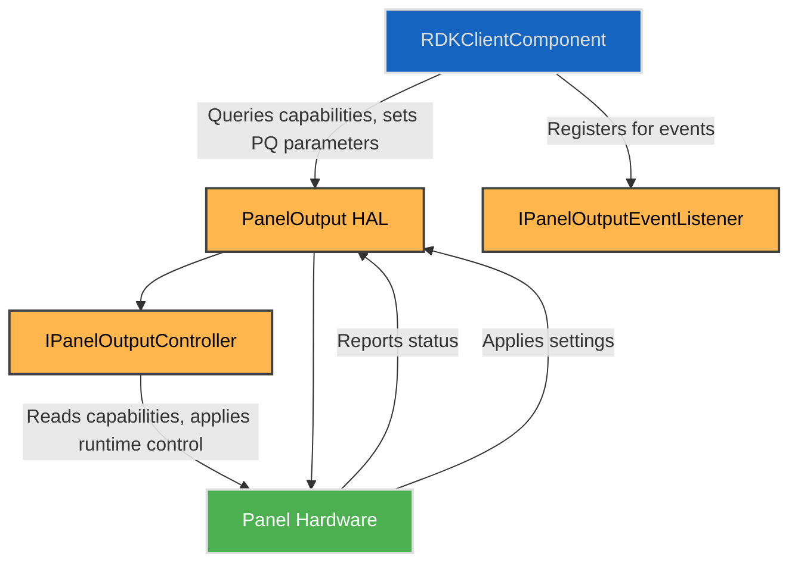

# Panel HAL Interface

## Overview

The Panel HAL provides a standardised interface to control and configure the display panel hardware on RDK platforms. It abstracts platform-specific display functions including resolution, panel type, picture quality parameters, white balance calibration, local dimming, and dynamic runtime controls such as picture modes, refresh rate management, calibration mode, and display fading.

This HAL enables higher-level components to dynamically adjust video output parameters and observe runtime panel behaviour through event callbacks.

To declare the static feature set and ensure alignment between implementation and testing, each platform must provide a **HAL Feature Profile (HFP)** YAML file. This machine-readable profile specifies the supported capabilities of the Panel HAL implementation, including available picture modes, PQ parameters, dynamic ranges, supported refresh rates, and supported AV sources. It is essential for test suites, middleware negotiation, and runtime validation.

---

## References

!!! info "References"
    |||
    |-|-|
    |**Interface Definition**|[panel/current](https://github.com/rdkcentral/rdk-halif-aidl/tree/main/panel/current)|
    |**Interface Version**|`current`|
    |**HAL Feature Profile**|[`hfp-panel.yaml`](https://github.com/rdkcentral/rdk-halif-aidl/blob/develop/panel/current/hfp-panel.yaml) – [Learn more](../key_concepts/hal/hal_feature_profiles.md)|
    |**HAL Interface Type**|[AIDL and Binder](../introduction/aidl_and_binder.md)|
    |**Initialization Unit**|[systemd](../vsi/systemd/current/systemd.md) – **hal-panel.service**|

---

## Related Pages

!!! tip "Related Pages"
    * [HAL Feature Profile](../key_concepts/hal/hal_feature_profiles.md)
    * [HAL Interface Overview](../key_concepts/hal/hal_interfaces.md)

---

## Functional Overview

The Panel HAL manages both static capabilities and dynamic runtime control of the display panel. It exposes:

* Panel hardware capabilities including resolution, physical size, panel type (LCD, OLED, QLED, Mini-LED), supported picture quality (PQ) parameters, refresh rates, picture modes, dynamic ranges, and AV sources.
* Picture quality configuration, including brightness, contrast, saturation, hue, gamma, local dimming, and noise reduction.
* White balance calibration interfaces for 2-point and multi-point adjustments.
* Dynamic control over panel enable/disable, picture modes, frame rate matching, calibration mode, and display fading.
* Event callbacks for real-time updates on picture mode, PQ parameter, video source, dynamic range, resolution, frame rate, and refresh rate changes.

The corresponding [`hfp-panel.yaml`](https://github.com/rdkcentral/rdk-halif-aidl/tree/develop/panel/current/hfp-panel.yaml) file includes structured declarations for:

* `panelType`, `pixelWidth`, `heightCm`, etc. (from `Capabilities.aidl`, returned via `IPanelOutputController.getCapabilities()`)
* `supportedPQParameters` (from `PQParameter.aidl`)
* `pqParameterCapabilities` (from `PQParameterCapabilities.aidl`)
* `pictureModeCapabilities`, `supportedDynamicRanges`, and `supportedAVSources` (from `Capabilities.aidl` and `hfp-panel.yaml`)

---

## Implementation Requirements

| #               | Requirement                                                                                                                                    | Comments                                      |
| --------------- | ---------------------------------------------------------------------------------------------------------------------------------------------- | --------------------------------------------- |
| **HAL.PANEL.1** | The service shall expose accurate static capabilities including panel resolution, physical dimensions, and supported PQ parameters.            | Enables adaptive client configurations        |
| **HAL.PANEL.2** | The service shall support setting and querying of picture quality parameters per picture mode, AV source, and dynamic range format.            | Supports granular PQ control                  |
| **HAL.PANEL.3** | The service shall allow enabling/disabling panel output and backlight with no side effects.                                                    |                                               |
| **HAL.PANEL.4** | The service shall provide asynchronous event callbacks for picture mode, PQ parameter, video source, dynamic range, frame rate, resolution, and refresh rate changes. | Ensures responsive UI/middleware updates      |
| **HAL.PANEL.5** | The service shall support frame rate matching with panel refresh rate adjustments.                                                             | Enables smooth video playback synchronisation |
| **HAL.PANEL.6** | The service shall support calibration mode, white balance, and display fading through the runtime controller.                                  | Supports panel tuning and diagnostics         |
| **HAL.PANEL.7** | The service shall expose current capabilities through the controller interface and align runtime queries with HFP declarations.                 | Keeps implementation and HFP in sync          |

---

## Interface Definitions

| AIDL File                           | Description                                                  |
| ----------------------------------- | ------------------------------------------------------------ |
| `Capabilities.aidl`                   | Defines panel capabilities and supported picture modes       |
| `IPanelOutput.aidl`                   | Singleton entry point for opening and closing the panel      |
| `IPanelOutputController.aidl`         | Exclusive control interface for runtime panel operations     |
| `IPanelOutputControllerListener.aidl` | Controller lifecycle and primary control callbacks           |
| `IPanelOutputEventListener.aidl`      | Passive event listener callbacks for runtime panel changes   |
| `PQParameter.aidl`                    | Enumeration of supported picture quality parameters          |
| `PQParameterCapabilities.aidl`        | Capabilities per PQ parameter by picture mode and dynamic range     |
| `PQParameterConfiguration.aidl`       | Configuration value of PQ parameter for a mode/source/dynamic range |
| `PanelType.aidl`                      | Enumeration of panel types (LCD, OLED, etc.)                 |
| `PictureModeConfiguration.aidl`       | Picture mode, dynamic range, and AV source config             |
| `State.aidl`                          | Panel controller lifecycle state enumeration                 |
| `TwoPointWB.aidl`                     | Two-point white balance calibration settings                 |
| `WhiteBalance2PointSettings.aidl`     | 2-point white balance calibration settings                   |
| `WhiteBalanceMultiPointSettings.aidl` | Multi-point white balance calibration arrays                 |

---

## Initialization

The Panel HAL service is initialised early in the device boot process, registering itself with the system service manager under the name `"PanelOutput"`. The singleton `IPanelOutput` interface is used to open and close the exclusive controller, while `IPanelOutputController` exposes the runtime control operations and `getCapabilities()`. The event listener interfaces allow clients to subscribe for asynchronous updates, with `IPanelOutputControllerListener` used by the primary controller client and `IPanelOutputEventListener` used by passive observers.

---

## Product Customization

* `Capabilities` parcelable exposes physical dimensions, panel type, supported PQ parameters, refresh rates, supported picture modes, supported dynamic ranges, and supported AV sources.
* Supports multiple picture modes, dynamic ranges, and AV sources, allowing flexible client-specific configurations.
* Platforms may expose multiple simultaneous picture modes or limit to a single active mode depending on hardware capability.

---

## System Context

---

## Resource Management

* Clients acquire the singleton service handle via binder connection to `PanelOutput`, then call `open()` to obtain the exclusive controller.
* Runtime control methods such as `start()`, `stop()`, `setEnabled()`, `setPictureModes()`, `setPQParameters()`, and white-balance methods are issued through `IPanelOutputController`.
* Passive observers register `IPanelOutputEventListener` to receive video source, dynamic range, frame rate, resolution, and refresh-rate notifications.
* Cleanup occurs on client disconnect, with the controller implicitly released by the HAL.

---

## Operation and Data Flow

* Client queries `IPanelOutputController.getCapabilities()` for supported picture modes, PQ parameters, refresh rates, and runtime limits.
* Picture mode configurations and PQ parameters are set via `setPictureModes()` and `setPQParameters()` after `start()` succeeds.
* The panel output enable state controls display and backlight through the controller.
* Frame rate matching adjusts panel refresh rate dynamically to match video content.
* White balance, calibration mode, and display fading are adjusted through the controller.

---

## Modes of Operation

* Runtime picture modes configurable by client with dynamic range and AV source scoping.
* Frame rate matching mode enabled/disabled by client.
* Calibration mode is available on the controller for PQ pipeline validation workflows.

---

## Event Handling

* `IPanelOutputControllerListener` provides controller lifecycle and control-linked callbacks:

  * `onPictureModeChanged`
  * `onPQParameterChanged`
  * `onStateChanged`
* `IPanelOutputEventListener` provides passive runtime observation callbacks:

  * `onVideoSourceChanged`
  * `onDynamicRangeChanged`
  * `onVideoFrameRateChanged`
  * `onVideoResolutionChanged`
  * `onRefreshRateChanged`

---

## State Machine / Lifecycle

* Typical states: `STOPPED`, `STARTING`, `STARTED`, `STOPPING`, `ERROR`
* Transitions triggered via `start()` and `stop()` on `IPanelOutputController`
* Picture modes and PQ parameters are set after the controller has been started successfully
* `IPanelOutput.close()` releases the controller from `STOPPED` or `ERROR`

---

## Data Format / Protocol Support

| Format        | Use Case                | Support Level |
| ------------- | ----------------------- | ------------- |
| Picture Modes | Video display presets   | Mandatory     |
| PQ Parameters | Picture quality control | Mandatory     |
| White Balance | Color calibration       | Mandatory     |

---

## Platform Capabilities

* Supports a range of panel types: LCD, OLED, QLED, Mini LED.
* Supports multiple refresh rates and frame rate matching.
* Supports advanced PQ parameters including AI PQ engine and noise reduction.
* Supports display fading and calibration mode on the runtime controller.

---

## HAL Feature Profile Integration

Each platform must include a [hfp-panel.yaml](https://github.com/rdkcentral/rdk-halif-aidl/tree/develop/panel/current/hfp-panel.yaml) to define the platform-specific implementation of this HAL. It includes:

* Static capabilities such as panel dimensions, panel type, refresh rates, supported AV sources, dynamic ranges, PQ parameters, and picture modes.
* Lists of supported PQ parameters and picture modes.
* Capabilities of each PQ parameter per picture mode, AV source, and dynamic range.
* Declared as structured sections aligned with the AIDL interfaces and consumed by the controller's `getCapabilities()`.

These files are machine-readable and used for:

* Platform validation via test automation.
* Runtime feature gating in middleware.
* Reference values for functions like `getCapabilities()`.

> See the [HAL Feature Profile documentation](../key_concepts/hal/hal_feature_profiles.md) for full details and schema format.

