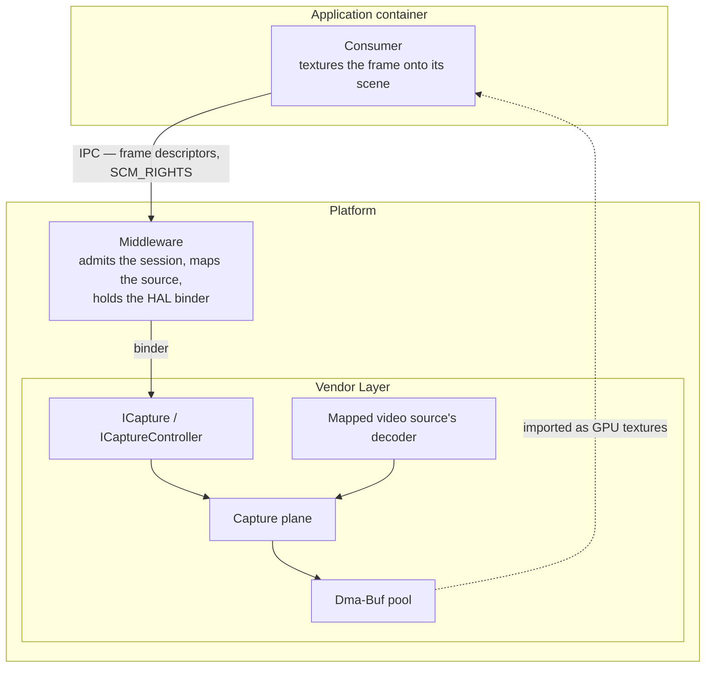
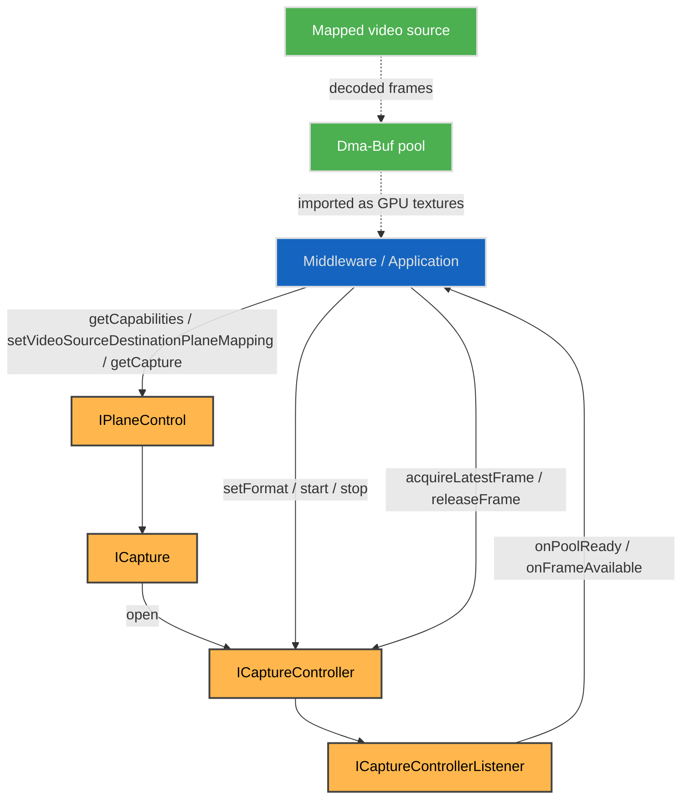
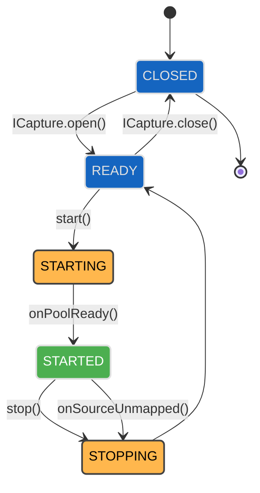
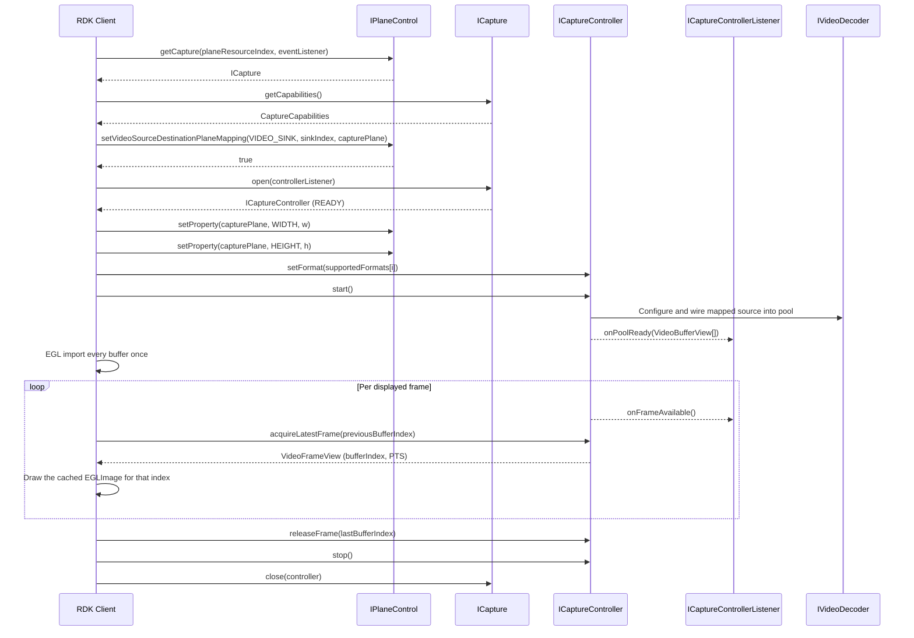
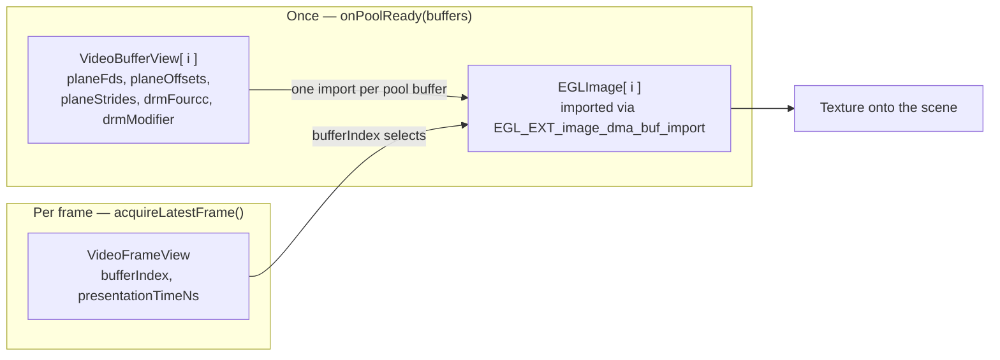

# Decoded Frame Capture

A capture plane is a plane whose destination is the client's texture rather than the display. This page is the contract for capturing a decoded video source into Dma-Buf buffers a client imports as GPU textures.

## References

!!! info References
    |||
    |-|-|
    |**Interface Definition**|[planecontrol/current/com/rdk/hal/planecontrol/capture](https://github.com/rdkcentral/rdk-halif-aidl/tree/main/planecontrol/current/com/rdk/hal/planecontrol/capture)|
    |**Interface Version**|`current`|
    |**Package**|`com.rdk.hal.planecontrol.capture`|
    | **API Documentation** | *TBD - Doxygen* |
    |**HAL Interface Type**|[AIDL and Binder](../../introduction/aidl_and_binder.md)|
    |**VTS Tests**| [https://github.com/rdkcentral/rdk-halif-binder-test-planecontrol](https://github.com/rdkcentral/rdk-halif-binder-test-planecontrol) |

## Related Pages

!!! tip "Related Pages"
    - [Plane Control](../plane_control.md)
    - [Graphics Frame Providers](../graphics/graphics_interface.md)
    - [Video Decoder](../../videodecoder/video_decoder.md)
    - [Video Sink](../../videosink/video_sink.md)

## Functionality

A capture plane is a plane whose destination is the client's texture rather than the display. It routes a mapped video source's decoded frames into a pool of Dma-Buf buffers that the client imports as GPU textures. Because that is a routing decision about where a source's frames go, a capture destination is discovered, mapped and addressed exactly as a display plane is — `IPlaneControl.getCapabilities()` lists it with `type` of `CAPTURE`, `setVideoSourceDestinationPlaneMapping()` chooses its source, and `IPlaneControl.getCapture()` returns its capture interface.

**The mapping is the binding.** A source mapped to a capture plane is captured; the source mapped there is the source the session delivers. A source is mapped to at most one plane at a time, which is what limits a decoder to a single capture session. Because the decoder is named in exactly one place, there is no second place for the two to disagree.

The `IVideoDecoder` contract is unchanged — the decoder does not know where its output goes, and nothing is set on it to arrange capture.

A capture session is configured in two places and neither is new: the frame size is a plane property, set through `IPlaneControl` the way any plane's size is, and the pixel format and memory layout are chosen with one `ICaptureController.setFormat()` call. Pool depth is not configured at all — the platform calibrates it. The vendor layer configures whatever the mapped source's decoder requires to deliver the result, over whatever internal path it has.

**What a capture plane can deliver is declared in `CaptureCapabilities`.** `supportedCodecs` lists the codecs it can capture, `supportedFormats` the pixel-format and memory-layout pairs, `maxFrameWidth` and `maxFrameHeight` the frame sizes, and `stallsWhenPoolExhausted` what happens when every buffer is held. A product that can decode to texture declares a capture plane, and that declaration is the whole of what is on offer.

**The client makes one decision.** It picks a row of `supportedFormats` and passes it to `ICaptureController.setFormat()`. Everything else is either calibrated by the platform and declared, or is a plane property set the way any plane's is.

A decoder opened for a codec outside `supportedCodecs` decodes and displays normally — it just cannot feed a capture plane, and `start()` fails with `CaptureErrorCode.CODEC_NOT_CAPTURABLE` if one is mapped to it.

### Where this interface sits

The consumer of a decoded frame is the code that textures it onto its own scene, and it typically runs in an application container with no binder to this HAL. The middleware holds the binder, configures the session and carries frames to the consumer over its own IPC.



**This interface does not know which of them is its client.** The HAL contract is the same whether the middleware relays frames onward or a consumer binds `ICapture` itself; only the holder of the per-frame binding changes, and that decision sits above this repository. Binding directly halves the per-frame IPC hops, and each hop costs an `SCM_RIGHTS` pass of a Dma-Buf descriptor — but it requires a binder into the container the consumer runs in, which is a platform packaging decision rather than an interface one. It also has to answer which decoder instance a consumer may capture from, and how a binding the middleware does not hold is invalidated when the decoder is reclaimed under contention.

## Planes, buffers and image planes

The word **plane** means two unrelated things on this page, and both are load-bearing.

**A plane is a hardware surface.** What `IPlaneControl` manages. A product has a handful — video planes, graphics planes, and a capture plane — identified by `planeIndex` and typed by `PlaneType`. This is the thing a source is mapped onto.

**An image plane is a colour component of one frame.** `NV12` stores a frame as two separate blocks of bytes: luma (Y), and interleaved chroma (UV). DRM and EGL both call these planes, which is where `planeFds[]`, `planeOffsets[]` and `planeStrides[]` take their name — element N feeds `EGL_DMA_BUF_PLANE<N>_FD_EXT`. The name is inherited from the import API rather than chosen here.

They have nothing to do with each other. A capture plane is one hardware surface; the frames it delivers each have one or more image planes inside them.

### How it nests

```text
capture plane            planeIndex = 3       one hardware surface
 └─ pool                 N buffers            allocated at start()
     ├─ buffer           bufferIndex = 0      one frame lands in one buffer
     │   ├─ image plane 0 (Y)    fd, offset, stride, length
     │   └─ image plane 1 (UV)   fd, offset, stride, length
     ├─ buffer           bufferIndex = 1
     ├─ buffer           bufferIndex = 2
     └─ buffer           bufferIndex = 3
```

| Identifier | Identifies | Where it appears |
|---|---|---|
| `planeIndex` | the hardware surface | `PlaneCapabilities`, `IPlaneControl.getCapture()` |
| `bufferIndex` | which pool buffer holds this frame | `VideoFrameView`, `releaseFrame()` |
| `(fd, offset)` | where one image plane's bytes live | `planeFds[N]`, `planeOffsets[N]` |

### Concretely

For 1920×1080 `NV12` with a pool of four, `onPoolReady()` delivers **four** `VideoBufferView`s. Buffer 0 might be:

```text
bufferIndex   = 0
planeFds      = [ 7,       7       ]   Y and UV in the same Dma-Buf
planeOffsets  = [ 0,       2088960 ]   UV starts after Y, plus alignment padding
planeStrides  = [ 1920,    1920    ]
planeLengths  = [ 2073600, 1036800 ]
```

or, where the implementation allocates each image plane separately:

```text
planeFds      = [ 7,       8       ]   different Dma-Bufs
planeOffsets  = [ 0,       0       ]
```

Both are valid, and a client that imports from `planeFds` and `planeOffsets` serves either without knowing which it was handed.

Note that `2088960` is **not** `1920 × 1080`. The implementation padded the chroma start for alignment, which is why the offset is stated rather than computed — deriving it from the frame size would land 15360 bytes short here.

Per frame, `acquireLatestFrame()` returns only a `bufferIndex` and a timestamp. The client resolves the frame against what it imported at `onPoolReady()`; no descriptor crosses the binder after that.


## Implementation Requirements

|#|Requirement | Comments|
|-|------------|---------|
| **HAL.PLANECONTROL.CAPTURE.1** | Shall provide a decoded frame capture API via `ICapture` for plane resources of type `PlaneType.CAPTURE`, delivering the frames of the video source mapped to that plane into a Dma-Buf buffer pool.| The source is selected with `setVideoSourceDestinationPlaneMapping()`, exactly as it is for a display plane. |
| **HAL.PLANECONTROL.CAPTURE.2** | Shall declare in `CaptureCapabilities.supportedCodecs` the codecs whose decoded frames a capture plane can deliver, .| The list is what the plane can capture, not what a product must offer. A decoder opened for a codec outside it decodes and displays normally; it just cannot feed this plane. A decoder opened for any other codec still decodes and displays normally. |
| **HAL.PLANECONTROL.CAPTURE.3** | Shall deliver captured frames in the pixel format, memory layout and size the session was configured with, as Dma-Bufs whose per-plane file descriptors, offsets and strides address the actual buffer layout and import directly through `EGL_EXT_image_dma_buf_import` without translation.| The vendor layer configures whatever the bound decoder requires to deliver them, over its own internal path. |
| **HAL.PLANECONTROL.CAPTURE.4** | Shall deliver the addressing of every pool buffer once at `ICaptureControllerListener.onPoolReady()`, and thereafter identify each frame by buffer index and presentation time alone.| A buffer's address and shape do not change during a session. Re-sending file descriptors at frame rate would move them across the binder boundary to repeat what was already said. |
| **HAL.PLANECONTROL.CAPTURE.5** | Shall reject a `FormatLayout` outside `CaptureCapabilities.supportedFormats` at `setFormat()`, and shall fail `ICaptureController.start()` with a `CaptureErrorCode` when the pool cannot be reserved or the mapped source is decoding a codec outside `CaptureCapabilities.supportedCodecs`, in no case falling back to plane output.| The failure belongs where it is still a configuration error, not a stream of wrong pixels. |
| **HAL.PLANECONTROL.CAPTURE.6** | Shall deliver captured frames at the resolution the stream decodes to and in its source colorimetry, applying no scaling, rotation, crop, colour conversion, tone-mapping or gamma adjustment.| Shape and colour belong to the consumer, which applies them per frame and may change them on any frame. A transform applied here would have to be undone, and one the consumer cannot undo makes the frame unusable. On a plane declaring `CaptureCapabilities.resize` false, the plane's `Property.WIDTH` and `HEIGHT` must equal the decoded resolution. |
| **HAL.PLANECONTROL.CAPTURE.7** | Shall drop no more than one frame per 15 seconds of capture, at every resolution from 144p to 2160p, while the client acquires and releases at the presentation cadence.| The capture path is not permitted to lose frames a display plane would have shown. A client that stops releasing is not covered by this — that case is `CaptureCapabilities.stallsWhenPoolExhausted`. |
| **HAL.PLANECONTROL.CAPTURE.8** | Shall carry each frame's presentation time unaltered in `VideoFrameView.presentationTimeNs`.| It is the frame's only timing reference. A captured frame goes to the client's scene rather than to a display plane, so the client presents it against the clock its audio path already runs on. |
| **HAL.PLANECONTROL.CAPTURE.9** | Shall allow decode to proceed at full rate independently of the rate at which the client acquires frames, and shall never re-deliver a frame already returned by `acquireLatestFrame()`.|
| **HAL.PLANECONTROL.CAPTURE.10** | Shall return from `acquireLatestFrame()` the frame due for presentation with audio latency and AV-sync correction already applied, dropping frames whose presentation time has passed and holding frames whose time has not yet come.| A client that draws each frame on receipt is then in sync without computing anything. |
| **HAL.PLANECONTROL.CAPTURE.11** | Shall release the buffer named in `acquireLatestFrame()`'s `releaseBufferIndex` before acquiring the next frame, so a client redrawing at frame rate makes one call per frame rather than two.| At 60 Hz the second round trip is pure overhead in the hot path. |

## Interface Definition

All of these are in `com.rdk.hal.planecontrol.capture`. The plane itself is described in [Plane Control](../plane_control.md).

|Interface Definition File | Description|
|--------------------------|------------|
| `ICapture.aidl` | Decoded frame capture interface for a video plane used as a capture destination.|
| `ICaptureController.aidl` | Capture session controller returned by `ICapture.open()`.|
| `ICaptureControllerListener.aidl` | Listener interface for buffer pool and frame callbacks from a capture session.|
| `ICaptureEventListener.aidl` | Listener interface for capture resource state and error callbacks.|
| `CaptureCapabilities.aidl` | Parcelable describing capture capabilities for a video plane.|
| `CaptureErrorCode.aidl` | Enum list of capture error codes.|
| `FormatLayout.aidl` | Parcelable pairing a DRM FOURCC with a memory layout valid for it.|
| `VideoBufferView.aidl` | Parcelable describing the Dma-Buf addressing of one capture pool buffer.|
| `VideoFrameView.aidl` | Parcelable identifying a single captured frame by buffer index and presentation time.|
| `State.aidl` | Enum list of capture resource lifecycle states.|

## Product Customization

A product declares its capture plane in `hfp-planecontrol.yaml` under `captureCapabilities`: the `supportedFormats` pairs, `supportedCodecs`, `maxFrameWidth` and `maxFrameHeight`, `stallsWhenPoolExhausted` and `resize`. Pool depth is not declared — the platform calibrates it and the client counts what `onPoolReady()` delivers. A product with no capture plane declares none, and `IPlaneControl.getCapabilities()` returns no plane of type `CAPTURE`.

## System Context

A capture plane is reached exactly as any plane is. `IPlaneControl` finds it, binds a source to it and hands out the controller; everything after that is the session.




## Resource Management


1. Open the capture resource:
Call `IPlaneControl.getCapabilities()` and find a plane resource of type `CAPTURE`, then `IPlaneControl.getCapture(planeResourceIndex, captureEventListener)`. A product with no capture plane does not support decode-to-texture.
2. Read what the plane can deliver:
Call `ICapture.getCapabilities()` for the capturable codecs, the supported pixel formats and modifiers, the maximum frame size and buffer count, and the behaviour when every buffer is locked.
3. Map the source to the capture plane:
Call `IPlaneControl.setVideoSourceDestinationPlaneMapping()` with the video sink feeding the decoder as `sourceType`/`sourceIndex` and the capture plane as `destinationPlaneIndex`. This is the binding, and it is the same call that routes a source to a display plane.
4. Open the session:
Call `ICapture.open(captureControllerListener)`. The resource transitions `CLOSED` → `READY`. It fails with `CaptureErrorCode.SOURCE_NOT_MAPPED` if no source is mapped to the plane.
5. Configure the session:
Call `ICaptureController.setFormat()` while in `READY` with one row of `CaptureCapabilities.supportedFormats`. There is no default — what a plane delivers is whatever it declares, so a format is selected before `start()`. Frame size is the plane's own `Property.WIDTH` and `HEIGHT`, set through `IPlaneControl` the way any plane's size is; where the plane declares `resize: false` they must equal what the mapped source decodes to. Pool depth is not a client choice and is not declared — the platform calibrates it from the throughput it can sustain, and the client sees how many buffers it got when `onPoolReady()` delivers them.
6. Start:
Call `ICaptureController.start()`. A format must have been selected first — there is no default pair, so a session that selected none fails here with `CaptureErrorCode.INVALID_CONFIGURATION`. The pool is reserved, the vendor layer configures the mapped source's decoder and wires it into the pool, the resource transitions `READY` → `STARTING` → `STARTED`, and `ICaptureControllerListener.onPoolReady()` delivers the pool addressing. The codec is checked here, because a decoder is opened for a codec independently of when it is mapped.
7. Pull frames:
Call `ICaptureController.acquireLatestFrame(releaseBufferIndex)`, passing the buffer just finished with — or `VideoFrameView.NO_BUFFER` on the first call. It returns the frame due for presentation, `null` rather than blocking when none is due, and never the same frame twice. `ICaptureControllerListener.onFrameAvailable()` is an optional wake-up; a client pulling at a known cadence can ignore it.
8. Release the last frame:
Call `ICaptureController.releaseFrame(bufferIndex)` when the client stops drawing while still holding a buffer. A client drawing continuously has already released through the previous step. The call is idempotent and tolerates unknown indices.

Release is keyed by index because the index is the buffer's identity. An index that names no buffer in the current pool is ignored, which is what makes a release arriving after a stop safe.
9. Stop and close:
Call `ICaptureController.stop()` to unwire the source and release the pool; the resource transitions `STARTED` → `STOPPING` → `READY`, reclaiming any buffer the client still holds, and can be started again. Then `ICapture.close(controller)` returns it to `CLOSED`. The source's decoder and its plane mapping are left as they are.

Unmapping the source while a session is running stops it and raises `ICaptureEventListener.onSourceUnmapped()`; mapping a source back makes the session startable again.

## Startup Order and Buffer Lifetime

### Session states



Blue states rest until the client acts on them, amber ones are passing through on their own, and green is the only state in which frames can be acquired.

`ICapture.getState()` reads the state at any time, and `ICaptureEventListener.onStateChanged()` reports every transition — which is how a client learns about the ones it did not ask for. Unmapping the source under a running session stops it; `ICaptureEventListener.onSystemError()` and `ICaptureControllerListener.onCaptureError()` report faults against the resource and the session respectively, each with a `CaptureErrorCode` and the vendor's own code.

`STARTING` is the gap between `start()` returning and the pool arriving: the session is not usable until `onPoolReady()` delivers the addressing, which is what moves it to `STARTED`.

### Buffer lifetime across teardown

A client holds its own duplicated file descriptors from `onPoolReady()` — binder duplicates them as they cross — and an imported image takes a further reference of its own. That is why a client may close a descriptor as soon as it has imported from it, and why the memory outlives `stop()`. A Dma-Buf stays alive while any reference to it does, so **the memory remains valid after `stop()` for as long as the client holds it** — there is no window in which it is freed under a GPU still sampling, and no copy is needed to guard against one. The client returns the memory to the platform by destroying its imported images and closing those descriptors.

What `stop()` does end is the *content* guarantee. A frame's pixels are fixed only while its buffer is Locked; once released — by `releaseFrame()`, by the next `acquireLatestFrame()`, or by `stop()` — the implementation may write into that buffer again. A client sampling beyond that point reads a frame being overwritten.

So a copy is needed in exactly one case: a client that wants a frame to outlive the period it holds the buffer — a screenshot, or handing it to an encoder — copies it while still holding it. Ordinary drawing never copies, which is the point of capturing to a texture at all.


A source and a capture session start independently, and either order is legal.

**Source decoding before the session starts.** Frames produced before `start()` are discarded — there is no pool to write them into. Starting capture may then require the vendor layer to reconfigure the decoder, and that reconfiguration can interrupt decode visibly for as long as it takes. Starting the session before the source begins decoding avoids both the discarded frames and the interruption.

**Session started before the source decodes.** The pool is reserved and idle, and `acquireLatestFrame()` returns `null` until frames arrive. Nothing is lost.

Shutdown is likewise legal in either order, and the pool outlives neither.

| What ends first | What happens |
|---|---|
| **The session** | `stop()` unwires the source and releases the pool and every Dma-Buf in it. The source's decoder keeps running and its plane mapping stands; the frames it produces are discarded again. |
| **The source** | The session is implicitly stopped, the pool and its Dma-Bufs are released, and `ICaptureEventListener.onSourceUnmapped()` is raised. The resource returns to `READY` and a new source mapped to the plane makes it startable again. |
| **The client process** | `stop()` and `close()` are called implicitly on its behalf, releasing the pool whether or not the client still held buffers. |

Buffers the client holds Locked at the moment of any of these are released with the rest of the pool. A client's imported EGLImages do not survive `stop()`: the buffer indices of a new session name new memory, and images cached against the old pool must be discarded when `onPoolReady()` delivers the new one.

All Dma-Bufs are released on `stop()` and on `close()`.

A format, modifier or frame size outside `CaptureCapabilities` fails at `ICaptureController.setProperty()`, while it is still a configuration error rather than a stream of wrong pixels. A pool the platform's video memory region cannot satisfy fails at `ICaptureController.start()` with `CaptureErrorCode.OUT_OF_MEMORY`, rather than being silently trimmed, and a mapped source decoding a codec outside `supportedCodecs` fails there with `CaptureErrorCode.CODEC_NOT_CAPTURABLE`. None of them falls back to plane output.



## A Capture Session End to End

The whole interface in one pass: find the plane, bind a source to it, agree the frame format, import the pool once, then loop. Error handling is elided to keep the shape visible.

```c++
// Find a capture plane. A product without one does not support decode-to-texture.
std::vector<PlaneCapabilities> allPlaneCapabilities;
planeControl->getCapabilities(&allPlaneCapabilities);

int32_t capturePlaneIndex = -1;
for (const PlaneCapabilities& planeCapabilities : allPlaneCapabilities) {
    if (planeCapabilities.type == PlaneType::CAPTURE) {
        capturePlaneIndex = planeCapabilities.planeIndex;
        break;
    }
}

// Open the capture resource and read what it can deliver.
sp<ICapture> captureResource;
planeControl->getCapture(capturePlaneIndex, captureEventListener, &captureResource);

CaptureCapabilities captureCapabilities;
captureResource->getCapabilities(&captureCapabilities);
// captureCapabilities.supportedCodecs   - what this plane can capture
// captureCapabilities.supportedFormats  - the {fourcc, modifier} pairs it can deliver
// captureCapabilities.maxFrameWidth     - the frame size ceiling
// captureCapabilities.resize            - whether a size other than the decoded one is allowed

// Bind the source. THIS is what makes the source captured - the same call that routes
// a source to a display plane. A source is mapped to at most one plane.
SourcePlaneMapping sourceToCapturePlane;
sourceToCapturePlane.sourceType = SourceType::VIDEO_SINK;
sourceToCapturePlane.sourceIndex = 0;
sourceToCapturePlane.destinationPlaneIndex = capturePlaneIndex;

bool mappingSucceeded = false;
planeControl->setVideoSourceDestinationPlaneMapping({sourceToCapturePlane}, &mappingSucceeded);

// Open a session. CLOSED -> READY.
sp<ICaptureController> captureController;
captureResource->open(captureControllerListener, &captureController);

// Configure while READY. The frame size is a plane property like any other.
bool propertySucceeded = false;
planeControl->setProperty(capturePlaneIndex, Property::WIDTH,
                          intPropertyValue(1920), &propertySucceeded);
planeControl->setProperty(capturePlaneIndex, Property::HEIGHT,
                          intPropertyValue(1080), &propertySucceeded);

// The one decision: pick a declared pair. LINEAR keeps CPU readback possible;
// a vendor-tiled layout may be faster where the GPU is the same vendor's.
bool formatSucceeded = false;
captureController->setFormat(selectPreferredFormat(captureCapabilities.supportedFormats),
                             &formatSucceeded);

// Start. READY -> STARTING -> STARTED, when onPoolReady() delivers the addressing.
captureController->start();
```

`VideoBufferView` carries `ParcelFileDescriptor`, which is move-only, and the callback receives them by const reference — so the array cannot simply be stored. A client duplicates the descriptors it intends to import from, which is also what keeps that memory alive independently of the session:

```c++
// One pool buffer, in a form the render thread can own.
struct CapturedPoolBuffer {
    int32_t          bufferIndex;
    int32_t          frameWidth;
    int32_t          frameHeight;
    int32_t          drmFourcc;
    int64_t          drmModifier;
    std::vector<int32_t> planeOffsets;
    std::vector<int32_t> planeStrides;
    std::vector<int>     planeFileDescriptors;   // duplicated; this thread owns them
};
```

The pool is delivered once, on a **binder thread** — `ICaptureControllerListener` is `oneway`, so the callback arrives on the client's binder pool, not on the thread that owns its GL context. An EGL import needs that context current, so the callback duplicates the descriptors and hands them over; the render thread imports each buffer once, and never again.

```c++
// ICaptureControllerListener - runs on a binder thread. No GL calls here.
::android::binder::Status onPoolReady(
        const std::vector<VideoBufferView>& poolBuffers) override {

    std::vector<CapturedPoolBuffer> capturedBuffers;
    for (const VideoBufferView& poolBuffer : poolBuffers) {
        CapturedPoolBuffer capturedBuffer{poolBuffer.bufferIndex,
                                          poolBuffer.width,
                                          poolBuffer.height,
                                          poolBuffer.drmFourcc,
                                          poolBuffer.drmModifier,
                                          poolBuffer.planeOffsets,
                                          poolBuffer.planeStrides,
                                          {}};
        for (const ::android::os::ParcelFileDescriptor& planeDescriptor : poolBuffer.planeFds) {
            capturedBuffer.planeFileDescriptors.push_back(::dup(planeDescriptor.get()));
        }
        capturedBuffers.push_back(std::move(capturedBuffer));
    }

    {
        std::lock_guard<std::mutex> lock(pendingPoolMutex);
        pendingPoolBuffers = std::move(capturedBuffers);
    }
    renderThread.wake();
    return ::android::binder::Status::ok();
}
```

On the render thread, with the context current — once, when the pool arrives:

```c++
void importCapturePoolAsTextures() {
    std::vector<CapturedPoolBuffer> capturedBuffers;
    {
        std::lock_guard<std::mutex> lock(pendingPoolMutex);
        capturedBuffers = std::move(pendingPoolBuffers);
    }

    for (const CapturedPoolBuffer& capturedBuffer : capturedBuffers) {
        // The per-plane arrays are the attribute list. Element N feeds
        // EGL_DMA_BUF_PLANE<N>_FD_EXT / _OFFSET_EXT / _PITCH_EXT; NV12 has two
        // planes, [Y, UV]. The modifier is split across a LO/HI pair per plane and
        // needs EGL_EXT_image_dma_buf_import_modifiers.
        const EGLint modifierLow  = (EGLint)(capturedBuffer.drmModifier & 0xFFFFFFFF);
        const EGLint modifierHigh = (EGLint)(capturedBuffer.drmModifier >> 32);

        EGLint imageAttributes[] = {
            EGL_WIDTH,                          capturedBuffer.frameWidth,
            EGL_HEIGHT,                         capturedBuffer.frameHeight,
            EGL_LINUX_DRM_FOURCC_EXT,           capturedBuffer.drmFourcc,

            EGL_DMA_BUF_PLANE0_FD_EXT,          capturedBuffer.planeFileDescriptors[0],
            EGL_DMA_BUF_PLANE0_OFFSET_EXT,      capturedBuffer.planeOffsets[0],
            EGL_DMA_BUF_PLANE0_PITCH_EXT,       capturedBuffer.planeStrides[0],
            EGL_DMA_BUF_PLANE0_MODIFIER_LO_EXT, modifierLow,
            EGL_DMA_BUF_PLANE0_MODIFIER_HI_EXT, modifierHigh,

            EGL_DMA_BUF_PLANE1_FD_EXT,          capturedBuffer.planeFileDescriptors[1],
            EGL_DMA_BUF_PLANE1_OFFSET_EXT,      capturedBuffer.planeOffsets[1],
            EGL_DMA_BUF_PLANE1_PITCH_EXT,       capturedBuffer.planeStrides[1],
            EGL_DMA_BUF_PLANE1_MODIFIER_LO_EXT, modifierLow,
            EGL_DMA_BUF_PLANE1_MODIFIER_HI_EXT, modifierHigh,

            EGL_NONE
        };

        EGLImageKHR eglImage = eglCreateImageKHR(eglDisplay, EGL_NO_CONTEXT,
                                                 EGL_LINUX_DMA_BUF_EXT, NULL,
                                                 imageAttributes);

        // KEY THE CACHE ON bufferIndex. Two buffers may share a descriptor and differ
        // only by offset, so a cache keyed on the descriptor collapses the pool onto
        // one entry and the picture silently freezes.
        eglImagesByBufferIndex[capturedBuffer.bufferIndex] = eglImage;
    }

    // Close the duplicates now the images hold their own references to the memory.
    for (const CapturedPoolBuffer& capturedBuffer : capturedBuffers) {
        for (int planeDescriptor : capturedBuffer.planeFileDescriptors) {
            ::close(planeDescriptor);
        }
    }
}
```

Then the draw loop. One call both releases the buffer just drawn and acquires the next, so a client drawing continuously never calls `releaseFrame()` at all:

```c++
int32_t heldBufferIndex = VideoFrameView::NO_BUFFER;   // nothing held on the first pass

while (isDrawing) {
    std::optional<VideoFrameView> capturedFrame;
    captureController->acquireLatestFrame(heldBufferIndex, &capturedFrame);

    if (!capturedFrame.has_value()) {
        continue;                       // none due yet - returns null, never blocks
    }

    // Resolve the frame against what was imported at onPoolReady().
    drawFrame(eglImagesByBufferIndex[capturedFrame->bufferIndex],
              capturedFrame->presentationTimeNs);

    heldBufferIndex = capturedFrame->bufferIndex;   // released by the next acquire
}

// Stop drawing while still holding one, and release it explicitly.
if (heldBufferIndex != VideoFrameView::NO_BUFFER) {
    captureController->releaseFrame(heldBufferIndex);
}

captureController->stop();              // unwires the source, frees the pool

bool closeSucceeded = false;
captureResource->close(captureController, &closeSucceeded);   // source and mapping untouched

// Destroying the images returns the memory to the platform.
for (const auto& [bufferIndex, eglImage] : eglImagesByBufferIndex) {
    eglDestroyImageKHR(eglDisplay, eglImage);
}
eglImagesByBufferIndex.clear();
```

The frame returned is the one due for presentation now, with AV-sync correction already applied, so a client that draws on receipt is in sync without computing anything from `presentationTimeNs`. It is carried for a client placing the frame on its own timeline.


## Pixel Format and Memory Layout

A captured frame is described by two values, and they answer different questions. Where those values sit relative to buffers and image planes is [above](#planes-buffers-and-image-planes).

| Value | Question it answers | Example |
|---|---|---|
| **FOURCC** | What are the pixels? | `NV12` — 8-bit 4:2:0, luma plane followed by interleaved chroma |
| **Modifier** | How are those bytes arranged in memory? | plain raster rows, or compressed blocks, or vendor tiles |

The same FOURCC under two different modifiers is the same picture in two different byte layouts. A consumer that does not understand the layout cannot read the frame, however well it understands the format.

Both are defined by the Linux kernel in `include/uapi/drm/drm_fourcc.h`. They are carried as plain integers rather than enums because the kernel owns those namespaces: new formats arrive with new kernel versions, and enumerating them in this interface would make every kernel addition an interface change to a value the HAL neither defines nor controls. The HAL client passes them to its EGL implementation without interpreting them.

### Modifiers are vendor-namespaced

A modifier is 64 bits, composed as `(vendor << 56) | value`. The top 8 bits are a registered vendor namespace and the remaining 56 bits mean whatever that vendor says they mean. The kernel registers a namespace per silicon vendor, so **most modifiers are specific to the hardware that defines them**.

Exactly one modifier is universal: `DRM_FORMAT_MOD_LINEAR`, which sits in the vendor-neutral namespace at value `0x0000000000000000` and describes plain raster rows.

A compressed or tiled layout is typically a *family* rather than a single value. Arm Frame Buffer Compression, for instance, is parameterised by superblock size (16×16, 32×8, 64×4) and by independent `YTR`, `SPLIT` and `SPARSE` flags, so two buffers can both be "AFBC" and carry different modifiers that a consumer must tell apart. That is why the declaration is a list of exact values rather than a list of layout names.

### Which one a plane delivers

`CaptureCapabilities.supportedFormats` declares the pairs a plane can deliver, and the client selects one with `setFormat()`. Paired, because a modifier is not valid with every format: most are vendor-namespaced tiling or compression layouts that apply to particular formats and bit depths, so two independent lists would offer combinations the plane cannot deliver.

That trade — bandwidth against portability — is settled per product rather than per session:

- **A GPU that understands the vendor's compressed layout** can take it directly. Compression can roughly halve the memory bandwidth of the capture path, which at 4K60 is often the difference between fitting in the platform's budget and not.
- **Anything that must touch the pixels** — CPU readback, a screenshot, an encoder, or a GPU from a different vendor — needs `DRM_FORMAT_MOD_LINEAR`, because no other layout is portably decodable.

A plane declares the pairs it can deliver and no more. A client that can handle none of them cannot capture from that plane, which is a fact about the product rather than a failure of the session.

The per-product declaration is `supportedFormats` under `captureCapabilities` in `hfp-planecontrol.yaml`.

## Error Handling

| Condition | Behaviour |
|---|---|
| No format selected before `start()` | `start()` fails with `CaptureErrorCode.INVALID_CONFIGURATION`. There is no default pair to fall back on. |
| A `FormatLayout` outside `supportedFormats` | `setFormat()` raises `EX_ILLEGAL_ARGUMENT`; the pair is rejected while it is still a configuration error. |
| Mapped source decoding a codec outside `supportedCodecs` | `start()` fails with `CODEC_NOT_CAPTURABLE`. The decoder still decodes and displays normally. |
| `resize` false and the size does not match the decoded resolution | `start()` fails with `RESOLUTION_MISMATCH`. Nothing is scaled. |
| Pool reservation refused | `start()` fails with `OUT_OF_MEMORY`. |
| Source unmapped while running | The session stops and `ICaptureEventListener.onSourceUnmapped()` is raised. Mapping a source back makes it startable again. |
| `releaseFrame()` with an index the pool does not name | Raises `EX_ILLEGAL_ARGUMENT` — a client holding an unknown index has lost track of what it holds. |

## Buffer Contract

Frames are delivered in the pixel format and memory layout the session was configured for, with truthful per-plane offsets addressing the actual buffer layout, at the resolution the stream decodes to and in its source colorimetry. No scaling, rotation, crop, colour conversion or tone-mapping is applied on this path — shape and colour belong to the consumer, which applies them per frame as it textures the frame onto its scene, and may change them on any frame.

`CaptureCapabilities.resize` states whether a plane can deliver a resolution other than the one being decoded. Where it is false, the plane's `Property.WIDTH` and `HEIGHT` must equal what the mapped source decodes to and `start()` fails with `CaptureErrorCode.RESOLUTION_MISMATCH` otherwise. A plane that never scales has no scaling quality to validate and no resolution permutations to cover, which is what keeps the tested surface small.

`supportedFormats` is an open list, so a product that can deliver a format carrying alpha declares that pair and a client selects it — no interface change is needed to support one.

`VideoBufferView` reports the format and modifier of every buffer at `onPoolReady()`, so an importer needs no second lookup.

`VideoBufferView.planeFds`, `planeOffsets` and `planeStrides` feed `EGL_DMA_BUF_PLANE<N>_FD_EXT`, `EGL_DMA_BUF_PLANE<N>_OFFSET_EXT` and `EGL_DMA_BUF_PLANE<N>_PITCH_EXT` directly, so a buffer imports through `EGL_EXT_image_dma_buf_import` without translation.

Each buffer is Free, Ready or Locked. The decoder writes into Free buffers and marks them Ready once the frame is atomically complete; `acquireLatestFrame()` moves the buffer due for presentation to Locked, and the decoder never writes into a Locked buffer. Decode proceeds at full rate however sparsely or slowly the client acquires. The behaviour when every buffer is Locked is declared per product in `CaptureCapabilities.stallsWhenPoolExhausted`.

**The frame returned is the one due for presentation now.** Audio latency and AV-sync correction are applied by the vendor layer before the frame is handed over, so a client that draws each frame on receipt is in sync without computing anything from the presentation time. Frames whose presentation time has passed can never be shown and are dropped rather than delivered; frames whose time has not yet come stay queued until it does.

**Release and acquire are one call.** `acquireLatestFrame(releaseBufferIndex)` frees the buffer the client just finished with and takes the next in the same round trip, because a client redrawing at frame rate does both every frame and two calls would put two binder round trips in a 60 Hz path. `VideoFrameView.NO_BUFFER` is passed on the first call of a session. `releaseFrame()` remains for the last frame, and for a client that has stopped drawing while still holding a buffer.

**Addressing is delivered once, not per frame.** `onPoolReady()` carries one `VideoBufferView` per pool buffer, with the file descriptors, offsets, strides, lengths, size and format that address it. None of that changes while the session runs, so a client imports every buffer into an EGLImage on receipt and thereafter resolves a frame by looking its `bufferIndex` up in what it already holds. A frame therefore costs one int and one long on the wire.



Nothing is imported per frame, and no file descriptor crosses the binder after `onPoolReady()`. The index is what makes that possible: it is the buffer's identity, where the addressing that reaches its memory is not.

A descriptor and its `planeOffsets` entry together address a plane, and that pair is the whole of what a client needs. How the memory behind it was allocated is the implementation's to choose — one descriptor shared across planes or buffers at differing offsets, or a descriptor per plane at offset zero, are equally valid. A client that imports from `VideoBufferView.planeFds` and `planeOffsets` serves both without knowing which it was handed. A client caching EGLImages **must key the cache on `bufferIndex`**, or equivalently on the pair (file descriptor, offset) — never on the file descriptor alone. Where the pool is one shared Dma-Buf every buffer carries the same descriptor and differs only by offset, so an fd-keyed cache collapses the whole pool onto one entry and the client re-textures a single buffer for the rest of the session. The picture freezes while frames keep arriving, and nothing in what the client was handed shows it.
