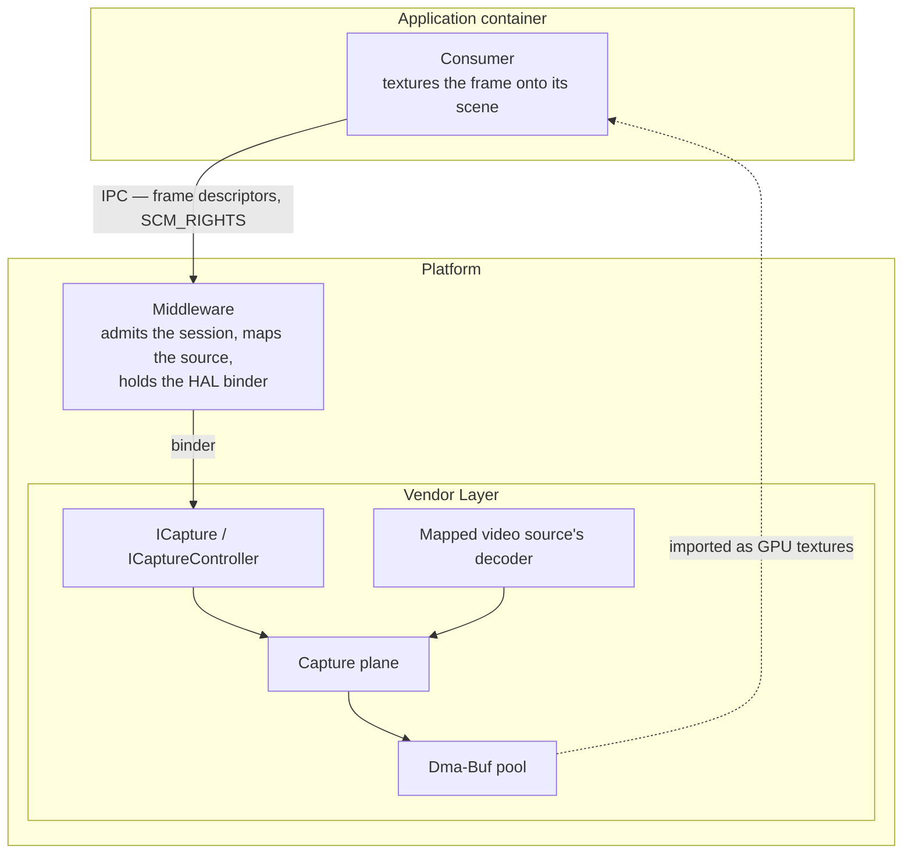
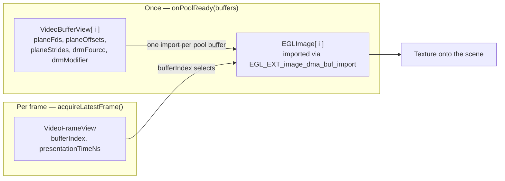
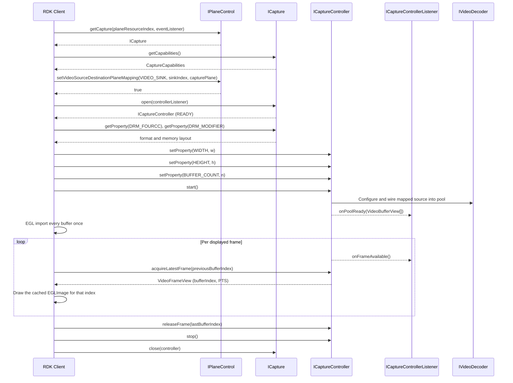

# Decoded Frame Capture

A capture plane is a plane whose destination is the client's texture rather than the display. This page is the contract for capturing a decoded video source into Dma-Buf buffers a client imports as GPU textures.

## References

!!! info References
    |||
    |-|-|
    |**Interface Definition**|[planecontrol/current](https://github.com/rdkcentral/rdk-halif-aidl/tree/main/planecontrol/current)|
    |**Interface Version**|`current`|
    | **API Documentation** | *TBD - Doxygen* |
    |**HAL Interface Type**|[AIDL and Binder](../introduction/aidl_and_binder.md)|
    |**VTS Tests**| [https://github.com/rdkcentral/rdk-halif-binder-test-planecontrol](https://github.com/rdkcentral/rdk-halif-binder-test-planecontrol) |

## Related Pages

!!! tip "Related Pages"
    - [Plane Control](plane_control.md)
    - [Video Decoder](../videodecoder/video_decoder.md)
    - [Video Sink](../videosink/video_sink.md)

A capture plane is a plane whose destination is the client's texture rather than the display. It routes a mapped video source's decoded frames into a pool of Dma-Buf buffers that the client imports as GPU textures. Because that is a routing decision about where a source's frames go, a capture destination is discovered, mapped and addressed exactly as a display plane is — `IPlaneControl.getCapabilities()` lists it with `type` of `CAPTURE`, `setVideoSourceDestinationPlaneMapping()` chooses its source, and `IPlaneControl.getCapture()` returns its capture interface.

**The mapping is the binding.** A source mapped to a capture plane is captured; the source mapped there is the source the session delivers. A source is mapped to at most one plane at a time, which is what limits a decoder to a single capture session. Because the decoder is named in exactly one place, there is no second place for the two to disagree.

The `IVideoDecoder` contract is unchanged — the decoder does not know where its output goes, and nothing is set on it to arrange capture.

A capture session is configured here in full: the frame format, memory layout and size the client wants, and the depth of the pool that holds them, are all `CaptureProperty` values on the session controller. The vendor layer configures whatever the mapped source's decoder requires in order to deliver that, over whatever internal path the platform provides.

**What a capture plane can deliver is declared in `CaptureCapabilities`.** `supportedCodecs` lists the codecs it can capture, `supportedFourCCs` and `supportedModifiers` the pixel formats and memory layouts, `maxFrameWidth` and `maxFrameHeight` the frame sizes, and `maxBufferCount` and `stallsWhenPoolExhausted` the pool. The format and layout in force are read back from `CaptureProperty.DRM_FOURCC` and `DRM_MODIFIER`, which are read-only — the plane's hardware settles them. A product that can decode to texture declares a capture plane, and that declaration is the whole of the contract — one place to read what is on offer, one place to select from it.

`Codec.H264` is required on every capture plane; decode-to-texture is certified against it. A decoder opened for a codec outside `supportedCodecs` decodes and displays normally — it just cannot feed a capture plane, and `start()` fails with `CaptureErrorCode.CODEC_NOT_CAPTURABLE` if one is mapped to it.

### Where this interface sits

The consumer of a decoded frame is the code that textures it onto its own scene, and it typically runs in an application container with no binder to this HAL. The middleware holds the binder, configures the session and carries frames to the consumer over its own IPC.



**This interface does not know which of them is its client.** The HAL contract is the same whether the middleware relays frames onward or a consumer binds `ICapture` itself; only the holder of the per-frame binding changes, and that decision sits above this repository. Binding directly halves the per-frame IPC hops, and each hop costs an `SCM_RIGHTS` pass of a Dma-Buf descriptor — but it requires a binder into the container the consumer runs in, which is a platform packaging decision rather than an interface one. It also has to answer which decoder instance a consumer may capture from, and how a binding the middleware does not hold is invalidated when the decoder is reclaimed under contention.

## A Capture Session End to End

The whole interface in one pass: find the plane, bind a source to it, agree the frame format, import the pool once, then loop. Error handling is elided to keep the shape visible.

```c++
// 1. Find a capture plane. A product without one does not support decode-to-texture.
std::vector<PlaneCapabilities> planes;
planeControl->getCapabilities(&planes);

int capturePlaneIndex = -1;
for (const auto& plane : planes) {
    if (plane.type == PlaneType::CAPTURE) { capturePlaneIndex = plane.planeIndex; break; }
}

// 2. Open the capture resource and read what it can deliver.
sp<ICapture> capture;
planeControl->getCapture(capturePlaneIndex, captureEventListener, &capture);

CaptureCapabilities caps;
capture->getCapabilities(&caps);
// caps.supportedCodecs      - H264 is required of every capture plane
// caps.supportedFourCCs     - NV12 is required
// caps.maxFrameWidth/Height - the frame size ceiling
// caps.maxBufferCount       - the pool ceiling

// 3. Bind the source. THIS is what makes the source captured - the same call that
//    routes a source to a display plane. A source is mapped to at most one plane.
SourcePlaneMapping mapping;
mapping.sourceType = SourceType::VIDEO_SINK;
mapping.sourceIndex = 0;
mapping.destinationPlaneIndex = capturePlaneIndex;

bool mapped = false;
planeControl->setVideoSourceDestinationPlaneMapping({mapping}, &mapped);

// 4. Open a session. CLOSED -> OPENING -> READY.
sp<ICaptureController> controller;
capture->open(captureControllerListener, &controller);

// 5. Configure while READY. Size and pool depth are the client's; format and layout
//    are the plane's, so they are read rather than set.
bool set = false;
controller->setProperty(CaptureProperty::WIDTH,        PropertyValue::make<PropertyValue::intValue>(1920), &set);
controller->setProperty(CaptureProperty::HEIGHT,       PropertyValue::make<PropertyValue::intValue>(1080), &set);
controller->setProperty(CaptureProperty::BUFFER_COUNT, PropertyValue::make<PropertyValue::intValue>(4),    &set);

std::optional<PropertyValue> fourcc, modifier;
capture->getProperty(CaptureProperty::DRM_FOURCC,   &fourcc);     // e.g. DRM_FORMAT_NV12
capture->getProperty(CaptureProperty::DRM_MODIFIER, &modifier);   // how its bytes are arranged

// 6. Start. READY -> STARTING -> STARTED, then the pool arrives on the listener.
controller->start();
```

The pool is delivered once. Import each buffer here and never again — after this call no file descriptor crosses the binder:

```c++
// ICaptureControllerListener
void onPoolReady(const std::vector<VideoBufferView>& buffers) override {
    for (const auto& buffer : buffers) {
        // The per-plane arrays feed EGL_EXT_image_dma_buf_import directly:
        // element N -> EGL_DMA_BUF_PLANE<N>_FD_EXT / _OFFSET_EXT / _PITCH_EXT.
        // NV12 has two planes, [Y, UV].
        EGLImageKHR image = importDmaBuf(buffer.planeFds,
                                         buffer.planeOffsets,
                                         buffer.planeStrides,
                                         buffer.width, buffer.height,
                                         buffer.drmFourcc, buffer.drmModifier);

        // KEY THE CACHE ON bufferIndex. Two buffers may share a descriptor and
        // differ only by offset, so a cache keyed on the descriptor collapses the
        // pool onto one entry and the picture silently freezes.
        imageCache[buffer.bufferIndex] = image;
    }
}
```

Then the draw loop. One call both releases the buffer just drawn and acquires the next, so a client drawing continuously never calls `releaseFrame()` at all:

```c++
int held = VideoFrameView::NO_BUFFER;      // nothing held on the first pass

while (drawing) {
    std::optional<VideoFrameView> frame;
    controller->acquireLatestFrame(held, &frame);

    if (!frame.has_value()) {
        continue;                          // none due yet - returns null, never blocks
    }

    // Resolve the frame against what was imported at onPoolReady().
    draw(imageCache[frame->bufferIndex], frame->presentationTimeNs);

    held = frame->bufferIndex;             // released by the next acquire
}

// Stop drawing while still holding one, and release it explicitly.
if (held != VideoFrameView::NO_BUFFER) {
    controller->releaseFrame(held);
}

controller->stop();                        // unwires the source, releases the pool
capture->close(controller, &closed);       // the source and its mapping are left alone
```

The frame returned is the one due for presentation now, with AV-sync correction already applied, so a client that draws on receipt is in sync without computing anything from `presentationTimeNs`. It is carried for a client placing the frame on its own timeline.

## Capture Session Lifecycle

1. Open the capture resource:
Call `IPlaneControl.getCapabilities()` and find a plane resource of type `CAPTURE`, then `IPlaneControl.getCapture(planeResourceIndex, captureEventListener)`. A product with no capture plane does not support decode-to-texture.
2. Read what the plane can deliver:
Call `ICapture.getCapabilities()` for the capturable codecs, the supported pixel formats and modifiers, the maximum frame size and buffer count, and the behaviour when every buffer is locked.
3. Map the source to the capture plane:
Call `IPlaneControl.setVideoSourceDestinationPlaneMapping()` with the video sink feeding the decoder as `sourceType`/`sourceIndex` and the capture plane as `destinationPlaneIndex`. This is the binding, and it is the same call that routes a source to a display plane.
4. Open the session:
Call `ICapture.open(captureControllerListener)`. The resource transitions `CLOSED` → `OPENING` → `READY`. It fails with `CaptureErrorCode.SOURCE_NOT_MAPPED` if no source is mapped to the plane.
5. Configure the session:
Call `ICaptureController.setProperty()` while in `READY` for `WIDTH`, `HEIGHT` and `BUFFER_COUNT`. `DRM_FOURCC` and `DRM_MODIFIER` are read through `ICapture.getProperty()` rather than set — the plane's hardware determines the format and layout, and the client reads them to import the frames correctly. Buffer size follows from those four, plus the vendor's plane alignment, and is reported back at `onPoolReady()`.
6. Start:
Call `ICaptureController.start()`. The pool is reserved, the vendor layer configures the mapped source's decoder and wires it into the pool, the resource transitions `READY` → `STARTING` → `STARTED`, and `ICaptureControllerListener.onPoolReady()` delivers the pool addressing. The codec is checked here, because a decoder is opened for a codec independently of when it is mapped.
7. Pull frames:
Call `ICaptureController.acquireLatestFrame(releaseBufferIndex)`, passing the buffer just finished with — or `VideoFrameView.NO_BUFFER` on the first call. It returns the frame due for presentation, `null` rather than blocking when none is due, and never the same frame twice. `ICaptureControllerListener.onFrameAvailable()` is an optional wake-up; a client pulling at a known cadence can ignore it.
8. Release the last frame:
Call `ICaptureController.releaseFrame(bufferIndex)` when the client stops drawing while still holding a buffer. A client drawing continuously has already released through the previous step. The call is idempotent and tolerates unknown indices.

Release is keyed by index because a buffer's identity is its index and nothing else. The addressing in `planeFds` and `planeOffsets` is how a client reaches the memory, and this interface constrains it no further than that — so a client that keys on a descriptor or an offset keys on something never promised to be distinct. A descriptor could not carry identity across a frame in any case: a `ParcelFileDescriptor` is duplicated as it crosses the binder boundary, so the same memory arrives as a different integer each delivery. An index is also the safer key across teardown, since a stale index names nothing where a stale descriptor names memory that may since have been freed.
9. Stop and close:
Call `ICaptureController.stop()` to unwire the source and release the pool, then `ICapture.close(controller)`. The source's decoder and its plane mapping are left as they are.

Unmapping the source while a session is running stops it and raises `ICaptureEventListener.onSourceUnmapped()`; mapping a source back makes the session startable again.

## Pixel Format and Memory Layout

A captured frame is described by two values, and they answer different questions.

| Value | Question it answers | Example |
|---|---|---|
| **FOURCC** | What are the pixels? | `NV12` — 8-bit 4:2:0, luma plane followed by interleaved chroma |
| **Modifier** | How are those bytes arranged in memory? | plain raster rows, or compressed blocks, or vendor tiles |

The same FOURCC under two different modifiers is the same picture in two different byte layouts. A consumer that does not understand the layout cannot read the frame, however well it understands the format.

Both are defined by the Linux kernel in `include/uapi/drm/drm_fourcc.h`. They are carried as plain integers rather than enums because the kernel owns those namespaces: new formats arrive with new kernel versions, and enumerating them in this interface would make every kernel addition an interface change to a value the HAL neither defines nor controls. The HAL client passes them to its EGL implementation without interpreting them.

### Modifiers are vendor-namespaced

A modifier is 64 bits, composed as `(vendor << 56) | value`. The top 8 bits are a registered vendor namespace and the remaining 56 bits mean whatever that vendor says they mean. The kernel registers a namespace per silicon vendor, so **most modifiers are specific to the hardware that defines them**.

Exactly one modifier is universal: `DRM_FORMAT_MOD_LINEAR`, which sits in the vendor-neutral namespace at value `0x0000000000000000` and describes plain raster rows.

A compressed or tiled layout is typically a *family* rather than a single value. Arm Frame Buffer Compression, for instance, is parameterised by superblock size (16×16, 32×8, 64×4) and by independent `YTR`, `SPLIT` and `SPARSE` flags, so two buffers can both be "AFBC" and carry different modifiers that a consumer must tell apart. That is why the declaration is a list of exact values rather than a list of layout names.

### Which one a plane delivers

The hardware writing the memory determines the layout, so the plane states it and the client reads it. `CaptureProperty.DRM_FOURCC` and `DRM_MODIFIER` are read-only, and `CaptureCapabilities.supportedFourCCs` and `supportedModifiers` declare what a plane is built to deliver.

That trade — bandwidth against portability — is settled per product rather than per session:

- **A GPU that understands the vendor's compressed layout** can take it directly. Compression can roughly halve the memory bandwidth of the capture path, which at 4K60 is often the difference between fitting in the platform's budget and not.
- **Anything that must touch the pixels** — CPU readback, a screenshot, an encoder, or a GPU from a different vendor — needs `DRM_FORMAT_MOD_LINEAR`, because no other layout is portably decodable.

`NV12` with `DRM_FORMAT_MOD_LINEAR` is required of every capture plane, which is what makes a client's import path always work: it is the one combination any consumer can handle.

The per-product declaration is `supportedFourCCs` and `supportedModifiers` under `captureCapabilities` in `hfp-planecontrol.yaml`.

## Buffer Contract

Frames are delivered in the pixel format and memory layout the session was configured for, with truthful per-plane offsets addressing the actual buffer layout, at the resolution the stream decodes to and in its source colorimetry. No scaling, rotation, crop, colour conversion or tone-mapping is applied on this path — shape and colour belong to the consumer, which applies them per frame as it textures the frame onto its scene, and may change them on any frame.

`CaptureCapabilities.resize` states whether a plane can deliver a resolution other than the one being decoded. Where it is false, `CaptureProperty.WIDTH` and `HEIGHT` must equal what the mapped source decodes to and `start()` fails with `CaptureErrorCode.RESOLUTION_MISMATCH` otherwise. A plane that never scales has no scaling quality to validate and no resolution permutations to cover, which is what keeps the tested surface small.

`NV12` and `DRM_FORMAT_MOD_LINEAR` are the required baseline, not the limit. `CaptureCapabilities.supportedFourCCs` is an open list, so a product that can deliver a format carrying alpha declares it and reports it through `CaptureProperty.DRM_FOURCC` — no interface change is needed to support one.

`VideoBufferView` reports the format and modifier of every buffer at `onPoolReady()`, so an importer needs no second lookup.

`VideoBufferView.planeFds`, `planeOffsets` and `planeStrides` feed `EGL_DMA_BUF_PLANE<N>_FD_EXT`, `EGL_DMA_BUF_PLANE<N>_OFFSET_EXT` and `EGL_DMA_BUF_PLANE<N>_PITCH_EXT` directly, so a buffer imports through `EGL_EXT_image_dma_buf_import` without translation.

Each buffer is Free, Ready or Locked. The decoder writes into Free buffers and marks them Ready once the frame is atomically complete; `acquireLatestFrame()` moves the buffer due for presentation to Locked, and the decoder never writes into a Locked buffer. Decode proceeds at full rate however sparsely or slowly the client acquires. The behaviour when every buffer is Locked is declared per product in `CaptureCapabilities.stallsWhenPoolExhausted`.

**The frame returned is the one due for presentation now.** Audio latency and AV-sync correction are applied by the vendor layer before the frame is handed over, so a client that draws each frame on receipt is in sync without computing anything from the presentation time. Frames whose presentation time has passed can never be shown and are dropped rather than delivered; frames whose time has not yet come stay queued until it does.

**Release and acquire are one call.** `acquireLatestFrame(releaseBufferIndex)` frees the buffer the client just finished with and takes the next in the same round trip, because a client redrawing at frame rate does both every frame and two calls would put two binder round trips in a 60 Hz path. `VideoFrameView.NO_BUFFER` is passed on the first call of a session. `releaseFrame()` remains for the last frame, and for a client that has stopped drawing while still holding a buffer.

**Addressing is delivered once, not per frame.** `onPoolReady()` carries one `VideoBufferView` per pool buffer, with the file descriptors, offsets, strides, lengths, size and format that address it. None of that changes while the session runs, so a client imports every buffer into an EGLImage on receipt and thereafter resolves a frame by looking its `bufferIndex` up in what it already holds. A frame therefore costs one int and one long on the wire.



Nothing is imported per frame, and no file descriptor crosses the binder after `onPoolReady()`. The index is what makes that possible: it is the buffer's identity, where the addressing that reaches its memory is not.

A client imports from `VideoBufferView.planeFds` and `planeOffsets` alone and needs to know nothing about how the vendor allocated the pool — one Dma-Buf carved into offset-addressed buffers and one Dma-Buf per buffer are both served by the same client code. A client caching EGLImages **must key the cache on `bufferIndex`**, or equivalently on the pair (file descriptor, offset) — never on the file descriptor alone. Where the pool is one shared Dma-Buf every buffer carries the same descriptor and differs only by offset, so an fd-keyed cache collapses the whole pool onto one entry and the client re-textures a single buffer for the rest of the session. The picture freezes while frames keep arriving, and nothing in what the client was handed shows it.

## Startup Order and Buffer Lifetime

A source and a capture session start independently, and either order is legal.

**Source decoding before the session starts.** Frames produced before `start()` are discarded — there is no pool to write them into. Starting capture may then require the vendor layer to reconfigure the decoder, and that reconfiguration can interrupt decode visibly for as long as it takes. Starting the session before the source begins decoding avoids both the discarded frames and the interruption.

**Session started before the source decodes.** The pool is reserved and idle, and `acquireLatestFrame()` returns `null` until frames arrive. Nothing is lost.

Shutdown is likewise legal in either order, and the pool outlives neither.

| What ends first | What happens |
|---|---|
| **The session** | `stop()` unwires the source and releases the pool and every Dma-Buf in it. The source's decoder keeps running and its plane mapping stands; the frames it produces are discarded again. |
| **The source** | The session is implicitly stopped, the pool and its Dma-Bufs are released, and `ICaptureEventListener.onSourceUnmapped()` is raised. The resource returns to `READY` and a new source mapped to the plane makes it startable again. |
| **The client process** | `stop()` and `close()` are called implicitly on its behalf, releasing the pool whether or not the client still held buffers. |

Buffers the client holds Locked at the moment of any of these are released with the rest of the pool. A client's imported EGLImages do not survive `stop()`: the buffer indices of a new session name new memory, and images cached against the old pool must be discarded when `onPoolReady()` delivers the new one.

All Dma-Bufs are released on `stop()` and on `close()`.

A format, modifier or frame size outside `CaptureCapabilities` fails at `ICaptureController.setProperty()`, while it is still a configuration error rather than a stream of wrong pixels. A pool the platform's video memory region cannot satisfy fails at `ICaptureController.start()` with `CaptureErrorCode.OUT_OF_MEMORY`, rather than being silently trimmed, and a mapped source decoding a codec outside `supportedCodecs` fails there with `CaptureErrorCode.CODEC_NOT_CAPTURABLE`. None of them falls back to plane output.


