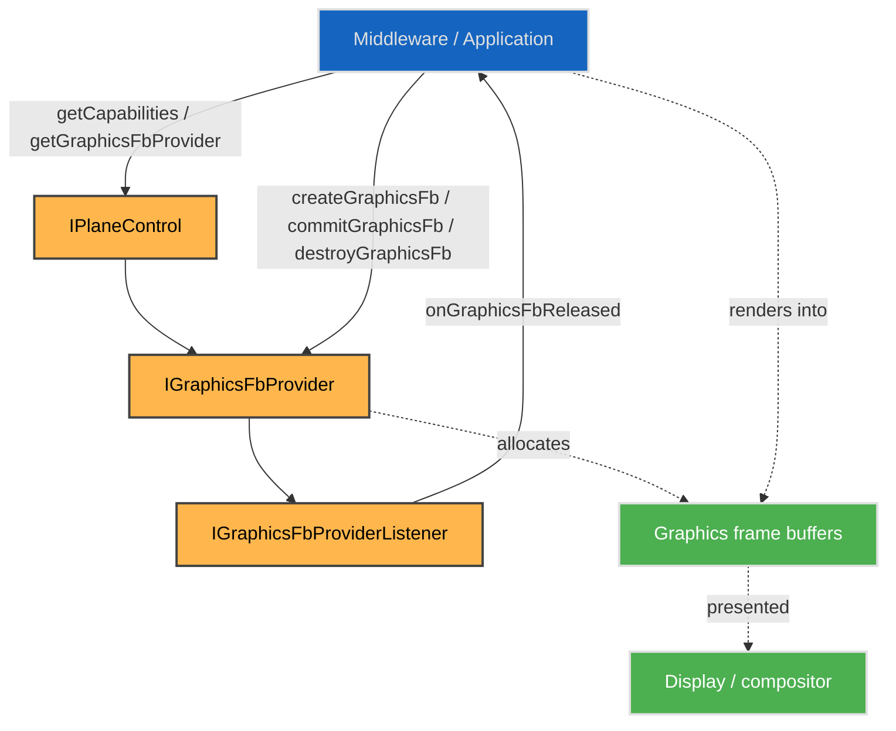
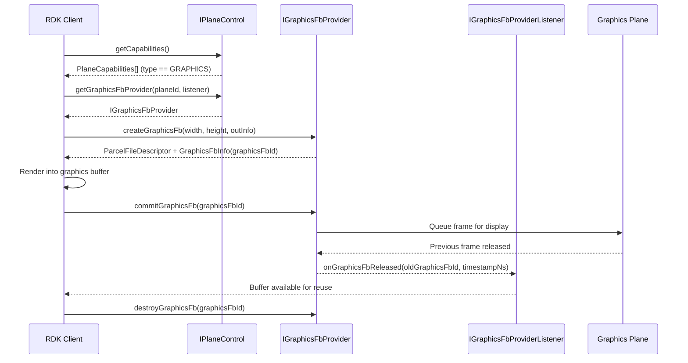

# Graphics Frame Providers

A graphics plane takes frames from the client to the display. This page is the contract for allocating graphics frame buffers and committing them for presentation, through `IGraphicsFbProvider`.

## References

!!! info References
    |||
    |-|-|
    |**Interface Definition**|[planecontrol/current/com/rdk/hal/planecontrol/graphics](https://github.com/rdkcentral/rdk-halif-aidl/tree/main/planecontrol/current/com/rdk/hal/planecontrol/graphics)|
    |**Interface Version**|`current`|
    |**Package**|`com.rdk.hal.planecontrol.graphics`|
    | **API Documentation** | *TBD - Doxygen* |
    |**HAL Interface Type**|[AIDL and Binder](../../introduction/aidl_and_binder.md)|
    |**VTS Tests**| [https://github.com/rdkcentral/rdk-halif-binder-test-planecontrol](https://github.com/rdkcentral/rdk-halif-binder-test-planecontrol) |

## Related Pages

!!! tip "Related Pages"
    - [Plane Control](../plane_control.md)
    - [Decoded Frame Capture](../capture/capture_interface.md)

## Functionality

A graphics plane carries frames from the client to the display, which is the opposite direction to a capture plane. A plane declaring `GraphicsFbCapabilities` exposes `IGraphicsFbProvider`, through which a client allocates graphics frame buffers, commits them for presentation and is told when the compositor has released one for reuse.

The plane itself — its geometry, z-order, visibility and alpha — is managed through `IPlaneControl` exactly as any plane's is. This page covers only the frame buffer provider.

## System Context

A graphics plane is reached as any plane is. `IPlaneControl` finds it and hands out the provider; the provider owns the buffers for the life of the plane's session.



## Implementation Requirements

|#|Requirement | Comments|
|-|------------|---------|
| **HAL.PLANECONTROL.GRAPHICS.1** | Shall provide a graphics frame buffer provider API for graphics planes where plane type is GRAPHICS. |
| **HAL.PLANECONTROL.GRAPHICS.2** | Shall provide APIs to create, commit and destroy graphics frame buffers via `IGraphicsFbProvider`.|
| **HAL.PLANECONTROL.GRAPHICS.3** | Shall notify clients when committed graphics frame buffers are released and available for reuse via `IGraphicsFbProviderListener`.|

## Interface Definition

All of these are in `com.rdk.hal.planecontrol.graphics`. The plane itself is described in [Plane Control](../plane_control.md).

|Interface Definition File | Description|
|--------------------------|------------|
| `IGraphicsFbProvider.aidl` | Graphics frame buffer provider interface for a graphics plane.|
| `IGraphicsFbProviderListener.aidl` | Listener interface for graphics frame release callbacks from the graphics frame buffer provider.|
| `GraphicsFbCapabilities.aidl` | Parcelable describing graphics frame buffer provider capabilities for a graphics plane.|
| `GraphicsFbInfo.aidl` | Parcelable describing graphics frame metadata (frame ID, pixel width, pixel height, stride and offset).|

## Product Customization

A product declares its graphics planes in `hfp-planecontrol.yaml`. A plane that provides frame buffers declares `GraphicsFbCapabilities`; one that does not exposes no provider, and `IPlaneControl.getGraphicsFbProvider()` returns null for it.

## Resource Management

A graphics frame buffer is allocated through the provider, committed for presentation, and returned to the client when the compositor has finished with it. Buffers are owned by the provider for the life of the plane's session; a client that exits leaves nothing to clean up.

### Graphics Frame Buffer Lifecycle

Use the following sequence for each graphics plane:

1. Discover provider support:
Call `IPlaneControl.getCapabilities()` and confirm the target plane is of type GRAPHICS.
2. Open provider:
Call `IPlaneControl.getGraphicsFbProvider(planeResourceIndex, graphicsFbProviderListener)`.
3. Create one or more frame buffers:
Call `IGraphicsFbProvider.createGraphicsFb(width, height, outInfo)`.
The returned file descriptor is the graphics buffer memory, and `outInfo` provides metadata such as `graphicsFbId`, stride, and offset. Supported format and modifier values are defined in `GraphicsFbCapabilities` and should be obtained via `IGraphicsFbProvider.getCapabilities()`.
4. Render into the buffer:
Use the returned graphics buffer and metadata with the client graphics stack (for example EGL/GL) to draw a frame.
5. Commit for display:
Call `IGraphicsFbProvider.commitGraphicsFb(graphicsFbId)` to queue the frame for presentation.
This call is non-blocking.
6. Reuse released buffers:
Wait for `IGraphicsFbProviderListener.onGraphicsFbReleased(oldGraphicsFbId, timestampNs)` before reusing a previously displayed buffer.
7. Destroy buffers when no longer needed:
Call `IGraphicsFbProvider.destroyGraphicsFb(graphicsFbId)` for each created buffer during shutdown or reconfiguration.

The number of simultaneously created buffers must not exceed `maxGraphicsFrameBuffers`, and created dimensions must not exceed `maxGraphicsFbWidth` and `maxGraphicsFbHeight`.



### What a frame buffer is

`createGraphicsFb(width, height, outInfo)` returns a `ParcelFileDescriptor` — the buffer memory itself, as a Dma-Buf — together with `GraphicsFbInfo`:

| Field | What it is |
|---|---|
| `graphicsFbId` | the buffer's identity. Every later call names the buffer by this, never by its descriptor |
| `pixelWidth`, `pixelHeight` | the size actually allocated, which is what was asked for |
| `stride` | bytes from the start of one row of pixels to the start of the next |
| `offset` | byte offset of the pixels from the start of the descriptor |

The pixel format and memory layout are `GraphicsFbCapabilities.format` and `modifier`, declared once for the plane rather than per buffer — every buffer a provider allocates shares them. Both are single values, not lists: the plane's hardware settles them and there is nothing for a client to select, which is the difference from a capture plane, where the client picks a pair. Together with the descriptor, `stride` and `offset`, that is everything an `EGL_EXT_image_dma_buf_import` needs.

Both are opaque here, passed through to the client's EGL implementation without this interface interpreting them, for the same reason capture carries them as integers: the kernel owns those namespaces.

**The descriptor is the client's.** It is duplicated as it crosses the binder boundary, so the client holds its own reference to the memory and an imported image takes a further one. A client closes the descriptor once it has imported from it, and the memory returns to the platform when the image is destroyed and `destroyGraphicsFb()` has been called.

### Colour

A client renders **sRGB** into a graphics frame buffer — BT.709 primaries with the sRGB transfer function — and the compositor reads them as sRGB.

It is stated here rather than carried per buffer because it does not vary: the client produces these pixels, so nothing needs reporting back to it, and the compositor needs one answer it can rely on. That answer is what lets graphics be placed correctly against video of any dynamic range — a compositor that has to guess a UI plane's colour space is the reason overlays wash out or blow out over HDR content.

### Ownership across a commit

A buffer is the client's to draw into until it commits, and the provider's from then until it says otherwise:

| | Owner | The client may |
|---|---|---|
| after `createGraphicsFb()` | client | render into it |
| after `commitGraphicsFb()` | provider | nothing — it may be on screen |
| after `onGraphicsFbReleased()` | client | render into it again |

**Drawing into a committed buffer is the failure this contract exists to prevent.** The compositor may be scanning it out, so the result is tearing on screen with nothing to indicate a fault — the client sees no error, and the frame it drew is not the frame displayed. A client therefore needs at least two buffers to draw continuously: one on screen while it renders the next.

`onGraphicsFbReleased()` arrives on a **binder thread** — `IGraphicsFbProviderListener` is `oneway` — so it carries no GL context. A client marks the buffer free there and lets its render thread pick it up, exactly as the capture path does with `onPoolReady()`.

### A graphics plane end to end

```c++
// Find a graphics plane and open its frame buffer provider.
std::vector<PlaneCapabilities> allPlaneCapabilities;
planeControl->getCapabilities(&allPlaneCapabilities);

int32_t graphicsPlaneIndex = -1;
for (const PlaneCapabilities& planeCapabilities : allPlaneCapabilities) {
    if (planeCapabilities.type == PlaneType::GRAPHICS) {
        graphicsPlaneIndex = planeCapabilities.planeIndex;
        break;
    }
}

sp<IGraphicsFbProvider> frameBufferProvider;
planeControl->getGraphicsFbProvider(graphicsPlaneIndex, graphicsFbProviderListener,
                                    &frameBufferProvider);

GraphicsFbCapabilities frameBufferCapabilities;
frameBufferProvider->getCapabilities(&frameBufferCapabilities);
// frameBufferCapabilities.maxGraphicsFrameBuffers - how many may exist at once
// frameBufferCapabilities.maxGraphicsFbWidth      - the size ceiling
// frameBufferCapabilities.format                  - the pixel format of every buffer
// frameBufferCapabilities.modifier                - its memory layout

// Two buffers is the minimum for continuous drawing: one on screen, one being drawn.
const int32_t frameBufferCount = 2;
for (int32_t i = 0; i < frameBufferCount; ++i) {
    GraphicsFbInfo frameBufferInfo;
    ::android::os::ParcelFileDescriptor frameBufferMemory;
    frameBufferProvider->createGraphicsFb(1920, 1080, &frameBufferInfo, &frameBufferMemory);

    // Import once, keyed by the id every later call uses to name this buffer.
    eglImagesByFrameBufferId[frameBufferInfo.graphicsFbId] =
        importGraphicsFb(frameBufferMemory.get(), frameBufferInfo,
                         frameBufferCapabilities.format,
                         frameBufferCapabilities.modifier);
    freeFrameBufferIds.push(frameBufferInfo.graphicsFbId);
}
```

Then the render loop — draw into a free buffer, commit it, and wait for the provider to hand one back:

```c++
while (isRendering) {
    int32_t frameBufferId;
    if (!freeFrameBufferIds.tryPop(&frameBufferId)) {
        continue;                       // every buffer is with the provider
    }

    renderInto(eglImagesByFrameBufferId[frameBufferId]);

    bool commitSucceeded = false;
    frameBufferProvider->commitGraphicsFb(frameBufferId, &commitSucceeded);
    // The buffer is the provider's now. It returns on onGraphicsFbReleased().
}
```

```c++
// IGraphicsFbProviderListener - runs on a binder thread. No GL calls here.
::android::binder::Status onGraphicsFbReleased(int32_t releasedFrameBufferId,
                                               int64_t releasedTimestampNs) override {
    freeFrameBufferIds.push(releasedFrameBufferId);
    return ::android::binder::Status::ok();
}
```

At shutdown, destroy the images and then the buffers:

```c++
for (const auto& [frameBufferId, eglImage] : eglImagesByFrameBufferId) {
    eglDestroyImageKHR(eglDisplay, eglImage);
    frameBufferProvider->destroyGraphicsFb(frameBufferId);
}
eglImagesByFrameBufferId.clear();
```
