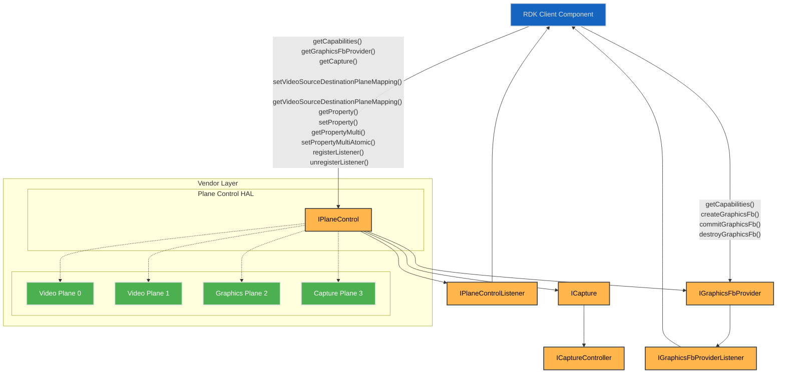
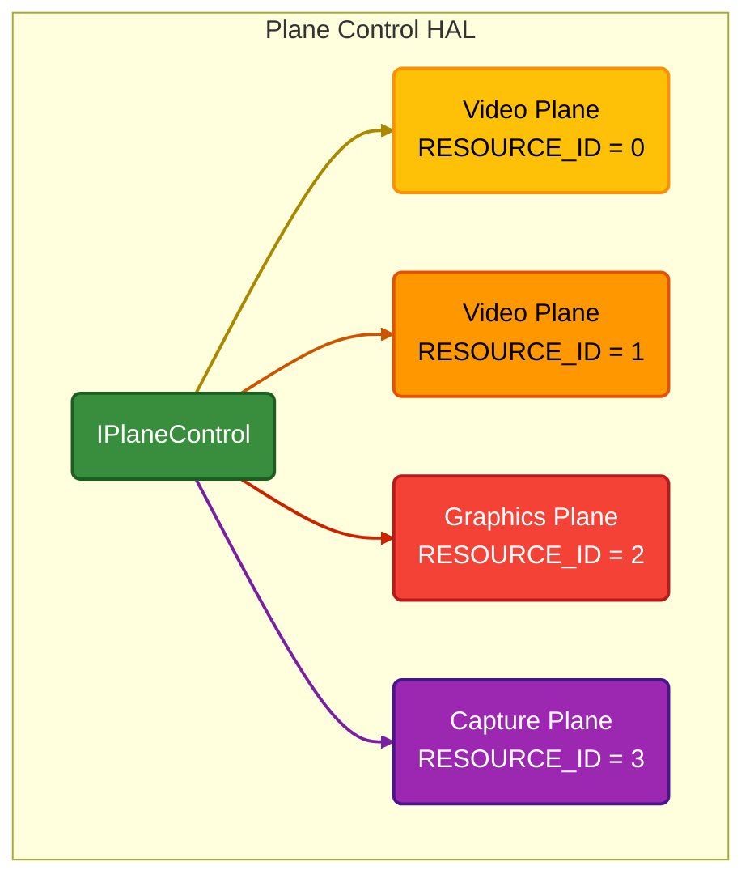
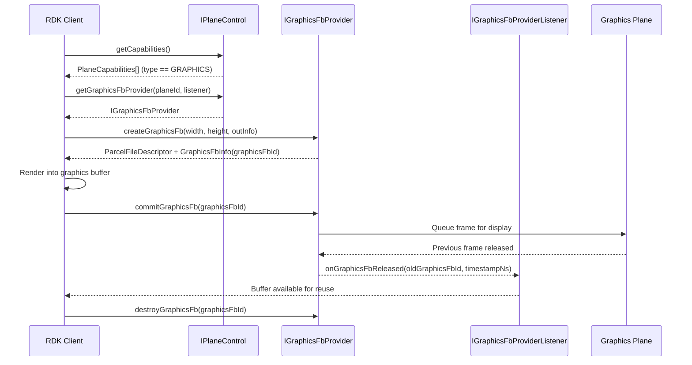
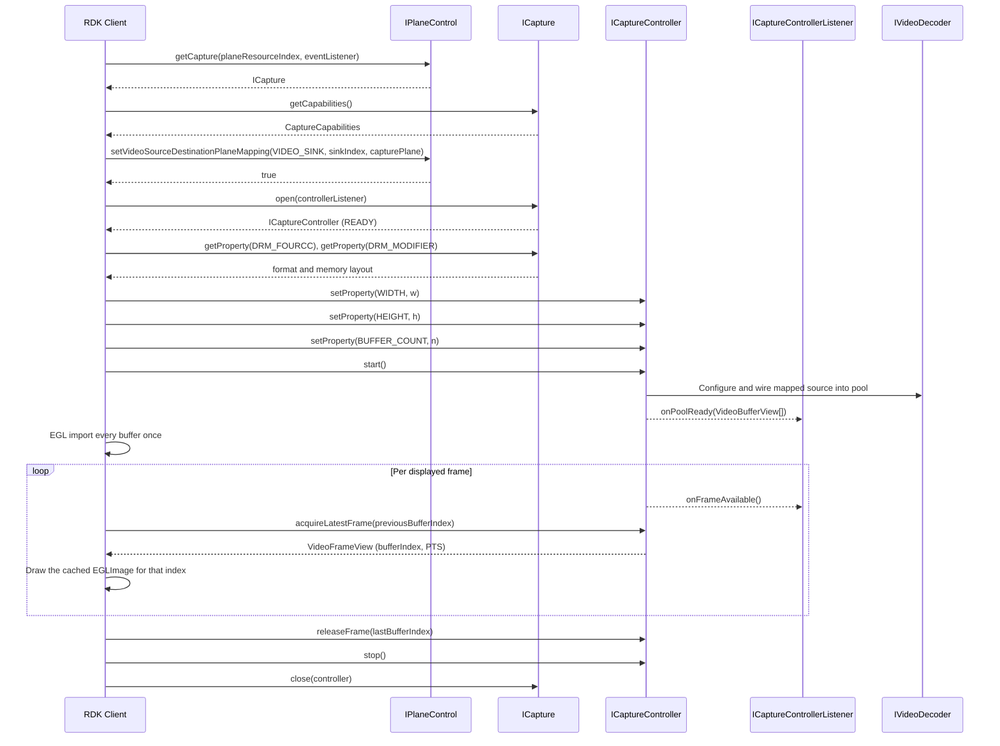

# Plane Control

The Plane Control HAL manages the platform’s video and graphics plane resources, exposing each plane as a resource with readable capabilities.  

It enables linking video sources - such as video sinks, HDMI input, and composite input - to a video plane. For graphics planes, graphics frame buffers are provided through `IGraphicsFbProvider` for EGL-based graphics display.  

Each plane is configurable through a set of properties that clients can read or modify, either individually or in batches.

## References

!!! info References
    |||
    |-|-|
    |**Interface Definition**|[planecontrol/current](https://github.com/rdkcentral/rdk-halif-aidl/tree/main/planecontrol/current)|
    |**Interface Version**|`current`|
    | **API Documentation** | *TBD - Doxygen* |
    |**HAL Interface Type**|[AIDL and Binder](../introduction/aidl_and_binder.md)|
    |**VTS Tests**| [https://github.com/rdkcentral/rdk-halif-binder-test-planecontrol](https://github.com/rdkcentral/rdk-halif-binder-test-planecontrol) |
    |**Reference Implementation - vComponent**|**TBC**|

## Related Pages

!!! tip "Related Pages"
    - [Video Sink](../videosink/video_sink.md)

## Implementation Requirements

|#|Requirement | Comments|
|-|------------|---------|
| **HAL.PLANECONTROL.1** | Shall provide APIs to manage the geometry, z-order, visibility and other properties of graphics and video planes for tunnelled and non-tunnelled operational modes of the video pipeline.|
|**HAL.PLANECONTROL.2** |Shall allow tunnelled video sources from a video decoder/sink, a HDMI input or a composite input to be linked to a video plane for display.|
|**HAL.PLANECONTROL.3** | Shall provide an API to expose the plane resources and their capabilities for a client to discover.|
| **HAL.PLANECONTROL.4** | Shall provide an API to atomically set multiple properties of a plane which take effect at the next available vsync.|
| **HAL.PLANECONTROL.5** | Shall allow only 1 source to be mapped to any given video plane.|
| **HAL.PLANECONTROL.6** | Shall provide an API to atomically update multiple video source to video plane mappings.|
| **HAL.PLANECONTROL.7** | Shall provide a graphics frame buffer provider API for graphics planes where plane type is GRAPHICS. |
| **HAL.PLANECONTROL.8** | Shall provide APIs to create, commit and destroy graphics frame buffers via `IGraphicsFbProvider`.|
| **HAL.PLANECONTROL.9** | Shall notify clients when committed graphics frame buffers are released and available for reuse via `IGraphicsFbProviderListener`.|
| **HAL.PLANECONTROL.10** | Shall provide a decoded frame capture API via `ICapture` for plane resources of type `PlaneType.CAPTURE`, delivering the frames of the video source mapped to that plane into a Dma-Buf buffer pool.| The source is selected with `setVideoSourceDestinationPlaneMapping()`, exactly as it is for a display plane. |
| **HAL.PLANECONTROL.10a** | Shall declare in `CaptureCapabilities.supportedCodecs` the codecs whose decoded frames a capture plane can deliver, and shall include `Codec.H264`.| Capture is certified against H264. A decoder opened for any other codec still decodes and displays normally. |
| **HAL.PLANECONTROL.11** | Shall deliver captured frames in the pixel format, memory layout and size the session was configured with through `CaptureProperty`, as Dma-Bufs whose per-plane file descriptors, offsets and strides address the actual buffer layout and import directly through `EGL_EXT_image_dma_buf_import` without translation.| The vendor layer configures whatever the bound decoder requires to deliver them, over its own internal path. |
| **HAL.PLANECONTROL.11a** | Shall deliver the addressing of every pool buffer once at `ICaptureControllerListener.onPoolReady()`, and thereafter identify each frame by buffer index and presentation time alone.| A buffer's address and shape do not change during a session. Re-sending file descriptors at frame rate would move them across the binder boundary to repeat what was already said. |
| **HAL.PLANECONTROL.12** | Shall allow decode to proceed at full rate independently of the rate at which the client acquires frames, and shall never re-deliver a frame already returned by `acquireLatestFrame()`.|
| **HAL.PLANECONTROL.12a** | Shall return from `acquireLatestFrame()` the frame due for presentation with audio latency and AV-sync correction already applied, dropping frames whose presentation time has passed and holding frames whose time has not yet come.| A client that draws each frame on receipt is then in sync without computing anything. |
| **HAL.PLANECONTROL.12b** | Shall release the buffer named in `acquireLatestFrame()`'s `releaseBufferIndex` before acquiring the next frame, so a client redrawing at frame rate makes one call per frame rather than two.| At 60 Hz the second round trip is pure overhead in the hot path. |
| **HAL.PLANECONTROL.13** | Shall reject a writable `CaptureProperty` value outside `CaptureCapabilities` at `setProperty()`, and shall fail `ICaptureController.start()` with a `CaptureErrorCode` when the pool cannot be reserved or the mapped source is decoding a codec outside `CaptureCapabilities.supportedCodecs`, in no case falling back to plane output.| The failure belongs where it is still a configuration error, not a stream of wrong pixels. |
| **HAL.PLANECONTROL.14** | Shall deliver captured frames at the resolution the stream decodes to and in its source colorimetry, applying no scaling, rotation, crop, colour conversion, tone-mapping or gamma adjustment.| Shape and colour belong to the consumer, which applies them per frame and may change them on any frame. A transform applied here would have to be undone, and one the consumer cannot undo makes the frame unusable. On a plane declaring `CaptureCapabilities.resize` false, `CaptureProperty.WIDTH` and `HEIGHT` must equal the decoded resolution. |
| **HAL.PLANECONTROL.15** | Shall drop no more than one frame per 15 seconds of capture, at every resolution from 144p to 2160p, while the client acquires and releases at the presentation cadence.| The capture path is not permitted to lose frames a display plane would have shown. A client that stops releasing is not covered by this — that case is `CaptureCapabilities.stallsWhenPoolExhausted`. |
| **HAL.PLANECONTROL.16** | Shall carry each frame's presentation time unaltered in `VideoFrameView.presentationTimeNs`.| It is the frame's only timing reference. A captured frame goes to the client's scene rather than to a display plane, so the client presents it against the clock its audio path already runs on. |

## Interface Definition

|Interface Definition File | Description|
|--------------------------|------------|
|`IPlaneControl.aidl` | Plane Control HAL interface which provides the central API for video and graphics plane management.|
| `IPlaneControlListener.aidl` | Plane Control listener for callbacks.|
| `IGraphicsFbProvider.aidl` | Graphics frame buffer provider interface for a graphics plane.|
| `IGraphicsFbProviderListener.aidl` | Listener interface for graphics frame release callbacks from the graphics frame buffer provider.|
| `ICapture.aidl` | Decoded frame capture interface for a video plane used as a capture destination.|
| `ICaptureController.aidl` | Capture session controller returned by `ICapture.open()`.|
| `ICaptureControllerListener.aidl` | Listener interface for buffer pool and frame callbacks from a capture session.|
| `ICaptureEventListener.aidl` | Listener interface for capture resource state and error callbacks.|
| `AspectRatio.aidl` | Enum list of aspect ratios.|
| `PlaneCapabilities.aidl` | Parcelable describing a single plane resource capabilities.|
| `GraphicsFbCapabilities.aidl` | Parcelable describing graphics frame buffer provider capabilities for a graphics plane.|
| `GraphicsFbInfo.aidl` | Parcelable describing graphics frame metadata (frame ID, pixel width, pixel height, stride and offset).|
| `CaptureCapabilities.aidl` | Parcelable describing capture capabilities for a video plane.|
| `CaptureErrorCode.aidl` | Enum list of capture error codes.|
| `CaptureProperty.aidl` | Enum list of capture session properties.|
| `CapturePropertyKVPair.aidl` | Parcelable of a single capture property key and value pair.|
| `VideoBufferView.aidl` | Parcelable describing the Dma-Buf addressing of one capture pool buffer.|
| `VideoFrameView.aidl` | Parcelable identifying a single captured frame by buffer index and presentation time.|
| `PlaneType.aidl` | Enum list of plane types.|
| `Property.aidl` | Enum list of plane properties.|
| `PropertyKVPair.aidl` | Parcelable of a single property key and value pair.|
| `State.aidl` | Enum list of capture resource lifecycle states.|
| `SourcePlaneMapping.aidl` | Parcelable of a single source to plane mapping.|
| `SourceType.aidl` | Enum list of source types used in source plane mapping.|

## Initialization

The [systemd](../vsi/systemd/current/systemd.md) `hal-plane_control.service` unit file is provided by the vendor layer to start the service and should include [Wants](https://www.freedesktop.org/software/systemd/man/latest/systemd.unit.html#Wants=) or [Requires](https://www.freedesktop.org/software/systemd/man/latest/systemd.unit.html#Requires=)  directives to start any platform driver services it depends upon.

The Plane Control service depends on the Service Manager to register itself as a service.

Upon starting, the service shall register the `IPlaneControl` interface with the Service Manager using the String `IPlaneControl.serviceName` and immediately become operational.

## Product Customization

The `IPlaneControl.getCapabilities()` returns an array of `PlaneCapabilities` parcelables to uniquely represent all of the plane resources supported by the vendor layer.

Typically, the plane index (resource ID) value starts at 0 for the first video plane and increments by 1 for each additional video plane, followed by the graphic plane(s).

The `PlaneCapabilities` parcelable returned by the `IPlaneControl.getCapabilities()` function lists all capabilities supported by a plane resource.
- Concurrent control of plane resources is allowed by multiple clients. The RDK middleware is responsible for ensuring only 1 controlling client is active at any given time.

A product that supports decode-to-texture declares one plane resource of type `CAPTURE` per concurrent capture session it can serve, each carrying the frames it can deliver and its buffer pool limits under `captureCapabilities`. Capture planes and video planes are independent resources, so a product declaring both can run a capture session alongside a playback session routed to a display plane, up to the decoder count its video decoder profile declares. `IPlaneControl.getCapture()` returns `null` for any plane resource that is not of type `CAPTURE`.

## System Context

The Plane Control service provides functionality to multiple clients which exist inside the RDK middleware.

Typically, video planes are linked to video sources when a GStreamer pipeline is created in the RDK middleware. The geometry of the video planes can be manipulated by the Window Manager through a separate client connection.

Graphics planes may expose `IGraphicsFbProvider` for EGL-based graphics frame rendering and commit.



## Resource Management

The `IPlaneControl` interface provides access to all of the plane resource instances offered by the platform.

Each plane resource instance is assigned a unique integer resource ID or index, which is used in the `IPlaneControl` function calls to indicate which plane is being accessed.

Any number of clients can access the `IPlaneControl` service and access plane settings.

The diagram below shows the relationship between the interface and resource instances.



## Plane Types and Fixed Configuration

For the 2 types of planes (video and graphics) there are fixed configurations which they are expected to hold.

|Plane Type | Fixed Configuration|
|-----------|--------------------|
| **Video** |If there is no video to display on a visible plane, then it shall render transparent black. <br>The z-order is dynamic only for video planes.<br> Primary video plane shall always be listed at resource index 0.|
| **Graphics** |When the plane type is GRAPHICS, `getGraphicsFbProvider()` provides graphics frame creation, commit, and destroy operations.|
| **Capture** |The destination is the client's texture rather than the display, so the plane is never composited: alpha, z-order and display latency do not apply.<br>The source is mapped with `setVideoSourceDestinationPlaneMapping()` exactly as it is for a video plane, and that mapping is what routes the source to capture.<br>When the plane type is CAPTURE, `getCapture()` provides decoded frame capture to a Dma-Buf buffer pool.<br>It runs opposite to a graphics plane: a graphics plane carries frames from the client to the display, a capture plane carries decoded frames from the pipeline to the client.<br>Capture planes are listed after graphics planes.|

## Graphics Frame Providers

- Plane Control supports graphics frame buffers via `IGraphicsFbProvider`.
- Clients should first query `IPlaneControl.getCapabilities()` and confirm the target plane is of type GRAPHICS.
- If supported, clients open the provider using `IPlaneControl.getGraphicsFbProvider()` and use provider APIs to create, render, commit, and destroy frames.

### Graphics Frame Buffer Lifecycle

Use the following sequence for each graphics plane:

1. Discover provider support:
Call `IPlaneControl.getCapabilities()` and confirm the target plane is of type GRAPHICS.
2. Open provider:
Call `IPlaneControl.getGraphicsFbProvider(planeResourceIndex, graphicsFbProviderListener)`.
3. Create one or more frame buffers:
Call `IGraphicsFbProvider.createGraphicsFb(width, height, outInfo)`.
The returned file descriptor is the graphics buffer memory, and `outInfo` provides metadata such as `graphicsFbId`, stride, and offset. Supported format and modifier values are defined in `GraphicsFbCapabilities` and should be obtained via `IGraphicsFbProvider.getCapabilities()`.
4. Render into the buffer:
Use the returned graphics buffer and metadata with the client graphics stack (for example EGL/GL) to draw a frame.
5. Commit for display:
Call `IGraphicsFbProvider.commitGraphicsFb(graphicsFbId)` to queue the frame for presentation.
This call is non-blocking.
6. Reuse released buffers:
Wait for `IGraphicsFbProviderListener.onGraphicsFbReleased(oldGraphicsFbId, timestampNs)` before reusing a previously displayed buffer.
7. Destroy buffers when no longer needed:
Call `IGraphicsFbProvider.destroyGraphicsFb(graphicsFbId)` for each created buffer during shutdown or reconfiguration.

The number of simultaneously created buffers must not exceed `maxGraphicsFrameBuffers`, and created dimensions must not exceed `maxGraphicsFrameBufferWidth` and `maxGraphicsFrameBufferHeight`.



## Video Planes

Video sources (video sinks, HDMI inputs, and composite inputs) can be mapped to destination video planes for presentation.

A video plane can only be mapped to one video source at a time, and any attempt to set additional video sources shall fail.

A call to the `setVideoSourceDestinationPlaneMapping()` allows for multiple sources and planes to be mapped and can perform complex operations such as plane swapping between main and PIP video.

The sequence of calls below shows how main video and PIP video can be mapped separately and then swapped.

### Main Video on Plane 0

- The main video using video sink 0 is displayed on video plane 0. 
- AV playback is started.

```c++
SourcePlaneMapping[] =
{
    sourceType = SourceType::VIDEO_SINK,
    sourceIndex = 0,
    destinationPlaneIndex = 0
}
```

### 2. PIP Video on Plane 1

- The PIP video using video sink 1 is displayed on video plane 1.
- AV playback is started.

```c++
SourcePlaneMapping[] =
{
    sourceType = SourceType::VIDEO_SINK,
    sourceIndex = 1,
    destinationPlaneIndex = 1
}
```

### 3a. Swapping Main and PIP Planes

- First variant: The destination plane indices for main and PIP are swapped in a single call.

```c++
SourcePlaneMapping[] =
{
  sourceType = SourceType::VIDEO_SINK,
  sourceIndex = 0,
  destinationPlaneIndex = 1
},
{
  sourceType = SourceType::VIDEO_SINK,
  sourceIndex = 1,
  destinationPlaneIndex = 0
}
```

### 3b. Unmapping Main and Moving PIP

- Second variant: The destination plane index for PIP is moved to plane 0 and main is unmapped.

```c++
SourcePlaneMapping[] =
{
    sourceType = SourceType::VIDEO_SINK,
    sourceIndex = 0,
    destinationPlaneIndex = -1 // -1 indicates unmapping
},
{
    sourceType = SourceType::VIDEO_SINK,
    sourceIndex = 1,
    destinationPlaneIndex = 0
}
```

## Stopping Video Display

When video is being stopped, the video source must also be unmapped from the plane.

The plane unmapping can technically be performed before or after the video source is stopped.

The `setVideoSourceDestinationPlaneMapping()` function can be used to unmap one or more video sources from planes.

- Video sink 0 is unmapped from plane 0.

```c++
SourcePlaneMapping[]=
{
    sourceType = SourceType::VIDEO_SINK,
    sourceIndex = 0, 
    destinationPlaneIndex = -1
}
```

## Decoded Frame Capture

A capture plane is a plane whose destination is the client's texture rather than the display. It routes a mapped video source's decoded frames into a pool of Dma-Buf buffers that the client imports as GPU textures. Because that is a routing decision about where a source's frames go, a capture destination is discovered, mapped and addressed exactly as a display plane is — `IPlaneControl.getCapabilities()` lists it with `type` of `CAPTURE`, `setVideoSourceDestinationPlaneMapping()` chooses its source, and `IPlaneControl.getCapture()` returns its capture interface.

**The mapping is the binding.** A source mapped to a capture plane is captured; the source mapped there is the source the session delivers. A source is mapped to at most one plane at a time, which is what limits a decoder to a single capture session. Because the decoder is named in exactly one place, there is no second place for the two to disagree.

The `IVideoDecoder` contract is unchanged — the decoder does not know where its output goes, and nothing is set on it to arrange capture.

A capture session is configured here in full: the frame format, memory layout and size the client wants, and the depth of the pool that holds them, are all `CaptureProperty` values on the session controller. The vendor layer configures whatever the mapped source's decoder requires in order to deliver that, over whatever internal path the platform provides.

**What a capture plane can deliver is declared in `CaptureCapabilities`.** `supportedCodecs` lists the codecs it can capture, `supportedFourCCs` and `supportedModifiers` the pixel formats and memory layouts, `maxFrameWidth` and `maxFrameHeight` the frame sizes, and `maxBufferCount` and `stallsWhenPoolExhausted` the pool. The format and layout in force are read back from `CaptureProperty.DRM_FOURCC` and `DRM_MODIFIER`, which are read-only — the plane's hardware settles them. A product that can decode to texture declares a capture plane, and that declaration is the whole of the contract — one place to read what is on offer, one place to select from it.

`Codec.H264` is required on every capture plane; decode-to-texture is certified against it. A decoder opened for a codec outside `supportedCodecs` decodes and displays normally — it just cannot feed a capture plane, and `start()` fails with `CaptureErrorCode.CODEC_NOT_CAPTURABLE` if one is mapped to it.

### Capture Session Lifecycle

1. Open the capture resource:
Call `IPlaneControl.getCapabilities()` and find a plane resource of type `CAPTURE`, then `IPlaneControl.getCapture(planeResourceIndex, captureEventListener)`. A product with no capture plane does not support decode-to-texture.
2. Read what the plane can deliver:
Call `ICapture.getCapabilities()` for the capturable codecs, the supported pixel formats and modifiers, the maximum frame size and buffer count, and the behaviour when every buffer is locked.
3. Map the source to the capture plane:
Call `IPlaneControl.setVideoSourceDestinationPlaneMapping()` with the video sink feeding the decoder as `sourceType`/`sourceIndex` and the capture plane as `destinationPlaneIndex`. This is the binding, and it is the same call that routes a source to a display plane.
4. Open the session:
Call `ICapture.open(captureControllerListener)`. The resource transitions `CLOSED` → `OPENING` → `READY`. It fails with `CaptureErrorCode.SOURCE_NOT_MAPPED` if no source is mapped to the plane.
5. Configure the session:
Call `ICaptureController.setProperty()` while in `READY` for `WIDTH`, `HEIGHT` and `BUFFER_COUNT`. `DRM_FOURCC` and `DRM_MODIFIER` are read through `ICapture.getProperty()` rather than set — the plane's hardware determines the format and layout, and the client reads them to import the frames correctly. Buffer size follows from those four, plus the vendor's plane alignment, and is reported back at `onPoolReady()`.
6. Start:
Call `ICaptureController.start()`. The pool is reserved, the vendor layer configures the mapped source's decoder and wires it into the pool, the resource transitions `READY` → `STARTING` → `STARTED`, and `ICaptureControllerListener.onPoolReady()` delivers the pool addressing. The codec is checked here, because a decoder is opened for a codec independently of when it is mapped.
7. Pull frames:
Call `ICaptureController.acquireLatestFrame(releaseBufferIndex)`, passing the buffer just finished with — or `VideoFrameView.NO_BUFFER` on the first call. It returns the frame due for presentation, `null` rather than blocking when none is due, and never the same frame twice. `ICaptureControllerListener.onFrameAvailable()` is an optional wake-up; a client pulling at a known cadence can ignore it.
8. Release the last frame:
Call `ICaptureController.releaseFrame(bufferIndex)` when the client stops drawing while still holding a buffer. A client drawing continuously has already released through the previous step. The call is idempotent and tolerates unknown indices.

Release is keyed by index rather than by address because the two vendor allocation models put a buffer's identity in different places — under a single shared Dma-Buf buffers differ by offset, and under one Dma-Buf per buffer they differ by file descriptor while every offset is 0. The pair `(file descriptor, offset)` would identify a buffer under both, but naming a file descriptor across a binder boundary means passing a `ParcelFileDescriptor` back on every released frame, to name memory the implementation already has open. An index carries the same information in an int, and is the safer key across teardown: a stale index names nothing, where a stale file descriptor names memory that may since have been freed.
9. Stop and close:
Call `ICaptureController.stop()` to unwire the source and release the pool, then `ICapture.close(controller)`. The source's decoder and its plane mapping are left as they are.

Unmapping the source while a session is running stops it and raises `ICaptureEventListener.onSourceUnmapped()`; mapping a source back makes the session startable again.

### Pixel Format and Memory Layout

A captured frame is described by two values, and they answer different questions.

| Value | Question it answers | Example |
|---|---|---|
| **FOURCC** | What are the pixels? | `NV12` — 8-bit 4:2:0, luma plane followed by interleaved chroma |
| **Modifier** | How are those bytes arranged in memory? | plain raster rows, or compressed blocks, or vendor tiles |

The same FOURCC under two different modifiers is the same picture in two different byte layouts. A consumer that does not understand the layout cannot read the frame, however well it understands the format.

Both are defined by the Linux kernel in `include/uapi/drm/drm_fourcc.h`. They are carried as plain integers rather than enums because the kernel owns those namespaces: new formats arrive with new kernel versions, and enumerating them in this interface would make every kernel addition an interface change to a value the HAL neither defines nor controls. The HAL client passes them to its EGL implementation without interpreting them.

#### Modifiers are vendor-namespaced

A modifier is 64 bits, composed as `(vendor << 56) | value`. The top 8 bits are a registered vendor namespace and the remaining 56 bits mean whatever that vendor says they mean. The kernel registers a namespace per silicon vendor, so **most modifiers are specific to the hardware that defines them**.

Exactly one modifier is universal: `DRM_FORMAT_MOD_LINEAR`, which sits in the vendor-neutral namespace at value `0x0000000000000000` and describes plain raster rows.

A compressed or tiled layout is typically a *family* rather than a single value. Arm Frame Buffer Compression, for instance, is parameterised by superblock size (16×16, 32×8, 64×4) and by independent `YTR`, `SPLIT` and `SPARSE` flags, so two buffers can both be "AFBC" and carry different modifiers that a consumer must tell apart. That is why the declaration is a list of exact values rather than a list of layout names.

#### Which one a plane delivers

The hardware writing the memory determines the layout, so the plane states it and the client reads it. `CaptureProperty.DRM_FOURCC` and `DRM_MODIFIER` are read-only, and `CaptureCapabilities.supportedFourCCs` and `supportedModifiers` declare what a plane is built to deliver.

That trade — bandwidth against portability — is settled per product rather than per session:

- **A GPU that understands the vendor's compressed layout** can take it directly. Compression can roughly halve the memory bandwidth of the capture path, which at 4K60 is often the difference between fitting in the platform's budget and not.
- **Anything that must touch the pixels** — CPU readback, a screenshot, an encoder, or a GPU from a different vendor — needs `DRM_FORMAT_MOD_LINEAR`, because no other layout is portably decodable.

`NV12` with `DRM_FORMAT_MOD_LINEAR` is required of every capture plane, which is what makes a client's import path always work: it is the one combination any consumer can handle.

The per-product declaration is `supportedFourCCs` and `supportedModifiers` under `captureCapabilities` in `hfp-planecontrol.yaml`.

### Buffer Contract

Frames are delivered in the pixel format and memory layout the session was configured for, with truthful per-plane offsets addressing the actual buffer layout, at the resolution the stream decodes to and in its source colorimetry. No scaling, rotation, crop, colour conversion or tone-mapping is applied on this path — shape and colour belong to the consumer, which applies them per frame as it textures the frame onto its scene, and may change them on any frame.

`CaptureCapabilities.resize` states whether a plane can deliver a resolution other than the one being decoded. Where it is false, `CaptureProperty.WIDTH` and `HEIGHT` must equal what the mapped source decodes to and `start()` fails with `CaptureErrorCode.RESOLUTION_MISMATCH` otherwise. A plane that never scales has no scaling quality to validate and no resolution permutations to cover, which is what keeps the tested surface small.

`NV12` and `DRM_FORMAT_MOD_LINEAR` are the required baseline, not the limit. `CaptureCapabilities.supportedFourCCs` is an open list, so a product that can deliver a format carrying alpha declares it and reports it through `CaptureProperty.DRM_FOURCC` — no interface change is needed to support one.

`VideoBufferView` reports the format and modifier of every buffer at `onPoolReady()`, so an importer needs no second lookup.

`VideoBufferView.planeFds`, `planeOffsets` and `planeStrides` feed `EGL_DMA_BUF_PLANE<N>_FD_EXT`, `EGL_DMA_BUF_PLANE<N>_OFFSET_EXT` and `EGL_DMA_BUF_PLANE<N>_PITCH_EXT` directly, so a buffer imports through `EGL_EXT_image_dma_buf_import` without translation.

Each buffer is Free, Ready or Locked. The decoder writes into Free buffers and marks them Ready once the frame is atomically complete; `acquireLatestFrame()` moves the buffer due for presentation to Locked, and the decoder never writes into a Locked buffer. Decode proceeds at full rate however sparsely or slowly the client acquires. The behaviour when every buffer is Locked is declared per product in `CaptureCapabilities.stallsWhenPoolExhausted`.

**The frame returned is the one due for presentation now.** Audio latency and AV-sync correction are applied by the vendor layer before the frame is handed over, so a client that draws each frame on receipt is in sync without computing anything from the presentation time. Frames whose presentation time has passed can never be shown and are dropped rather than delivered; frames whose time has not yet come stay queued until it does.

**Release and acquire are one call.** `acquireLatestFrame(releaseBufferIndex)` frees the buffer the client just finished with and takes the next in the same round trip, because a client redrawing at frame rate does both every frame and two calls would put two binder round trips in a 60 Hz path. `VideoFrameView.NO_BUFFER` is passed on the first call of a session. `releaseFrame()` remains for the last frame, and for a client that has stopped drawing while still holding a buffer.

**Addressing is delivered once, not per frame.** `onPoolReady()` carries one `VideoBufferView` per pool buffer, with the file descriptors, offsets, strides, lengths, size and format that address it. None of that changes while the session runs, so a client imports every buffer into an EGLImage on receipt and thereafter resolves a frame by looking its `bufferIndex` up in what it already holds. A frame therefore costs one int and one long on the wire.

A client imports from `VideoBufferView.planeFds` and `planeOffsets` alone and needs to know nothing about how the vendor allocated the pool — one Dma-Buf carved into offset-addressed buffers and one Dma-Buf per buffer are both served by the same client code. A client caching EGLImages **must key the cache on `bufferIndex`**, or equivalently on the pair (file descriptor, offset) — never on the file descriptor alone. Where the pool is one shared Dma-Buf every buffer carries the same descriptor and differs only by offset, so an fd-keyed cache collapses the whole pool onto one entry and the client re-textures a single buffer for the rest of the session. The picture freezes while frames keep arriving, and nothing in what the client was handed shows it.

### Startup Order and Buffer Lifetime

A source and a capture session start independently, and either order is legal.

**Source decoding before the session starts.** Frames produced before `start()` are discarded — there is no pool to write them into. Starting capture may then require the vendor layer to reconfigure the decoder, and that reconfiguration can interrupt decode visibly for as long as it takes. Starting the session before the source begins decoding avoids both the discarded frames and the interruption.

**Session started before the source decodes.** The pool is reserved and idle, and `acquireLatestFrame()` returns `null` until frames arrive. Nothing is lost.

Shutdown is likewise legal in either order, and the pool outlives neither.

| What ends first | What happens |
|---|---|
| **The session** | `stop()` unwires the source and releases the pool and every Dma-Buf in it. The source's decoder keeps running and its plane mapping stands; the frames it produces are discarded again. |
| **The source** | The session is implicitly stopped, the pool and its Dma-Bufs are released, and `ICaptureEventListener.onSourceUnmapped()` is raised. The resource returns to `READY` and a new source mapped to the plane makes it startable again. |
| **The client process** | `stop()` and `close()` are called implicitly on its behalf, releasing the pool whether or not the client still held buffers. |

Buffers the client holds Locked at the moment of any of these are released with the rest of the pool. A client's imported EGLImages do not survive `stop()`: the buffer indices of a new session name new memory, and images cached against the old pool must be discarded when `onPoolReady()` delivers the new one.

All Dma-Bufs are released on `stop()` and on `close()`.

A format, modifier or frame size outside `CaptureCapabilities` fails at `ICaptureController.setProperty()`, while it is still a configuration error rather than a stream of wrong pixels. A pool the platform's video memory region cannot satisfy fails at `ICaptureController.start()` with `CaptureErrorCode.OUT_OF_MEMORY`, rather than being silently trimmed, and a mapped source decoding a codec outside `supportedCodecs` fails there with `CaptureErrorCode.CODEC_NOT_CAPTURABLE`. None of them falls back to plane output.



## Z-Order

The default z-order for planes is linked to their resource ID (index).

The z-order can be changed by setting the `ZORDER` property on a plane.

Higher z-order planes display over the top of lower z-order planes.

A virtual background plane of opaque black or ultra-black (RGB=0,0,0 or YUV=0,0,0) shall be used to display when no plane pixel is visible above it.

The diagram below shows a typical default plane resource configuration for 2 video planes and a single graphics plane.


## Compositor

The compositor is a platform component responsible for blending the raster in the visible planes using z-order and alpha settings to produce a single output display image.

For STB devices the display image is scaled and output over HDMI and for TV devices it is scaled and displayed on the panel.

There is explicit HAL API exposed for the compositor as it is expected to be configured and managed privately by the vendor layer implementation based on the plane properties.

## Plane Dimensions & Geometry Control

When properties affecting the plane geometry are changed by the client, they shall take immediate effect on the next available vsync.

For video planes, if there is already a video frame displayed on a plane that remains visible, then it shall be updated to reflect the new geometry settings.

The frameWidth and frameHeight in the Capabilities specify the pixel coordinate system of the plane reference frame, when used for positioning and scaling the plane.  The plane properties X, Y, WIDTH and HEIGHT are all defined in terms of the reference frame geometry.

The maxWidth and maxHeight specify the maximum size the plane can be scaled to within the reference frame.

While a primary video plane commonly supports full screen display (maxWidth=frameWidth and maxHeight=frameHeight), it may not always be the case for other video planes.

If a plane has a size limitation (e.g. 1/4 screen) then the maxWidth and maxHeight must reflect this limitation. 

There is no limitation on the positioning of a plane within its reference frame.


## Alpha Blending

Where a plane is configured to use a translucent alpha setting (`Property::ALPHA = 1..254`), the porter-duff operation shall be `OVER` using pre-multiplied alpha.

## Plane Display Latency

The `vsyncDisplayLatency` in `PlaneCapabilities` indicates the delay of video or graphics presentation changes before final output.

For example, video planes may have latency incurred by vendor specific PQ pipelines or MEMC processing and graphics planes may have latency incurred by vendor specific double buffering or composition.

Understanding the latencies for each plane is important when performing display synchronisation between different planes.

For example, when subtitles on the graphics plane need to be displayed with a particular video frame the application rendering the subtitles needs to understand any latency difference between a video plane and the graphics plane to compensate for any differences.
