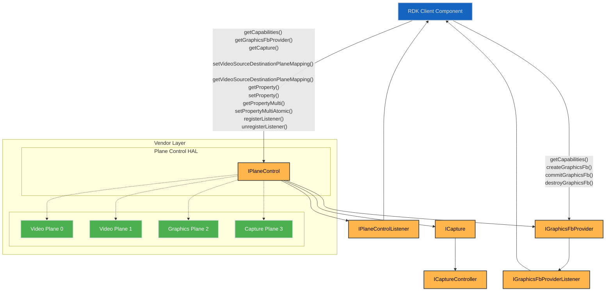
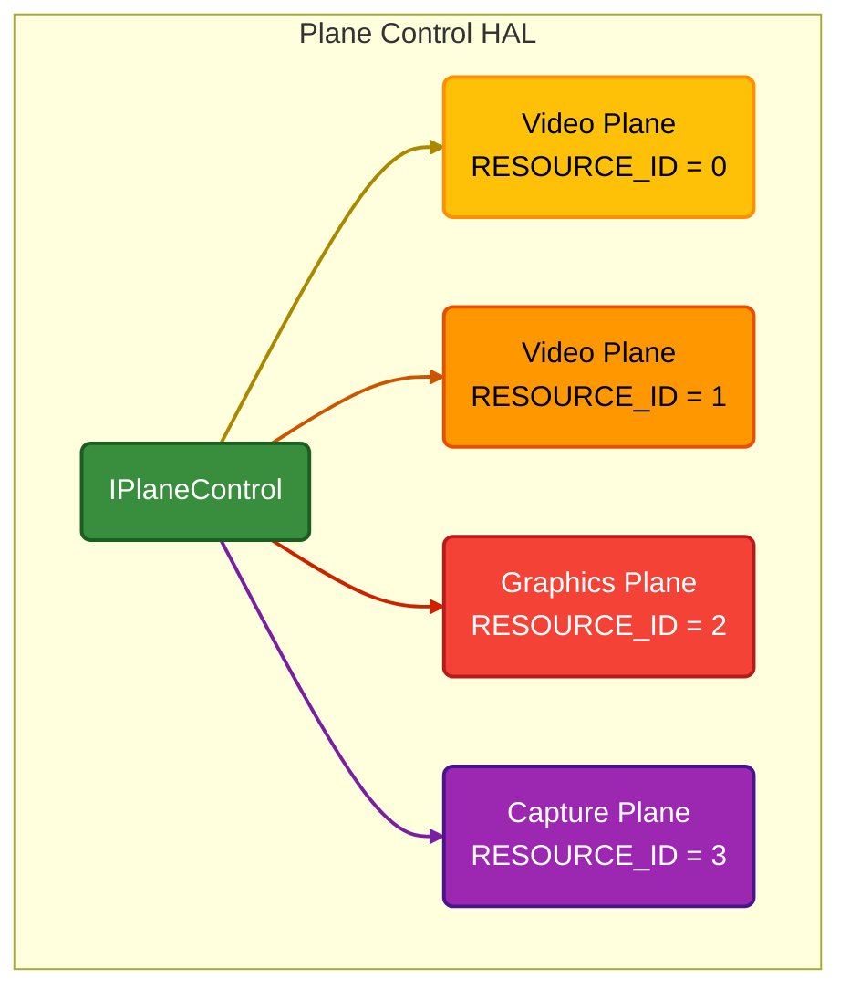
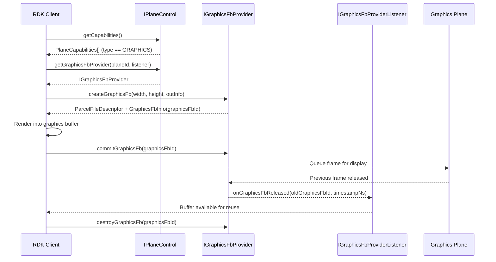
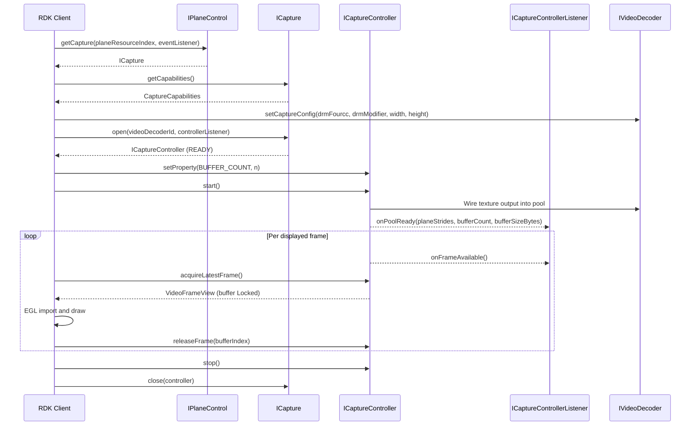
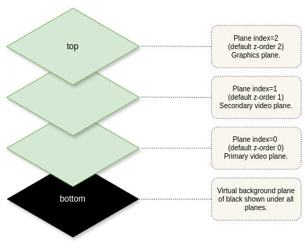
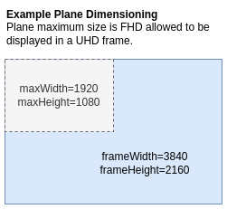

# Plane Control

The Plane Control HAL manages the platform’s video and graphics plane resources, exposing each plane as a resource with readable capabilities.  

It enables linking video sources - such as video sinks, HDMI input, and composite input - to a video plane. For graphics planes, graphics frame buffers are provided through `IGraphicsFbProvider` for EGL-based graphics display.  

Each plane is configurable through a set of properties that clients can read or modify, either individually or in batches.

## References

!!! info References
    |||
    |-|-|
    |**Interface Definition**|[planecontrol/current](https://github.com/rdkcentral/rdk-halif-aidl/tree/main/planecontrol/current)|
    |**Interface Version**|`current`|
    | **API Documentation** | *TBD - Doxygen* |
    |**HAL Interface Type**|[AIDL and Binder](../introduction/aidl_and_binder.md)|
    |**VTS Tests**| [https://github.com/rdkcentral/rdk-halif-binder-test-planecontrol](https://github.com/rdkcentral/rdk-halif-binder-test-planecontrol) |
    |**Reference Implementation - vComponent**|**TBC**|

## Related Pages

!!! tip "Related Pages"
    - [Video Sink](../videosink/video_sink.md)

## Implementation Requirements

|#|Requirement | Comments|
|-|------------|---------|
| **HAL.PLANECONTROL.1** | Shall provide APIs to manage the geometry, z-order, visibility and other properties of graphics and video planes for tunnelled and non-tunnelled operational modes of the video pipeline.|
|**HAL.PLANECONTROL.2** |Shall allow tunnelled video sources from a video decoder/sink, a HDMI input or a composite input to be linked to a video plane for display.|
|**HAL.PLANECONTROL.3** | Shall provide an API to expose the plane resources and their capabilities for a client to discover.|
| **HAL.PLANECONTROL.4** | Shall provide an API to atomically set multiple properties of a plane which take effect at the next available vsync.|
| **HAL.PLANECONTROL.5** | Shall allow only 1 source to be mapped to any given video plane.|
| **HAL.PLANECONTROL.6** | Shall provide an API to atomically update multiple video source to video plane mappings.|
| **HAL.PLANECONTROL.7** | Shall provide a graphics frame buffer provider API for graphics planes where plane type is GRAPHICS. |
| **HAL.PLANECONTROL.8** | Shall provide APIs to create, commit and destroy graphics frame buffers via `IGraphicsFbProvider`.|
| **HAL.PLANECONTROL.9** | Shall notify clients when committed graphics frame buffers are released and available for reuse via `IGraphicsFbProviderListener`.|
| **HAL.PLANECONTROL.10** | Shall provide a decoded frame capture API via `ICapture` for plane resources of type `PlaneType.CAPTURE`, binding a video decoder configured for capture via `videodecoder.CaptureConfig` to a Dma-Buf buffer pool.|
| **HAL.PLANECONTROL.11** | Shall deliver captured frames in the pixel format and size the bound decoder was configured with via `videodecoder.CaptureConfig`, as Dma-Bufs whose per-plane file descriptors, offsets and strides address the actual buffer layout and import directly through `EGL_EXT_image_dma_buf_import` without translation.|
| **HAL.PLANECONTROL.12** | Shall allow decode to proceed at full rate independently of the rate at which the client acquires frames, and shall never re-deliver a frame already returned by `acquireLatestFrame()`.|
| **HAL.PLANECONTROL.13** | Shall fail `ICaptureController.start()` with a `CaptureErrorCode` when the pool cannot be reserved or the bound decoder is not configured for capture, and shall not silently fall back to plane output.|
| **HAL.PLANECONTROL.14** | Shall deliver captured frames at the resolution the stream decodes to and in its source colorimetry, applying no scaling, rotation, crop, colour conversion, tone-mapping or gamma adjustment.| Shape and colour belong to the consumer, which applies them per frame and may change them on any frame. A transform applied here would have to be undone, and one the consumer cannot undo makes the frame unusable. `CaptureConfig.width` and `.height` size the buffers; `VideoFrameView.width` and `.height` report what each frame is. |
| **HAL.PLANECONTROL.15** | Shall drop no more than one frame per 15 seconds of capture, at every resolution from 144p to 2160p, while the client acquires and releases at the presentation cadence.| The capture path is not permitted to lose frames a display plane would have shown. A client that stops releasing is not covered by this — that case is `CaptureCapabilities.stallsWhenPoolExhausted`. |
| **HAL.PLANECONTROL.16** | Shall carry each frame's presentation time unaltered in `VideoFrameView.presentationTimeNs`.| It is the frame's only timing reference. A captured frame goes to the client's scene rather than to a display plane, so the client presents it against the clock its audio path already runs on. |

## Interface Definition

|Interface Definition File | Description|
|--------------------------|------------|
|`IPlaneControl.aidl` | Plane Control HAL interface which provides the central API for video and graphics plane management.|
| `IPlaneControlListener.aidl` | Plane Control listener for callbacks.|
| `IGraphicsFbProvider.aidl` | Graphics frame buffer provider interface for a graphics plane.|
| `IGraphicsFbProviderListener.aidl` | Listener interface for graphics frame release callbacks from the graphics frame buffer provider.|
| `ICapture.aidl` | Decoded frame capture interface for a video plane used as a capture destination.|
| `ICaptureController.aidl` | Capture session controller returned by `ICapture.open()`.|
| `ICaptureControllerListener.aidl` | Listener interface for buffer pool and frame callbacks from a capture session.|
| `ICaptureEventListener.aidl` | Listener interface for capture resource state and error callbacks.|
| `AspectRatio.aidl` | Enum list of aspect ratios.|
| `PlaneCapabilities.aidl` | Parcelable describing a single plane resource capabilities.|
| `GraphicsFbCapabilities.aidl` | Parcelable describing graphics frame buffer provider capabilities for a graphics plane.|
| `GraphicsFbInfo.aidl` | Parcelable describing graphics frame metadata (frame ID, pixel width, pixel height, stride and offset).|
| `CaptureCapabilities.aidl` | Parcelable describing capture capabilities for a video plane.|
| `CaptureErrorCode.aidl` | Enum list of capture error codes.|
| `CaptureProperty.aidl` | Enum list of capture session properties.|
| `CapturePropertyKVPair.aidl` | Parcelable of a single capture property key and value pair.|
| `VideoFrameView.aidl` | Parcelable describing the Dma-Buf addressing of a single captured frame.|
| `PlaneType.aidl` | Enum list of plane types.|
| `Property.aidl` | Enum list of plane properties.|
| `PropertyKVPair.aidl` | Parcelable of a single property key and value pair.|
| `State.aidl` | Enum list of capture resource lifecycle states.|
| `SourcePlaneMapping.aidl` | Parcelable of a single source to plane mapping.|
| `SourceType.aidl` | Enum list of source types used in source plane mapping.|

## Initialization

The [systemd](../vsi/systemd/current/systemd.md) `hal-plane_control.service` unit file is provided by the vendor layer to start the service and should include [Wants](https://www.freedesktop.org/software/systemd/man/latest/systemd.unit.html#Wants=) or [Requires](https://www.freedesktop.org/software/systemd/man/latest/systemd.unit.html#Requires=)  directives to start any platform driver services it depends upon.

The Plane Control service depends on the Service Manager to register itself as a service.

Upon starting, the service shall register the `IPlaneControl` interface with the Service Manager using the String `IPlaneControl.serviceName` and immediately become operational.

## Product Customization

The `IPlaneControl.getCapabilities()` returns an array of `PlaneCapabilities` parcelables to uniquely represent all of the plane resources supported by the vendor layer.

Typically, the plane index (resource ID) value starts at 0 for the first video plane and increments by 1 for each additional video plane, followed by the graphic plane(s).

The `PlaneCapabilities` parcelable returned by the `IPlaneControl.getCapabilities()` function lists all capabilities supported by a plane resource.
- Concurrent control of plane resources is allowed by multiple clients. The RDK middleware is responsible for ensuring only 1 controlling client is active at any given time.

A product that supports decode-to-texture declares one plane resource of type `CAPTURE` per concurrent capture session it can serve, each carrying its buffer pool limits under `captureCapabilities`. Capture planes and video planes are independent resources, so a product declaring both can run a capture session alongside a playback session routed to a display plane, up to the decoder count its video decoder profile declares. A product declaring one must emit frames when the bound decoder has a `videodecoder.CaptureConfig` applied. `IPlaneControl.getCapture()` returns `null` for any plane resource that is not of type `CAPTURE`.

## System Context

The Plane Control service provides functionality to multiple clients which exist inside the RDK middleware.

Typically, video planes are linked to video sources when a GStreamer pipeline is created in the RDK middleware. The geometry of the video planes can be manipulated by the Window Manager through a separate client connection.

Graphics planes may expose `IGraphicsFbProvider` for EGL-based graphics frame rendering and commit.



## Resource Management

The `IPlaneControl` interface provides access to all of the plane resource instances offered by the platform.

Each plane resource instance is assigned a unique integer resource ID or index, which is used in the `IPlaneControl` function calls to indicate which plane is being accessed.

Any number of clients can access the `IPlaneControl` service and access plane settings.

The diagram below shows the relationship between the interface and resource instances.



## Plane Types and Fixed Configuration

For the 2 types of planes (video and graphics) there are fixed configurations which they are expected to hold.

|Plane Type | Fixed Configuration|
|-----------|--------------------|
| **Video** |If there is no video to display on a visible plane, then it shall render transparent black. <br>The z-order is dynamic only for video planes.<br> Primary video plane shall always be listed at resource index 0.|
| **Graphics** |When the plane type is GRAPHICS, `getGraphicsFbProvider()` provides graphics frame creation, commit, and destroy operations.|
| **Capture** |The destination is the client's texture rather than the display, so the plane is never composited: alpha, z-order and display latency do not apply.<br>When the plane type is CAPTURE, `getCapture()` provides decoded frame capture to a Dma-Buf buffer pool.<br>Capture planes are listed after graphics planes.|

## Graphics Frame Providers

- Plane Control supports graphics frame buffers via `IGraphicsFbProvider`.
- Clients should first query `IPlaneControl.getCapabilities()` and confirm the target plane is of type GRAPHICS.
- If supported, clients open the provider using `IPlaneControl.getGraphicsFbProvider()` and use provider APIs to create, render, commit, and destroy frames.

### Graphics Frame Buffer Lifecycle

Use the following sequence for each graphics plane:

1. Discover provider support:
Call `IPlaneControl.getCapabilities()` and confirm the target plane is of type GRAPHICS.
2. Open provider:
Call `IPlaneControl.getGraphicsFbProvider(planeResourceIndex, graphicsFbProviderListener)`.
3. Create one or more frame buffers:
Call `IGraphicsFbProvider.createGraphicsFb(width, height, outInfo)`.
The returned file descriptor is the graphics buffer memory, and `outInfo` provides metadata such as `graphicsFbId`, stride, and offset. Supported format and modifier values are defined in `GraphicsFbCapabilities` and should be obtained via `IGraphicsFbProvider.getCapabilities()`.
4. Render into the buffer:
Use the returned graphics buffer and metadata with the client graphics stack (for example EGL/GL) to draw a frame.
5. Commit for display:
Call `IGraphicsFbProvider.commitGraphicsFb(graphicsFbId)` to queue the frame for presentation.
This call is non-blocking.
6. Reuse released buffers:
Wait for `IGraphicsFbProviderListener.onGraphicsFbReleased(oldGraphicsFbId, timestampNs)` before reusing a previously displayed buffer.
7. Destroy buffers when no longer needed:
Call `IGraphicsFbProvider.destroyGraphicsFb(graphicsFbId)` for each created buffer during shutdown or reconfiguration.

The number of simultaneously created buffers must not exceed `maxGraphicsFrameBuffers`, and created dimensions must not exceed `maxGraphicsFrameBufferWidth` and `maxGraphicsFrameBufferHeight`.



## Video Planes

Video sources (video sinks, HDMI inputs, and composite inputs) can be mapped to destination video planes for presentation.

A video plane can only be mapped to one video source at a time, and any attempt to set additional video sources shall fail.

A call to the `setVideoSourceDestinationPlaneMapping()` allows for multiple sources and planes to be mapped and can perform complex operations such as plane swapping between main and PIP video.

The sequence of calls below shows how main video and PIP video can be mapped separately and then swapped.

### Main Video on Plane 0

- The main video using video sink 0 is displayed on video plane 0. 
- AV playback is started.

```c++
SourcePlaneMapping[] =
{
    sourceType = SourceType::VIDEO_SINK,
    sourceIndex = 0,
    destinationPlaneIndex = 0
}
```

### 2. PIP Video on Plane 1

- The PIP video using video sink 1 is displayed on video plane 1.
- AV playback is started.

```c++
SourcePlaneMapping[] =
{
    sourceType = SourceType::VIDEO_SINK,
    sourceIndex = 1,
    destinationPlaneIndex = 1
}
```

### 3a. Swapping Main and PIP Planes

- First variant: The destination plane indices for main and PIP are swapped in a single call.

```c++
SourcePlaneMapping[] =
{
  sourceType = SourceType::VIDEO_SINK,
  sourceIndex = 0,
  destinationPlaneIndex = 1
},
{
  sourceType = SourceType::VIDEO_SINK,
  sourceIndex = 1,
  destinationPlaneIndex = 0
}
```

### 3b. Unmapping Main and Moving PIP

- Second variant: The destination plane index for PIP is moved to plane 0 and main is unmapped.

```c++
SourcePlaneMapping[] =
{
    sourceType = SourceType::VIDEO_SINK,
    sourceIndex = 0,
    destinationPlaneIndex = -1 // -1 indicates unmapping
},
{
    sourceType = SourceType::VIDEO_SINK,
    sourceIndex = 1,
    destinationPlaneIndex = 0
}
```

## Stopping Video Display

When video is being stopped, the video source must also be unmapped from the plane.

The plane unmapping can technically be performed before or after the video source is stopped.

The `setVideoSourceDestinationPlaneMapping()` function can be used to unmap one or more video sources from planes.

- Video sink 0 is unmapped from plane 0.

```c++
SourcePlaneMapping[]=
{
    sourceType = SourceType::VIDEO_SINK,
    sourceIndex = 0, 
    destinationPlaneIndex = -1
}
```

## Decoded Frame Capture

A capture plane is a plane whose destination is the client's texture rather than the display. It routes a video decoder's output into a pool of Dma-Buf buffers that the client imports as GPU textures. Because that is a routing decision about where a decoder's output goes, a capture destination is discovered and addressed exactly as a display plane is — `IPlaneControl.getCapabilities()` lists it with `type` of `CAPTURE`, and `IPlaneControl.getCapture()` returns its capture interface.

The `IVideoDecoder` contract is unchanged - the decoder does not know where its output goes.

Capture requires the decoder to have a `videodecoder.CaptureConfig` applied — that call is what routes its output to capture. Whether a decoder supports capture at all is `videodecoder.Capabilities.supportedCaptureFourCCs` being non-empty. A video decoder can be bound to at most one capture session at a time.

**The captured frames' pixel format and size are the decoder's, not the plane's.** They are declared in `videodecoder.Capabilities.supportedCaptureFourCCs` / `supportedCaptureModifiers` and configured through `videodecoder.CaptureConfig`. A capture plane consumes what the decoder produces; it does not negotiate a second format, so the two cannot disagree. What the plane declares is how the buffer pool behaves — its depth, whether it is one shared allocation, and what happens when every buffer is locked.

### Capture Session Lifecycle

1. Open the capture resource:
Call `IPlaneControl.getCapabilities()` and find a plane resource of type `CAPTURE`, then `IPlaneControl.getCapture(planeResourceIndex, captureEventListener)`. A product with no capture plane does not support decode-to-texture.
2. Read the buffer pool limits:
Call `ICapture.getCapabilities()` for the maximum buffer count and the behaviour when every buffer is locked.
3. Configure and bind the decoder:
Apply a `videodecoder.CaptureConfig` stating the pixel format and frame size, then call `ICapture.open(videoDecoderId, captureControllerListener)`. The resource transitions `CLOSED` → `OPENING` → `READY`.
4. Configure the buffer pool:
Call `ICaptureController.setProperty(BUFFER_COUNT, n)` while in `READY`. Buffer size is not set here — it follows from the format and frame size the decoder was configured with, plus the vendor's plane alignment, and is reported back at `onPoolReady()`.
5. Start:
Call `ICaptureController.start()`. The pool is reserved, the decoder is wired into it, the resource transitions `READY` → `STARTING` → `STARTED`, and `ICaptureControllerListener.onPoolReady()` delivers the pool addressing.
6. Pull frames:
Call `ICaptureController.acquireLatestFrame()` to take the newest ready frame. It returns `null` rather than blocking when no new frame exists, and never returns the same frame twice. `ICaptureControllerListener.onFrameAvailable()` is an optional wake-up; a client pulling at a known cadence can ignore it.
7. Release each acquired frame:
Call `ICaptureController.releaseFrame(bufferIndex)` with the `VideoFrameView.bufferIndex` value. The call is idempotent and tolerates unknown indices.

Release is keyed by index rather than by address because the two vendor allocation models put a buffer's identity in different places — under a single shared Dma-Buf buffers differ by offset, and under one Dma-Buf per buffer they differ by file descriptor while every offset is 0. The pair `(file descriptor, offset)` would identify a buffer under both, but naming a file descriptor across a binder boundary means passing a `ParcelFileDescriptor` back on every released frame, to name memory the implementation already has open. An index carries the same information in an int, and is the safer key across teardown: a stale index names nothing, where a stale file descriptor names memory that may since have been freed.
8. Stop and close:
Call `ICaptureController.stop()` to unwire the decoder and release the pool, then `ICapture.close(controller)`. The bound decoder is left as it is.

### Buffer Contract

Frames are NV12 linear with truthful per-plane offsets addressing the actual buffer layout, at the resolution the stream decodes to and in its source colorimetry. The decoder applies no scaling, rotation, crop, colour conversion or tone-mapping on this path — shape and colour belong to the consumer, which applies them per frame as it textures the frame onto its scene, and may change them on any frame.

`NV12` and `DRM_FORMAT_MOD_LINEAR` are the required baseline, not the limit. `videodecoder.Capabilities.supportedCaptureFourCCs` is an open list, so a product that can emit a format carrying alpha declares it and a client selects it through `CaptureConfig` — no interface change is needed to support one.

The pixel format and modifier are the decoder's output configuration — see `videodecoder.CaptureConfig`. Both are defined by the Linux kernel in `include/uapi/drm/drm_fourcc.h` and carried as integers because the kernel owns that namespace; the HAL client passes them to its EGL implementation without interpreting them. `VideoFrameView` reports the format on every frame, so an importer needs no second lookup.

`VideoFrameView.planeFds`, `planeOffsets` and `planeStrides` feed `EGL_DMA_BUF_PLANE<N>_FD_EXT`, `EGL_DMA_BUF_PLANE<N>_OFFSET_EXT` and `EGL_DMA_BUF_PLANE<N>_PITCH_EXT` directly, so a frame imports through `EGL_EXT_image_dma_buf_import` without translation.

Each buffer is Free, Ready or Locked. The decoder writes into Free buffers and marks them Ready once the frame is atomically complete; `acquireLatestFrame()` moves the newest Ready buffer to Locked, and the decoder never writes into a Locked buffer. This is a pool rather than a queue — the client always takes the newest, and older Ready buffers it never took are recycled rather than delivered in turn. Decode proceeds at full rate however sparsely or slowly the client acquires. The behaviour when every buffer is Locked is declared per product in `CaptureCapabilities.stallsWhenPoolExhausted`.

Each frame carries the file descriptors and offsets that address it, so a client imports from `VideoFrameView.planeFds` and `planeOffsets` alone and needs to know nothing about how the vendor allocated the pool — one Dma-Buf carved into offset-addressed buffers and one Dma-Buf per buffer are both served by the same client code. A descriptor may repeat across frames, so a client caching EGLImages keys the cache on the descriptor and will see at most `BUFFER_COUNT` distinct ones.

All Dma-Bufs are released on `stop()` and on `close()`.

A pool the platform's video memory region cannot satisfy fails at `start()` with `CaptureErrorCode.OUT_OF_MEMORY`, rather than being silently trimmed.

An unsupported capture format fails earlier, at `videodecoder.IVideoDecoderController.setCaptureConfig()`, while it is still a configuration error rather than a stream of wrong pixels. A pool the platform cannot reserve fails at `start()` with `CaptureErrorCode.OUT_OF_MEMORY`. Neither falls back to plane output.



## Z-Order

The default z-order for planes is linked to their resource ID (index).

The z-order can be changed by setting the `ZORDER` property on a plane.

Higher z-order planes display over the top of lower z-order planes.

A virtual background plane of opaque black or ultra-black (RGB=0,0,0 or YUV=0,0,0) shall be used to display when no plane pixel is visible above it.

The diagram below shows a typical default plane resource configuration for 2 video planes and a single graphics plane.



## Compositor

The compositor is a platform component responsible for blending the raster in the visible planes using z-order and alpha settings to produce a single output display image.

For STB devices the display image is scaled and output over HDMI and for TV devices it is scaled and displayed on the panel.

There is explicit HAL API exposed for the compositor as it is expected to be configured and managed privately by the vendor layer implementation based on the plane properties.

## Plane Dimensions & Geometry Control

When properties affecting the plane geometry are changed by the client, they shall take immediate effect on the next available vsync.

For video planes, if there is already a video frame displayed on a plane that remains visible, then it shall be updated to reflect the new geometry settings.

The frameWidth and frameHeight in the Capabilities specify the pixel coordinate system of the plane reference frame, when used for positioning and scaling the plane.  The plane properties X, Y, WIDTH and HEIGHT are all defined in terms of the reference frame geometry.

The maxWidth and maxHeight specify the maximum size the plane can be scaled to within the reference frame.

While a primary video plane commonly supports full screen display (maxWidth=frameWidth and maxHeight=frameHeight), it may not always be the case for other video planes.

If a plane has a size limitation (e.g. 1/4 screen) then the maxWidth and maxHeight must reflect this limitation. 

There is no limitation on the positioning of a plane within its reference frame.



## Alpha Blending

Where a plane is configured to use a translucent alpha setting (`Property::ALPHA = 1..254`), the porter-duff operation shall be `OVER` using pre-multiplied alpha.

## Plane Display Latency

The `vsyncDisplayLatency` in `PlaneCapabilities` indicates the delay of video or graphics presentation changes before final output.

For example, video planes may have latency incurred by vendor specific PQ pipelines or MEMC processing and graphics planes may have latency incurred by vendor specific double buffering or composition.

Understanding the latencies for each plane is important when performing display synchronisation between different planes.

For example, when subtitles on the graphics plane need to be displayed with a particular video frame the application rendering the subtitles needs to understand any latency difference between a video plane and the graphics plane to compensate for any differences.
