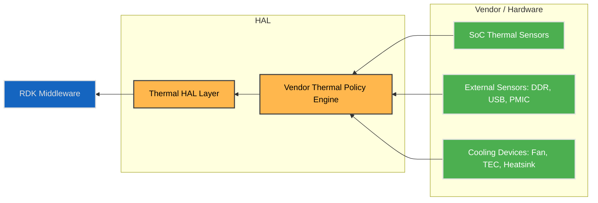
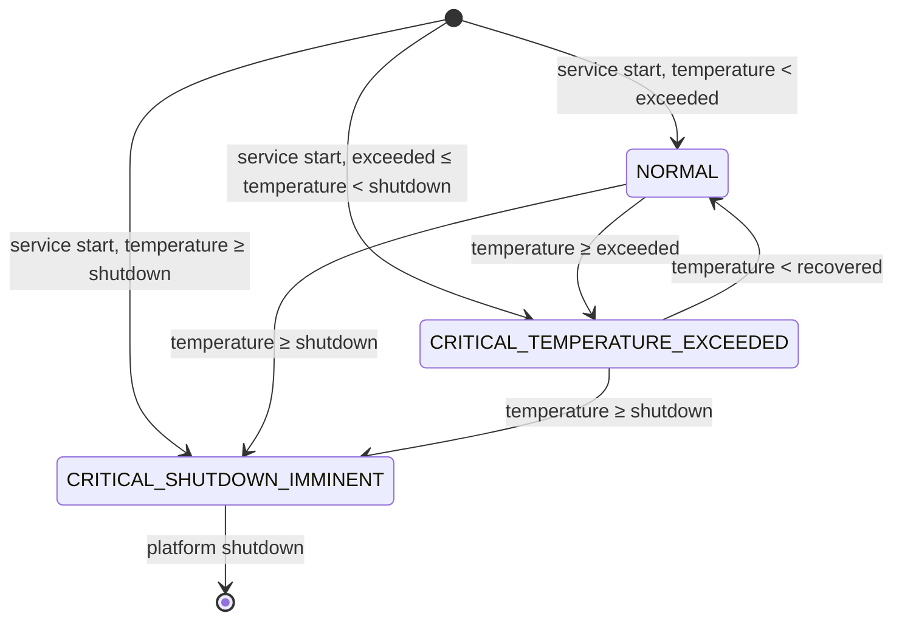
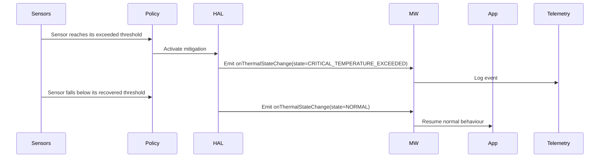
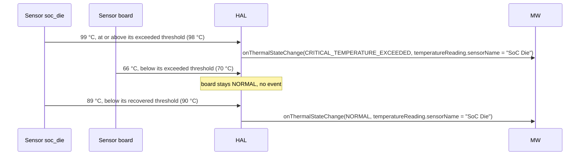
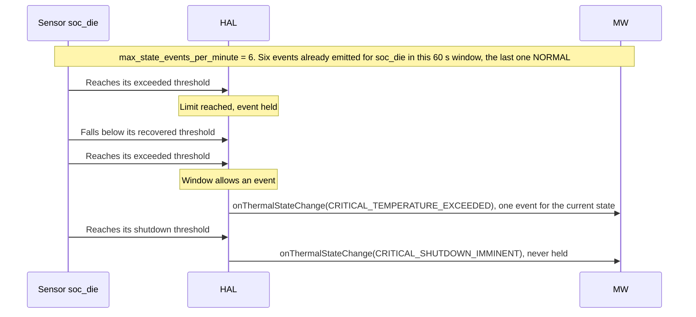
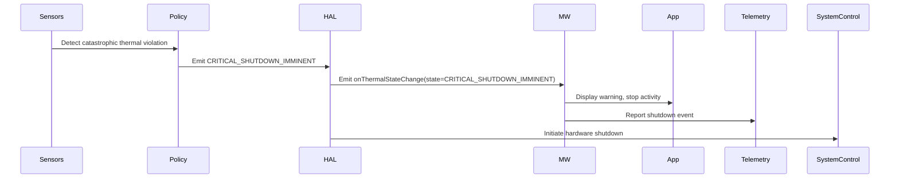

# Thermal Sensor HAL

The **Thermal Sensor HAL** manages platform thermal state signalling for RDK-E devices.
It abstracts the underlying hardware sensors, vendor thermal policy engine, and cooling device behaviour, presenting a unified, event-driven interface to the RDK Middleware.

Thermal thresholds are defined at multiple severity levels, allowing the system or user space components to **receive early warning events** and communicate thermal stress to the user, indicating that the device will shut down if the condition is not rectified.

The vendor thermal policy remains responsible for determining exact threshold values and corresponding mitigation strategies.
When any level is breached, the HAL emits a well-defined `ThermalActionEvent` describing the new thermal condition.

This layered model keeps thermal management flexible across hardware implementations while ensuring consistent signalling behaviour to upper layers.

---

!!! info "References"
    |||
    |-|-|
    |**Interface Definition**|[sensor/current/thermal](https://github.com/rdkcentral/rdk-halif-aidl/tree/main/sensor/current/thermal)|
    |**API Documentation**| *TBD* |
    |**HAL Interface Type**|[AIDL and Binder](../../introduction/aidl_and_binder.md)|
    |**Initialization - TBC**| [systemd](../../vsi/systemd/current/systemd.md) - **hal-sensor-thermal.service** |
    |**VTS Tests**| TBC |

---

!!! tip "Related Pages"
    - [Sensor Motion HAL](../motion/motion_sensor.md)

---

## Overview

The Thermal HAL allows RDK Middleware to receive high-level **thermal action events**, triggered by vendor-defined thermal policies.

### Typical Use Cases

- Prepare for **thermal shutdown** due to high board or SoC temperature  
- Gracefully handle **shutdown** events  
- Collect **telemetry** on thermal behaviour in the field

---

## Implementation Requirements

| # | Requirement | Comments |
|---|--------------|----------|
| **HAL.THERMAL.1** | Shall provide an event-driven API to report vendor-defined thermal state changes to RDK Middleware using the `State` enum. | |
| **HAL.THERMAL.2** | Shall not expose or require Middleware to manage raw temperature thresholds or thermal policy decisions. | |
| **HAL.THERMAL.3** | Shall emit all thermal state change events to registered Middleware clients and support registering / unregistering of such clients. | |
| **HAL.THERMAL.4** | Shall support querying the current thermal state at any time via a `getCurrentThermalState()` API. | |
| **HAL.THERMAL.5** | Shall support optional reporting of current temperature readings for platform sensors via `getCurrentTemperatures()`. | |
| **HAL.THERMAL.6** | Shall provide a `vendorInfo` string field in thermal state change events for vendor-specific debug or telemetry purposes. | |
| **HAL.THERMAL.7** | Shall update `getCurrentThermalState()` coherently with emitted state change events following the [Thermal State Machine](#thermal-state-machine). | Ensures predictable state → event alignment. |

---

## Interface Definition

| Interface Definition File | Description |
| -------------------------- | ------------ |
| `com/rdk/hal/sensor/thermal/IThermalSensor.aidl` | Main service interface for registering listeners and querying state/telemetry. |
| `com/rdk/hal/sensor/thermal/IThermalEventListener.aidl` | One-way callback for thermal state change events. |
| `com/rdk/hal/sensor/thermal/ActionEvent.aidl` | Parcelable event payload, including `state`, `timestampMonotonicMs`, and `temperatureReading`. |
| `com/rdk/hal/sensor/thermal/State.aidl` | Thermal state enumeration: `NORMAL`, `CRITICAL_TEMPERATURE_EXCEEDED`, `CRITICAL_SHUTDOWN_IMMINENT`; `CRITICAL_TEMPERATURE_RECOVERED` is deprecated. |
| `com/rdk/hal/sensor/thermal/TemperatureReading.aidl` | Per-sensor temperature record (°C + timestamp); carried on every state change event. |

---

## Initialization

The [systemd](../../vsi/systemd/current/systemd.md) `hal-sensor-thermal.service` unit file is provided by the vendor layer to start the service and should include  
[`Wants`](https://www.freedesktop.org/software/systemd/man/latest/systemd.unit.html#Wants=) or [`Requires`](https://www.freedesktop.org/software/systemd/man/latest/systemd.unit.html#Requires=) directives to start any platform driver services it depends upon.

Upon starting, the service shall register the `IThermalSensor` interface with the Service Manager using the string `IThermalSensor.serviceName` and immediately become operational.

---

## System Context

The Thermal HAL fits into the system architecture as the **thermal state signalling layer** between **vendor-defined thermal policy engines** and the **RDK Middleware**.

It enables consistent and portable notification of **thermal state changes** to the Middleware and Applications, allowing system UX and behaviour to be adapted accordingly.

The HAL abstracts away the diversity of hardware implementations and thermal policy tuning across platforms, exposing only well-defined thermal state change events to the RDK stack.

## Design Principles

- **Vendor Controls Policy**
  Thermal thresholds, response logic, and mitigation strategies are entirely defined and owned by the **vendor platform**.
  These are established by the **hardware design team** as part of the thermal envelope validation process and are not configurable by RDK middleware.

  The vendor implementation must:

  - Define and enforce temperature thresholds approved for the hardware design.
  - Ensure the platform behaves **deterministically** when limits are exceeded.
  - Apply any platform-specific **thermal regulation or mitigation** automatically (e.g. fan control) if supported.
  - Trigger a **system-controlled shutdown** when required — this action is outside the control of upper software layers.
  - Update the vendor HAL layer if observed behaviour deviates from validated specifications.

  In essence, thermal compliance is a **hardware validation responsibility**, not a runtime tuning exercise. The HAL exposes events and telemetry for visibility — it does **not** make policy decisions.

- **HAL Emits State Change Events**

  This standardizes how temperature and mitigation state changes are reported.
  Events carry portable, structured data that allows middleware to log, visualize, or correlate system behaviour without influencing platform policy.

- **Middleware Acts on Events**

  Middleware may use events for **UX adaptation**, **application awareness**, or **telemetry**, but it does not modify hardware thresholds or take control actions.
  The separation ensures deterministic hardware behaviour even if middleware is delayed or offline.

- **Telemetry Optional**

  Middleware may periodically query temperature sensors for analytics or backend reporting.
  This is an optional diagnostic feature — it must not interfere with the vendor’s thermal control mechanisms.

- **Platform-Specific Cooling Technologies Supported**

  The HAL design accommodates vendor-unique mitigation strategies (e.g. fan profiles, passive heat spreading).
  Such features remain internal to the vendor implementation but are surfaced via standardized event types for consistent observability.

- **Explicit Shutdown Signalling**

  When a thermal limit forces a platform-controlled shutdown, the HAL must emit a final state change event indicating that condition.
  This provides clear auditability and compliance traceability for safety and user-experience requirements.



---

### Thermal Policy Ownership

| Aspect                 | Owner                 |
| ---------------------- | --------------------- |
| Sensor thresholds      | Vendor                |
| Policy decisions       | Vendor                |
| Cooling device control | Vendor                |
| State change signalling | HAL                  |
| Middleware reaction    | RDK Middleware        |
| App reaction           | Applications (via MW) |

---

## Thermal States

The Thermal HAL exposes a small, extensible set of **thermal states**, represented by the **`State`** enum.

These states represent high-level system thermal conditions determined by the platform's vendor-defined Thermal Policy Engine.

They enable general principles of:

- Managing application behaviour
- Logging and reporting field telemetry
- Supporting regulatory and UX requirements

The HAL emits state change events containing these states, abstracting away platform-specific thresholds and control logic.

### State Enum

```aidl
enum State {
    NORMAL = 0,
    CRITICAL_TEMPERATURE_EXCEEDED = 1,
    CRITICAL_TEMPERATURE_RECOVERED = 2,
    CRITICAL_SHUTDOWN_IMMINENT = 3
}
```

---

## Thermal State Machine

Each thermal sensor declared in the HFP has its own state machine. The product's thermal specification decides when each transition occurs; the sensor's HFP `triggers` declare the thresholds it uses.



`recovered`, `exceeded` and `shutdown` are the sensor's HFP `triggers` values (`critical_temperature_recovered_celsius`, `critical_temperature_exceeded_celsius`, `entering_critical_shutdown_celsius`).

| State | Meaning | Entered when |
| --- | --- | --- |
| **NORMAL** | No mitigation active; the sensor is within safe thermal limits. | Service start with the temperature below the exceeded threshold; or the temperature falls below the recovered threshold while in `CRITICAL_TEMPERATURE_EXCEEDED`. |
| **CRITICAL_TEMPERATURE_EXCEEDED** | Critical temperature reached; vendor mitigation active where supported. | The temperature reaches the exceeded threshold; or service start with the temperature at or above the exceeded threshold and below the shutdown threshold. |
| **CRITICAL_TEMPERATURE_RECOVERED** | Deprecated. | Not entered. |
| **CRITICAL_SHUTDOWN_IMMINENT** | Forced thermal shutdown in progress. Terminal. | The temperature reaches the shutdown threshold, including at service start. |

- Between the recovered and exceeded thresholds the state does not change.
- Each `onThermalStateChange()` event carries the sensor's new state and its `temperatureReading`, which identifies the sensor and is always set.
- The HAL emits no more than the sensor's HFP `policy.max_state_events_per_minute` events for that sensor in any 60 s window. A transition that would exceed the limit is not emitted at once: when the limit next allows an event, the HAL emits one event carrying the sensor's current state, if that differs from the state last emitted for the sensor. `CRITICAL_SHUTDOWN_IMMINENT` is always emitted immediately.

---

## Interaction Flow Examples

### Normal Operation



---

### Independent Sensors



---

### Event Rate Limit



---

### Critical Shutdown Path



---

## Platform Policy Metadata

Vendors **may** define platform-specific thermal policy hints in the hardware configuration (HFP) for reference and telemetry use.

```yaml
sensor:
  thermal:
    - id: "soc_die"
      sensorName: "SoC Die" # Used in com.rdk.hal.sensor.thermal/TemperatureReading.aidl
      location: "CPU"       # Used in com.rdk.hal.sensor.thermal/TemperatureReading.aidl

      # -------------------------------------------------------------------------
      # SENSOR CHARACTERISTICS
      # -------------------------------------------------------------------------
      # sensor_reading_range_celsius:
      #   Absolute measurable range of the physical sensor. These limits are
      #   hardware-defined and represent what the ADC/IC can report, not what is
      #   considered safe for operation.
      sensor_reading_range_celsius:
        min: -40
        max: 125

      # operational_temperature_celsius:
      #   Normal safe operating envelope for the platform under steady-state load.
      #   Middleware should regard this as the “normal zone”.
      #   Anything above the max here enters mitigation or alarm territory.
      operational_temperature_celsius:
        min: -20
        max: 95

      # -------------------------------------------------------------------------
      # POLICY TRIGGER POINTS
      # -------------------------------------------------------------------------
      # The trigger values define how the vendor policy transitions between
      # State values. They MUST satisfy:
      #   recovered  <  exceeded  <  shutdown
      #
      # • critical_temperature_recovered_celsius :
      #       Threshold below which the sensor returns from
      #       CRITICAL_TEMPERATURE_EXCEEDED to NORMAL.
      # • critical_temperature_exceeded_celsius :
      #       Point at which CRITICAL_TEMPERATURE_EXCEEDED is emitted and
      #       mitigation (if supported) becomes active.  This is usually a few
      #       degrees ABOVE operational max to allow early warning.
      # • entering_critical_shutdown_celsius :
      #       Hard limit at which CRITICAL_SHUTDOWN_IMMINENT is emitted and
      #       hardware shutdown is initiated.
      #
      # Between the recovered and exceeded thresholds the state does not change.
      triggers:
        critical_temperature_recovered_celsius: 90
        critical_temperature_exceeded_celsius: 98
        entering_critical_shutdown_celsius: 115

      # • max_state_events_per_minute :
      #       Maximum onThermalStateChange() events for this sensor in any
      #       60 s window. Recommended: 6.
      policy:
        shutdown_min_downtime_s: 900
        max_state_events_per_minute: 6

      vendor:
        vendorCode: 1001  # Used in com.rdk.hal.sensor.thermal/TemperatureReading.aidl
        vendorInfo: "Primary die sensor used for critical trip points." # Used in com.rdk.hal.sensor.thermal/TemperatureReading.aidl

    - id: "board"
      sensorName: "Mainboard Ambient" # Used in com.rdk.hal.sensor.thermal/TemperatureReading.aidl
      location: "Board"           # Used in com.rdk.hal.sensor.thermal/TemperatureReading.aidl

      # Absolute measurable range of this sensor device.
      sensor_reading_range_celsius:
        min: -20
        max: 80

      # Expected steady-state board temperature range under normal conditions.
      operational_temperature_celsius:
        min: 0
        max: 65

      # Trigger thresholds for this domain.
      #   Recovered < Exceeded < Shutdown  (must hold true)
      triggers:
        critical_temperature_recovered_celsius: 60
        critical_temperature_exceeded_celsius: 70
        entering_critical_shutdown_celsius: 72   # ~10% below sensor max

      policy:
        shutdown_min_downtime_s: 600
        max_state_events_per_minute: 6

      vendor:
        vendorCode: 1002  # Used in com.rdk.hal.sensor.thermal/TemperatureReading.aidl
        vendorInfo: "Used for general system thermal monitoring." # Used in com.rdk.hal.sensor.thermal/TemperatureReading.aidl
```
