# Yocto integration

Everything an integrator needs to build and consume the RDK HAL AIDL interface
libraries — plus the tests that prove the contract works.

**Named `-aidl` throughout** (layer, recipe, packages, install paths) so nothing
here is ever confused with the legacy C HAL (`rdk-halif-*`) it coexists with
during migration.

## What is what

| Path | Yours to use? | Purpose |
| ---- | ------------- | ------- |
| `meta-rdk-halif-aidl/` | **yes** | the consumable layer — one `rdk-halif-aidl` recipe, one package per component |
| `meta-vendor/`, `meta-mw/` | **as examples** | role build-config + a worked consumer recipe each |
| `bitbake/` | **as a test** | runs *real* BitBake on the recipe in a container and asserts the packaging + staging. See its [README](bitbake/README.md). |
| `ci/` | **as a test** | offline emulation of the build loop (no BitBake) for fast contract checks |

## How it works

The recipe installs every component to one place — the **mount point**
(`/vendor/rdk-halif-aidl` or `/mw/rdk-halif-aidl`, chosen by `HALIF_MOUNT_POINT`).
That single mount feeds both surfaces: it is **staged** into a consumer's sysroot
for build-time linking, and **packaged** onto the device rootfs at runtime.

```mermaid
flowchart TD
    SRC["rdk-halif-aidl source<br/>pre-generated C++, per component × version"] --> CMP
    CMP["do_compile — cmake builds<br/>lib&lt;comp&gt;-v&lt;ver&gt;-cpp.so"] --> INST
    INST["do_install → the mount point<br/>&#36;{HALIF_MOUNT_POINT}/rdk-halif-aidl"]
    INST --> STG
    INST --> PKG
    STG["do_populate_sysroot<br/>SYSROOT_DIRS stages the whole mount"] --> SY["consumer recipe-sysroot<br/>&#36;{STAGING_DIR_HOST}/vendor/rdk-halif-aidl/<br/>· lib*-cpp.so &nbsp; · include/"]
    PKG["do_package — split"] --> P1["rdk-halif-aidl-&lt;comp&gt;<br/>the .so → /vendor/rdk-halif-aidl (device)"]
    PKG --> P2["rdk-halif-aidl-&lt;comp&gt;-dev<br/>headers under include/ (staging only)"]
    PKG --> P3["rdk-halif-aidl-dbg<br/>all debug symbols"]
```



Staging is **role-partitioned on purpose**: vendor and middleware carry different
versions of the same component, so each role stages to its own mount and their
libraries never share a path.

```mermaid
flowchart LR
    subgraph VB["vendor build — HALIF_MOUNT_POINT=/vendor"]
        VH["rdk-halif-aidl<br/>vendor cohort"] --> VM["/vendor/rdk-halif-aidl<br/>libcommon-v0.2.0.0-cpp.so"]
    end
    subgraph MB["mw build — HALIF_MOUNT_POINT=/mw"]
        MH["rdk-halif-aidl<br/>mw cohort"] --> MM["/mw/rdk-halif-aidl<br/>libcommon-v0.3.0.0-cpp.so"]
    end
    VM --> VC["vendor consumer<br/>-L&#8230;/vendor/rdk-halif-aidl"]
    MM --> MC["mw consumer<br/>-L&#8230;/mw/rdk-halif-aidl"]
```



## Layout: staging vs target

Both trees are the same role mount; they differ in what rides along. A vendor
build of `hdmicec@0.1.0.0` (which imports `common@0.2.0.0`):

**Staging** — the consumer's build-time sysroot (`DEPENDS = "rdk-halif-aidl"`).
Libraries *and* headers, for compiling and linking:

```
${STAGING_DIR_HOST}/                              the consumer's recipe-sysroot
└── vendor/
    └── rdk-halif-aidl/                           ← -L${STAGING_DIR_HOST}/vendor/rdk-halif-aidl
        ├── libhdmicec-v0.1.0.0-cpp.so            link: -lhdmicec-v0.1.0.0-cpp
        ├── libcommon-v0.2.0.0-cpp.so             link: -lcommon-v0.2.0.0-cpp
        └── include/                              ← -I…/include/<comp>/<ver>/include
            ├── hdmicec/0.1.0.0/include/com/rdk/hal/hdmicec/
            │   ├── IHdmiCec.h
            │   ├── BnHdmiCec.h
            │   └── …
            └── common/0.2.0.0/include/com/rdk/hal/
                └── …
```

**Target** — the device rootfs (`IMAGE_INSTALL` / `RDEPENDS`). Libraries only;
the mount is a real partition, so this is not an FHS `/usr/lib` layout:

```
/                                                 device rootfs
├── vendor/
│   └── rdk-halif-aidl/                           the role mount (a partition)
│       ├── libhdmicec-v0.1.0.0-cpp.so            pkg rdk-halif-aidl-hdmicec
│       └── libcommon-v0.2.0.0-cpp.so             pkg rdk-halif-aidl-common
└── usr/
    └── bin/
        └── vendor-halif-example                  the consumer binary
```

An `mw` build is identical with `/mw/rdk-halif-aidl` in place of
`/vendor/rdk-halif-aidl`, carrying its own cohort's versions.

## Consume it

Add the layer and install the components you need:

```bitbake
BBLAYERS += "${TOPDIR}/../rdk-halif-aidl/tests/yocto/meta-rdk-halif-aidl"
IMAGE_INSTALL:append = " rdk-halif-aidl-common rdk-halif-aidl-avclock"
```

The Binder SDK comes from the `linux-binder` recipe (`linux_binder_idl`). Pin
`SRCREV` in `meta-rdk-halif-aidl/recipes-halif/rdk-halif-aidl/rdk-halif-aidl.bb`
to a released tag for reproducible builds.

## What you get

One package per component, plus its headers. `<role>` is the mount
`HALIF_MOUNT_POINT` selects (`/vendor` or `/mw`):

```
/<role>/rdk-halif-aidl/lib<comp>-v<ver>-cpp.so                    → rdk-halif-aidl-<comp>       (device + sysroot)
/<role>/rdk-halif-aidl/include/<comp>/<ver>/include/com/rdk/hal/… → rdk-halif-aidl-<comp>-dev   (sysroot only)
```

Concretely, a vendor build for `hdmicec@0.1.0.0` (which imports `common@0.2.0.0`):

```
/vendor/rdk-halif-aidl/libhdmicec-v0.1.0.0-cpp.so
/vendor/rdk-halif-aidl/libcommon-v0.2.0.0-cpp.so
/vendor/rdk-halif-aidl/include/hdmicec/0.1.0.0/include/com/rdk/hal/hdmicec/IHdmiCec.h
/vendor/rdk-halif-aidl/include/common/0.2.0.0/include/com/rdk/hal/…
```

**Why the version appears where it does:** it is in the library *name* (and its
`SONAME`), so libraries for several versions sit side by side in one flat
directory and you link an exact one. Headers have no version in the filename —
`BnPropertyValue.h` is the same name in every version — so for headers the
version lives in the *path*.

The `include/` subdir belongs to the `-dev` package, which stages into the build
sysroot; the device rootfs carries the libraries only.

## Consuming from your recipe

```bitbake
DEPENDS        = "rdk-halif-aidl linux-binder"      # stages the role mount
RDEPENDS:${PN} = "rdk-halif-aidl-hdmicec rdk-halif-aidl-common"

# The mount point you build against — match the one the HAL was built with.
HALIF_MOUNT_POINT ?= "/vendor"
HALIF_STAGED       = "${STAGING_DIR_HOST}${HALIF_MOUNT_POINT}/rdk-halif-aidl"

# The Binder SDK, staged by linux-binder at non-standard subdirs. Required: the
# generated Bn/Bp headers #include <binder/*.h>, and the libs link libbinder/libutils.
CXXFLAGS += "-I${HALIF_STAGED}/include/hdmicec/0.1.0.0/include -I${STAGING_INCDIR}/binder_sdk"
LDFLAGS  += "-L${HALIF_STAGED} -lhdmicec-v0.1.0.0-cpp -L${STAGING_LIBDIR}/binder -lbinder -lutils"
```

then include by the AIDL namespace:

```cpp
#include <com/rdk/hal/hdmicec/IHdmiCec.h>
```

Link the same versions the `rdk-halif-aidl` recipe built (its
`HALIF_VERSIONS_FILE`) — the `.so` you link must be the one on the rootfs.

Worked examples, which you can copy the shape of:

- `meta-vendor/recipes-example/vendor-halif-example/` — **server**: subclass the
  generated `Bn<Interface>` stub and register the service
- `meta-mw/recipes-example/mw-halif-example/` — **client**: look the service up
  and gate newer calls on `getInterfaceVersion()`

Client and server link the *same* interface library; the role difference is what
the code does, not how it builds.

## Choosing what gets built

The recipe builds `HALIF_COMPONENTS` at the versions in `HALIF_VERSIONS_FILE`:

| Variable | Default | Meaning |
| -------- | ------- | ------- |
| `HALIF_COMPONENTS` | every released component (`halif-components.inc`) | which components to build |
| `HALIF_VERSIONS_FILE` | `${S}/versions_released.yaml` | which version of each |
| `HALIF_MOUNT_POINT` | `/vendor` | the target + staging **mount point** (the partition: `/vendor` or `/mw`) |
| `HALIF_LIBDIR` | `${HALIF_MOUNT_POINT}/rdk-halif-aidl` | mount + module dir — libraries, staged and installed |
| `HALIF_INCDIR` | `${HALIF_LIBDIR}/include` | header staging dir, under the mount |

Every version of every component is committed side by side in the source, so
`HALIF_VERSIONS_FILE` *selects* — it does not fetch. See `meta-vendor/conf/halif-vendor.inc`
and `meta-mw/conf/halif-mw.inc` for role configs to `require` from your
`local.conf`/distro. A platform whose mounts differ overrides `HALIF_LIBDIR`
outright.

### Dependencies resolve automatically, at the version each consumer links

You name only the components you *want*; their dependencies are pulled in
automatically (the transitive closure), so `common` is never listed by hand:

```bitbake
HALIF_COMPONENTS = "hdmicec"     # builds hdmicec AND the common it links
```

The closure is keyed by **(component, version)**, so different versions of one
dependency coexist in a single build — the version lives in the `.so` name, so
they sit side by side. If two consumers pin different versions:

```bitbake
HALIF_COMPONENTS = "audiodecoder:0.1.0.0 hdmicec:0.1.0.0"
```

`audiodecoder@0.1.0.0` links `common@0.1.0.0` while `hdmicec@0.1.0.0` links
`common@0.2.0.0`, so **both** commons are built and land in the
`rdk-halif-aidl-common` package (`libcommon-v0.1.0.0-cpp.so` and
`libcommon-v0.2.0.0-cpp.so`). Each consumer's runtime dependency resolves to the
exact version it links.

## Running the tests

**Real BitBake** — builds + packages the recipe in a container and asserts the
packaging and staging (including a consumer that links against the staged HAL):

```bash
./tests/yocto/bitbake/run.sh
```

**Offline** (`ci/`) — no BitBake, no AIDL toolchain; each uses a fresh temporary
work dir:

```bash
./tests/yocto/ci/yocto_staging_check.sh    # inter-module staging + negative control
./tests/yocto/ci/yocto_build_each.sh       # every component built individually
./tests/yocto/ci/yocto_build_vendor.sh     # full HAL, vendor role
./tests/yocto/ci/yocto_build_mw.sh         # full HAL, MW role
```

`test.sh` Test 12 runs the component-list check, the staging check and both role
builds; Test 13 runs the per-component build.

The default component list is generated — never hand-edit it:

```bash
./tests/yocto/meta-rdk-halif-aidl/gen_recipes.py           # regenerate
./tests/yocto/meta-rdk-halif-aidl/gen_recipes.py --check   # CI guard
```

Relocating the libraries needs no snapshot edits — each snapshot's install
destination is an overridable input:

```bash
cmake -S <comp>/<ver> -B <build> -DHALIF_INSTALL_LIBDIR=lib64/rdk-halif-aidl
```

See [`docs/standards/build_integration.md`](../../docs/standards/build_integration.md)
for the full integration contract.
