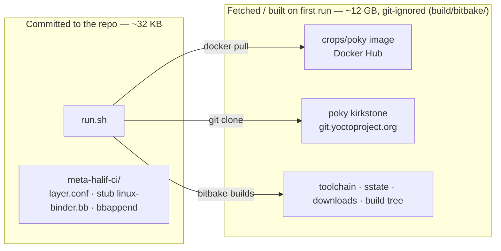
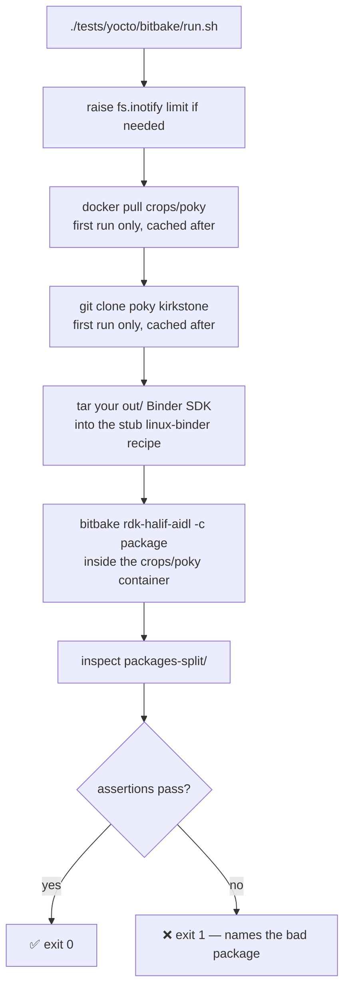
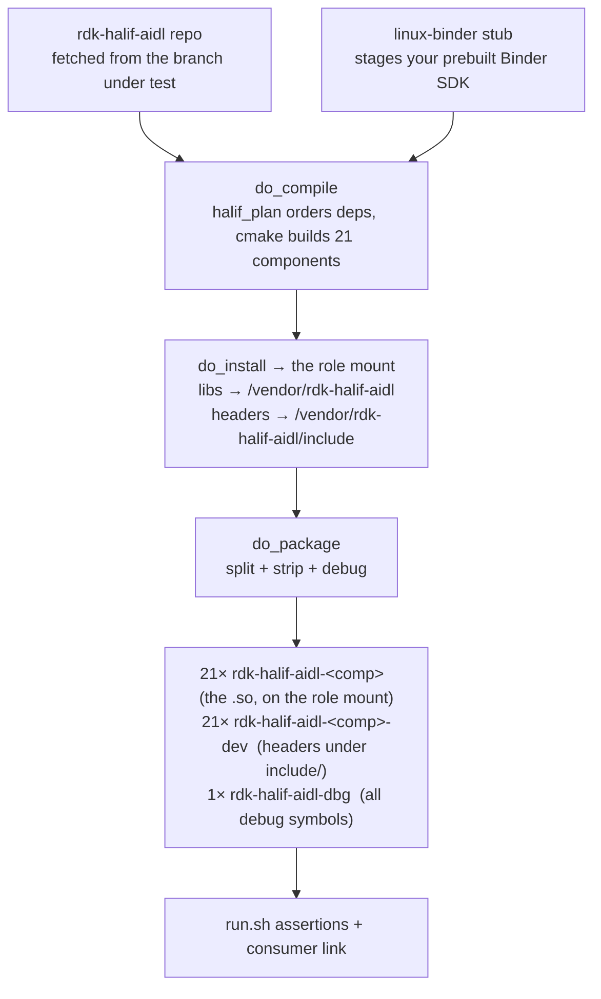

# Real bitbake packaging test

Everything under `tests/yocto/ci/` emulates the build *offline* - it proves the
components compile and stage, but it cannot see BitBake packaging (`do_install`,
`do_package`, the `PACKAGES`/`FILES` split, `-dbg`). Packaging bugs therefore
reached integrators instead of us.

`run.sh` closes that gap: it runs **real bitbake** on the `rdk-halif-aidl` recipe
in a container and **asserts the packaging is correct**. It already earned its
keep - it found that the per-component `-dbg` split did not work (OE puts every
`.debug` file in the first `-dbg` package, so 20 shipped empty), now fixed to a
single `rdk-halif-aidl-dbg`.

## Nothing large is committed - it is all fetched on first run

The repo carries **~32 KB of scripts**. Everything heavy - the container image,
poky, the toolchain, sstate - is downloaded or built on the **first run** into
`build/bitbake/` (~12 GB), a git-ignored build-output tree. No Dockerfile, no
tarballs, no binaries committed.



## How a run flows



## What bitbake actually does to the recipe



## Run it

```bash
./tests/yocto/bitbake/run.sh
```

The first run builds a cross toolchain from source (~an hour); every run after is
cached (minutes). Options:

| Env | Effect |
| --- | ------ |
| `HALIF_BB_EACH=1`      | sweep: build **each** component on its own through real bitbake |
| `HALIF_BB_COMPONENTS=` | build only a subset; the planner adds each one's dependency closure |
| `HALIF_BB_CLEAN=1`     | force a clean re-fetch + rebuild of the recipe |
| `HALIF_TEST_BRANCH=`   | test a different branch (default: the #661 branch) |
| `HALIF_BB_WORK=`       | put the (large) build tree somewhere else |

`HALIF_BB_COMPONENTS` exercises the closure resolution: `"hdmicec"` builds hdmicec
plus the `common` it links, and `"audiodecoder:0.1.0.0 hdmicec:0.1.0.0"` builds
BOTH `common` versions those two consumers pin — the assertions confirm the
`rdk-halif-aidl-common` package then holds both `.so`.

`HALIF_BB_EACH=1` is the **per-component sweep**: it builds every component (with
its dependency closure) one at a time, asserting each packages its own `.so` on
the mount. Only the `rdk-halif-aidl` recipe is cleaned between components
(`bitbake -c clean`), so the cross toolchain, the Binder SDK and the downloads are
built once and reused — the first component is slow, the rest quick. This is the
bitbake counterpart of the offline `yocto_build_each.sh`, and runs as `test.sh`
Test 14 (skipped where docker or the Binder SDK is absent, or with
`HALIF_SKIP_BITBAKE=1`).

## Prerequisites

- **docker** (the image is pulled at first run; nothing to install)
- the **Binder SDK built** (`./build_binder.sh` → `out/`) - the stub recipe
  stages it so we do not reproduce the whole RDK layer stack
- **`fs.inotify.max_user_instances` >= 512** - a standard Yocto requirement;
  bitbake's parser fails without it. `run.sh` raises it if it can (passwordless
  sudo), otherwise it prints the one command to run. Persist it in
  `/etc/sysctl.d/`.

## What it asserts

After a green `do_package`, on the produced `packages-split/`:

1. one **`rdk-halif-aidl-<comp>`** per component, each holding exactly its own
   `lib<comp>-v<ver>-cpp.so` on the role mount (`/vendor/rdk-halif-aidl/` etc.)
2. a matching **`rdk-halif-aidl-<comp>-dev`** holding that component's headers
   under the role mount's `include/` subdir
3. exactly one **`rdk-halif-aidl-dbg`**, holding every component's debug library
   (no empty `-dbg` packages)

Then it builds **`vendor-halif-example`** — a real consumer with
`DEPENDS = "rdk-halif-aidl"` that links `-lhdmicec`/`-lcommon` from the role
mount. This only compiles if `SYSROOT_DIRS` staged the mount into its sysroot, so
it is the regression guard for the staging path: a broken stage fails the
consumer's `do_compile`.

## How it is wired

```
tests/yocto/bitbake/
├── run.sh                 the test: docker + poky + bitbake + assertions
├── README.md
├── .gitignore             ignores the staged binder tarball (work tree is in build/)
└── meta-halif-ci/         a minimal layer that exists only for CI
    ├── conf/layer.conf
    ├── recipes-binder/linux-binder/       stub: stages the prebuilt Binder SDK
    │                                       so the recipe's DEPENDS resolves
    └── recipes-halif/rdk-halif-aidl/
        └── rdk-halif-aidl.bbappend         fetches the branch under test
```

The recipe itself lives in the consumable layer `tests/yocto/meta-rdk-halif-aidl/`
and is fetched from git (not `externalsrc` - that broke fakeroot for `do_package`
and hashed the in-repo build tree). To test a local commit, push it and point
`HALIF_TEST_BRANCH` / the bbappend `SRCREV` at it.

`run.sh` also adds `tests/yocto/meta-vendor/`, whose `vendor-halif-example` recipe
is the consumer built as the staging regression guard.
