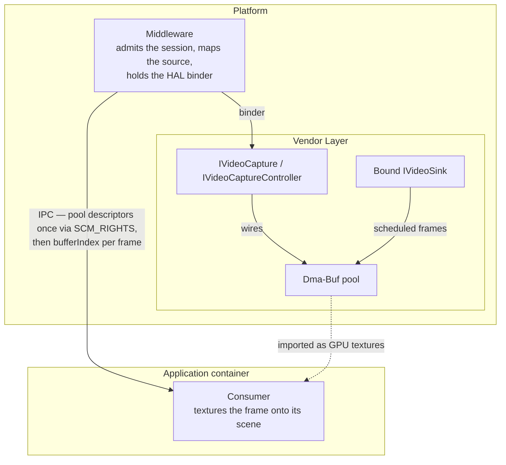
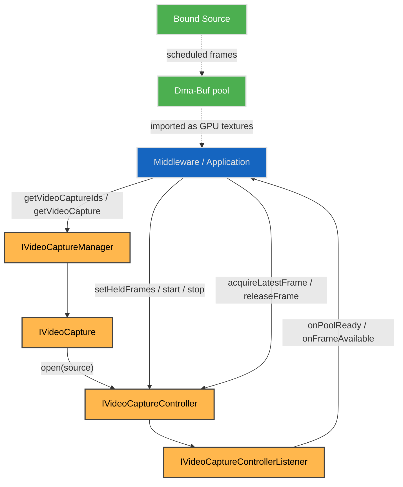
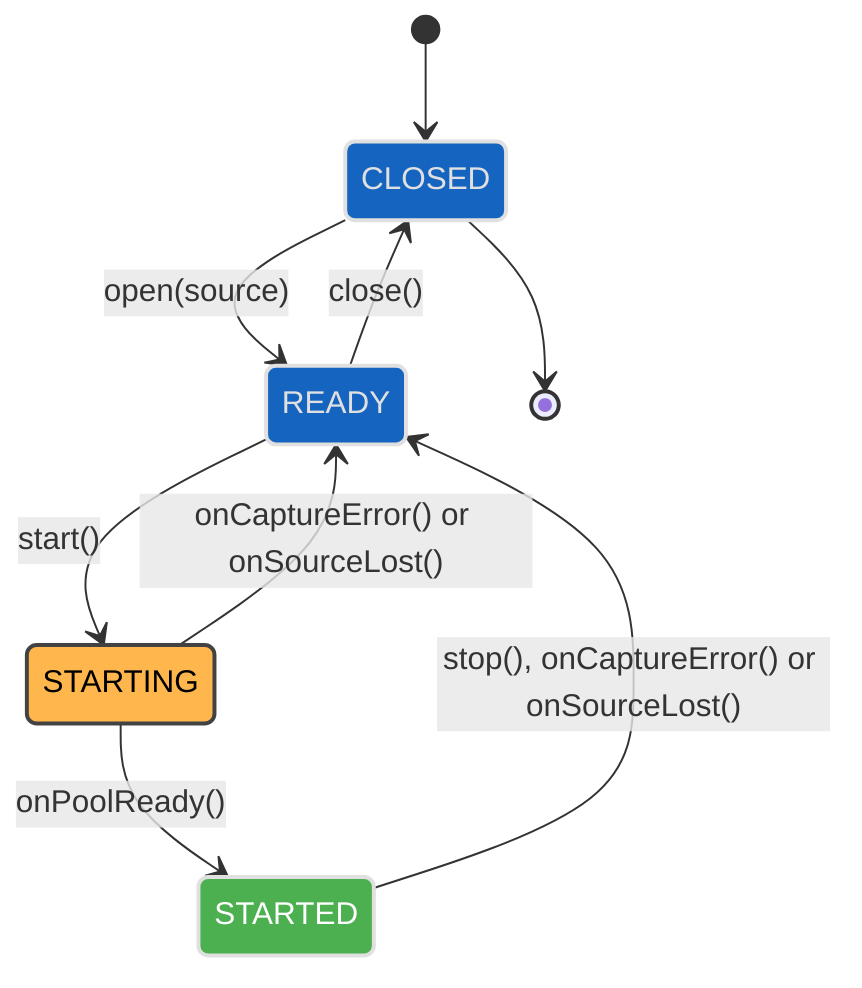
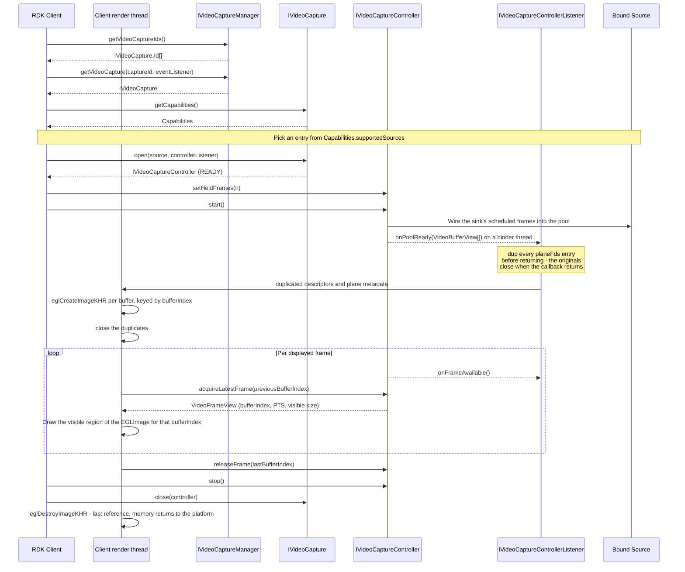
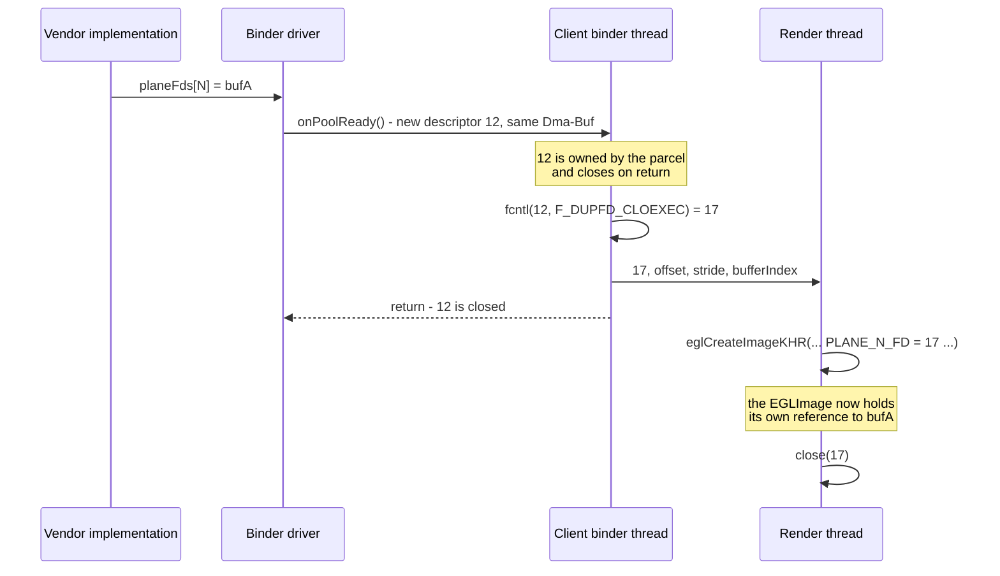
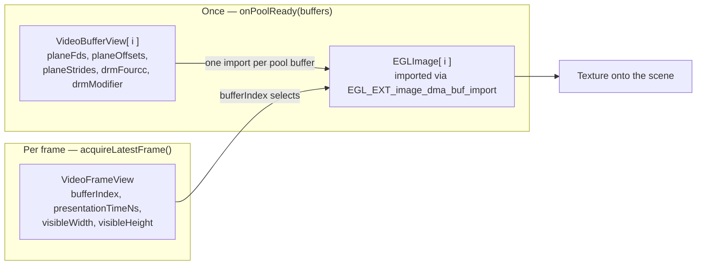

# Decoded Frame Capture

A capture is an output in its own right, bound to a stage of the pipeline. This page is the contract for capturing a decoded video source into Dma-Buf buffers a client imports as GPU textures.

## References

!!! info References
    |||
    |-|-|
    |**Interface Definition**|[videocapture/current/com/rdk/hal/videocapture](https://github.com/rdkcentral/rdk-halif-aidl/tree/main/videocapture/current/com/rdk/hal/videocapture)|
    |**Interface Version**|`current`|
    |**Package**|`com.rdk.hal.videocapture`|
    |**HAL Interface Type**|[AIDL and Binder](../introduction/aidl_and_binder.md)|
    |**VTS Tests**| [https://github.com/rdkcentral/rdk-halif-binder-test-videocapture](https://github.com/rdkcentral/rdk-halif-binder-test-videocapture) |

## Related Pages

!!! tip "Related Pages"
    - [Video Decoder](../videodecoder/video_decoder.md)
    - [Video Sink](../videosink/video_sink.md)

## Functionality

A capture takes frames from one stage of the pipeline and delivers them into a pool of Dma-Buf buffers the client imports as GPU textures. It is an output in its own right, not a destination inside another module's model: it is discovered through `IVideoCaptureManager.getVideoCaptureIds()` and addressed by its own `IVideoCapture.Id`.

**The binding is the session.** `IVideoCapture.open()` names the source to take frames from — one arm of `Source`, naming a particular sink by its own ID — and that source is what the session delivers for its lifetime. A source may have a display path, a capture, both or neither; none of those is a special case, and a capture never needs a display destination in order to exist.

**A capture is served the frame its sink would be presenting.** The sink is where the estate's presentation scheduling lives — the AV Clock attaches there, and the frame due now is the frame it has already worked out. A capture is a second consumer of that same scheduled stream, so what a frame means is whatever it means at that sink, and the capture adds no clock, no scheduler and no timing policy of its own.

**What flows through the bound stage is decided by the input feed**, exactly as it always was. A capture neither selects nor changes it. Where a capture attaches and what content is playing are different axes, and a capture only chooses the first.

**Binding takes a view, it does not divert.** A source already feeding a display path carries on unaffected, which is what lets a capture attach to a pipeline that is already running. A source carries at most one capture; a second bind is refused with `ErrorCode.SOURCE_UNAVAILABLE`.

The `IVideoDecoder` contract is unchanged — the decoder does not know where its output goes, and nothing is set on it to arrange capture.

**Capture is of clear content only.** No secure pool, no protected import path and no secure video path handling is expected of an implementation. A source carrying protected content is refused with `ErrorCode.PROTECTED_CONTENT` — at `open()` or `start()`, or mid-session through `onCaptureError()`, which stops the session — and its playback continues unaffected.

Frames are delivered in the one pixel format and memory layout the capture declares, `Capabilities.format`. Frame size is not configured: every buffer is `Capabilities.maxFrameWidth` × `maxFrameHeight`, and each frame reports the visible size of the picture it holds, so a stream changing resolution within that maximum needs no new pool. The vendor layer arranges whatever the bound source requires to deliver the result, over whatever internal path it has.

**What a capture can deliver is declared in `Capabilities`.** `supportedCodecs` lists the codecs it can capture, `format` the pixel-format and memory-layout pair every frame is delivered in, `maxFrameWidth` and `maxFrameHeight` the size of every pool buffer, and `supportedSources` the sinks it can bind to. A product that can decode to texture declares a capture, and that declaration is the whole of what is on offer.

**The client makes one decision:** how many buffers it will hold Locked at once, set with `IVideoCaptureController.setHeldFrames()`. That is a property of its own rendering pipeline — a frame being sampled, frames in GPU flight, frames waiting on its consumer — and the same on every platform. The platform adds the buffers it needs in flight to keep writing at rate, calibrated from its own memory bandwidth and decode throughput, and sizes the pool from the sum. The client never supplies a platform number, and the platform never guesses the client's pipeline.

A decoder opened for a codec outside `supportedCodecs` decodes and displays normally — it just cannot feed a capture, and `start()` fails with `ErrorCode.CODEC_NOT_CAPTURABLE` if a session is bound to it.

### Where this interface sits

The consumer of a decoded frame is the code that textures it onto its own scene, and it typically runs in an application container with no binder to this HAL. The middleware holds the binder, configures the session and carries frames to the consumer over its own IPC.



**This interface does not know which of them is its client.** The HAL contract is the same whether the middleware relays frames onward or a consumer binds `IVideoCapture` itself; only the holder of the per-frame binding changes, and that decision sits above this repository. Binding directly halves the per-frame IPC hops, and each hop costs an `SCM_RIGHTS` pass of a Dma-Buf descriptor — but it requires a binder into the container the consumer runs in, which is a platform packaging decision rather than an interface one. It also has to answer which decoder instance a consumer may capture from, and how a binding the middleware does not hold is invalidated when the decoder is reclaimed under contention.

## Buffers and image planes

**An image plane is a colour component of one frame**, and it is the only sense of "plane" this page uses. `NV12` stores a frame as two separate blocks of bytes: luma (Y), and interleaved chroma (UV). DRM and EGL both call these planes, which is where `planeFds[]`, `planeOffsets[]` and `planeStrides[]` take their name — element N feeds `EGL_DMA_BUF_PLANE<N>_FD_EXT`. The name is inherited from the import API rather than chosen here.

A capture is addressed by its own `IVideoCapture.Id`, and the frames it delivers each have one or more image planes inside them.

### How it nests

```text
capture                  IVideoCapture.Id          one capture resource
 └─ session              open(source)         bound to one Source arm
     └─ pool             N buffers            allocated at start()
         ├─ buffer       bufferIndex = 0      one frame lands in one buffer
         │   ├─ image plane 0 (Y)    fd, offset, stride, length
         │   └─ image plane 1 (UV)   fd, offset, stride, length
         ├─ buffer       bufferIndex = 1
         ├─ buffer       bufferIndex = 2
         └─ buffer       bufferIndex = 3
```

| Identifier | Identifies | Where it appears |
|---|---|---|
| `IVideoCapture.Id` | the capture resource | `IVideoCaptureManager.getVideoCaptureIds()`, `getVideoCapture()` |
| `Source` | which sink this session takes frames from | `IVideoCapture.open()`, `Capabilities.supportedSources` |
| `bufferIndex` | which pool buffer holds this frame | `VideoFrameView`, `releaseFrame()` |
| `(fd, offset)` | where one image plane's bytes live | `planeFds[N]`, `planeOffsets[N]` |

### Concretely

For 1920×1080 `NV12` with a pool of four, `onPoolReady()` delivers **four** `VideoBufferView`s. The implementation is free to lay the memory out in any of these ways, and all of them are valid:

| Layout | Buffer 0 | Buffer 1 |
|---|---|---|
| **One Dma-Buf per plane** | `(bufA, 0)`, `(bufB, 0)` | `(bufC, 0)`, `(bufD, 0)` |
| **One Dma-Buf per buffer**, planes at differing offsets | `(bufA, 0)`, `(bufA, 2088960)` | `(bufB, 0)`, `(bufB, 2088960)` |
| **One Dma-Buf for the whole pool**, buffers and planes at differing offsets | `(bufA, 0)`, `(bufA, 2088960)` | `(bufA, 3133440)`, `(bufA, 5222400)` |

Each pair is (Dma-Buf, offset) as the implementation sees it. Buffer 0 in the second layout, as it is written on the vendor side:

```text
bufferIndex   = 0
planeFds      = [ bufA,    bufA    ]   Y and UV in the same Dma-Buf
planeOffsets  = [ 0,       2088960 ]   UV starts after Y, plus alignment padding
planeStrides  = [ 1920,    1920    ]
planeLengths  = [ 2073600, 1036800 ]
```

and as it arrives in the client:

```text
bufferIndex   = 0
planeFds      = [ 12,      13      ]   two descriptor numbers - the SAME Dma-Buf
planeOffsets  = [ 0,       2088960 ]
planeStrides  = [ 1920,    1920    ]
planeLengths  = [ 2073600, 1036800 ]
```

**Binder installs a new descriptor in the client for every array entry**, even where several entries name the same Dma-Buf. The client cannot tell the three layouts apart from the numbers it receives, and does not need to: a client that imports every plane from its own `planeFds[N]` and `planeOffsets[N]` serves all of them. See [Getting the Buffers into Your Process](#getting-the-buffers-into-your-process).

Note that `2088960` is **not** `1920 × 1080`. The implementation padded the chroma start for alignment, which is why the offset is stated rather than computed — deriving it from the frame size would land 15360 bytes short here.

Per frame, `acquireLatestFrame()` returns only a `bufferIndex`, a timestamp and the frame's visible size. The client resolves the frame against what it imported at `onPoolReady()`; no descriptor crosses the binder after that.


## Implementation Requirements

|#|Requirement | Comments|
|-|------------|---------|
| **HAL.VIDEOCAPTURE.1** | Shall provide a decoded frame capture API via `IVideoCapture`, delivering the frames of the bound source into a Dma-Buf buffer pool.| The capture is found through `IVideoCaptureManager`, and the sink is named by its own ID at `IVideoCapture.open()`. The binding is the session. |
| **HAL.VIDEOCAPTURE.2** | Shall declare in `Capabilities.supportedCodecs` the codecs whose decoded frames a capture can deliver.| The list is what the capture can take, not what a product must offer. A decoder opened for a codec outside it decodes and displays normally; it just cannot feed this capture. |
| **HAL.VIDEOCAPTURE.3** | Shall deliver captured frames in the pixel format and memory layout of `Capabilities.format`, in buffers of `Capabilities.maxFrameWidth` × `maxFrameHeight`, as Dma-Bufs whose per-plane file descriptors, offsets and strides address the actual buffer layout and import directly through `EGL_EXT_image_dma_buf_import` without translation.| The vendor layer configures whatever the bound decoder requires to deliver them, over its own internal path. Where the bound source's native pixel format or memory layout differs from the declared pair, it converts below this interface. That conversion changes how the picture is represented; **HAL.VIDEOCAPTURE.6** governs the picture itself. |
| **HAL.VIDEOCAPTURE.4** | Shall deliver the addressing of every pool buffer once at `IVideoCaptureControllerListener.onPoolReady()`, and thereafter identify each frame by buffer index and presentation time alone.| A buffer's address and shape do not change during a session. Re-sending file descriptors at frame rate would move them across the binder boundary to repeat what was already said. |
| **HAL.VIDEOCAPTURE.5** | Shall fail `IVideoCaptureController.start()` with an `ErrorCode` when the pool cannot be reserved or the bound source is decoding a codec outside `Capabilities.supportedCodecs` or beyond `maxFrameWidth` × `maxFrameHeight`, in no case falling back to display output.| The failure belongs where it is still a configuration error, not a stream of wrong pixels. |
| **HAL.VIDEOCAPTURE.6** | Shall deliver captured frames at the resolution the stream decodes to, applying no scaling, rotation, crop, tone-mapping or gamma adjustment, and shall preserve the source colour space, range, transfer characteristics and chroma siting through whatever conversion the declared pixel format and memory layout require of the bound source.| A transform applied here would have to be undone, and one the consumer cannot undo makes the frame unusable. The picture occupies the top-left `VideoFrameView.visibleWidth` × `visibleHeight` of its buffer. The stream's colour description reaches the consumer from the decoder's metadata, not through this interface, so the delivered frame must still be what that description says. |
| **HAL.VIDEOCAPTURE.7** | Shall drop no more than one frame per 15 seconds of capture, at every resolution from 144p to 2160p, while the client acquires and releases at the presentation cadence.| The capture path is not permitted to lose frames the display path would have shown. A client that stops releasing is not covered by this — that case is **HAL.VIDEOCAPTURE.9**. |
| **HAL.VIDEOCAPTURE.8** | Shall carry each frame's presentation time unaltered in `VideoFrameView.presentationTimeNs`.| The time the sink holds for the frame, neither recomputed nor compensated. The scheduling has already been done (**HAL.VIDEOCAPTURE.10**), so it is carried for a client placing the frame on a timeline of its own rather than for one that needs it to draw in sync. |
| **HAL.VIDEOCAPTURE.9** | Shall allow decode to proceed at full rate independently of the rate at which the client acquires frames, shall never stall decode for want of a buffer, and shall never re-deliver a frame already returned by `acquireLatestFrame()`.| With no Free buffer the new frame is written over the oldest Ready one, whose frame is dropped; with every buffer Locked the new frame is dropped. Decode, presentation, audio and the clock continue in both cases. |
| **HAL.VIDEOCAPTURE.10** | Shall return from `acquireLatestFrame()` the frame the bound sink would be presenting at that moment, under whatever presentation mode that sink is running. Where the sink is presenting against an attached AV Clock, that is the frame due now with audio latency and AV-sync correction already applied, frames whose presentation time has passed dropped and frames whose time has not yet come held.| A client that draws each frame on receipt is then in sync without computing anything. The sink owns the timing policy and capture inherits it, so a change of presentation mode at the sink needs no change here. |
| **HAL.VIDEOCAPTURE.11** | Shall release the buffer named in `acquireLatestFrame()`'s `releaseBufferIndex` before acquiring the next frame, so a client redrawing at frame rate makes one call per frame rather than two.| At 60 Hz the second round trip is pure overhead in the hot path. |
| **HAL.VIDEOCAPTURE.12** | Shall declare every source it can bind to in `Capabilities.supportedSources`, and shall accept `open()` only against a source listed there, failing others with `ErrorCode.SOURCE_NOT_CAPTURABLE`.| What can be captured from is a property of the capture, so it is declared in one place and a client finds a valid target by enumeration rather than by attempting a bind. A sink carries no capture vocabulary. |
| **HAL.VIDEOCAPTURE.13** | Shall carry at most one capture session per source, failing a further `open()` against a bound source with `ErrorCode.SOURCE_UNAVAILABLE`.| No use case fans one source out to several captures. |
| **HAL.VIDEOCAPTURE.14** | Shall capture clear content only, failing `open()` or `start()` against a source operating in its secure video path with `ErrorCode.PROTECTED_CONTENT`, and stopping a session whose source enters it through `onCaptureError(PROTECTED_CONTENT)`.| No secure pool and no protected import path is expected of an implementation. The source's playback continues. |
| **HAL.VIDEOCAPTURE.15** | Shall reserve at `start()` a pool of the client's `setHeldFrames()` count plus the buffers the platform needs in flight to meet **HAL.VIDEOCAPTURE.7** at `maxFrameWidth` × `maxFrameHeight`, within its reserved video memory; shall accept every count from one to the product's declared maximum; and shall fail `start()` with `ErrorCode.OUT_OF_MEMORY` where the pool cannot be reserved.| The client's count is portable and the platform's share is not: bandwidth, bus and memory differ per SoC. Splitting them keeps platform calibration out of the client and the client's pipeline out of the platform. The maximum is the product's `maxHeldFrames` declaration, tested at and above. |
| **HAL.VIDEOCAPTURE.16** | Shall refuse an `acquireLatestFrame()` that would take the client past its `setHeldFrames()` count of Locked buffers, raising `EX_ILLEGAL_STATE`.| The platform reserved buffers for that many. A client holding more would take the buffers it keeps writing into. |

## Interface Definition

All of these are in `com.rdk.hal.videocapture`.

|Interface Definition File | Description|
|--------------------------|------------|
| `IVideoCapture.aidl` | Frame capture interface for one capture resource.|
| `IVideoCaptureManager.aidl` | Manager interface listing the capture resources a product offers and the sources they can bind to.|
| `IVideoCaptureController.aidl` | Capture session controller returned by `IVideoCapture.open()`.|
| `IVideoCaptureControllerListener.aidl` | Listener interface for buffer pool and frame callbacks from a capture session.|
| `IVideoCaptureEventListener.aidl` | Listener interface for capture resource state and error callbacks.|
| `Capabilities.aidl` | Parcelable describing what a capture resource can deliver.|
| `ErrorCode.aidl` | Enum list of capture error codes.|
| `FormatLayout.aidl` | Parcelable pairing a DRM FOURCC with a memory layout valid for it.|
| `VideoBufferView.aidl` | Parcelable describing the Dma-Buf addressing of one capture pool buffer.|
| `VideoFrameView.aidl` | Parcelable identifying a single captured frame by buffer index, presentation time and visible size.|
| `State.aidl` | Enum list of capture resource lifecycle states.|

## Product Customization

A product declares each capture in `hfp-videocapture.yaml`: `supportedSources`, and under `captureCapabilities` the `format` pair, `supportedCodecs`, `maxFrameWidth` and `maxFrameHeight`, and `maxHeldFrames` — the largest `setHeldFrames()` count the product backs on top of its own buffers in flight. `maxHeldFrames` is a declaration for conformance, not a `Capabilities` field: the client states what its pipeline holds, not a number tuned to the platform. A product with no capture declares none, and `IVideoCaptureManager.getVideoCaptureIds()` returns an empty array.

## System Context

A capture is reached through its own manager. `IVideoCaptureManager` lists the capture resources and hands out an `IVideoCapture`; `open()` binds one named video sink and returns the controller; everything after that is the session.




## Resource Management


1. Open the capture resource:
Call `IVideoCaptureManager.getVideoCaptureIds()` and take an `IVideoCapture` with `getVideoCapture(captureId, captureEventListener)`. An empty array means the product does not support decode-to-texture.
2. Read what the capture can deliver:
Call `IVideoCapture.getCapabilities()` for the capturable codecs, the pixel format and modifier frames are delivered in, the maximum frame size and the sinks it can bind to. The buffer count is not among them — it is learnt from `onPoolReady()`.
3. Bind a source, which opens the session:
Call `IVideoCapture.open(source, captureControllerListener)`, naming the stage by one arm of `Source`. The binding and the session are the same thing — the source named here is what this session delivers until `close()`. The resource transitions `CLOSED` → `READY`. It fails with `EX_ILLEGAL_ARGUMENT` if the arm names no resource of its kind, with `ErrorCode.SOURCE_NOT_CAPTURABLE` if the source is absent from `Capabilities.supportedSources`, with `ErrorCode.SOURCE_UNAVAILABLE` if it already carries a capture, and with `ErrorCode.PROTECTED_CONTENT` if it is carrying protected content.

A client finds a valid target before opening: read `IVideoCapture.getCapabilities()` and take an entry from `supportedSources`. What the capability lists is exactly what `open()` accepts.
4. Configure the session:
Call `IVideoCaptureController.setHeldFrames()` while in `READY` with the most buffers the client will hold Locked at once. It is one when not set, which serves a client that releases as it acquires. The platform adds its own buffers in flight, and the client sees the total when `onPoolReady()` delivers the pool.
5. Start:
Call `IVideoCaptureController.start()`. The pool is reserved — the held count plus the platform's buffers in flight, failing with `ErrorCode.OUT_OF_MEMORY` where the video memory cannot hold it — the vendor layer configures the bound source and wires it into the pool, the resource transitions `READY` → `STARTING` → `STARTED`, and `IVideoCaptureControllerListener.onPoolReady()` delivers the pool addressing. The codec, the decoded size and the content protection are checked here, because a decoder is opened independently of when a capture binds to it. A failure raised by `start()` leaves the resource in `READY`.
6. Take the pool into the client process:
In `onPoolReady()`, duplicate every descriptor before the callback returns and hand the copies to the thread that owns the GL context, which imports each buffer once. The descriptors in the callback's arguments are closed when it returns. [Getting the Buffers into Your Process](#getting-the-buffers-into-your-process) is the whole procedure.
7. Pull frames:
Call `IVideoCaptureController.acquireLatestFrame(releaseBufferIndex)`, passing the buffer just finished with — or `VideoFrameView.NO_BUFFER` on the first call. It returns the frame the bound sink would be presenting at that moment, `null` rather than blocking when none is due, and never the same frame twice. A client may hold up to its `setHeldFrames()` count of buffers Locked at once — passing `NO_BUFFER` acquires without releasing — and release them in any order. An acquire past that count raises `EX_ILLEGAL_STATE`. `IVideoCaptureControllerListener.onFrameAvailable()` is an optional wake-up; a client pulling at a known cadence can ignore it.
8. Release the last frame:
Call `IVideoCaptureController.releaseFrame(bufferIndex)` when the client stops drawing while still holding a buffer, or to release one of several it holds. A client drawing continuously has already released through the previous step.

Release is keyed by index because the index is the buffer's identity. Releasing a buffer that is already Free is harmless, so a repeated release — including one that arrives after `stop()` has already freed every buffer — returns without error. An index outside `[0, pool size)` is never a repeat release: it raises `EX_ILLEGAL_ARGUMENT`, because a client holding an index the pool cannot name has lost track of what it holds.
9. Stop and close:
Call `IVideoCaptureController.stop()` to unwire the source; it returns with the resource in `READY`, any buffer the client still held returned to Free, and the session can be started again. Then `IVideoCapture.close(controller)` returns it to `CLOSED`. The bound source keeps running and anything else consuming it is untouched. The implementation drops its own references to the pool here; the client's references are its own to drop — see [Buffer lifetime across teardown](#buffer-lifetime-across-teardown).

The bound sink becoming unavailable while a session is starting or running stops it, moves the resource to `READY` and raises `IVideoCaptureEventListener.onSourceLost()`. The client closes the controller with `close()` and binds again with `open()`.

## Startup Order and Buffer Lifetime

### Session states



Blue states rest until the client acts on them, amber is passing through on its own, and green is the only state in which frames can be acquired.

`IVideoCapture.getState()` reads the state at any time, and `IVideoCaptureEventListener.onStateChanged()` reports every transition — which is how a client learns about the ones it did not ask for. The bound source becoming unavailable under a running session stops it; `IVideoCaptureEventListener.onSystemError()` and `IVideoCaptureControllerListener.onCaptureError()` report faults against the resource and the session respectively, each with a `ErrorCode` and the vendor's own code.

`STARTING` is the gap between `start()` returning and the pool arriving: the session is not usable until `onPoolReady()` delivers the addressing, which is what moves it to `STARTED`. A failure raised by `start()` itself leaves the resource in `READY`; it never entered `STARTING`. A failure found after `start()` has returned, reported through `onCaptureError()`, or the loss of the sink, moves `STARTING` back to `READY` with no `onPoolReady()`.

`stop()` returns once teardown is complete, so there is no stopping state: the resource is `READY` when the call returns.

### Buffer lifetime across teardown

A client holds its own duplicated file descriptors from `onPoolReady()` — binder duplicates them as they cross — and an imported image takes a further reference of its own. That is why a client may close a descriptor as soon as it has imported from it, and why the memory outlives `stop()`. A Dma-Buf stays alive while any reference to it does, so **the memory remains valid after `stop()` for as long as the client holds it** — there is no window in which it is freed under a GPU still sampling, and no copy is needed to guard against one. The client returns the memory to the platform by destroying its imported images and closing those descriptors.

**Nothing writes to the pool once the session ends** — by `stop()`, `onSourceLost()` or `onCaptureError()`. The source is unwired, and a later `start()` delivers a new pool in new memory, so every buffer's content is fixed from that point. The client may go on sampling what it imported — the last frame after the pipeline has gone, for instance — for as long as it holds its references, or drop them: its choice.

While the session runs, a frame's pixels are fixed only while its buffer is Locked; once released by `releaseFrame()` or the next `acquireLatestFrame()`, the source may write into that buffer again. A client that wants a frame to outlive that — a screenshot, or handing it to an encoder mid-session — copies it while still holding it. Ordinary drawing never copies, which is the point of capturing to a texture at all.


A source and a capture session start independently, and either order is legal.

**Playback running before the session starts.** Frames presented before `start()` are discarded — there is no pool to write them into. Starting capture may then require the vendor layer to reconfigure the pipeline behind the sink, and that reconfiguration can interrupt playback visibly for as long as it takes. Starting the session before playback begins avoids both the discarded frames and the interruption.

**Session started before the source decodes.** The pool is reserved and idle, and `acquireLatestFrame()` returns `null` until frames arrive. Nothing is lost.

Shutdown is likewise legal in either order, and the implementation's pool outlives neither.

| What ends first | What happens |
|---|---|
| **The session** | `stop()` unwires the capture and the implementation drops its references to the pool. The bound source keeps running and anything else consuming it is untouched; frames are simply no longer delivered here. |
| **The sink** | The session is implicitly stopped as above and `IVideoCaptureEventListener.onSourceLost()` is raised. The resource is `READY`; the client closes the controller with `close()` and binds again with `open()`. |
| **The sink's decoder** — closed while the sink stays open, as under resource reclamation | The session stays `STARTED`. No frame becomes due, so `acquireLatestFrame()` returns `null` until a decoder feeds the sink again. No callback is raised; the decoder's owner closed it. |
| **The sink's clock** — detached while the session runs | The sink stops presenting, so no frame becomes due and `acquireLatestFrame()` returns `null`. The session stays `STARTED` and resumes delivering when a clock is attached again. |
| **The sink's decoder is replaced** | The session continues where the new decoder's codec is in `supportedCodecs`, its size within `maxFrameWidth` × `maxFrameHeight` and its content clear; frames report the new visible size. Otherwise `onCaptureError()` is raised with `CODEC_NOT_CAPTURABLE`, `RESOLUTION_MISMATCH` or `PROTECTED_CONTENT`, and the resource moves to `READY`. |
| **The pipeline behind the sink**, reconfigured by the vendor layer | The pool is kept: buffer indices and their descriptors stay valid. A reconfiguration that cannot keep the pool raises `onCaptureError()` with the code naming the cause and moves the resource to `READY`; `start()` delivers a new pool. |
| **The client process** — exit, crash or kill | `stop()` and `close()` are called implicitly on its behalf. The process's descriptors and imported images went with it, so nothing holds the pool and its memory returns to the platform. |
| **The middleware**, where it relays frames to a consumer in another process | The middleware is the client process, so the row above applies. The consumer's imported images stay valid; no further `bufferIndex` reaches it. Detecting that is the relay's own IPC concern, above this interface. |

Buffers the client holds Locked at the moment of any of these are returned to Free with the rest of the pool.

In every case the implementation drops only **its own** references. Memory the client still references — through a descriptor it duplicated, an image it imported or a mapping it made — stays valid until the client drops those, and is returned to the platform when the last one goes. Nothing writes to it after the session ends, so its content stays as it was.

A pool belongs to one session. Every `start()` delivers a fresh `onPoolReady()`, and its buffer indices name new memory even where the numbers repeat. A client destroys the images it imported from the previous pool — at `stop()`, or at the latest when the new `onPoolReady()` arrives — and never resolves a new session's `bufferIndex` against an old session's images.

A bound source decoding beyond `maxFrameWidth` × `maxFrameHeight` fails `start()` with `ErrorCode.RESOLUTION_MISMATCH`, and one carrying protected content with `ErrorCode.PROTECTED_CONTENT`. A pool the platform's video memory region cannot satisfy — the held count plus the platform's buffers in flight — fails at `IVideoCaptureController.start()` with `ErrorCode.OUT_OF_MEMORY`, rather than being silently trimmed, and a bound source decoding a codec outside `supportedCodecs` fails there with `ErrorCode.CODEC_NOT_CAPTURABLE`. None of them falls back to display output.



## Getting the Buffers into Your Process

Everything a client needs to reach the pool's memory arrives once, in `IVideoCaptureControllerListener.onPoolReady()`. This section is the procedure for turning that callback into memory the client's process can use — as GPU textures, as a CPU mapping, or relayed onward to another process — and the rules that keep that memory valid.

### What arrives

`onPoolReady(VideoBufferView[] buffers)` carries one `VideoBufferView` per pool buffer:

| Field | Meaning to the caller |
|---|---|
| `bufferIndex` | The buffer's identity, in `[0, buffers.size())`. Every frame names its buffer by this. |
| `planeFds[N]` | A Dma-Buf descriptor, **already valid in the receiving process**, for image plane N. |
| `planeOffsets[N]` | Where plane N starts within that Dma-Buf. Use it as given; never derive it. |
| `planeStrides[N]` | Bytes from one row of plane N to the next. |
| `planeLengths[N]` | Bytes in plane N. |
| `width`, `height`, `drmFourcc`, `drmModifier` | The buffer's size — `maxFrameWidth` × `maxFrameHeight` — and format. The same for every buffer in the pool. Each frame's picture occupies the top-left `visibleWidth` × `visibleHeight` of it. |

The number of image planes is `planeFds.size()` — one for a packed format, two for `NV12`, three for `YUV420`, never more than four — and the four per-plane arrays always have that same length. The number of buffers is `buffers.size()`; it is declared nowhere else.

### How a descriptor reaches the client

A `ParcelFileDescriptor` is not a number carried in the parcel. Binder translates each one as the transaction crosses: the kernel installs a new descriptor in the receiving process referring to the same open Dma-Buf, and the client's copy carries that new number. Three consequences follow for a caller:

1. **The client needs nothing else to reach the memory.** No shared allocator, no handle lookup, no second call — the descriptors in `onPoolReady()` are usable as delivered.
2. **Every array entry arrives as its own descriptor.** Where the implementation lays several planes or buffers into one Dma-Buf, the client still receives a distinct number per entry. `(bufA, 0)`, `(bufA, 2088960)` on the vendor side is `(12, 0)`, `(13, 2088960)` in the client — see [Concretely](#concretely).
3. **Descriptor numbers are not identity.** They say nothing about which entries share memory, they change again at every further process hop, and a number is reused as soon as it is closed. Identity is `bufferIndex`.

A client never needs to know whether entries share a Dma-Buf. Importing plane N from `planeFds[N]` at `planeOffsets[N]` is correct for every layout.

One plane's descriptor, from the implementation to the GPU:



### Ownership inside the callback

The descriptors in the callback's arguments belong to the parcel, not to the client. In the C++ backend each `ParcelFileDescriptor` owns its descriptor as a `unique_fd`, the array is passed by const reference, and all of them are **closed when `onPoolReady()` returns**. A client that stores the numbers and uses them later is using descriptors that have been closed — and, because numbers are reused, may be using a different file entirely.

So, before returning, the callback:

1. **Duplicates every descriptor it will use** — `fcntl(fd, F_DUPFD_CLOEXEC, 0)`, so the copy is not leaked into a child process across `exec()`.
2. **Copies the per-plane metadata** alongside, since the `VideoBufferView`s go too.
3. **Hands the copies to the thread that will use them**, and returns.

It does no GL work. `IVideoCaptureControllerListener` is `oneway`, so the callback runs on a thread of the client's binder pool, and an EGL import needs the client's context current on the thread that makes it.

`oneway` calls on one binder object are delivered in order, so `onPoolReady()` always arrives before the first `onFrameAvailable()` of the same session. The session is `STARTING` until the pool is delivered and `acquireLatestFrame()` is not valid before it.

```c++
// One pool buffer, in a form another thread can own.
struct CapturedPlane {
    android::base::unique_fd fd;        // this process's own duplicate
    int32_t                  offset;
    int32_t                  stride;
    int32_t                  length;
};

struct CapturedPoolBuffer {
    int32_t                    bufferIndex;
    int32_t                    width;
    int32_t                    height;
    int32_t                    drmFourcc;
    int64_t                    drmModifier;
    std::vector<CapturedPlane> planes;  // planes.size() == VideoBufferView.planeFds.size()
};

// IVideoCaptureControllerListener - runs on a binder thread. No GL calls here.
::android::binder::Status onPoolReady(
        const std::vector<VideoBufferView>& poolBuffers) override {

    std::vector<CapturedPoolBuffer> capturedPool;
    capturedPool.reserve(poolBuffers.size());

    for (const VideoBufferView& poolBuffer : poolBuffers) {
        CapturedPoolBuffer captured{poolBuffer.bufferIndex, poolBuffer.width,
                                    poolBuffer.height,      poolBuffer.drmFourcc,
                                    poolBuffer.drmModifier, {}};

        for (size_t plane = 0; plane < poolBuffer.planeFds.size(); ++plane) {
            // The descriptor in the argument is closed when this callback returns.
            // Take this process's own reference to the Dma-Buf now.
            android::base::unique_fd duplicate(
                    ::fcntl(poolBuffer.planeFds[plane].get(), F_DUPFD_CLOEXEC, 0));
            if (!duplicate.ok()) {
                // Usually EMFILE. A pool with a buffer missing cannot be drawn from.
                reportCaptureFailure(errno);
                return ::android::binder::Status::ok();
            }
            captured.planes.push_back({std::move(duplicate),
                                       poolBuffer.planeOffsets[plane],
                                       poolBuffer.planeStrides[plane],
                                       poolBuffer.planeLengths[plane]});
        }
        capturedPool.push_back(std::move(captured));
    }

    {
        std::lock_guard<std::mutex> lock(pendingPoolMutex);
        pendingPool = std::move(capturedPool);   // replaces any earlier pool not yet taken
        pendingPoolArrived = true;
    }
    renderThread.wake();
    return ::android::binder::Status::ok();
}
```

### Importing as GPU textures

On the render thread, with the context current, once per pool. The attribute list is built per plane from the arrays, so the same code imports a one-, two- or three-plane format and every memory layout.

```c++
// EGL_DMA_BUF_PLANE<N>_* attribute names, by plane index.
static const EGLint kPlaneFd[]       = { EGL_DMA_BUF_PLANE0_FD_EXT,          EGL_DMA_BUF_PLANE1_FD_EXT,
                                         EGL_DMA_BUF_PLANE2_FD_EXT,          EGL_DMA_BUF_PLANE3_FD_EXT };
static const EGLint kPlaneOffset[]   = { EGL_DMA_BUF_PLANE0_OFFSET_EXT,      EGL_DMA_BUF_PLANE1_OFFSET_EXT,
                                         EGL_DMA_BUF_PLANE2_OFFSET_EXT,      EGL_DMA_BUF_PLANE3_OFFSET_EXT };
static const EGLint kPlanePitch[]    = { EGL_DMA_BUF_PLANE0_PITCH_EXT,       EGL_DMA_BUF_PLANE1_PITCH_EXT,
                                         EGL_DMA_BUF_PLANE2_PITCH_EXT,       EGL_DMA_BUF_PLANE3_PITCH_EXT };
static const EGLint kPlaneModLow[]   = { EGL_DMA_BUF_PLANE0_MODIFIER_LO_EXT, EGL_DMA_BUF_PLANE1_MODIFIER_LO_EXT,
                                         EGL_DMA_BUF_PLANE2_MODIFIER_LO_EXT, EGL_DMA_BUF_PLANE3_MODIFIER_LO_EXT };
static const EGLint kPlaneModHigh[]  = { EGL_DMA_BUF_PLANE0_MODIFIER_HI_EXT, EGL_DMA_BUF_PLANE1_MODIFIER_HI_EXT,
                                         EGL_DMA_BUF_PLANE2_MODIFIER_HI_EXT, EGL_DMA_BUF_PLANE3_MODIFIER_HI_EXT };

void importCapturePoolAsTextures() {
    std::vector<CapturedPoolBuffer> capturedPool;
    {
        std::lock_guard<std::mutex> lock(pendingPoolMutex);
        if (!pendingPoolArrived) {
            return;
        }
        capturedPool = std::move(pendingPool);
        pendingPoolArrived = false;
    }

    // A new pool is a new session's memory. Nothing imported from the old one
    // may be resolved against this session's buffer indices.
    destroyImportedImages();

    for (CapturedPoolBuffer& captured : capturedPool) {
        std::vector<EGLint> attributes = {
            EGL_WIDTH,                captured.width,
            EGL_HEIGHT,               captured.height,
            EGL_LINUX_DRM_FOURCC_EXT, captured.drmFourcc,
        };

        for (size_t plane = 0; plane < captured.planes.size(); ++plane) {
            attributes.insert(attributes.end(), {
                kPlaneFd[plane],     captured.planes[plane].fd.get(),
                kPlaneOffset[plane], captured.planes[plane].offset,
                kPlanePitch[plane],  captured.planes[plane].stride,
            });
            // The modifier is repeated on every plane, split LO/HI. It needs
            // EGL_EXT_image_dma_buf_import_modifiers; without that extension only
            // DRM_FORMAT_MOD_LINEAR can be imported, and it is then omitted.
            if (haveModifierImport) {
                attributes.insert(attributes.end(), {
                    kPlaneModLow[plane],  (EGLint)(captured.drmModifier & 0xFFFFFFFF),
                    kPlaneModHigh[plane], (EGLint)(captured.drmModifier >> 32),
                });
            }
        }
        attributes.push_back(EGL_NONE);

        EGLImageKHR image = eglCreateImageKHR(eglDisplay, EGL_NO_CONTEXT,
                                              EGL_LINUX_DMA_BUF_EXT, nullptr,
                                              attributes.data());
        if (image == EGL_NO_IMAGE_KHR) {
            // This EGL cannot import the pair the session selected.
            reportCaptureFailure(eglGetError());
            return;
        }

        // KEY THE CACHE ON bufferIndex - never on a descriptor number.
        eglImagesByBufferIndex[captured.bufferIndex] = image;
    }

    // capturedPool goes out of scope here and its unique_fds close. That is
    // correct: each EGLImage holds its own reference to the Dma-Buf, so the
    // memory stays alive, and the process is not left holding descriptors
    // it has no further use for.
}
```

Closing the duplicates once the images exist keeps the process's descriptor count at zero per buffer in steady state. A client that holds them open instead costs one descriptor per image plane per pool buffer — sixteen for eight `NV12` buffers — for the life of the session, which counts against `RLIMIT_NOFILE`.

### Reading the pixels on the CPU

A client that touches the pixels — readback, a screenshot, a software encoder — needs a capture whose `Capabilities.format` is `DRM_FORMAT_MOD_LINEAR`; no other layout is portably readable. It maps each plane from its duplicated descriptor instead of, or as well as, importing it:

```c++
// Map from the start of the Dma-Buf up to the end of the plane; the offset
// need not be page-aligned, so it is applied after mapping.
size_t mappingLength = plane.offset + plane.length;
void*  mapping = ::mmap(nullptr, mappingLength, PROT_READ, MAP_SHARED, plane.fd.get(), 0);

// Per frame, while the buffer is Locked - between acquireLatestFrame() and its release:
struct dma_buf_sync sync{DMA_BUF_SYNC_START | DMA_BUF_SYNC_READ};
::ioctl(plane.fd.get(), DMA_BUF_IOCTL_SYNC, &sync);
const uint8_t* rows = static_cast<const uint8_t*>(mapping) + plane.offset;
// ... read `rows`, stepping planeStrides[N] per row ...
sync.flags = DMA_BUF_SYNC_END | DMA_BUF_SYNC_READ;
::ioctl(plane.fd.get(), DMA_BUF_IOCTL_SYNC, &sync);
```

The mapping holds its own reference to the Dma-Buf, as an image does, but `DMA_BUF_IOCTL_SYNC` needs a descriptor, so a client reading on the CPU keeps the duplicate open for as long as it reads. The sync bracket is what lets the implementation flush caches and account for the access; reading without it can see stale bytes on platforms with non-coherent memory. Reads are valid only while the buffer is Locked — a released buffer may already be taking the next frame.

### Relaying the pool to another process

Where the middleware holds the binder and the consumer runs in another container ([Where this interface sits](#where-this-interface-sits)), the middleware is the process that receives `onPoolReady()` and it forwards the pool:

1. **Once per pool**, it sends each buffer's `bufferIndex`, shape and per-plane offsets, strides and lengths, with the plane descriptors attached as `SCM_RIGHTS` ancillary data on a Unix domain socket. It sends from its own duplicates — the callback's descriptors are gone once it returns — and may close them after the send, because the kernel has taken the receiver's references.
2. **Per frame**, it forwards only `bufferIndex`, `presentationTimeNs`, `visibleWidth` and `visibleHeight`, exactly as `acquireLatestFrame()` returned them. No descriptor crosses again.
3. **On a new pool**, it tells the consumer the old one is finished before sending the new, so the consumer destroys its old images before it resolves any new index.

`SCM_RIGHTS` translates descriptors just as binder does, so every rule above holds in the consumer: each descriptor arrives with a new number, sharing is invisible, and identity is `bufferIndex`. The consumer imports once and keys on the index. `SCM_RIGHTS` carries at most 253 descriptors per message, far above any pool, but a relay splitting the pool across messages keeps each buffer's planes in one message.

The consumer's release travels back the same way: it tells the middleware which `bufferIndex` it has finished with, and the middleware passes that to its next `acquireLatestFrame()`. The HAL sees one client — the middleware — and Locked state is tracked against it.

### Reference lifetime

A Dma-Buf is returned to the platform only when the last reference to it goes, wherever it is held:

| Reference | Taken | Dropped |
|---|---|---|
| Implementation's pool | `start()` | `stop()`, `close()`, loss of the sink, or client death |
| Descriptor in the `onPoolReady()` argument | Binder, on delivery | Automatically, when the callback returns |
| Client's duplicate | `F_DUPFD_CLOEXEC` in the callback | `close(2)` — once imported or mapped, unless still needed for `DMA_BUF_IOCTL_SYNC` or a relay |
| `EGLImage` | `eglCreateImageKHR()` | `eglDestroyImageKHR()` |
| CPU mapping | `mmap()` | `munmap()` |
| Relayed descriptor in another process | `SCM_RIGHTS` receipt | That process's `close(2)`, or its exit |

`stop()` and `close()` remove only the first row. That is why an image drawn after either still addresses valid memory, and because nothing writes to the pool after the session ends, it still holds the frame it held. Every other row is dropped by whoever holds it, whenever they choose: no call on this interface frees a buffer, and none is required before or after the session ends.

### Checklist

- Duplicate every plane descriptor **inside** `onPoolReady()`; the argument's descriptors close on return.
- Do no GL work on the binder thread; import on the thread that owns the context.
- Take the plane count from `planeFds.size()`; never assume two.
- Use `planeOffsets` and `planeStrides` as delivered; never compute them from the frame size.
- Key everything on `bufferIndex`; never on a descriptor number.
- Close duplicates once imported, unless a CPU mapping or a relay still needs them.
- Read pixels only while the buffer is Locked, bracketed by `DMA_BUF_IOCTL_SYNC`.
- On every new `onPoolReady()`, destroy what was imported from the previous pool first.

## A Capture Session End to End

The whole interface in one pass: find the capture, bind it to a source, agree the frame format, import the pool once, then loop. Error handling is elided to keep the shape visible.

```c++
// Find a capture. A product without one does not support decode-to-texture.
std::vector<IVideoCapture::Id> captureIds;
captureManager->getVideoCaptureIds(&captureIds);
if (captureIds.empty()) {
    return;   // no capture on this product
}

// Open the capture resource and read what it can deliver.
sp<IVideoCapture> captureResource;
captureManager->getVideoCapture(captureIds[0], captureEventListener, &captureResource);

Capabilities captureCapabilities;
captureResource->getCapabilities(&captureCapabilities);
// captureCapabilities.supportedCodecs       - what this capture can take
// captureCapabilities.format                - the {fourcc, modifier} every frame is in
// captureCapabilities.maxFrameWidth         - the size of every pool buffer
// captureCapabilities.supportedSources      - the sinks it can bind to

// Take a sink the capture declares. What open() accepts is what the capability
// lists - no probing, and no capture vocabulary on the sink.
Source captureSource = captureCapabilities.supportedSources[0];

// Bind the sink. THIS is the session - it lasts until close(). The sink's own display
// path is unaffected, and frames arrive as the sink would present them.
sp<IVideoCaptureController> captureController;
captureResource->open(captureSource, captureControllerListener,
                      &captureController);   // CLOSED -> READY

// Configure while READY. The one decision: how many buffers this client holds at
// once - one frame sampled plus two in GPU flight, here. Not a platform number: the
// platform adds its own buffers in flight and sizes the pool from the sum.
captureController->setHeldFrames(3);

// Start. READY -> STARTING -> STARTED, when onPoolReady() delivers the addressing.
captureController->start();
```

Then, on `onPoolReady()`, the pool is duplicated on the binder thread and imported on the render thread exactly as [Getting the Buffers into Your Process](#getting-the-buffers-into-your-process) shows. That section is the part of the contract a caller most often gets wrong; the rest of this walk-through assumes `eglImagesByBufferIndex` has been filled from it.

Then the draw loop. One call both releases the buffer just drawn and acquires the next, so a client drawing continuously never calls `releaseFrame()` at all:

```c++
int32_t heldBufferIndex = VideoFrameView::NO_BUFFER;   // nothing held on the first pass

while (isDrawing) {
    std::optional<VideoFrameView> capturedFrame;
    captureController->acquireLatestFrame(heldBufferIndex, &capturedFrame);

    if (!capturedFrame.has_value()) {
        continue;                       // none due yet - returns null, never blocks
    }

    // Resolve the frame against what was imported at onPoolReady().
    drawFrame(eglImagesByBufferIndex[capturedFrame->bufferIndex],
              capturedFrame->visibleWidth, capturedFrame->visibleHeight,
              capturedFrame->presentationTimeNs);

    heldBufferIndex = capturedFrame->bufferIndex;   // released by the next acquire
}

// Stop drawing while still holding one, and release it explicitly.
if (heldBufferIndex != VideoFrameView::NO_BUFFER) {
    captureController->releaseFrame(heldBufferIndex);
}

captureController->stop();              // unwires the source, frees the pool

bool closeSucceeded = false;
captureResource->close(captureController, &closeSucceeded);   // source and mapping untouched

// Destroying the images returns the memory to the platform.
for (const auto& [bufferIndex, eglImage] : eglImagesByBufferIndex) {
    eglDestroyImageKHR(eglDisplay, eglImage);
}
eglImagesByBufferIndex.clear();
```

The frame returned is the one the bound sink would be presenting now, with the sink's own correction already applied, so a client that draws on receipt is in sync without computing anything from `presentationTimeNs`; the time is carried for a client placing the frame on a timeline of its own.


## Pixel Format and Memory Layout

A captured frame is described by two values, and they answer different questions. Where those values sit relative to buffers and image planes is [above](#buffers-and-image-planes).

| Value | Question it answers | Example |
|---|---|---|
| **FOURCC** | What are the pixels? | `NV12` — 8-bit 4:2:0, luma plane followed by interleaved chroma |
| **Modifier** | How are those bytes arranged in memory? | plain raster rows, or compressed blocks, or vendor tiles |

The same FOURCC under two different modifiers is the same picture in two different byte layouts. A consumer that does not understand the layout cannot read the frame, however well it understands the format.

Both are defined by the Linux kernel in `include/uapi/drm/drm_fourcc.h`. They are carried as plain integers rather than enums because the kernel owns those namespaces: new formats arrive with new kernel versions, and enumerating them in this interface would make every kernel addition an interface change to a value the HAL neither defines nor controls. The HAL client passes them to its EGL implementation without interpreting them.

### Modifiers are vendor-namespaced

A modifier is 64 bits, composed as `(vendor << 56) | value`. The top 8 bits are a registered vendor namespace and the remaining 56 bits mean whatever that vendor says they mean. The kernel registers a namespace per silicon vendor, so **most modifiers are specific to the hardware that defines them**.

Exactly one modifier is universal: `DRM_FORMAT_MOD_LINEAR`, which sits in the vendor-neutral namespace at value `0x0000000000000000` and describes plain raster rows.

A compressed or tiled layout is typically a *family* rather than a single value. Arm Frame Buffer Compression, for instance, is parameterised by superblock size (16×16, 32×8, 64×4) and by independent `YTR`, `SPLIT` and `SPARSE` flags, so two buffers can both be "AFBC" and carry different modifiers that a consumer must tell apart. That is why the declaration is an exact value rather than a layout name.

### Which one a capture delivers

`Capabilities.format` is the one pair every frame of a capture is delivered in, declared by the product. The client does not choose it. Paired, because a modifier is not valid with every format: most are vendor-namespaced tiling or compression layouts that apply to particular formats and bit depths.

The product declares the vendor's most efficient layout that its own GPU imports as an external texture:

- **A GPU that understands the vendor's compressed layout** takes it directly. Compression can roughly halve the memory bandwidth of the capture path, which at 4K60 is often the difference between fitting in the platform's budget and not.
- **Anything that must touch the pixels** — CPU readback, a screenshot, an encoder, or a GPU from a different vendor — needs `DRM_FORMAT_MOD_LINEAR`, because no other layout is portably decodable. A product serving such a client declares it.

The frame stays in its decoded colour encoding. A consumer that needs RGB(A) samples the imported external texture, and the GPU converts as it reads; the capture does not.

The per-product declaration is `format` under `captureCapabilities` in `hfp-videocapture.yaml`.

## Error Handling

| Condition | Behaviour |
|---|---|
| `setHeldFrames()` with a count below one | Raises `EX_ILLEGAL_ARGUMENT`. |
| A held count the platform cannot back within its video memory | `start()` fails with `OUT_OF_MEMORY`. The declared `maxHeldFrames` is always backed. |
| `acquireLatestFrame()` that would exceed the `setHeldFrames()` count of Locked buffers | Raises `EX_ILLEGAL_STATE`. |
| Bound source decoding a codec outside `supportedCodecs` | `start()` fails with `CODEC_NOT_CAPTURABLE`. The decoder still decodes and displays normally. |
| Bound source decoding beyond `maxFrameWidth` × `maxFrameHeight` | `start()` fails with `RESOLUTION_MISMATCH`; mid-session, `onCaptureError(RESOLUTION_MISMATCH)` stops the session. Nothing is scaled, and playback continues. |
| Bound source carrying protected content | `open()` or `start()` fails with `PROTECTED_CONTENT`; mid-session, `onCaptureError(PROTECTED_CONTENT)` stops the session. Playback continues. |
| `open()` against a source already carrying a capture | Fails with `SOURCE_UNAVAILABLE`. |
| The declared pair requires a conversion of the bound source this capture cannot perform | `start()` fails with `COLOR_CONVERSION_UNSUPPORTED`. |
| The declared pair cannot be delivered for this bound source | `start()` fails with `FORMAT_UNSUPPORTED`. |
| Pool reservation refused | `start()` fails with `OUT_OF_MEMORY`. |
| Bound sink lost while starting or running | The session stops, the resource moves to `READY` and `IVideoCaptureEventListener.onSourceLost()` is raised. The client calls `close()`, then `open()` against a sink. |
| `releaseFrame()` or `acquireLatestFrame()` with a buffer already Free | Returns without error. A repeated release, including one arriving after `stop()`, is harmless. |
| `releaseFrame()` or `acquireLatestFrame()` with an index outside `[0, pool size)` | Raises `EX_ILLEGAL_ARGUMENT` — a client holding an unknown index has lost track of what it holds. |
| `dup()` of a pool descriptor fails in `onPoolReady()` | The client's own resource failure, usually `EMFILE`. The client cannot import that buffer; it stops the session rather than drawing from a partial pool. |
| `eglCreateImageKHR()` fails for a pool buffer | The client's EGL cannot import the declared pair. On the product's own GPU that is a product defect, since the pair is declared as one it imports; a client on another GPU needs a product declaring `DRM_FORMAT_MOD_LINEAR`. The client stops the session. |

## Buffer Contract

Frames are delivered in the pixel format and memory layout of `Capabilities.format`, with truthful per-plane offsets addressing the actual buffer layout, at the resolution the stream decodes to and in its source colorimetry. No scaling, rotation, crop, tone-mapping or gamma adjustment is applied on this path, and any conversion the declared pair requires preserves the source colour space, range, transfer characteristics and chroma siting. The stream's colour description reaches the consumer from the decoder's metadata, not through this interface.

Every pool buffer is `Capabilities.maxFrameWidth` × `maxFrameHeight`. A frame's picture occupies the top-left `VideoFrameView.visibleWidth` × `visibleHeight` of its buffer, so a stream changing resolution within that maximum changes only those values and needs no new pool. A source decoding beyond the maximum fails with `ErrorCode.RESOLUTION_MISMATCH`. Nothing is scaled, so there is no scaling quality to validate.

A product delivering a format carrying alpha declares that pair as its `format` — no interface change is needed to support one.

`VideoBufferView` reports the format and modifier of every buffer at `onPoolReady()`, so an importer needs no second lookup.

`VideoBufferView.planeFds`, `planeOffsets` and `planeStrides` feed `EGL_DMA_BUF_PLANE<N>_FD_EXT`, `EGL_DMA_BUF_PLANE<N>_OFFSET_EXT` and `EGL_DMA_BUF_PLANE<N>_PITCH_EXT` directly, so a buffer imports through `EGL_EXT_image_dma_buf_import` without translation.

Each buffer is Free, Ready or Locked. The source writes into Free buffers and marks them Ready once the frame is atomically complete; `acquireLatestFrame()` moves the buffer it returns to Locked, and the decoder never writes into a Locked buffer. Decode proceeds at full rate however sparsely or slowly the client acquires, and capture never stalls it. With no Free buffer, a new frame is written over the oldest Ready one, whose frame is dropped; with every buffer Locked, the new frame is dropped. Decode, presentation, audio and the clock continue in both cases.

**The frame returned is the one the bound sink would be presenting.** Where that sink is presenting against an attached AV Clock, audio latency and AV-sync correction are applied by the vendor layer before the frame is handed over, so a client that draws each frame on receipt is in sync without computing anything from the presentation time; frames whose presentation time has passed can never be shown and are dropped rather than delivered, and frames whose time has not yet come stay queued until it does. The timing policy is the sink's, and capture inherits whichever one it is running — see **HAL.VIDEOCAPTURE.10**.

**Release and acquire are one call.** `acquireLatestFrame(releaseBufferIndex)` frees the buffer the client just finished with and takes the next in the same round trip, because a client redrawing at frame rate does both every frame and two calls would put two binder round trips in a 60 Hz path. `VideoFrameView.NO_BUFFER` is passed on the first call of a session. `releaseFrame()` remains for the last frame, for a client that has stopped drawing while still holding a buffer, and for a client holding several buffers — passing `NO_BUFFER` acquires without releasing — that releases them in any order.

**Addressing is delivered once, not per frame.** `onPoolReady()` carries one `VideoBufferView` per pool buffer, with the file descriptors, offsets, strides, lengths, size and format that address it. None of that changes while the session runs, so a client imports every buffer into an EGLImage on receipt and thereafter resolves a frame by looking its `bufferIndex` up in what it already holds. A frame therefore costs three ints and one long on the wire.



Nothing is imported per frame, and no file descriptor crosses the binder after `onPoolReady()`. The index is what makes that possible: it is the buffer's identity, where the addressing that reaches its memory is not.

A descriptor and its `planeOffsets` entry together address a plane, and that pair is the whole of what a client needs. How the memory behind it was allocated is the implementation's to choose — one descriptor shared across planes or buffers at differing offsets, or a descriptor per plane at offset zero, are equally valid. A client that imports from `VideoBufferView.planeFds` and `planeOffsets` serves both without knowing which it was handed. A client caching EGLImages **must key the cache on `bufferIndex`**, and never on a descriptor number. A descriptor number is a process-local handle, not an identity: binder gives each array entry its own number even where entries share a Dma-Buf, the numbers change again at every further hop, and a number closed after import is handed straight back out by the next `open()` or `dup()` in the process. A cache keyed on descriptor numbers therefore either misses buffers that share memory or aliases a new buffer onto a stale entry, and in both cases the picture is wrong while frames keep arriving, with nothing in what the client was handed to show it.
