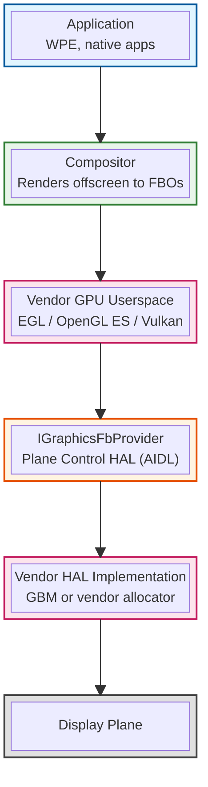

# Graphics

## Document History

|Date|Author|Comments|
|----|------|--------|
|2026-07-31|G.Weatherup|Initial specification|

!!! warning "Draft Document"
    This document is currently in **draft form** and under active discussion. Specifications, examples, and recommendations may change based on review feedback and implementation experience.

## References

!!! info References
    |||
    |-|-|
    |**VTS Tests**| TBC |
    |**Reference Implementation - vComponent**|**TBD**|
    |**Vulkan Loader Interface**|[LunarG — Loader Interface Architecture](https://vulkan.lunarg.com/doc/view/latest/linux/LoaderInterfaceArchitecture.html)|

## Related Pages

!!! tip "Related Pages"
    - [Plane Control HAL](../../../../planecontrol/current/docs/plane_control.md)
    - [Transforming Westeros onto IGraphicsFbProvider](../../../../docs/transformation/westeros_graphics_fb_transform.md)
    - [File System Architecture](../../../filesystem/current/docs/file_system_architecture.md)

## Purpose

This document defines the graphics vendor software interface for RDK platforms, specifying the GPU userspace a vendor delivers, the capabilities that userspace must expose, how loaders discover it within the layered file system, and the buffer allocation and presentation contract used by the compositor.

The specification enables:

* **Platform-Agnostic Compositor**: A single compositor implementation runs on every SoC, with vendor differences confined below the HAL boundary
* **Standard Buffer Transport**: Every buffer crossing a process or HAL boundary is a kernel DMA-buf file descriptor with explicit DRM format and modifier metadata
* **Declared GPU Capabilities**: Vendors state the EGL, OpenGL ES and Vulkan versions and extensions they provide, so integration failures surface at delivery rather than at bring-up
* **Layer-Correct Driver Discovery**: Vulkan, EGL and the other ICD loaders find vendor drivers held in the `/vendor` layer through their standard search paths
* **Independent Driver Delivery**: GPU userspace ships as part of the vendor layer and is versioned and frozen with it
* **Verifiable Conformance**: The contract is expressed as capabilities and interfaces that VTS can assert

## Architectural Overview

### Two Surfaces, One GPU Stack

Graphics reaches the display through two surfaces, each with a different consumer, both implemented by the same vendor GPU stack:



An application renders into its own DMA-buf and attaches it to a Wayland surface. The compositor imports that buffer as an `EGLImage`, composes into a frame buffer obtained from `IGraphicsFbProvider`, and presents it with `commitGraphicsFb()`.

### Surface Characteristics

| Surface | Consumer | Delivered As | Contract |
|---------|----------|--------------|----------|
| **GPU userspace** | Applications and compositor | Shared libraries in the `/vendor` layer | EGL / OpenGL ES / Vulkan versions and extensions |
| **Driver manifests** | ICD loaders | JSON in the `/vendor` layer, discoverable from rootfs | Loader search path contract |
| **Frame buffer provider** | Compositor only | AIDL interface over Binder | `IGraphicsFbProvider` in the Plane Control HAL |
| **Device nodes** | Applications and compositor | Kernel device files, group-gated | Declared per platform |

### Key Design Principles

1. **Vendor-Opaque Allocation**: The compositor calls `createGraphicsFb()` and never learns which kernel path allocated the memory
2. **DMA-buf as Universal Transport**: Allocation differs per SoC; the exported file descriptor does not
3. **Offscreen Client EGL**: The compositor needs a display and a context, never a native window, so no windowing type crosses the HAL
4. **Capabilities Over Convention**: Format and modifier are reported by the provider rather than assumed by the client
5. **Discovery Without Environment**: Loaders find vendor drivers through their compiled-in search paths, so discovery survives privilege elevation and a bare environment
6. **Standard Libraries Unmodified**: Upstream `libwayland-egl`, the Vulkan loader and the Khronos sonames are used as published

## GPU Userspace Delivery

The GPU userspace is SoC-specific and is delivered in the `/vendor` layer described in [File System Architecture](../../../filesystem/current/docs/file_system_architecture.md), versioned and frozen with that layer.

```bash
/vendor/graphics/
├── lib/
│   ├── libEGL.so -> libEGL.so.1
│   ├── libEGL.so.1 -> libEGL.so.1.4.0
│   ├── libEGL.so.1.4.0
│   ├── libGLESv1_CM.so -> libGLESv1_CM.so.1
│   ├── libGLESv1_CM.so.1 -> libGLESv1_CM.so.1.1.0
│   ├── libGLESv1_CM.so.1.1.0
│   ├── libGLESv2.so -> libGLESv2.so.2
│   ├── libGLESv2.so.2 -> libGLESv2.so.2.1.0
│   ├── libGLESv2.so.2.1.0
│   ├── libvulkan_<vendor>.so       # ICD, not the loader
│   ├── dri/                        # VA-API and DRI driver modules
│   └── gbm/                        # GBM backend modules
├── etc/
│   ├── vulkan/icd.d/<vendor>.json
│   ├── glvnd/egl_vendor.d/50_<vendor>.json
│   └── OpenCL/vendors/<vendor>.icd
├── ld.so.conf.d/
│   └── vendor-graphics.conf
└── VERSION
```

Libraries carry the sonames defined by Khronos, with the unversioned development symlinks alongside them. Where a platform must supply both 32-bit and 64-bit GPU userspace, each ABI is delivered in its own library directory (`lib/` and `lib64/`) with a manifest set per ABI.

The Vulkan **loader** (`libvulkan.so.1`) is not part of the vendor layer. It is a platform component so that it remains independently updatable, and it consumes the vendor ICD through the manifest.

## Loader and Driver Discovery

Graphics drivers are not loaded by the dynamic linker alone. Vulkan, EGL, OpenCL, VA-API and GBM each use an ICD loader that discovers drivers by scanning **fixed search paths compiled into the loader**, then loading the driver named by a manifest found there. Those search paths are rootfs paths; the drivers live in `/vendor`. The layered architecture therefore has to bridge the two.

### Loader Search Paths

| Loader | Search roots | Manifest subdirectory | Driver named by |
|--------|--------------|-----------------------|-----------------|
| **Vulkan drivers** | `$XDG_CONFIG_HOME`, `$XDG_CONFIG_DIRS` (`/etc/xdg`), `SYSCONFDIR` (`/etc`), `EXTRASYSCONFDIR`, `$XDG_DATA_HOME`, `$XDG_DATA_DIRS` (`/usr/local/share:/usr/share`) | `vulkan/icd.d/*.json` | `library_path` in the manifest |
| **Vulkan layers** | as above | `vulkan/explicit_layer.d/`, `vulkan/implicit_layer.d/` | `library_path` in the manifest |
| **EGL (libglvnd)** | `/etc/glvnd/egl_vendor.d`, `/usr/share/glvnd/egl_vendor.d` | — | `library_path` in the manifest |
| **OpenCL ICD** | `/etc/OpenCL/vendors` | — | library name in the `.icd` file |
| **VA-API** | `${libdir}/dri` | — | `<driver>_drv_video.so` |
| **GBM backends** | `${libdir}/gbm` | — | `<backend>_gbm.so` |
| **Mesa DRI** | `${libdir}/dri` | — | `<driver>_dri.so` |

Vulkan searches its roots in the order listed and aggregates every manifest found.

### Discovery Rules

The rootfs exposes vendor manifests through symbolic links created at boot, matching the linker configuration strategy already used for `ld.so.conf.d`:

```bash
# Vulkan driver manifest
/usr/share/vulkan/icd.d/<vendor>.json -> /vendor/graphics/etc/vulkan/icd.d/<vendor>.json

# EGL vendor manifest (libglvnd)
/usr/share/glvnd/egl_vendor.d/50_<vendor>.json -> /vendor/graphics/etc/glvnd/egl_vendor.d/50_<vendor>.json

# OpenCL ICD registration
/etc/OpenCL/vendors/<vendor>.icd -> /vendor/graphics/etc/OpenCL/vendors/<vendor>.icd

# Driver module directories
/usr/lib/dri -> /vendor/graphics/lib/dri
/usr/lib/gbm -> /vendor/graphics/lib/gbm
```

Three rules make this work:

1. **`library_path` is absolute.** The Vulkan and glvnd loaders resolve a relative `library_path` against the directory holding the manifest. When the manifest is reached through a rootfs symlink, that directory is the link location, not the vendor layer, and a relative path resolves to the wrong place. Manifests therefore give an absolute path into the vendor layer:

    ```json
    {
        "file_format_version": "1.0.0",
        "ICD": {
            "library_path": "/vendor/graphics/lib/libvulkan_<vendor>.so",
            "api_version": "1.3.0"
        }
    }
    ```

2. **Discovery does not depend on environment variables.** `VK_DRIVER_FILES`, `VK_ADD_DRIVER_FILES`, `VK_LAYER_PATH`, `XDG_DATA_DIRS`, `LIBVA_DRIVERS_PATH`, `GBM_BACKENDS_PATH` and `__EGL_VENDOR_LIBRARY_DIRS` can each redirect a loader, but the user-relative paths and the override variables are ignored when a process runs setuid, setgid or with file capabilities, and they are absent from a minimal service environment. The symlinks above are the delivery mechanism; the environment variables are available for development and test.

3. **The manifest set is versioned with the layer.** Manifests are delivered inside `/vendor/graphics/etc`, so a vendor layer update replaces the drivers and their registrations together, and a rollback reverts both.

### Layer Isolation

The libraries a manifest names, and every dynamic dependency of those libraries, resolve within `/vendor` through the layer's `ld.so.conf.d` entry. A vendor driver does not load a library from `/mw`, `/product` or `/apps`.

## Buffer Allocation and Presentation

### Obtaining a Provider

A graphics plane exposes a frame buffer provider through `IPlaneControl`:

```aidl
@nullable IGraphicsFbProvider getGraphicsFbProvider(
    in int planeResourceIndex,
    in IGraphicsFbProviderListener graphicsFbProviderListener);
```

The return is `@nullable`: a plane that is not of type `GRAPHICS` returns null, so the plane type is confirmed through `IPlaneControl.getCapabilities()` first.

### The Provider Interface

```aidl
@VintfStability
interface IGraphicsFbProvider {
    GraphicsFbCapabilities getCapabilities();
    boolean                commitGraphicsFb(in int graphicsFbId);
    ParcelFileDescriptor   createGraphicsFb(in int width, in int height, out GraphicsFbInfo outInfo);
    void                   destroyGraphicsFb(in int graphicsFbId);
}

@VintfStability
oneway interface IGraphicsFbProviderListener {
    void onGraphicsFbReleased(in int oldGraphicsFbId, in long timestampNs);
}
```

Buffer metadata is split by lifetime. Per-frame geometry travels in `GraphicsFbInfo`; the pixel format and modifier, constant for a given provider, travel in `GraphicsFbCapabilities`:

```aidl
@VintfStability
parcelable GraphicsFbInfo {
    int graphicsFbId;
    int pixelWidth;
    int pixelHeight;
    int stride;
    int offset;
}

@VintfStability
parcelable GraphicsFbCapabilities {
    int  maxGraphicsFrameBuffers;
    int  maxGraphicsFbWidth;
    int  maxGraphicsFbHeight;
    int  format;
    long modifier;
}
```

### Vendor Implementation Requirements

The vendor implementation allocates through whichever path the platform provides and exports the result as a DMA-buf file descriptor:

* **DRM/KMS platforms**: `gbm_bo_create()` for allocation, `gbm_bo_get_fd()` for export, presentation through a DRM atomic commit
* **Platforms without GBM**: a DMA-buf heap or the vendor allocator, exported through the kernel's DMA-buf mechanism, presented through the vendor display API

In both cases:

* `format` and `modifier` are reported once through `getCapabilities()` and are constant for the provider
* The returned file descriptor may be shared across buffers; buffers are distinguished by `GraphicsFbInfo.offset`
* `commitGraphicsFb()` is non-blocking and returns `false` for an unknown buffer id
* Buffer availability is signalled through `onGraphicsFbReleased()`, with `oldGraphicsFbId` of `-1` on the first release

The derivation, EGL attribute mapping and reference implementation are covered in [Transforming Westeros onto IGraphicsFbProvider](../../../../docs/transformation/westeros_graphics_fb_transform.md).

## EGL and OpenGL ES Requirements

The vendor GPU userspace provides **EGL 1.5** and **OpenGL ES 2.0** as a minimum; OpenGL ES 3.0 or later is expected on new platforms.

### Required EGL Extensions

| Extension | Purpose |
|-----------|---------|
| [`EGL_EXT_image_dma_buf_import`](https://registry.khronos.org/EGL/extensions/EXT/EGL_EXT_image_dma_buf_import.txt) | Importing a DMA-buf file descriptor as an `EGLImage` — the HAL frame buffer and every client buffer |
| [`EGL_EXT_image_dma_buf_import_modifiers`](https://registry.khronos.org/EGL/extensions/EXT/EGL_EXT_image_dma_buf_import_modifiers.txt) | Importing tiled and compressed formats, and enumerating the supported format/modifier set |
| `EGL_KHR_image_base` | `eglCreateImageKHR` and `eglDestroyImageKHR` |
| `EGL_KHR_surfaceless_context` | `eglMakeCurrent` with no surface — the compositor renders only to FBOs |
| `EGL_EXT_client_extensions` | Querying extensions on `EGL_NO_DISPLAY` before a display exists |
| `EGL_MESA_platform_surfaceless` **or** `EGL_EXT_platform_device` | Creating an offscreen `EGLDisplay` with no native window and no DRM node |
| `EGL_KHR_fence_sync` | Fence objects for GPU completion |
| `EGL_ANDROID_native_fence_sync` | Exporting fences as file descriptors across HAL and Wayland boundaries |

### Required OpenGL ES Extensions

| Extension | Purpose |
|-----------|---------|
| `GL_OES_EGL_image` | `glEGLImageTargetTexture2DOES` — binding an imported `EGLImage` to a texture |
| `GL_OES_EGL_image_external` | Sampling video and client buffers in non-RGB formats |

### Offscreen Display Creation

The compositor obtains its `EGLDisplay` through `eglGetPlatformDisplay()` on a surfaceless or device platform:

```c
EGLDisplay dpy = eglGetPlatformDisplay(EGL_PLATFORM_SURFACELESS_MESA,
                                       EGL_DEFAULT_DISPLAY, NULL);
eglInitialize(dpy, NULL, NULL);
EGLContext ctx = eglCreateContext(dpy, config, EGL_NO_CONTEXT, ctxAttrs);
```

It renders to FBOs and presents through `commitGraphicsFb()`, so it opens no DRM node, creates no native window and calls no vendor windowing API. The GPU stack supports this path independently of any platform windowing system.

### Frame Buffer Import

An imported frame buffer maps directly onto the EGL DMA-buf attributes:

| EGL attribute | Source |
|---------------|--------|
| `EGL_DMA_BUF_PLANE0_FD_EXT` | the `ParcelFileDescriptor` from `createGraphicsFb()` |
| `EGL_WIDTH` / `EGL_HEIGHT` | `GraphicsFbInfo.pixelWidth` / `pixelHeight` |
| `EGL_DMA_BUF_PLANE0_PITCH_EXT` | `GraphicsFbInfo.stride` |
| `EGL_DMA_BUF_PLANE0_OFFSET_EXT` | `GraphicsFbInfo.offset` |
| `EGL_LINUX_DRM_FOURCC_EXT` | `GraphicsFbCapabilities.format` |
| `EGL_DMA_BUF_PLANE0_MODIFIER_LO/HI_EXT` | `GraphicsFbCapabilities.modifier` |

### Wayland Client Buffers

The compositor imports client buffers advertised through the [`zwp_linux_dmabuf_v1`](https://wayland.app/protocols/linux-dmabuf-v1) protocol, using `EGL_EXT_image_dma_buf_import` and the format/modifier set reported by `EGL_EXT_image_dma_buf_import_modifiers`.

Clients bind to the compositor through the reference `libwayland-egl` from [wayland](https://gitlab.freedesktop.org/wayland/wayland). The vendor GPU stack works with that library as published.

## Vulkan Requirements

The vendor delivers a Vulkan driver in [ICD](https://github.com/KhronosGroup/Vulkan-Loader/blob/main/docs/LoaderDriverInterface.md) form, registered through a driver manifest as described in [Loader and Driver Discovery](#loader-and-driver-discovery).

Where a Vulkan application shares buffers with the compositor or the video pipeline, the driver provides:

| Extension | Purpose |
|-----------|---------|
| `VK_KHR_external_memory_fd` | Importing and exporting memory as a file descriptor |
| `VK_EXT_external_memory_dma_buf` | Identifying that descriptor as a kernel DMA-buf |
| `VK_EXT_image_drm_format_modifier` | Matching the DRM format modifier reported by `GraphicsFbCapabilities` |
| `VK_KHR_external_semaphore_fd` | Explicit synchronisation across process and HAL boundaries |

## ABI Requirements

GPU libraries are loaded into processes built against the platform base package, so they are binary compatible with it:

* **Shared Dependencies**: The C library, C++ runtime and any other dependency taken from the base package are used at the ABI the base package provides
* **Sonames**: Libraries carry the sonames defined by Khronos, with the unversioned development symlinks alongside them
* **Private Dependencies**: Any additional dynamic library a GPU library depends on is delivered with it in the vendor layer, unless the base package already provides it, in which case the base package's copy is used

Building the GPU libraries against the platform SDK and base layer satisfies these requirements where the driver is built from source. Where the driver is a prebuilt binary, the vendor states the ABI it was built against and validates it against the base package.

## Device Access

Rendering requires access to the platform's GPU device nodes. The device nodes and the Linux groups that gate them are declared per platform, and are the same set for the compositor and for applications.

Platforms exposing a DRM render node grant access to `/dev/dri/renderD*` for rendering. Allocation for display is performed by the vendor HAL behind `IGraphicsFbProvider`, so neither applications nor the compositor require access to the card node.

## Integration Requirements

### Vendor Deliverables

Vendors provide the following for each platform:

1. **GPU Userspace**: EGL, OpenGL ES and Vulkan libraries under the Khronos sonames, in the vendor layer
2. **Driver Manifests**: Vulkan ICD, glvnd EGL and any OpenCL manifests, with absolute `library_path` entries
3. **Capability Declaration**: The EGL, OpenGL ES and Vulkan versions and extensions the driver reports
4. **Frame Buffer Provider**: An `IGraphicsFbProvider` implementation for each `GRAPHICS` plane
5. **Device Node Declaration**: The device files and Linux groups required for rendering
6. **ABI Statement**: The base package ABI the driver was built against
7. **VTS Results**: A passing run of the graphics VTS suite

### Cross-Layer Dependencies

* **Upward Dependencies**: The compositor depends on the vendor layer through the Plane Control HAL and the Khronos APIs
* **No Vendor Coupling Above the HAL**: No component above the HAL boundary links against a vendor-specific library or opens a vendor device node
* **Interface Contracts**: All dependencies are through AIDL/Binder or published Khronos and Wayland interfaces
* **Version Pinning**: The Plane Control HAL version is pinned in the vendor layer manifest

## Compliance and Governance

### Responsibilities

| Area | Responsible Team | Governance |
|------|------------------|------------|
| GPU userspace and manifests | SoC vendor | Khronos conformance + vendor |
| `IGraphicsFbProvider` implementation | SoC vendor | RDK HAL-IF governance |
| Plane Control HAL definition | RDK architecture team | RDK community governance |
| Loader components and search paths | Platform team | RDK community governance |
| Compositor | RDK middleware team | RDK community governance |

### Conformance Criteria

A platform is conformant when:

* The EGL, OpenGL ES and Vulkan versions and extensions specified above are reported by the delivered libraries
* Every driver is discovered by its loader with no environment variables set, and by a process running with elevated privileges
* A `GRAPHICS` plane returns a non-null `IGraphicsFbProvider`
* Buffers created through the provider import into EGL using the format and modifier reported by `getCapabilities()`
* The compositor runs unmodified, using only the offscreen EGL path and the Plane Control HAL
* The graphics VTS suite passes

### Review and Approval

Changes to this specification require:

* Review by RDK architecture team
* Approval from affected layer owners
* Impact assessment on existing deployments
* Migration plan for breaking changes

## Summary

This graphics vendor software interface provides:

* **Single Compositor**: One platform-agnostic implementation replaces the per-SoC GL backends
* **Opaque Allocation**: Vendor allocators stay below the HAL, behind a standard DMA-buf file descriptor
* **Declared Capabilities**: The GPU driver's versions, extensions, formats and modifiers are stated rather than discovered at bring-up
* **Deterministic Discovery**: ICD loaders find vendor drivers through compiled-in search paths, independent of the process environment
* **Standard Interfaces**: Khronos, Wayland and DRM contracts are used as published, with no vendor forks
* **Verifiable Delivery**: Conformance is expressed in terms VTS can assert

For the transformation of the existing compositor onto this interface, see [Transforming Westeros onto IGraphicsFbProvider](../../../../docs/transformation/westeros_graphics_fb_transform.md).
