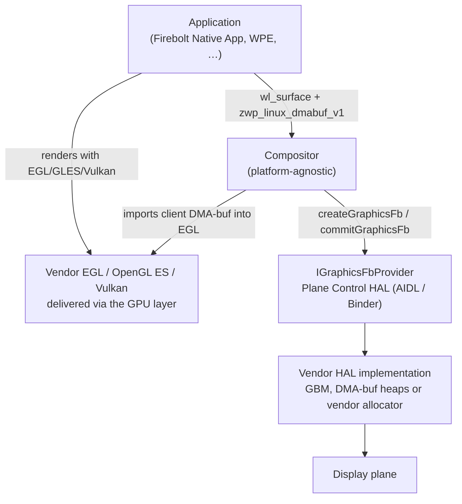

# Graphics

## References

!!! info References
    |||
    |-|-|
    |**VTS Tests**| TBC |
    |**Reference Implementation - vComponent**|**TBD**|
    |**GPU layer spec (Native Apps WG)**|[wiki.rdkcentral.com — GPU layer spec](https://wiki.rdkcentral.com/spaces/WG/pages/440670747/GPU+layer+spec)|

## Related Pages

!!! tip "Related Pages"
    - [Plane Control HAL](../../../../planecontrol/current/docs/plane_control.md)
    - [Transforming Westeros onto IGraphicsFbProvider](../../../../docs/transformation/westeros_graphics_fb_transform.md)
    - [File System Architecture](../../../filesystem/current/docs/file_system_architecture.md)

## Purpose

This document defines what a vendor must deliver for graphics on an RDK
platform: the GPU userspace libraries and their capabilities, and the
buffer allocation and presentation contract used by the compositor.

Graphics reaches the display through two surfaces, each with a different
consumer:

- **Application-facing GPU userspace** — the EGL, OpenGL ES and Vulkan
  implementations an application links against to render.
- **Compositor-facing HAL** — `IGraphicsFbProvider` in the Plane Control HAL,
  which allocates displayable frame buffers and presents them.

Both are implemented by the same vendor GPU stack. The library set is
delivered as described in the Native Apps WG
[GPU layer spec](https://wiki.rdkcentral.com/spaces/WG/pages/440670747/GPU+layer+spec);
this document defines the capabilities those libraries must expose and the
HAL contract beneath them.

## Architectural Overview



An application renders into its own DMA-buf and attaches it to a Wayland
surface. The compositor imports that buffer as an `EGLImage`, composes into a
frame buffer obtained from `IGraphicsFbProvider`, and presents it with
`commitGraphicsFb()`. Every buffer crossing a process or HAL boundary is a
kernel DMA-buf file descriptor with explicit DRM format and modifier metadata.

## Buffer allocation and presentation

Displayable frame buffers are allocated and presented through
`IGraphicsFbProvider`, obtained from a `GRAPHICS` plane:

```aidl
@nullable IGraphicsFbProvider getGraphicsFbProvider(
    in int planeResourceIndex,
    in IGraphicsFbProviderListener graphicsFbProviderListener);
```

```aidl
@VintfStability
interface IGraphicsFbProvider {
    GraphicsFbCapabilities getCapabilities();
    ParcelFileDescriptor   createGraphicsFb(in int width, in int height, out GraphicsFbInfo outInfo);
    void                   destroyGraphicsFb(in int graphicsFbId);
    boolean                commitGraphicsFb(in int graphicsFbId);
}
```

The vendor implementation allocates through whichever path the platform
provides — GBM on DRM/KMS platforms, a DMA-buf heap, or a vendor allocator —
and exports the result as a DMA-buf file descriptor. `GraphicsFbCapabilities`
reports the DRM format and modifier once per provider; `GraphicsFbInfo` carries
per-buffer geometry. The compositor imports the descriptor with
`EGL_LINUX_DMA_BUF_EXT` and renders to an FBO backed by the resulting
`EGLImage`.

The full derivation, EGL attribute mapping and reference implementation are in
[Transforming Westeros onto IGraphicsFbProvider](../../../../docs/transformation/westeros_graphics_fb_transform.md).

## EGL and OpenGL ES requirements

The vendor GPU userspace must provide **EGL 1.5** and **OpenGL ES 2.0**;
OpenGL ES 3.0 or later is expected on new platforms.

### Required EGL extensions

| Extension | Used for |
|---|---|
| [`EGL_EXT_image_dma_buf_import`](https://registry.khronos.org/EGL/extensions/EXT/EGL_EXT_image_dma_buf_import.txt) | Importing a DMA-buf FD as an `EGLImage` — the HAL frame buffer and every client buffer |
| [`EGL_EXT_image_dma_buf_import_modifiers`](https://registry.khronos.org/EGL/extensions/EXT/EGL_EXT_image_dma_buf_import_modifiers.txt) | Importing tiled and compressed formats, and enumerating the supported format/modifier set |
| `EGL_KHR_image_base` | `eglCreateImageKHR` / `eglDestroyImageKHR` |
| `EGL_KHR_surfaceless_context` | `eglMakeCurrent` with no surface — the compositor renders only to FBOs |
| `EGL_EXT_client_extensions` | Querying extensions on `EGL_NO_DISPLAY` before a display exists |
| `EGL_MESA_platform_surfaceless` **or** `EGL_EXT_platform_device` | Creating an offscreen `EGLDisplay` without a native window or DRM node |
| `EGL_KHR_fence_sync` and `EGL_ANDROID_native_fence_sync` | Explicit fences across the HAL and Wayland boundaries in place of `glFinish()` |

### Required OpenGL ES extensions

| Extension | Used for |
|---|---|
| `GL_OES_EGL_image` | `glEGLImageTargetTexture2DOES` — binding an imported `EGLImage` to a texture |
| `GL_OES_EGL_image_external` | Sampling video and client buffers in non-RGB formats |

### Offscreen display creation

The compositor obtains its `EGLDisplay` through `eglGetPlatformDisplay()` on a
surfaceless or device platform. It renders to FBOs and presents through
`commitGraphicsFb()`, so it opens no DRM node, creates no native window and
calls no vendor windowing API. The vendor GPU stack must support this path
independently of any platform windowing system.

### Wayland client buffers

The compositor imports client buffers from the
[`zwp_linux_dmabuf_v1`](https://wayland.app/protocols/linux-dmabuf-v1) protocol
using `EGL_EXT_image_dma_buf_import` and the format/modifier set advertised by
`EGL_EXT_image_dma_buf_import_modifiers`. `libwayland-egl` is the reference
implementation from
[wayland](https://gitlab.freedesktop.org/wayland/wayland); the vendor GPU stack
must work with it unmodified.

## Vulkan requirements

The vendor delivers a Vulkan driver in
[ICD](https://github.com/KhronosGroup/Vulkan-Loader/blob/main/docs/LoaderDriverInterface.md)
form, with the driver manifest under `/usr/share/vulkan/icd.d/`. The Vulkan
loader (`libvulkan.so.1`) is supplied by the platform so that it remains
independently updatable.

Where a Vulkan application shares buffers with the compositor or the video
pipeline, the driver must support:

| Extension | Used for |
|---|---|
| `VK_KHR_external_memory_fd` | Importing and exporting memory as a file descriptor |
| `VK_EXT_external_memory_dma_buf` | Identifying that descriptor as a kernel DMA-buf |
| `VK_EXT_image_drm_format_modifier` | Matching the DRM format modifier reported by `GraphicsFbCapabilities` |
| `VK_KHR_external_semaphore_fd` | Explicit synchronisation across process and HAL boundaries |

## ABI requirements

The GPU libraries are loaded into processes built against the platform base
package, so they must be binary compatible with it:

- The C library, C++ runtime and any other shared dependency taken from the
  base package must be used at the ABI the base package provides.
- Libraries carry the sonames defined by Khronos — `libEGL.so.1`,
  `libGLESv1_CM.so.1`, `libGLESv2.so.2` — with the unversioned development
  symlinks alongside them.
- Any additional dynamic library a GPU library depends on is delivered with it,
  unless the base package already provides it, in which case the base package's
  copy is used.

Building the GPU libraries against the platform SDK and base layer satisfies
these requirements where the driver is built from source. Where the driver is a
prebuilt binary, the vendor states the ABI it was built against and validates it
against the base package.

## Device access

Rendering requires access to the platform's GPU device nodes. The device nodes
and the Linux groups that gate them are declared per platform as described in
the [GPU layer spec](https://wiki.rdkcentral.com/spaces/WG/pages/440670747/GPU+layer+spec),
and are the same set for the compositor and for applications.

Platforms exposing a DRM render node grant access to `/dev/dri/renderD*` for
rendering; allocation for display is performed by the vendor HAL behind
`IGraphicsFbProvider`, so applications and the compositor need no access to the
card node.

## Conformance

A platform is conformant when:

- The EGL, OpenGL ES and Vulkan versions and extensions listed above are
  reported by the delivered libraries.
- A `GRAPHICS` plane returns a non-null `IGraphicsFbProvider`, and buffers
  created through it import into EGL using the format and modifier reported by
  `getCapabilities()`.
- The compositor runs unmodified against the platform, using only the offscreen
  EGL path and the Plane Control HAL.
- The graphics VTS suite passes.
